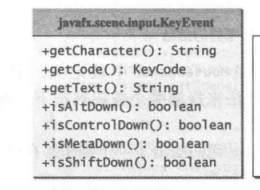
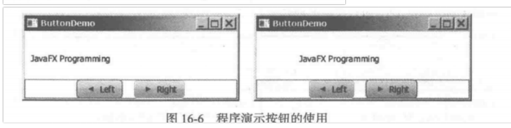
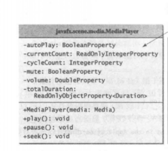
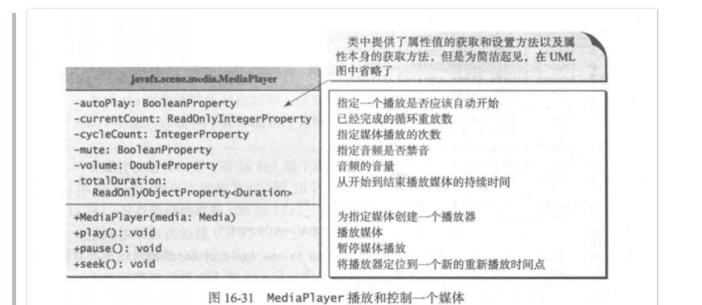

# java FX [	](java_se_20191219101334709)

## Java FX程序的基本结构 [	](java_se_20191219101334711)

### 一个最基本结构java FX程序 [	](java_se_20191219101334713)

图：


```java
public class MyJavaFX extends Application {
  //{{c1::
  @Override
  public void start(Stage primaryStage) {
    // Create a button and place it in the scene
    Button btOK = new Button("OK");
    Scene scene = new Scene(btOK, 200, 250);
    primaryStage.setTitle("MyJavaFX"); // Set the stage title
    primaryStage.setScene(scene); // Place the scene in the stage
    primaryStage.show(); // Display the stage
  }
	//在IDE中需显式调用
  public static void main(String[] args) { 
    Application.launch(args);
  }
  //}}
}
```

命令行执行javaFX程序时会自动{{c1::调用`AppliApplication.launch(args);`方法。}}

### 一个javaFX程序显示多个舞台 [	](java_se_20191219101334714)


核心代码：

```java
//{{c1::
	  Stage newStage = new Stage();
    newStage.setTitle("Second Stage");
    newStage.setScene(new Scene(new Button("New Stage"), 100, 100));
    newStage.show();
//}}
```

+ **stage.setResizable(false)**方法：{{c1:禁止改变舞台大小}}

### 使用javaFX类库在一个面版中央显示圆： [	](java_se_20191219101334715)

{{c1::

```java
    public void start(Stage primaryStage) throws Exception {
        Pane pane = new Pane();
        pane.setMaxWidth(200);
        pane.setMaxHeight(200);

        Circle circle = new Circle();
        circle.centerXProperty().bind(pane.widthProperty().divide(2));
        circle.centerYProperty().bind(pane.heightProperty().divide(2));
        circle.setRadius(30);
        circle.setStroke(Color.RED);
        circle.setFill(Color.BLUE);
        pane.getChildren().add(circle);

        primaryStage.setScene(new Scene(pane,200,200));
        primaryStage.setTitle("showCircle");
        primaryStage.show();
    }
```

}}

### javaFX中各个类的关系。 [	](java_se_20191219101334717)

+ Stage组合{{c1::Scene}}
+ Scene组合{{c1::Parent}},因此Scenne不能直接{{c1::包含Shape与ImageView}}
+ {{c1::Shape}}与{{c1::ImageView}}继承自Node
+ {{c1::Control}}与{{c1::Pane}}继承自Parent

{{c1::}}

### Java FX的绑定属性 [	](java_se_20191219101334719)

+ 例：{{c1:: `targetProperty.bind(source)`}}

+ 对于 double/float/1ong/int/boolean 类型的值，它的绑定属性类型是{{c1::DoubleProperty/FloatProperty/LongProperty/IntegerProperty/BooleanProperty。}}

+ 数值类绑定属性提供了{{c1:: 常用的运算方法}}

+ DoubleProperty等基本绑定属性为{{c1:: 抽象类}},需要使用{{c1:: 对应的实现类SimpleDoubleProperty等}}创建实例.

+ 方法签名{{c1::
  ```java
  /**
    * 为当前绑定属性对象设置单向绑定。 绑定的对象必须先实现ObservableValue接口
    */
  void bind(ObservableValue<? extends T> observable);
  ```
  
  }}

### 绑定属性应该具有的3个方法 [	](java_se_20191219101334721)

{{c1::

+ getter与setter方法
+ `public propertyType xProperty()`

}}

### java FX中Node类的通用方法 [	](java_se_20191219101334722)

+ ` setStyle(String value)`:{{c1:: 设置css样式}}
+ `setRotate()`:{{c1:: 可以设置旋转的角度}}

```java
//黑边 红色填充
//{{c1:: 
bt.setStyle("-fx-stroke: black; -fx-fill: red;");
//}}
//旋转角度顺时针80
//{{c1::
b.setRotate(80);
//}}
```

### java FX中Color类用法 [	](java_se_20191219101334724)

+ 使用构造方法:

{{c1::

```java
public Color(double r, double g ,double b double opacity);
```

}}

+ 使用{{c1::Color.RED之类的标准颜色}}

### java FX中Font类用法 [	](java_se_20191219101334725)


核心代码：{{c1::

```java
// FontDemo类
//使用字体类
Label label = new Label("JavaFX");
label.setFont(Font.font("Times New Roman", 
                        FontWeight.BOLD, FontPosture.ITALIC, 20));
pane.getChildren().add(label);
```

}}

### 一个图像通过面版中的三个图像视图显示 [	](java_se_20191219101334727)


`ShowImage`类核心代码：

{{c1::

```java
    Pane pane = new HBox(10);
    pane.setPadding(new Insets(5, 5, 5, 5));
    Image image = new Image("m2.jpg");
    pane.getChildren().add(new ImageView(image));
    
    ImageView imageView2 = new ImageView(image);
    imageView2.setFitHeight(100);
    imageView2.setFitWidth(100);
    pane.getChildren().add(imageView2);   

    ImageView imageView3 = new ImageView(image);
    imageView3.setRotate(90);
    pane.getChildren().add(imageView3);     
```

}}

### GridPane的用法 [	](java_se_20191219101334729)

图示：


`ShowGridPane`核心代码：

{{c1::

```java
    GridPane pane = new GridPane();
    pane.setAlignment(Pos.CENTER);
    pane.setPadding(new Insets(11.5, 12.5, 13.5, 14.5));
    pane.setHgap(5.5);
    pane.setVgap(5.5);
    
    // Place nodes in the pane
    pane.add(new Label("First Name:"), 0, 0);
    pane.add(new TextField(), 1, 0);
    pane.add(new Label("MI:"), 0, 1); 
    pane.add(new TextField(), 1, 1);
    pane.add(new Label("Last Name:"), 0, 2);
    pane.add(new TextField(), 1, 2);
    Button btAdd = new Button("Add Name");
    pane.add(btAdd, 1, 3);
    GridPane.setHalignment(btAdd, HPos.RIGHT);
```

}}

### JavaFx中布局面板 [	](java_se_20191219101334731)

|    Pane    | {{c1::布局面板的基类.getChildren方法来返回面板中的节点列表}} |
| :--------: | ------------------------------------------------------------ |
| StackPane  | {{c1::节点放置在面板中央.并且畳加在其他节点之上}}            |
|  FlowPane  | {{c1::节点以**水平方式**（`Orientation.HORIZONTAL`）一行一行放,或者**垂直方式**一列一列放}} |
|  CridPane  | {{c1::节点放置在一个二维网格的单元格中}}                     |
| BorderPane | {{c1::将节点放置在頂部、右边、底鄙、左边以及中间区域}}       |
|    HBox    | {{c1::节点放在単行中}}                                       |
|    VBox    | {{c1::节点放在单列中}}                                       |

## javaFX事件 [	](java_se_20191219101334732)

### 事件与事件源 [	](java_se_20191219101334733)

+ java中的事件类的根类是{{c1::`java.util.EventObject`}}
+ javaFX中的事件类的根类是{{c1::`javafx.event.Event`}}
+ 可以通过事件类的{{c1::`getSoource()`}}方法来确定一个事件的源对象。

### JavaFx中为一个按钮注册处理器与处理事件 [	](java_se_20191219101334735)

{{c1::

```java
// Create and register the 
btn.setOnAction(new EnlargeHandler());

class EnlargeHandler implements EventHandler<ActionEvent> {
  @Override // Override the handle method
  public void handle(ActionEvent e) {
    circlePane.enlarge();
  }
}
```

}}

lambda表达式版版：{{c1::

```java
btn.setOnAction(event -> circlePane.enlarge());
```

}}

### `MouseEvent`鼠标事件 [	](java_se_20191219101334737)


{{c1::}}

### 键盘事件 [	](java_se_20191219101334741)



{{c1::}}

### 可观察对象监听器 [	](java_se_20191219101334742)

+ Observable的实例，使用{{c1::`addListener`与`removeListener`}}添加或删除实现{{c1::`InvalidationListener`监听器}}对象，用于监听可观察对象的添加于修改
+ 每个绑定属性都是{{c1::Observable的实例}}
+ Observable与InvalidationListener接口源码：
```java
//{{c1::
public interface Observable {
    void addListener(InvalidationListener listener);
    void removeListener(InvalidationListener listener);
}
//}}

@FunctionalInterface
public interface InvalidationListener {
    public void invalidated(Observable observable);
}
//}}
```

### javafx.animation.Animation类 [	](java_se_20191219101334760)


{{c1::}}

### javafx.animation.PathTransition类的使用 [	](java_se_20191219101334761)


PathTransitionDemo类核心代码：

```java
// Create a circle
Circle circle = new Circle(125, 100, 50);
circle.setFill(Color.WHITE);
circle.setStroke(Color.BLACK);

// Add circle and rectangle to the pane
pane.getChildren().add(circle);
pane.getChildren().add(rectangle);
//{{c1::
// Create a path transition 
PathTransition pt = new PathTransition();
pt.setDuration(Duration.millis(4000));
pt.setPath(circle);
pt.setNode(rectangle);
pt.setOrientation(PathTransition.OrientationType.ORTHOGONAL_TO_TANGENT );
pt.setCycleCount(Timeline.INDEFINITE);
pt.setAutoReverse(true);
pt.play(); // Start animation 
//}}
```

### javafx.animation.FadeTransition类的使用 [	](java_se_20191219101334763)


FadeTransitionDemo核心代码：

```java
// Place an ellipse to the pane
Pane pane = new Pane();
Ellipse ellipse = new Ellipse(10, 10, 100, 50);
ellipse.setFill(Color.RED); 
ellipse.setStroke(Color.BLACK);
ellipse.centerXProperty().bind(pane.widthProperty().divide(2));
ellipse.centerYProperty().bind(pane.heightProperty().divide(2));    
ellipse.radiusXProperty().bind(
  pane.widthProperty().multiply(0.4));    
ellipse.radiusYProperty().bind(
  pane.heightProperty().multiply(0.4)); 
pane.getChildren().add(ellipse);

// {{c1::
FadeTransition ft = 
  new FadeTransition(Duration.millis(3000), ellipse);
ft.setFromValue(1.0);
ft.setToValue(0.1);
ft.setCycleCount(Timeline.INDEFINITE);
ft.setAutoReverse(true);
ft.play();
//}}
// Control animation
ellipse.setOnMousePressed(e -> ft.pause());
ellipse.setOnMouseReleased(e -> ft.play());
```

###  javafx.animation.Timeline的使用 [	](java_se_20191219101334765)

+ PathTransition 和 FadeTransition 定义了特定的动画。Timeline 类可以用于通过使用一个或者更多的 KeyFrame (关键帧）来编写任意动画。每个 KeyFrame 在一个给定的时间间隔内顺序执行。Timeline 继承自 Animation。
+ 

核心代码：

```java
// Create a handler for changing text
EventHandler<ActionEvent> eventHandler = e -> {
  if (text.getText().length() != 0) {
    text.setText("");
  }
  else {
    text.setText("Programming is fun");
  }
};
//{{c1::
// Create an animation for alternating text
Timeline animation = new Timeline(new KeyFrame(Duration.millis(500), eventHandler));
animation.setCycleCount(Timeline.INDEFINITE);
animation.play(); 
// }}
```

## 内部类 [	](java_se_20191219101334767)

### 内部类的特征： [	](java_se_20191219101334768)

+ 一个内部类被编译成{{c1::一个名为`OuterClassName$InnerClassName.class`的类}}
+ 一个内部类可以引用{{c1::定义在它所在的外部类中的数据和方法。}}
+ 和类中成员相同,内部类可以使用{{c1:可见性修饰符所定义。}}

+ 可以被定义成{{c1::static}}

### 创建一个内部类 [	](java_se_20191219101334769)

```java
//对象.new语法{{c1::
OuterClass.InnerClass innerObject = outerObject.new InnerClass();
//}}
//如果内部类是静态的，使用以下语法{{c1::
OuterClass.InnerClass innerObject = new OuterObject.InnerClass();
//}}
```

### 匿名内部类 [	](java_se_20191219101334771)

+ 匿名内部类一步实现定义内部类以及创建一个内部类实例。

+ 语法:{{c1::

  ```java 
  new SuperClassName/InterfaceName(){
    //...
  }
  //}}
  ```

+ 匿名内部类别编译成名为`OuterClassName$n.class`的类

## Java FX类库 [	](java_se_20201026014023074)

### Labeled类与Label类 [	](java_se_20191219101334772)


Label类的构造方法：{{c1::`public Label(String text, Node graphic)`}}

{{c1::


}}

### Button的使用 [	](java_se_20191219101334774)



核心代码：{{c1::

```java
Button btLeft = new Button("Left", new ImageView("image/left.gif"));
Button btRight = new Button("Right", new ImageView("image/right.gif"));   
```

}}

### RadioButtion与CheckBox的使用例子 [	](java_se_20191219101334775)


CheckBox核心代码：

{{c1::

```java
//定义元素
CheckBox chkBold = new CheckBox("Bold");
CheckBox chkItalic = new CheckBox("Italic");

//定义事件处理器
EventHandler<ActionEvent> handler = e -> { 
  if (chkBold.isSelected() && chkItalic.isSelected()) {
    text.setFont(fontBoldItalic); // Both check boxes checked
  }
  else if (chkBold.isSelected()) {
    text.setFont(fontBold); // The Bold check box checked
  }
  else if (chkItalic.isSelected()) {
    text.setFont(fontItalic); // The Italic check box checked
  }      
  else {
    text.setFont(fontNormal); // Both check boxes unchecked
  }
};
//祖册事件
chkBold.setOnAction(handler);
chkItalic.setOnAction(handler);
```

}}

RadioButtonDemo核心代码：

{{c1::

```java
//定义元素
RadioButton rbRed = new RadioButton("Red");
RadioButton rbGreen = new RadioButton("Green");
RadioButton rbBlue = new RadioButton("Blue");
//设置组
ToggleGroup group = new ToggleGroup();
rbRed.setToggleGroup(group);
rbGreen.setToggleGroup(group);
rbBlue.setToggleGroup(group);
//设置事件
rbRed.setOnAction(e -> {
  if (rbRed.isSelected()) {
    text.setFill(Color.RED);
  }
});
```

}}

### TextField类与PasswordField类的使用 [	](java_se_20191219101334776)

TextFiled类与PasswordFiled类区别在于：{{c1::PasswordFiled显示***隐藏了文本。}}

基本使用代码：{{c1::

```java
TextField textField=new TextField();
PasswordField passwordField=new PasswordField();

textFiled.setActionEvent(c -> textField.getText());
passwordField.setActionEvent(c -> passwordField.getText());
```

}}

### TextArea类 [	](java_se_20191219101334778)

+ prefColumnCount绑定属性：{{c1::指定文本的优先列数}}
+ prefRowCount绑定属性：{{c1::指定文本的优先列数}}
+ wrapText绑定属性：{{c1::指定文本是否折到下一行}}
+ 添加滚动功能：{{c1::`ScrollPane scrollPane=new ScrollPane(textArea);`}}

### TextArea与ScrollPane 例子 [	](java_se_20191219101334780)


核心代码：

{{c1::

```java
Label label = new Label();
TextArea textArea = new TextArea();
// Center the icon and text and place the text under the icon
label.setContentDisplay(ContentDisplay.TOP);
label.setPrefSize(200,  100);

// Set the font in the label and the text field
label.setFont(new Font("SansSerif", 16));
textArea.setFont(new Font("Serif", 14));
//  taDescription.setWrapText(true);
//  taDescription.setEditable(false);
ScrollPane scrollPane = new ScrollPane(textArea);

setLeft(label);
setCenter(scrollPane);
setPadding(new Insets(5, 5, 5, 5));
```

}}

### 下拉框 [	](java_se_20191219101334782)

JavaFX 提供了⼀个静态⽅法{{c1::` FXCollections.observableArrayList ( arrayOfElements )`}}来从⼀个元素数组中创建⼀个ObservableList。

例子：

核心代码：{{c1::

```java
ComboBox<String> cbo = new ComboBox<>(); 
cbo.setPrefWidth(400);
cbo.setValue("Canada");
ObservableList<String> items = 
  FXCollections.observableArrayList(flagTitles);
cbo.getItems().addAll(items); 
// Display the selected country
cbo.setOnAction(e -> setDisplay(items.indexOf(cbo.getValue())));
```

}}

### ListViewDemo例子： [	](java_se_20191219101334784)


核心代码：{{c1::

```java
ListView<String> lv = new ListView<>
  (FXCollections.observableArrayList(flagTitles));
lv.setPrefSize(400, 400);
lv.getSelectionModel().setSelectionMode(SelectionMode.MULTIPLE);

FlowPane imagePane = new FlowPane(10, 10);
BorderPane pane = new BorderPane();
pane.setLeft(new ScrollPane(lv));   
pane.setCenter(imagePane);

lv.getSelectionModel().selectedItemProperty().addListener(
  ov -> { 
    imagePane.getChildren().clear();
    for (Integer i: lv.getSelectionModel().getSelectedIndices()) {
      imagePane.getChildren().add(ImageViews[i]);
    }
  });
```

}}

### ScrollBar类 [	](java_se_20191219101334785)


{{c1::}}

### ScrollBar类使用实例 [	](java_se_20191219101334786)


ScrollBarDemo核心代码{{c1::

```java
Text text = new Text(20, 20, "JavaFX Programming");

ScrollBar hScrollBar = new ScrollBar();
ScrollBar vScrollBar = new ScrollBar();
vScrollBar.setOrientation(Orientation.VERTICAL);

    // 可以使用绑定属性的bind方法替换下列代码
    hScrollBar.valueProperty().addListener(ov ->
      text.setX(hScrollBar.getValue() * paneForText.getWidth() /
        hScrollBar.getMax()));
    
    // 可以使用绑定属性的bind方法替换下列代码
    vScrollBar.valueProperty().addListener(ov ->
      text.setY(vScrollBar.getValue() * paneForText.getHeight() /
        vScrollBar.getMax()));
```

}}

### SliderDemo类 [	](java_se_20191219101334788)


### SliderDemo例子： [	](java_se_20191219101334789)


核心代码：

```java
    Text text = new Text(20, 20, "JavaFX Programming");
    
    Slider slHorizontal = new Slider();
    slHorizontal.setShowTickLabels(true);
    slHorizontal.setShowTickMarks(true);    
    
    Slider slVertical = new Slider();
    slVertical.setOrientation(Orientation.VERTICAL);
    slVertical.setShowTickLabels(true);
    slVertical.setShowTickMarks(true);
    slVertical.setValue(100);

    slHorizontal.valueProperty().addListener(ov -> 
      text.setX(slHorizontal.getValue() * paneForText.getWidth() /
        slHorizontal.getMax()));
    
    slVertical.valueProperty().addListener(ov -> 
      text.setY((slVertical.getMax() + slVertical.getValue()) 
        * paneForText.getHeight() / slVertical.getMax()));
    
```

### Media类 [	](java_se_20191219101334791)


{{c1::

}}

### MediaPlayer类 [	](java_se_20191219101334792)



{{c1::}}

### MediaView类 [	](java_se_20191219101334793)


{{c1::}}

### Media MediaPlayer  MediaView之间的关系 [	](java_se_20191219101334795)

{{c1::


}}

### javaFX视频与音频的例子： [	](java_se_20191219101334797)


核心代码：

{{c1::

```java
String MEDIA_URL = "http://cs.armstrong.edu/liang/common/sample.mp4";
Media media = new Media(MEDIA_URL);
MediaPlayer mediaPlayer = new MediaPlayer(media);
MediaView mediaView = new MediaView(mediaPlayer);
```

}}

# 正则表达式 [	](java_se_20200604111131317)

### 元字符 [	](java_se_20200510104820590)

| 元字符 | 描述                                                         |
| ------ | ------------------------------------------------------------ |
| .      | {{c1:: 句号匹配任意单个字符除了换行符。}}                    |
| [ ]    | {{c1:: 字符种类。匹配方括号内的任意字符。}}                  |
| [^ ]   | {{c1:: 否定的字符种类。匹配除了方括号里的任意字符}}          |
| *      | {{c1:: 匹配>=0个重复的在*号之前的字符。}}                    |
| +      | {{c1:: 匹配>=1个重复的+号前的字符。}}                        |
| ?      | {{c1:: 标记?之前的字符为可选.}}                              |
| {n,m}  | {{c1:: 匹配num个大括号之前的字符或字符集 (n <= num <= m).}}  |
| (xyz)  | {{c1:: 字符集，匹配与 xyz 完全相等的字符串.}}                |
| \|     | {{c1:: 或运算符，匹配符号前或后的字符.}}                     |
| \      | {{c1:: 转义字符,用于匹配一些保留的字符 `[ ] ( ) { } . * + ? ^ $ \ |`}} |
| ^      | {{c1:: 从开始行开始匹配.}}                                   |
| $      | {{c1:: 从末端开始匹配.}}                                     |
| \b     | {{c1:: 可以匹配一个单词的边界，边界是指位于 \w 和 \W 之间的位置 }} |

### 简写字符集 [	](java_se_20200510104820593)

| 简写 | 描述                                                        |
| ---- | ----------------------------------------------------------- |
| .    | {{c1:: 除换行符外的所有字符}}                               |
| \w   | {{c1:: 匹配所有字母数字，等同于 `[a-zA-Z0-9_]`}}            |
| \W   | {{c1:: 匹配所有非字母数字，即符号，等同于： `[^\w]`}}       |
| \d   | {{c1:: 匹配数字： `[0-9]`}}                                 |
| \D   | {{c1:: 匹配非数字： `[^\d]`}}                               |
| \s   | {{c1:: 匹配所有空格字符，等同于： `[\t\n\f\r\p{Z}]`}}       |
| \S   | {{c1:: 匹配所有非空格字符： `[^\s]`}}                       |
| \f   | {{c1:: 匹配一个换页符}}                                     |
| \n   | {{c1:: 匹配一个换行符}}                                     |
| \r   | {{c1:: 匹配一个回车符}}                                     |
| \t   | {{c1:: 匹配一个制表符}}                                     |
| \v   | {{c1:: 匹配一个垂直制表符}}                                 |
| \p   | {{c1:: 匹配 CR/LF（等同于 `\r\n`），用来匹配 DOS 行终止符}} |

### 前后查找 [	](java_se_20200510104820595)

先行断言和后发断言都属于**非捕获簇**（不捕获文本 ，也不针对组合计进行计数）。 

| 符号 | 描述                     |
| ---- | ------------------------ |
| ?=   | {{c1:: 正先行断言-存在}} |
| ?!   | {{c1:: 负先行断言-排除}} |
| ?<=  | {{c1:: 正后发断言-存在}} |
| ?<!  | {{c1:: 负后发断言-排除}} |

**正则表达式**

```
\w+(?=@)
```

**结果**

**abc** @qq.com

### 回溯引用条件 [	](java_se_20200510104820597)

**正则表达式**:`(\()?abc(?(1)\))`

**字符串**:

1. (abc)
2. abc
3. (abc

**结果：**

{{c1:: 

1. **(abc)**
2. **abc**
3. (abc

}}

### 前后查找条件 [	](java_se_20200510104820600)

**正则表达式**:`\d{5}(?(?=-)-\d{4})`

**字符串**

1. 11111
2. 22222-
3. 33333-4444

**结果**

{{c1::

1. **11111**
2. 22222-
3. **33333-4444**

}}

### 回溯引用 [	](java_se_20200510104820602)

**正则表达式**:`<(h[1-6])>\w*?<\/\1>`

**字符串**

```
<h1>x</h1>
<h2>x</h2>
<h3>x</h1>
```

**结果**

{{c1::

```
<h1>x</h1> 选中
<h2>x</h2> 选中
<h3>x</h1>
```

}}

### 正则表达式替换 [	](java_se_20200510104820603)

**文本**

313-555-1234

**查找正则表达式**:{{c1::`(\d{3})(-)(\d{3})(-)(\d{4})`}}

**替换正则表达式**：{{c1:: `($1) $3-$5`}}

**结果**

(313) 555-1234

# java多线程 [	](java_se_20200604111131318)

### 线程与进程概念 [	](java_se_20200604111131319)
+ 进程的特征：{{c1:: 独立性，动态性，并发性。}}
+ 并发性：{{c1:: 同一时刻，有多条指令在多个处理器上同时执行。}}
+ 并行性：{{c1:: 同一时刻只有一条指令执行，多个进程快速轮流执行}}
+ 多线程的优点：{{c1:: 共享内存。创建线程代价小，java内置。}}

### 有三种使用线程的方法： [	](java_se_20200604111131320)

1. {{c1:: 实现 Runnable 接口； }}
2. {{c1:: 实现 Callable 接口； }}
3. {{c1:: 继承 Thread 类。 }}

### 实现 Runnable 接口 [	](java_se_20200604111131321)

+ 需要实现接口中的 run() 方法。
  ```java
  //{{c1::
  public class MyRunnable implements Runnable {
    @Override
      public void run() {
        // ...
      }
  }
  //}}
  ```
+ 使用 Runnable 实例再创建一个 Thread 实例，然后调用 Thread 实例的 start() 方法来启动线程。
  ```java
  //{{c1::
  }}
  public static void main(String[] args) {
      MyRunnable instance = new MyRunnable();
      Thread thread = new Thread(instance);
      thread.start();
  }
  //}}
  ```

### 实现 Callable 接口 [	](java_se_20200604111131323)

+ 与 Runnable 相比，Callable 可以有返回值，返回值通过 `FutureTask` 进行封装。
  ```java
  //{{c1::
  public class MyCallable implements Callable<Integer> {
      public Integer call() {
          return 123;
      }
  }
  //}}
  ```

+ 调用

  ```java
  //{{c1::
  public static void main(String[] args) throws ExecutionException, InterruptedException {
      MyCallable mc = new MyCallable();
      FutureTask<Integer> ft = new FutureTask<>(mc);
      Thread thread = new Thread(ft);
      thread.start();
      System.out.println(ft.get());
  //}}
  }
  ```

### 获取线程名字的2个方法 [	](java_se_20200604111131324)
1. `Thread.currentThread()`:{{c1:: 总是返回当前正在执行的线程。 }}
2. `getName()`:{{c1:: Thread类的实例方法，常用于继承 Thread 类的线程。 }}

### 多线程：Callable 接口 VS Runnable 接口 [	](java_se_20200604111131325)

+ {{c1:: call()更加强大。}}
+ {{c1:: call()方法可以有返回值。}}
+ {{c1:: call()方法可以声明抛出异常。}}

### Future接口 [	](java_se_20200604111131326)

+ `boolean cancel(boolean mayInterruptIfRunning)`：{{c1:: 试图取消关联的callable任务 }}
+ `boolean isCancelled()`：{{c1:: 判断Callable任务是否取消 }}
+ `boolean isDone()`：{{c1:: 判断Callable任务是否结束 }}
+ `V get()`：{{c1:: 返回Callable任务中的返回值 }}
+ `V get(long timeout, TimeUnit unit)`：{{c1:: 指定时间内，返回Callable任务中的返回值 }}

### 线程状态 [	](java_se_20200604111131327)

+ `isAlive()`：{{c1:: 当线程处于新建与死亡状态时，返回false }}
+ 对死亡的线程调用`start()`方法,会引发{{c1:: `IllegalThreadStateException` }}异常
+ 五种线程状态转换图
  {{c1::  }}

### 线程之间的协助 [	](java_se_20200604111131328)

+ join()：{{c1:: Thread实例方法，在线程中调用另一个线程的 join() 方法，会将当前线程挂起，而不是忙等待，直到目标线程结束。 }}
+ `wait() notify() notifyAll()`：
  1. {{c1:: Object的实例方法}}
  2. {{c1:: 只能用在同步方法或者同步控制块中使用}}
  3. {{c1:: 使用 wait() 挂起期间，线程会释放锁。这是因为，如果没有释放锁，那么其它线程就无法进入对象的同步方法或者同步控制块中，那么就无法执行 notify() 或者 notifyAll() 来唤醒挂起的线程，造成死锁。}}

### `wait() notify() notifyAll()`使用例子`before after` [	](java_se_20200604111131329)

```java
public class WaitNotifyExample {
//{{c1:: 
    public synchronized void before() {
      System.out.println("before");
        notifyAll();
    }

    public synchronized void after() {
      try {
        wait();
        } catch (InterruptedException e) {
          e.printStackTrace();
        }
        System.out.println("after");
    }
//}}
}
public static void main(String[] args) {
    ExecutorService executorService = Executors.newCachedThreadPool();
    WaitNotifyExample example = new WaitNotifyExample();
    executorService.execute(() -> example.after());
    executorService.execute(() -> example.before());
}
```

### wait() 和 sleep() 的区别 [	](java_se_20200604111131330)

1. {{c1:: wait() 是 Object 的方法，而 sleep() 是 Thread 的静态方法。}}
2. {{c1:: wait() 会释放锁，sleep() 不会。}}

### 后台线程 [	](java_se_20200604111131331)

+ 特征：{{c1:: 如何前台线程都死亡，后台线程自动死亡 }}
+ 设置指定线程成后台线程：{{c1:: Thread对象的`setDaemon(true)`方法 }}

### sleep()方法与yield()方法的区别 [	](java_se_20200604111131333)

1. 优先级：{{c1:: sleep()不理会线程的优先级 }}
2. 状态转换：{{c1:: sleep()会进入阻塞状态，yield直接进入就绪状态 }}
3. 异常：{{c1:: sleep会抛出`InterruptedException`异常，yield没有抛出异常。 }}
4. 可移植性：{{c1:: sleep()比yield()要好。 }}

### 线程的优先级设置 [	](java_se_20200604111131334)
+ Thread类提供了{{c1:: `SetPriority(int newPriority)`}}方法设置优先级。
+ Thread包含3个优先级静态常量：
    1. {{c1:: MAX_PRIORITY:值为10}}
    2. {{c1:: MIN_PRIORITY:值为1}}
    3. {{c1:: NORM_PRIORITY:值为5}}

### Java 提供了两种锁机制来控制多个线程对共享资源的互斥访问 [	](java_se_20200604111131335)

1. {{c1:: JVM 实现的 ` synchronized`。 }}
2. {{c1:: JDK 实现的 `ReentrantLock`。 }}

### synchronized同步方式 [	](java_se_20200604111131337)

1. 同步一个代码块：
    {{c1::
  ```java
  public void func() {
    synchronized (this) {
      // ...
      }
  }
  ```
  }}
2. 同步一个方法：
    {{c1::
  ```java
  public synchronized void func () {
    // ...
  }
  ```
  }}
3. 同步一个类：
    {{c1::
  ```java
  public void func() {
    synchronized (SynchronizedExample.class) {
      // ...
      }
  }
  ```
  }}
4. 同步一个静态方法：
    {{c1::
```java
  public synchronized static void fun() {
    // ...
  }
```
  }}
### `ReentrantLock`同步方式 [	](java_se_20200604111131338)
```java
//{{c1::
public class LockExample {
  private Lock lock = new ReentrantLock();
    int count;
    public void func() {
      lock.lock();
        try {
          for (int i = 0; i < 10; i++) {
            System.out.println(Thread.currentThread().getName()+":"+(++count));
            }
        } finally {
          lock.unlock(); // 确保释放锁，从而避免发生死锁。
        }
    }
}
//}}
```


### 线程不会释放同步监视器的情况 [	](java_se_20200604111131339)

1. {{c1:: 程序调用`Thread.sleep()`方法时 }}
2. {{c1:: 程序调用`Thread.yield()`方法时   }}
3. {{c1:: 调用了线程的`suspend()`方法 }}

### 使用`Conditon`控制线程通信 [	](java_se_20200604111131340)

+ 实例创建：{{c1:: `Conditoin`实例被绑定在一个Lock对象上，调用Lock对象的`newCondition()`方法即可。 }}

+ Condition类提供了3个线程通信方法
  1. {{c1:: `await()`:类似于同步监视器上的`wait()`方法，只是监视器对象变成了Lock对象。 }}
  2. {{c1:: `signal()`:类似与`notify()` }}
  3. {{c1:: `signalAll()`:类似于`notifyAll()` }}

### 使用`ReentrantLock`与`Conditon`的生产者消费者模式(实践) [	](java_se_20200604111131342)

```java
public class Account {
	// 显示定义Lock对象
	private final Lock lock = new ReentrantLock();
	// 获得指定Lock对象对应的条件变量
	private final Condition cond = lock.newCondition();
	// 账户编号
	private String accountNo;
	// 余额
	private double balance;

	// 标识账户中是否已经存款的旗标
	private boolean flag = false;

	public void draw(double drawAmount) {
    // {{c1::
		// 加锁
		lock.lock();
		try {
			// 如果账户中还没有存入存款，该线程等待
			if (!flag) {
				cond.await();
			} else {
				// 执行取钱操作
				System.out.println(Thread.currentThread().getName() + " 取钱:" + drawAmount);
				balance -= drawAmount;
				System.out.println("账户余额为：" + balance);
				// 将标识是否成功存入存款的旗标设为false
				flag = false;
				// 唤醒该Lock对象对应的其他线程
				cond.signalAll();
			}
		} catch (InterruptedException ex) {
			ex.printStackTrace();
		}
		// 使用finally块来确保释放锁
		finally {
			lock.unlock();
    }
    // }}
	}

	public void deposit(double depositAmount) {
    // {{c1::
		lock.lock();
		try {
			// 如果账户中已经存入了存款，该线程等待
			if (flag) {
				cond.await();
			} else {
				// 执行存款操作
				System.out.println(Thread.currentThread().getName() + " 存款:" + depositAmount);
				balance += depositAmount;
				System.out.println("账户余额为：" + balance);
				// 将标识是否成功存入存款的旗标设为true
				flag = true;
				// 唤醒该Lock对象对应的其他线程
				cond.signalAll();
			}
		} catch (InterruptedException ex) {
			ex.printStackTrace();
		}
		// 使用finally块来确保释放锁
		finally {
			lock.unlock();
    }
    //}}
	}
}
```

### `BlockingQueue`接口包含的方法之间的对应关系 [	](java_se_20200604111131343)

| 失败时，         | 抛出异常           | 返回false         | 阻塞线程        | 指定超时时长            |
| ---------------- | ------------------ | ----------------- | --------------- | ----------------------- |
| 队尾插入元素     | {{c1:: add(e) }}   | {{c1:: offer(e)}} | {{c1:: put(e)}} | offer(e,time,unit)}}    |
| 队头删除元素     | {{c1:: remove()}}  | {{c1:: poll()}}   | {{c1:: take()}} | {{c1::poll(time,unit)}} |
| 获取、不删除元素 | {{c1:: element()}} | {{c1:: peek()}}   | {{c1:: 无}}     | {{c1:: 无}}             |

### `BlockingQueue`接口具有的实现类 [	](java_se_20200604111131344)
+ {{c1:: `ArrayBlockingQueue` }}
+ {{c1:: `LinkedBlockingQueue`  }}
+ {{c1:: `PriorityBlockingQueue`  }}
+ {{c1:: `DelayQueue` }}
+ {{c1:: `SynchronousQueue` }}

{{c1::  }}

### 线程组 [	](java_se_20200615060135980)

+ 作用：{{c1:: **可以批量管理线程或线程组对象，有效地对线程或线程组对象进行组织**。}}
+ 概念图:
	{{c1:: }}

### 线程组的相关API [	](java_se_20200615060135982)

+ `Tread`类提供的构造器，设置新创建的线程属于哪个线程组
  + `Thread(ThreadGroup group, Runnable target)`
  + `Thread(ThreadGroup group, Runnable target, String name)`
  + `Thread(ThreadGroup group, String name)`
  + 参数：
    + `ThreadGroup group`:{{c1:: 指定线程组}}
    + `Runnable target`:{{c1:: 线程类}}
    + `String name`:{{c1:: 线程名称}}
  + 注意：{{c1:: 线程一旦加入指定线程组后，中途不能改变该线程所属组。  }}
+ `ThreadGroup`类
  + 构造器
    + `ThreadGroup(String name) `
    + `ThreadGroup(ThreadGroup parent, String name) `
    + 参数：
      + ThreadGroup parent：{{c1:: 父线程组 }}
      + String name：{{c1:: 线程组名称 }}
  + 方法：
    + `int activeCount()`：{{c1:: 活动线程的数目 }}
    + `void interrupt()`：{{c1:: 中断线程组中所有线程 }}
    + `boolean isDaemon()`：{{c1:: 是否后台线程组 }}
    + `void setDaemon(boolean daemon)`：{{c1:: 设置为后台线程组 }}
    + `void setMaxPriority(int pri)`：{{c1:: 设置线程组的最高优先级 }}

### Thread提供了两个方法来自定义（未处理的）异常处理： [	](java_se_20200615060135983)

+ `static setDefaultUncaughtExceptionHandler(UncaughtExceptionHandler eh)`:{{c1::  为线程类的所有实例设置默认的异常处理器}}
+ `setUncaughtExceptionHandler(UncaughtExceptionHandler eh)`:{{c1:: 为指定线程实例设置异常处理器}}
+ 自定义异常处理器
  ```java
    public class ExHandler
    {
      public static void main(String[] args) 
      {
        //{{c1::
        Thread.currentThread().setUncaughtExceptionHandler(
            (t,e)->{
                System.out.println(t + " 线程出现了异常：" + e);
            });
        int a = 5 / 0;
        //}}
      }
    }
  ```

## JDBC [	](java_se_20201026014023077)

### JDBC使用最简示例 [	](java_se_20201026014023079)

```java
    //加载驱动1.不灵活 不推荐，会与mysqlapi耦合，{{c1::
    //DriverManager.registerDriver(new com.mysql.jdbc.Driver());}}

    //加载驱动2{{c1::
    Class.forName("com.mysql.jdbc.Driver");
    //}}

    //获取与数据库连接的对象-Connetcion{{c1::
    connection = DriverManager.getConnection("jdbc:mysql://localhost:3306/zhongfucheng", "root", "root");
    //}}
Druid
    //获取执行sql语句的statement对象{{c1::
    statement = connection.createStatement();
    //}}

    //执行sql语句,拿到结果集{{c1::
    resultSet = statement.executeQuery("SELECT * FROM users");
    //}}

    //遍历结果集，得到数据{{c1::
    while (resultSet.next()) {
      System.out.println(resultSet.getString(1));
        System.out.println(resultSet.getString(2));
    }
    //}}

```


### Connection对象 [	](java_se_20201026014023081)

+ 作用:{{c1:: 客户端与数据库所有的交互都是通过Connection来完成的。 }}
| 常用方法                            | 说明                                             |
| :---------------------------------- | :----------------------------------------------- |
| `createcreateStatement()`           | {{c1:: 创建向数据库发送sql的statement对象。            }} |
| `prepareStatement(sql)`             | {{c1:: 创建向数据库发送预编译sql的PrepareSatement对象。}} |
| `prepareCall(sql)`                  | {{c1:: 创建执行存储过程的callableStatement对象         }} |
| `setAutoCommit(boolean autoCommit)` | {{c1:: 设置事务自动提交                                }} |
| `commit()`                          | {{c1:: 提交事务                                        }} |
| `rollback()`                        | {{c1:: 回滚事务                                        }} |

### Statement对象 [	](java_se_20201026014023083)

+ 作用：{{c1:: `Statement对象用于向数据库发送Sql语句，对数据库的增删改查都可以通过此对象发送sql语句完成。` }}
+ | 常用方法                    | 说明                                               |
  | :-------------------------- | :------------------------------------------------- |
  | `executeQuery(String sql)`  | {{c1:: 查询 }}                                     |
  | `executeUpdate(String sql)` | {{c1:: 增删改 }}                                   |
  | `execute(String sql)`       | {c1:: 任意sql语句都可以，但是目标不明确，很少用 }} |
  | `addBatch(String sql)`      | {{c1:: 把多条的sql语句放进同一个批处理中 }}        |
  | `executeBatch()`            | {{c1:: 向数据库发送一批sql语句执行 }}              |

### ResultSet对象 [	](java_se_20201026014023085)
+ 作用：{{c1:: ResultSet对象代表Sql语句的执行结果ResultSet对象维护了一个数据行的游标【简单理解成指针】，调用ResultSet.next()方法，可以让游标指向具体的数据行，进行获取该行的数据}}
+ | 返回类型 | 方法               | 功能描述                                                     |
  | -------- | ------------------ | ------------------------------------------------------------ |
  | `boolean`  | `next()`             | {{c1:: 将光标从当前位置向下移动一行,也就是读取下一行               }} |
  | `boolean`  | `previous()`         | {{c1:: 将光标从当前位置向上移动一行,也就是读取上一行               }} |
  | `void`     | `close()`            | {{c1:: 关闭ResultSet对象                                           }} |
  | `int`      | `getInt(int)`        | {{c1:: 以int的形式获取结果集,以当前行指定序号的值,以列的编号或者列的名字}} |
  | `int`      | `getInt(String)`     | {{c1:: 其他类型以此类推                                      }} |
  | `int`      | `getRow()`           | {{c1:: 得到光标当前所指定的行号                                    }} |
  | `boolean`  | `absolute(int row)`  | {{c1:: 光标移动到row指定的行                                       }} |
  | `boolean`  | `relative(int rows)` | {{c1:: 光标移动到相对于当前行的指定行,上下使用+和-表示             }} |

### 为什么要用PreparedStatement。 [	](java_se_20201026014023087)

1. 占位符: {{c1:: Statement对象编译SQL语句时，如果SQL语句有变量，就需要使用分隔符来隔开，如果变量非常多，就会使SQL变得非常复杂。**PreparedStatement可以使用占位符，简化sql的编写** }}
2. 预编译: {{c1:: Statement会频繁编译SQL。**PreparedStatement可对SQL进行预编译，提高效率，预编译的SQL存储在PreparedStatement对象中** }}
3. SQL注入: {{c1:: **PreparedStatement防止SQL注入**。(Statement通过分隔符`'++'`,编写永等式，可以不需要密码就进入数据库) }}

### Oracle和MySQL实现分页 [	](java_se_20201026014023089)

+ MySQL实现分页: {{c1:: `SELECT * FROM 表名  LIMIT [START], length;` }}
+ Oracle实现分页
  ```SQL
      /*
      {{c1::
        Oracle分页语法：
          @lineSize---每页显示数据行数
          @currentPage----当前所在页
      */
      SELECT *FROM (
          SELECT 列名,列名,ROWNUM rn
          FROM 表名
          WHERE ROWNUM<=(currentPage*lineSize)) temp
      WHERE temp.rn>(currentPage-1)*lineSize;
      /*}}*/
  ```
### JDBC批处理 [	](java_se_20201026050823603)
+ 作用：当需要向数据库发送一批SQL语句执行时，应避免向数据库一条条发送执行
+ Statement方式实现批处理：{{c1:: 可以发送不同类型的SQL }}
  ```java
    //{{c1::
    statement.addBatch(sql1);
    statement.addBatch(sql2);
    statement.executeBatch();
    //}}
  ```
+ PreparedStatement方式实现批处理:{{c1:: 只能发送同一句的SQL语句 }}
  ```java
    //{{c1::
    String sql = "INSERT INTO test(id,name) VALUES (?,?)";
    for (int i = 1; i <= 205; i++) {
        preparedStatement.setInt(1, i);
        preparedStatement.setString(2, (i + "zhongfucheng"));
        preparedStatement.addBatch();

        if (i %2 ==100) {
            preparedStatement.executeBatch();
            preparedStatement.clearBatch();
        }
    }
    //不是所有的%2==100，剩下的再执行一次批处理
    preparedStatement.executeBatch();
    //再清空
    preparedStatement.clearBatch();
    //}}
  ```

### JDBC处理MYSQL大文本和二进制数据 [	](java_se_20201026050823605)
+ MYSQL数据库：
  + 插入大文本：{{c1:: `preparedStatement.setCharacterStream(1, fileReader, (int) file.length());` }}
  + 读取大文本：{{c1:: ` Reader reader = resultSet.getCharacterStream("bigTest");` }}
  + 插入二进制数据：{{c1:: `preparedStatement.setBinaryStream(1, new FileInputStream(path), (int)file.length());` }}
  + 获取二进制数据：{{c1:: `InputStream inputStream = resultSet.getBinaryStream("blobtest");` }}

### JDBC获取数据库的自动主键列 [	](java_se_20201026050823607)

```java
    // {{c1::
    //获取到自动主键列的值
    resultSet = preparedStatement.getGeneratedKeys();
    if (resultSet.next()) {
        int id = resultSet.getInt(1);
        System.out.println(id);
    }
    // }}
```

### 调用数据库的存储过程 [	](java_se_20201026050823610)
+ 调用存储过程的语法：{{c1:: `{call <procedure-name>[(<arg1>,<arg2>, ...)]}` }}
+ 调用函数的语法：{{c1:: `{?= call <procedure-name>[(<arg1>,<arg2>, ...)]}` }}
+ JDBC调用：
  ```java
        //{{c1::
        connection = JdbcUtils.getConnection();
        callableStatement = connection.prepareCall("{call demoSp(?,?)}");
        callableStatement.setString(1, "nihaoa");
        //注册第2个参数,类型是VARCHAR
        callableStatement.registerOutParameter(2, Types.VARCHAR);
        callableStatement.execute();
        //获取传出参数[获取存储过程里的值]
        String result = callableStatement.getString(2);
        System.out.println(result);
        //}}
  ```
+ 如果是Output类型的：{{c1:: 那么在JDBC调用的时候是要注册的 }}

### JDBC元数据 [	](java_se_20201026050823612)

+ 是什么：{{c1:: 元数据其实就是数据库，表，列的定义信息 }}
+ 元数据对象：
  1. {{c1:: `ParameterMetaData`   --参数的元数据 }}
  2. {{c1:: `ResultSetMetaData`      --结果集的元数据 }}
  3. {{c1:: `DataBaseMetaData`      --数据库的元数据 }}