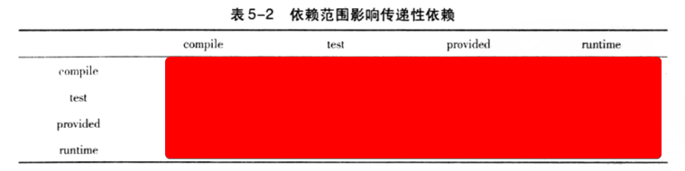
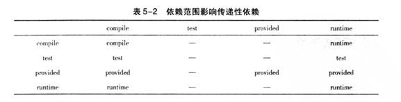
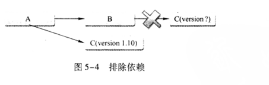
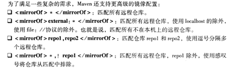
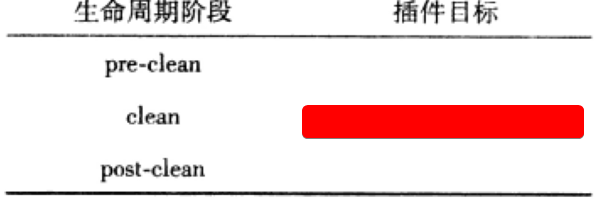
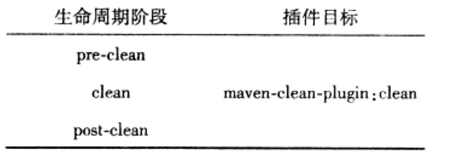
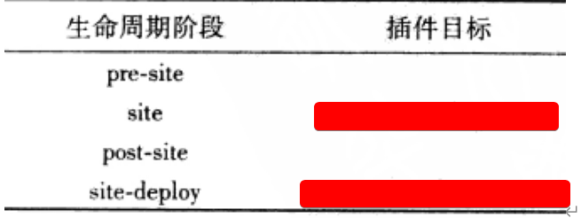
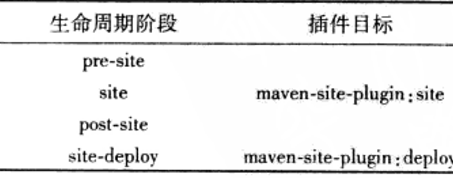

### windows上安装Maven [	](maven_20200331123149423)

- {{c1::环境变量`M2_HOME`：Maven安装目录}}
- {{c1::环境变量`Path`:添加`"%M2_HOME%\bin"`}}
- {{c1::管理员运行命令行检查安装情况：`mvn -v`}}
### .m2文件夹的作用 [	](maven_20200331123149426)

- 位置：{{c1::~/.m2}}
- .m2/repository ：{{c1::本地仓库}}
- .m2/settings.xml：{{c1::本地Maven配置文件}}
### 配置HTTP代理的作用(实践搜索) [	](maven_20200331123149427)

- 背景：{{c1::公司不允许直接访问外部网络，需要经过代理验证（比如在安全限制上设置了白名单网站），这时，maven需要通过配置http代理访问中央仓库（repo1.maven.org）}}
- 搜索：{{c1:: MAVEN配置HTTP代理 }}

### MAVEN_OPTS环境变量的作用 [	](maven_20200331123149428)
+ 通常需要设置MAVEN_OPTS的值为:{{c1::`-Xms128m  -Xmx512m`}}
+ 含义：{{c1:: 因为Java默认的最大可用内存往往不够满足Maven运行需要，比如较大的项目时，使用Maven生成项目站点需要占用大量内存。如果没有该配置，则很容易得到java.lang.OutOfMeneoryError。因此，一开始就配置该变量是推荐的做法。}}

### pom.xml文件中概要 [	](maven_20200331123149430)

| 元素                 | 意义                                                            |
| -------------------- | --------------------------------------------------------------- |
| `<modelVersion>`元素 | {{c1::当前POM模型的版本}}                                       |
| `<groupId>`元素      | {{c1::定义项目属于哪个组，通常与公司域名关联，建立一个myapp组为 | `com.google.myapp.`}} |
| `<artifactId>`元素   | {{c1:: 当前项目在组中的唯一ID,通常与模块文件夹名称一致 }}       |
| `<version>`元素      | {{c1:: 定义项目版本,1.0.SHNAPSHOT,其中SHNAPSHOT代表快照版本 }}  |
| `<name>`元素         | {{c1::可选的，声明一个对用户友好的项目名称。}}                  |
| `<packaging>`元素    | {{c1::可选的，打包方式默认为jar。}}                             |

### maven项目主要骨架 [	](maven_20200331123149431)

+ {{c1:: ./src/main/java }}
+ {{c1:: ./src/main/resources }}
+ {{c1:: ./src/test/java }}
+ {{c1:: ./src/test/resources }}
+ {{c1:: ./pom.xml }}

### maven的默认编译使用的jdk版本是1.3,如何解决？（实践搜索） [	](maven_20200331123149432)
+ {{c1:: maven会用maven-compiler-plugin默认的jdk版本来进行处理，以至于可能导致编译不通过的问题，需要显示在pom文件中配置插件。}}
+ {{c1::搜索：maven-compiler-plugin}}

### maven配置生成可执行的jar（搜索） [	](maven_20200331123149434)
含义：{{c1::maven默认打包生成jar是不能直接运行的，因为带有main方法的类信息不会添加到MANIFEST.MF文件,需要配置.}}
搜索:{{c1::`maven-shade-plugin`}}

### 使用archetype生成项目骨架 [	](maven_20200331123149437)
{{c1::
简单运行命令行：mvn archetype:generate
}}
### maven官方插件坐标的格式 [	](maven_20200331123149438)
{{c1::
```xml
<groupId>org.apache.maven.plugins</groupId>
<artifactId>maven-shade-plugin</artifactId>
```
}}

### 项目构件的文件名生成规则 [	](maven_20200331123149440)
一般规则为：{{c1:: `artifactId-version [-classifer] .packaging` }}

### 依赖范围与classpath之间的关系 [	](maven_20200331123149441)

- 3种classpath：{{c1::编译classpath，测试classpath，运行时classpath。}}
- 5种依赖范围：
  1. compile: {{c1::都有效，例子：spring-core}}
  2. test: {{c1::只对测试有效 例子：JUnit}}
  3. provided: {{c1::只对运行时无效，例子：servlet-api}}
  4. runtime: {{c1::只对编译无效，例子：JDBC驱动实现。}}
  5. System:{{c1::与provided一致，代表本地的，仓库之外的，需要配置systemPath元素。}}

### 依赖范围对传递性依赖的影响 [	](maven_20200331123149442)


{{c1::  }}

### 依赖冲突原则 [	](maven_20200331123149443)

有依赖关系如下：
1. A->B->C->X（1.0）、A->D->X（2.0）
2. A->B->X（1.0）、A->C->X（2.0）

分别对应什么依赖调解原则？
- {{c1:: 最短路径优先：X(2.0) }}
- {{c1:: 第一声明优先：X(1.0) }}

### `<dependency>`子元素`<optional>`的作用： [	](maven_20200331123149444)

{{c1:: 可选的，当optional为true时，<dependency>引用的依赖不会被传递给当前项目的引用者，通常需要引用者自己提供一个代替依赖。}}

### `<exclusion>`元素的使用场景以及使用例子 [	](maven_20200331123149445)

{{c1::



}}

+ {{c1:: 通常用于修改某个间接依赖版本。}}


{{c1:: 
```xml
    <exclusions>  
        <exclusion>  
            <groupId>org.springframework</groupId>  
            <artifactId>spring-beans</artifactId>  
        </exclusion> 
    <exclusions>
```
}}


### pom.xml中`<properties>`元素的使用 [	](maven_20200331123149447)

{{c1::
```xml
<properties>
 <spring.version>1.2.6</spring.version>
</properties>
```
```xml
<dependency>
 <groupId>org.springframework</groupId>
 <artifactId>spring-core</artifactId>
 <version>${spring.version}</version>
</dependency>
<dependency>
 <groupId>org.springframework</groupId>
 <artifactId>spring-aop</artifactId>
 <version>${spring.version}</version>
</dependency>
```
}}

### mvn dependency插件 [	](maven_20200410012359789)
+ 查看当前项目已解析依赖：{{c1:: mvn dependency:list }}
+ 查看当前项目的依赖树：{{c1:: mvn dependency:tree }}
+ 查看当前项目分析当前项目依赖：{{c1:: mvn dependency:analyze }}


## Maven仓库 [	](maven_20200410012359790)

### 仓库路径与坐标的对应关系为： [	](maven_20200410012359792)

{{c1:: groupId/artifactId/version/artifactId-version.packagine }}

### 自定义本地仓库目录地址 [	](maven_20200410012359793)
{{c1::
将以下配置加入settings.xml文件
```xml
<settings>
<localRepository>D:\java\myRepository</localRepository>
</settings>
```
}}

### 将本地项目的构建安装到Maven仓库中 [	](maven_20200410012359794)
{{c1:: 命令：{{c1:: mvn clean install }}

### Maven仓库的分类 [	](maven_20200410012359796)
+ {{c1:: 本地仓库 }}
+ {{c1:: 远程仓库 }}
    + {{c1:: 中央仓库 }}
    + {{c1:: 私服 }}
    + {{c1:: 其他公共库 }}

### 远程仓库认证的配置 [	](maven_20200410012359797)
{{c1::
在settings.xml文件中配置
```xml 
<servers>
<server>
<!-- id必须与POM中需要认证的repository元素ID一致 -->
<id>prok-releases</id>
<username>repo-user</username>
<password>repo-pwd</password>
</server>
</servers>
```
}}

### 远程依赖部署仓库的配置 [	](maven_20200410012359798)
```xml
<distributionManagement>
    <repository>
        <!-- 唯一标识符 -->
        <id>prok-releases</id>
        <!-- 仓库名称 -->
        <name>Proj Release Repository</name>
        <!-- 仓库地址 -->
        <url>http://192.168.1.100/content/repository/proj-releases</url>
    </repository>
    <snapshotRepository>
        <id>proj-snapshots</id>
        <name>Proj Snapshot Repository</name>
        <url>http://192.168.1.100/content/repository/proj-snapshots</url>
    </snapshotRepository>
</distributionManagement>
```
+ 以上配置到POM中后，配置正确的认证信息到settings.xml中
+ 运行`mvn clean deploy`命令部署。

### 远程依赖仓库以及远程插件仓库的配置 [	](maven_20200410012359800)

```xml
<!-- 远程依赖仓库 -->
<repositories>
        <repository>
            <id>maven-ali</id>
            <url>https://maven.aliyun.com/repository/public</url>
            <releases>
                <enabled>true</enabled>
            </releases>
            <snapshots>
                <enabled>true</enabled>
                <!-- daily,always -->
                <updatePolicy>always</updatePolicy>
                <!-- ignore,warn,fail -->
                <checksumPolicy>fail</checksumPolicy>
            </snapshots>
        </repository>
</repositories>
```
+ `<updatePolicy>`: {{c1:: 配置Maven检查更新的频率。}}
+ `<checksumPolicy>`: {{c1:: 配置Maven检查检验和文件的策略。}}

```xml
<!-- 远程插件仓库 -->
<!-- {{c1:: -->
<pluginRepositories>
        <pluginRepository>
            <!-- ...与远程依赖仓库一致 -->
        </pluginRepository>
</pluginRepositories>
<!-- }} -->
```

### 配置中央仓库镜像 [	](maven_20200410012359801)

{{c1::

```xml
<mirror>
<id>alimaven</id>
<name>aliyun maven</name>
<url>http://maven.aliyun.com/nexus/content/groups/public/</url>
<mirrorOf>central</mirrorOf>
</mirror>
```
}}

- id：唯一标识一个镜像
- name：镜像名称
- url：镜像地址
- mirrorOf：代表一个镜像的替代位置，例如central就表示代替官方的中央仓库
- mirrorOf用法如下：

{{c1::}}

### 中央仓库的概念 [	](maven_20200410012359802)
+ 中央仓库是Maven配置文件中默认的仓库地址，如果用户没有修改仓库配置，那么Maven默认会从中央仓库下载依赖。
+ 其在超级POM文件中的默认配置了`<repository>`元素

### Maven的快照版本机制 [	](maven_20200410012359804)
{{c1::
+ 将当前项目坐标中`<version>`改为类似2.1-SNAPSHOT的值
+ 然后发布到私服中，发布过程中，maven自动为构件打上时间戳。
+ 类似：2.1-20091214.221414-13.jar
}}
+ 强制更新命令：{{c1:: `mvn clean install-U`}}

### Maven生命周期 [	](maven_20200410012359805790

### clean生命周期阶段与插件目标的绑定关系 [	](maven_20200410012359806)



{{c1::}}

### site生命周期阶段与插件目标的绑定关系 [	](maven_20200410012359808)



{{c1::  }}

 }}

### default生命周期与内置插件绑定关系及具体任务(打包类型: jar) [	](maven_20200410012359809)

| 生命周期阶段           |               插件目标                | 执行任务                               |
| ---------------------- | :-----------------------------------: | -------------------------------------- |
| process-resources      |   maven-resources-plugin:resources    | {{c1::复制主资源文件至主输出目录}}     |
| compile                |     maven-compile-plugin:compile      | {{c1::编译主代码至主输出目录}}         |
| process-test-resources | maven-resources-plugin:testRresources | {{c1::复制测试资源文件至测试输出目录}} |
| test-compile           |   maven-compiler-plugin:testCompile   | {{c1::编译测试代码至测试输出目录}}     |
| test                   |      maven-surefire-plugin:test       | {{c1::执行测试用例}}                   |
| package                |         maven-jar-plugin:jar          | {{c1::创建项目jar包}}                  |
| install                |     maven-install-plugin:install      | {{c1::将项目输出构件安装到本地仓库}}   |
| deploy                 |      maven-deploy-plugin:deploy       | {{c1::将项目输出构件部署到远程仓库}}   |

### 将`maven-source-plugin`插件的`jar-no-fork`绑定到default生命周期的verify阶段 [	](maven_20200410012359811)

```xml
<!-- {{c1:: -->
    <plugin>
        <groupId>org.apache.maven.plugins</groupId>
        <artifactId>maven-source-plugin</artifactId>
        <version>2.1.1</version>
        <executions>
            <execution>
                <id>attach-sources</id>
                <phase>verify</phase>
                <goals>
                    <goal>jar-no-fork</goal>
                </goals>
            </execution>
        </executions>
    </plugin>
    <!-- 当执行 verify生命周期阶段的时候，maven-Source-plugin:jar-no-fork会得以执行，它会创建一个以 ources. Jar结尾的源码文件包。}} -->
```

### maven中插件的配置 [	](maven_20200410012359813)

+ 命令行配置：{{c1:: `mvn install-Dmaven.test.skip=true`跳过安装配置 }}
+ 插件配置：{{c1:: 在POM中`<plugin>`的子元素`<configuration>`中配置}}
+ 插件任务配置：{{c1:: `<configuration>`下`<tasks>`还可配置插件任务}}

## 聚合与继承 [	](maven_20200410012359814)

### maven聚合的概念 [	](maven_20200410012359816)

+ 作用：{{c1:: 使用一条命令就可以构建多个项目，本质上上是maven提供的工具。}}
+ 必要：{{c1:: 聚合模块的打包方式为`pom`}}
+ 父子目录形式的聚合
    ```xml
    <!-- 通常使用该形式 -->
    <!-- {{c1:: -->
    	<modules>
            <module>account-email</module>
            <module>account-persist</module>
	    </modules>
    <!-- }} -->
    ```
+ 平行目录形式的聚合
    ```xml
    <!-- {{c1:: -->
    	<modules>
            <module>../account-email</module>
            <module>../account-persist</module>
	    </modules>
    <!-- }} -->
    ```

### maven继承的概念 [	](maven_20200410012359817)

+ 作用：{{c1:: 消除重复配置 }}
+ 必要：{{c1:: 与聚合一样，继承模块打包方式也为pom }}
+ 继承父模块语法
    ```xml
        <!-- {{c1:: -->
        <parent>
            <artifactId>com.juvenxu.mvnbook.account</artifactId>
            <groupId>account-parent</groupId>
            <version>1.0-SNAPSHOT</version>
            <!-- 平行目录形式，指定父模块的pom文件 -->
            <relativePath>../account-parent/pom.xml</relativePath>
        </parent>   
        <!-- }} -->
    ```
+ `<relativePath>`的默认值：{{c1:: `../pom.xml` (即父目录的pom.xml)}}

### 同一模块中，聚合与继承的区别 [	](maven_20200410012359819)

|              | 聚合                                | 继承                                |
| :----------- | ----------------------------------- | ----------------------------------- |
| **作用**     | {{c1::方便构建项目}}                | {{c1::消除重复配置}}                |
| **语法**     | {{c1::父模块中配置`<modules>`}}     | {{c1::子模块中配置`<parent>`}}      |
| **打包方式** | {{c1::`<packaging>pom<packaging>`}} | {{c1::`<packaging>pom<packaging>`}} |

### 父模块中 `<dependencyManagement> <pluginManagement>` 与 `<dependencies> <plugins>` 区别 [	](maven_20200410012359821)

+  `<dependencies> <plugins>`即使在子项目中不写该依赖项，那么子项目仍然会从父项目中继承该依赖项（全部继承）。
+ `<dependencyManagement> <pluginManagement>`里只是声明依赖，并不实现引入，因此子项目需要显示的声明需要用的依赖,无需版本号。

### `<dependency>`中的`<scope>import</scope>` [	](maven_20200410012359823)

+ 作用：{{c1:: 将目标POM中`<dependencyManagement`的配置导入并合并到当前POM的`<dependencyManagement`中 }}
+ 必要：{{c1:: import依赖范围通常都是指向打包类型为pom的模块 }}
+ 具体语法：
    ```xml
        <!-- {{c1:: -->
         <dependencyManagement>
            <dependencies>
                <dependency>
                    <groupId>org.springframework.boot</groupId>
                    <artifactId>spring-boot-dependencies</artifactId>
                    <version>2.0.1.BUILD-SNAPSHOT</version>
                    <!-- import依赖范围通常都是指向打包类型为pom的模块 -->
                    <type>pom</type>
                    <scope>import</scope>
                </dependency>
            </dependencies>
        </dependencyManagement>
        <!-- }} -->
    ```
### 超级POM概念 [	](maven_20200410012359825)

+ 作用：{{c1:: 任何一个Maven项目都隐式的继承自该POM }}
+ 位置：{{c1:: lib下maven-model-builder-3.6.3.jar包中 }}

### maven的`Reactor Build Order`概念 [	](maven_20200412024742027)
+ Maven按顺序读取POM，读取当前模块时，会检查是否有POM依赖链，如果有会从链顶端开始构建模块。
+ Reactor Build Order是POM的构建顺序。

### 裁剪反应堆 [	](maven_20200412024742032)
+ 作用：构建完整反应堆中的某些个模块。
+ 构建指定的几个模块命令：{{c1::`mvn clean install -pl account-email,account-persist`}}
+ 同时构建所列模块的依赖模块：{{c1::`mvn clean install -pl account-email-am`}}
+ 同时构建依赖于所列模块的模块：{{c1::`mvn clean install -pl account-email-amd`}}
+ 在完整的反应堆构建顺序基础上制定从哪个模块开始构建：{{c1::`mvn clean install -rf account-email`}}
+ 在-pl -am或者-pl -amd的基础上应用-rf参数：{{c1::`mvn clean install -pl account-parent -amd -rf acount-email`}}

### windows下安装Nexus与启动 [	](maven_20200412024742034)

1. 下载Nexus安装包后。
2. {{c1:: 在.../nexus-3.14.0-04-win64/nexus-3.14.0-04/bin 目录下，以管理员身份运行cmd。}}
3. 启动nexus服务
   -  启动nexus服务命令：{{c1::`nexus.exe /run`}}
   - 安装nexus本地服务来启动
     - 安装服务：{{c1::`nexus.exe /install <optional-service-name>`}}
     - 启动服务：{{c1::`nexus.exe /start <optional-service-name>`}}
     - 关闭服务：{{c1::`nexus.exe /stop <optional-service-name>`}}
     - 手动开启与关闭服务：{{c1::`控制面板\系统和安全\管理工具\服务`}}
4. 访问Nexus:{{c1::`http://localhost:8081/`}}

### nexus仓库类型 [	](maven_20200412024742035)

默认安装有以下这几个仓库，在控制台也可以修改远程仓库的地址，第三方仓库等。

| 仓库名               | 作用                                                         |
| -------------------- | ------------------------------------------------------------ |
| hosted（宿主仓库库） | 地仓库，通常我们会部署自己的构件到这一类型的仓库。比如公司的第二方库 |
| proxy（代理仓库）    | 代理仓库，它们被用来代理远程的公共仓库，如maven中央仓库。    |
| group（组仓库）      | 仓库组，用来合并多个hosted/proxy仓库，当你的项目希望在多个repository使用资源时就不需要多次引用了，只需要引用一个group即可。 |
| virtual (虚拟仓库)   | 基本用不到，重点关注上面三个仓库的使用                       |