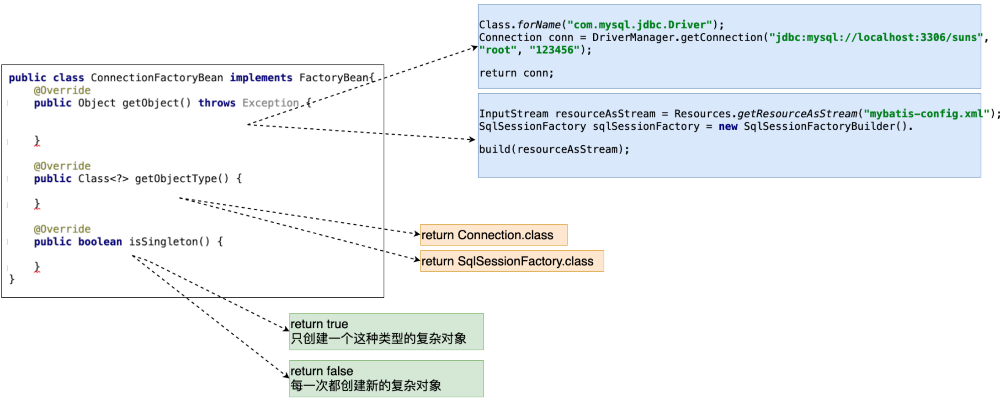

## 工厂 [	](spring_20200713102713838)

### EJB对比Spring [	](spring_20200713102713839)

- EJB({{c1:: Enterprise Java Bean }})特点：
    1. {{c1:: 运行环境苛刻 }}
    2. {{c1:: 代码移植性差 }}
    3. {{c1:: 重量级的框架 }}
- Spring:{{c1:: 轻量级的JavaEE解决方案，整合众多优秀的设计模式 }}
  - 轻量级：{{c1:: 对于运行环境是没有额外要求的 }}
    - 开源运行环境：{{c1:: tomcat resion jetty }}
    - 收费运行环境：{{c1:: weblogic websphere }}
  - 代码移植性高,{{c1:: 不需要实现额外接口 }}
  - 整合设计模式
    1.  {{c1:: 工厂 }}
    2.  {{c1:: 代理 }}
    3.  {{c1:: 模板 }}
    4.  {{c1:: 策略 }}

### 设计模式 [	](spring_20200713102713841)

1. 广义概念:{{c1:: 面向对象设计中，解决特定问题的经典代码 }}
2. 狭义概念:{{c1:: GOF4人帮定义的23种设计模式：工厂、适配器、装饰器、门面、代理、模板... }}

### 通用工厂的设计 [	](spring_20200713102713842)
- 简单工厂会存在大量的代码冗余
  - 
- 通用工厂的代码
  ```java
  //{{c1::
  public class BeanFactory{
      public static Object getBean(String key){
          Object ret = null;
          try {
              Class clazz = Class.forName(env.getProperty(key));
              ret = clazz.newInstance();
          } catch (Exception e) {
              e.printStackTrace();
          }
          return ret;
      }
  }
  //}}
  ```

##  Spring的核心API [	](spring_20200713102713844)

### Spring的配置文件 [	](spring_20200713102713845)

1.  配置文件的放置位置：{{c1:: 没有硬性要求，可以任意位置 }}
2.  配置文件的命名 ：{{c1:: 没有硬性要求 ，通常使用`applicationContext.xml` }}

### ApplicationContext [	](spring_20200713102713846)

+ 作用：工厂接口
- 主要实现类
  - 非web环境:(main junit)：{{c1::  `ClassPathXmlApplicationContext` }}
  - web环境 ：{{c1::   `XmlWebApplicationContext` }}
- 重量级资源含义：{{c1:: ApplicationContext工厂的对象占用大量内存，一个应用只会创建一个工厂对象，一定是线程安全的。 }}

### spring程序开发流程 [	](spring_20200713102713847)

1. 创建类型:{{c1:: `public class Person{...}` }}
2. 配置文件的配置 :{{c1:: `<bean id="person" class="com.baizhiedu.basic.Person"/>` }}
3. 通过工厂类，获得对象
   ```java
   //{{c1::
   ApplicationContext ctx = new ClassPathXmlApplicationContext("/applicationContext.xml");
   Person person = (Person)ctx.getBean("person");
   //}}
   ```
- 注意：Spring工厂创建的对象，叫做{{c1:: bean或者组件(componet) }}

### Spring工厂的相关的方法 [	](spring_20200713102713849)

+ 通过这种方式获得对象，就不需要强制类型转换:{{c1:: `Person person = ctx.getBean("person", Person.class);`}}
+ 当前Spring的配置文件中 只能有一个`<bean class ..>`是Person类型:{{c1:: `Person person = ctx.getBean(Person.class);`}}
+ 获取的是 Spring工厂配置文件中所有bean标签的id值:{{c1:: `String[] beanDefinitionNames = ctx.getBeanDefinitionNames();`}}
+ 根据类型获得Spring配置文件中对应的id值:{{c1:: `String[] beanNamesForType = ctx.getBeanNamesForType(Person.class);`}}
+ 用于判断是否存在指定id值得bean:{{c1:: `ctx.containsBeanDefinition("a")`}}
+ 用于判断是否存在指定id值得bean:{{c1:: `ctx.containsBean("person")`}}

### 配置文件细节 [	](spring_20200713102713850)
+ `<bean  class="com.baizhiedu.basic.Person"/>`自动分配的id值为:{{c1:: com.baizhiedu.basic.Person#0 }}
+ name属性与id属性的区别
  1. 多个别名：{{c1:: 别名可以定义多个,但是id属性只能有一个值}}
  2. 命名要求：{{c1:: XML的id属性的值有命名要求：必须以字母开头，字母 数字 下划线 连字符 不能以特殊字符开头 /person，但现在这个限制已经没有了。name属性的值没有命名要求。}}
  3. ctx.containsBean("p"):{{c1:: 也可以判断name值}}
  4. ctx.containsBeanDefinition("person"):{{c1:: 不可以判断name值}}

### Spring工厂的底层实现原理(简易版) [	](spring_20200713102713852)


{{c1::}}

### Spring5.x与日志框架的整合

+ 默认日志框架
  + spring 1/2/3 早起都是基于：{{c1:: commons-logging.jar}}
  + spring 5.x默认使用：{{c1:: logback log4j2}}
+ 整合log4j
  1. 引入依赖：{{c1:: `slf4j-log4j12` `log4j`}}
  2. 配置文件：{{c1:: 将`log4j.properties`放在`resources`文件夹根目录下}}

## 依赖注入
### 什么是注入
  + 注入：{{c1:: Injection,通过Spring工厂及配置文件，为所创建对象的成员变量赋值 }}
  + 为什么需要注入：{{c1:: **通过编码的方式，为成员变量进行赋值，存在耦合** }}
  + 如何进行注入[开发步骤]
    - {{c1:: 类的成员变量提供set get方法 }}
    - {{c1:: 配置spring的配置文件 }}
      ```xml
        <!-- {{c1:: -->
        <bean id="person" class="com.baizhiedu.basic.Person">
          <property name="id">
            <value>10</value>
          </property>
          <property name="name">
            <value>xiaojr</value>
          </property>
        </bean>
        <!-- }} -->
      ```
### Spring注入的原理分析(简易版)

+ `<bean id="account" class="xxx.Accout">`等效于：{{c1:: `Account account = new Account();`}}
+ `<property name="name">`等效于：{{c1:: `account.setName("suns");`}}

### JDK内置类型注入

+ String + 8种基本类型：
  ```xml
  <!-- {{c1:: -->
  <value>suns</value>
  <!-- }} -->
  ```
+ 数组
  ```xml
  <!-- {{c1:: -->
  <list>
    <value>suns@zparkhr.com.cn</value>
    <value>liucy@zparkhr.com.cn</value>
    <value>chenyn@zparkhr.com.cn</value>
  </list>
  <!-- }} -->
  ```
+ Set集合
  ```xml
  <!-- {{c1:: -->
  <set>
    <value>11111</value>
    <value>112222</value>
    <ref bean="account">
    <set>...
  </set>
  <!-- }} -->
  ```
+ List集合
  ```xml
  <!-- {{c1:: -->
  <list>
    <value>11111</value>
    <value>2222</value>
    <ref bean>
    <set>...
  </list>
  <!-- }} -->
  ```
+ Map集合
  ```xml
  <!-- {{c1:: -->
  <map>
    <entry>
      <key><value>suns</value></key>
      <value>3434334343</value>
    </entry>
    <entry>
      <key><value>chenyn</value></key>
      <ref bean="account">
    </entry>
  </map>
  <!-- }} -->
  ```
+ Properites
  ```xml
  <!-- {{c1:: -->
  <!-- Properties类型 特殊的Map key=String value=String  -->
  <props>
    <prop key="key1">value1</prop>
    <prop key="key2">value2</prop>
  </props>
  <!-- }} -->
  ```

### 用户自定义类型注入

- 新建bean注入(赋值)
  ```xml
  <!-- {{c1:: -->
  <bean id="userService" class="xxxx.UserServiceImpl">
     <property name="userDAO">
         <bean class="xxx.UserDAOImpl"/>
    </property>
  </bean>
  <!-- }} -->
  ```
  + 存在问题
    1. {{c1:: 配置文件代码冗余}}
    2. {{c1:: 被注入的对象(UserDAO),多次创建，浪费（JVM)内存资源}}
+ bean引用注入
  ```xml
  <!-- {{c1:: -->
  <bean id="userDAO" class="xxx.UserDAOImpl"/>
  <bean id="userService" class="xxx.UserServiceImpl">
     <property name="userDAO">
          <ref bean="userDAO"/>
    </property>
  </bean>
  <!-- }} -->
  ```

### Set注入的简化写法

- 基于属性的简化写法
  - spring + 8种基本类型:{{c1:: `<property name="name" value="suns"/>`}}
  - 用户自定义类型：{{c1:: `<property name="userDAO" ref="userDAO"/>`}}
- 基于p命名空间的简化写法
  - spring + 8种基本类型:{{c1:: `<bean id="person" class="xxx.Person" p:name="suns"/>`}}
  - 用户自定义类型：{{c1:: `<bean id="userService" class="xxx.UserServiceImpl" p:userDAO-ref="userDAO"/>`}}

### 构造注入

- 基于以下代码进行构造注入
    ```java
    <!-- {{c1:: -->
    public class Customer implements Serializable {
        private String name;
        private int age;
    public Customer(String name, int age) {
            this.name = name;
            this.age = age;
        }
    }
    <!-- }} -->
    ```
+ 配置文件
    ```xml
    <!-- {{c1:: -->
    <bean id="customer" class="com.baizhiedu.basic.constructer.Customer">
      <constructor-arg>
        <value>suns</value>
      </constructor-arg>
      <constructor-arg>
        <value>102</value>
      </constructor-arg>
    </bean>
    <!-- }} -->
    ```

+ 当构造方法有多个重载方法时的2种情况的类型冲突解决
  1. 参数个数不同时：{{c1:: 通过控制`<constructor-arg>`标签的数量进行区分  }}
  2. 构造参数个数相同时：{{c1:: `用type属性进行类型的区分 <constructor-arg type="">` }}

### spring注入的总结图

{{c1::}}

### 反转控制与依赖注入

- 反转控制：
  - IOC：{{c1:: inverse of Control }}
  - 控制:{{c1:: 对于成员变量赋值的控制权 }}
  - 反转控制:{{c1:: 把对于成员变量赋值的控制权，从代码中反转(转移)到Spring工厂和配置文件中完成,达到解耦合的目的 }}
- 依赖注入：
  - DI：{{c1:: Dependency Injection }}
  - 注入：{{c1:: 通过Spring的工厂及配置文件，为对象（bean，组件）的成员变量赋值 }}
  - 依赖注入：{{c1:: 当一个类需要另一个类时，就意味着依赖，一旦出现依赖，就可以把另一个类作为本类的成员变量，最终通过Spring配置文件进行注入(赋值),达到解耦合的目的 }}

### Spring工厂创建复杂对象的3种方式

- 实例工厂与静态工厂
  - 作用：{{c1:: 避免Spring框架的侵入，整合遗留系统  }}s
  - 实例工厂:
    ```xml
      <!-- {{c1:: -->
     <bean id="connFactory" class="com.baizhiedu.factorybean.ConnectionFactory"></bean>
     <bean id="conn"  factory-bean="connFactory" factory-method="getConnection"/>
     <!-- }} -->
    ```
  - 静态工厂：
      ```xml
      <!-- {{c1:: -->
      <bean id="conn" class="com.baizhiedu.factorybean.StaticConnectionFactory" factory-method="getConnection"/>
      <!-- }} -->
      ```

- 实现FactoryBean接口
  - 实现内部3个方法:
  - 配置：`<bean id="conn" class="com.baizhiedu.factorybean.ConnectionFactoryBean"/>`
  - 细节:
    - 获得FactoryBean类型的对象 :`ctx.getBean("&conn")`获得就是ConnectionFactoryBean对象
    - 依赖注入的体会(DI):
      ```xml
      把ConnectionFactoryBean中依赖的4个字符串信息 ，进行配置文件的注入
      <bean id="conn" class="com.baizhiedu.factorybean.ConnectionFactoryBean">
        <property name="driverClassName" value="com.mysql.jdbc.Driver"/>
        <property name="url" value="jdbc:mysql://localhost:3306/suns?useSSL=false"/>
        <property name="username" value="root"/>
        <property name="password" value="123456"/>
      </bean>
      ```
    - mysql高版本连接创建时，需要制定SSL证书，解决问题的方式
      ```
      url = "jdbc:mysql://localhost:3306/suns?useSSL=false"
      ```

### Spring工厂创建对象的总结图

{{c1::}}

### Spring工厂创建对象的次数

- 创建对象的次数的类型：
  - singleton:{{c1:: 只会创建一次简单对象 默认值}}
  - prototype:{{c1:: 每一次都会创建新的对象}}
- 控制简单对象的创建次数:{{c1:: `<bean id="account" scope="singleton|prototype" class="xxxx.Account"/>`}}
- 控制复杂对象的创建次数:{{c1:: 实现FactoryBean接口中`boolean isSingleton()`方法返回值}}
- 什么样的对象只创建一次？
  1. {{c1:: `SqlSessionFactory` }}
  2. {{c1:: `DAO` }}
  3. {{c1:: `Service` }}
- 什么样的对象 每一次都要创建新的？
  1. {{c1:: `Connection` }}
  2. {{c1:: `SqlSession | Session` }}
  3. {{c1:: `Struts2 Action` }}
