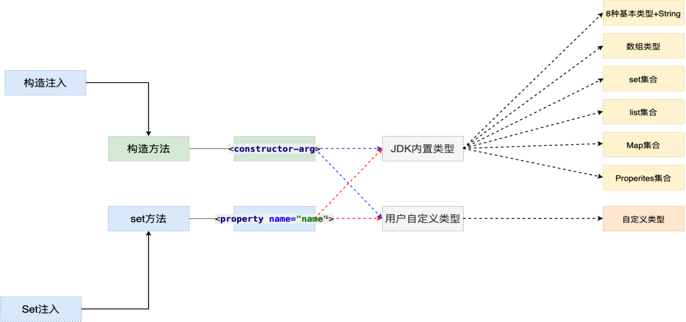
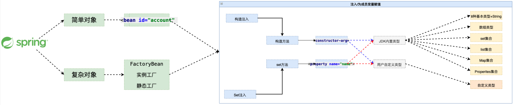
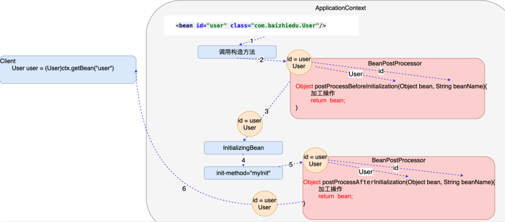

### EJB对比Spring [	](spring_20200713102713839)

- EJB({{c1:: Enterprise Java Bean }})特点：
    1. {{c1:: 运行环境苛刻 }}
    2. {{c1:: 代码移植性差 }}
    3. {{c1:: 重量级的框架 }}
- Spring:{{c1:: 轻量级的JavaEE解决方案，整合众多优秀的设计模式 }}
  - 轻量级：{{c1:: 对于运行环境是没有额外要求的 }}
    - 开源运行环境：{{c1:: tomcat resion jetty }}
    - 收费运行环境：{{c1:: weblogic websphere }}
  - 代码移植性高,{{c1:: 不需要实现额外接口 }}
  - 整合设计模式
    1.  {{c1:: 工厂 }}
    2.  {{c1:: 代理 }}
    3.  {{c1:: 模板 }}
    4.  {{c1:: 策略 }}

### 静态类实现通用工厂 [	](spring_20200713102713842)
- 简单工厂会存在大量的代码冗余
  
  - 
- 通用工厂的代码
  ```java
  //{{c1::
  public class BeanFactory{
      public static Object getBean(String key){
          Object ret = null;
          try {
              Class clazz = Class.forName(env.getProperty(key));
              ret = clazz.newInstance();
          } catch (Exception e) {
              e.printStackTrace();
          }
          return ret;
      }
  }
  //}}
  ```

##  Spring的核心API [	](spring_20200713102713844)

### BeanFactory [	](spring_20200824063336925)

+ 作用：{{c1:: spring最核心的接口，是`ApplicationContext`的父接口。 }}

+ 常用实现类：{{c1:: `DefaultListableBeanFactory` }}


### ApplicationContext [	](spring_20200713102713846)

+ 作用：工厂接口
- 主要实现类
  - 非web环境:(main junit)：{{c1::  `ClassPathXmlApplicationContext` }}
  - web环境 ：{{c1::   `XmlWebApplicationContext` }}
- 重量级资源含义：{{c1:: ApplicationContext工厂的对象占用大量内存，一个应用只会创建一个工厂对象，一定是线程安全的。 }}

### ApplicationContext的国际化:概念 [	](spring_20200824063336928)

- ApplicationContext继承了MessageSource接口，该接口具有以下方法：
  1. {{c1:: `String getMessage(String code,Object[] args,Locale loc)` }}
  2. {{c1:: `String getMessage(String code,Object[] args,String default,Locale loc)` }}
- ApplicationContext在创建时，为了实现国际化：
  - {{c1:: 会自动在其容器中寻找`messageSource bean` }}
  - {{c1:: 如果没有找到，会自动创建一个`staticMessageSrouce bean`接收getMessage方法的调用 }}

### ApplicationContext的国际化:使用 [	](spring_20200824063336931)

- 给出文件名为`message_en_US.properties`与`message_zh_CN.properties`两个资源文件
- 配置`messageSource`:
  ```xml
   <!-- {{c1:: -->
  	<bean id="messageSource" class="xxx.ResourceBundleMessageSource">
  		<property name="defaultEncoding" value="utf-8"/>
  		<property name="basenames">
  			<list>
  				<value>message</value>
  			</list>
  		</property>
  	</bean>
    <!-- }} -->
  ```
- 使用：
  ```java
    //{{c1::
    ctx.getMessage("hello", new String[]{"孙悟空"},Locale.getDefault(Locale.Category.FORMAT));
    ctx.getMessage("now", new Object[]{new Date()},Locale.getDefault(Locale.Category.FORMAT));  
    //}}
  ```

### ApplicationContext的事件机制 [	](spring_20200824063336933)

+ 简单使用例子：
  ```java
    //{{c1::
    var ctx = new ClassPathXmlApplicationContext("beans.xml");
		// 创建一个ApplicationEvent对象
		var ele = new EmailEvent("test", "spring_test@163.com", "this is a test");
		// 发布容器事件
    ctx.publishEvent(ele);
    //}}
  ```
+ 使用事件机制的配置步骤：
   1. {{c1:: 自定义实现了`ApplicationEvent`的事件类 }}
   2. {{c1:: 自定义实现了`ApplicationListener`的监听器 }}
   3. {{c1:: 配置监听器：`<bean class="xx.xxApplicationListener" />` }}
   
### spring内置的xxxAware接口 [	](spring_20200824063336936)

+ 作用：{{c1:: 让容器调用setter将**特定的对象**注入到实现了`xxxAware接口`的`bean`中 }}
+ 常见的`xxxAware接口`：
  + `BeanNameAware`：{{c1:: 容器会注入bean本身的id值 }}
  + `ResourceLoaderAware`：{{c1:: 容器会注入资源访问器，如果没有自定义`ResourceLoader`,默认注入的实际上是`ResourceLoader`类型的`ctx`对象 }}
  + `ApplicationContextAware`：{{c1:: 容器会注入ctx对象 }}

### spring程序开发流程 [	](spring_20200713102713847)

1. 创建java类:{{c1:: `public class Person{...}` }}
2. 在配置文件中配置Bean :{{c1:: `<bean id="person" class="com.baizhiedu.basic.Person"/>` }}
3. 通过工厂（容器）类，获得对象
   ```java
   //{{c1::
   ApplicationContext ctx = new ClassPathXmlApplicationContext("/applicationContext.xml");
   Person person = (Person)ctx.getBean("person");
   //}}
   ```
- 注意：Spring工厂创建的对象，叫做{{c1:: bean或者组件(componet) }}

### Spring工厂的相关的方法 [	](spring_20200713102713849)

+ 通过这种方式获得对象，就不需要强制类型转换:{{c1:: `Person person = ctx.getBean("person", Person.class);`}}
+ 当前Spring的配置文件中 只能有一个`<bean class ..>`是Person类型:{{c1:: `Person person = ctx.getBean(Person.class);`}}
+ 获取的是 Spring工厂配置文件中所有bean标签的id值:{{c1:: `String[] beanDefinitionNames = ctx.getBeanDefinitionNames();`}}
+ 根据类型获得Spring配置文件中对应的id值:{{c1:: `String[] beanNamesForType = ctx.getBeanNamesForType(Person.class);`}}
+ 用于判断是否存在指定id值得bean:{{c1:: `ctx.containsBeanDefinition("a")`}}
+ 用于判断是否存在指定id值得bean:{{c1:: `ctx.containsBean("person")`}}

### spring配置文件细节 [	](spring_20200713102713850)

+ `<bean  class="com.baizhiedu.basic.Person"/>`自动分配的id值为:{{c1:: com.baizhiedu.basic.Person#0 }}
+ name属性与id属性的区别
  1. 多个别名：{{c1:: 别名可以定义多个,但是id属性只能有一个值}}
  2. 命名要求：{{c1:: XML的id属性的值有命名要求：必须以字母开头，字母 数字 下划线 连字符 不能以特殊字符开头 /person，但现在这个限制已经没有了。name属性的值没有命名要求。}}
  3. ctx.containsBean("p"):{{c1:: 也可以判断name值}}
  4. ctx.containsBeanDefinition("person"):{{c1:: 不可以判断name值}}

### Spring5.x与日志框架的整合 [	](spring_20200715110208921)

+ 默认日志框架
  + spring 1/2/3 早起都是基于：{{c1:: commons-logging.jar}}
  + spring 5.x默认使用：{{c1:: logback log4j2}}
+ 整合log4j
  1. 引入依赖：{{c1:: `slf4j-log4j12` `log4j`}}
  2. 配置文件：{{c1:: 将`log4j.properties`放在`resources`文件夹根目录下}}

## 依赖注入 [	](spring_20200715110208922)
### 什么是注入 [	](spring_20200715110208923)
  + 注入：{{c1:: Injection,通过Spring工厂及配置文件，为所创建对象的成员变量赋值 }}
  + 为什么需要注入：{{c1:: **通过编码的方式，为成员变量进行赋值，存在耦合** }}
  + 如何进行注入[开发步骤]
    - {{c1:: 类的成员变量提供set get方法 }}
    - {{c1:: 配置spring的配置文件 }}
      ```xml
        <!-- {{c1:: -->
        <bean id="person" class="com.baizhiedu.basic.Person">
          <property name="id">
            <value>10</value>
          </property>
          <property name="name">
            <value>xiaojr</value>
          </property>
        </bean>
        <!-- }} -->
      ```
### Spring注入的原理分析(简易版) [	](spring_20200715110208924)

+ `<bean id="account" class="xxx.Accout">`等效于：{{c1:: `Account account = new Account();`}}
+ `<property name="name">`等效于：{{c1:: `account.setName("suns");`}}

### JDK内置类型注入 [	](spring_20200715110208925)

+ String + 8种基本类型：
  ```xml
  <!-- {{c1:: -->
  <value>suns</value>
  <!-- }} -->
  ```
+ 数组
  ```xml
  <!-- {{c1:: -->
  <list>
    <value>suns@zparkhr.com.cn</value>
    <value>liucy@zparkhr.com.cn</value>
    <value>chenyn@zparkhr.com.cn</value>
  </list>
  <!-- }} -->
  ```
+ Set集合
  ```xml
  <!-- {{c1:: -->
  <set>
    <value>11111</value>
    <value>112222</value>
    <ref bean="account">
    <set>...
  </set>
  <!-- }} -->
  ```
+ List集合
  ```xml
  <!-- {{c1:: -->
  <list>
    <value>11111</value>
    <value>2222</value>
    <ref bean>
    <set>...
  </list>
  <!-- }} -->
  ```
+ Map集合
  ```xml
  <!-- {{c1:: -->
  <map>
    <entry>
      <key><value>suns</value></key>
      <value>3434334343</value>
    </entry>
    <entry>
      <key><value>chenyn</value></key>
      <ref bean="account">
    </entry>
  </map>
  <!-- }} -->
  ```
+ Properites
  ```xml
  <!-- {{c1:: -->
  <!-- Properties类型 特殊的Map key=String value=String  -->
  <props>
    <prop key="key1">value1</prop>
    <prop key="key2">value2</prop>
  </props>
  <!-- }} -->
  ```

### 用户自定义类型注入 [	](spring_20200715110208926)

- 新建bean注入(赋值)
  ```xml
  <!-- {{c1:: -->
  <bean id="userService" class="xxxx.UserServiceImpl">
     <property name="userDAO">
         <bean class="xxx.UserDAOImpl"/>
    </property>
  </bean>
  <!-- }} -->
  ```
  + 存在问题
    1. {{c1:: 配置文件代码冗余}}
    2. {{c1:: 被注入的对象(UserDAO),多次创建，浪费（JVM)内存资源}}
+ bean引用注入
  ```xml
  <!-- {{c1:: -->
  <bean id="userDAO" class="xxx.UserDAOImpl"/>
  <bean id="userService" class="xxx.UserServiceImpl">
     <property name="userDAO">
          <ref bean="userDAO"/>
    </property>
  </bean>
  <!-- }} -->
  ```

### 依赖注入:Set注入的简化写法 [	](spring_20200715110208927)

- 基于属性的简化写法
  - spring + 8种基本类型:{{c1:: `<property name="name" value="suns"/>`}}
  - 用户自定义类型：{{c1:: `<property name="userDAO" ref="userDAO"/>`}}
- 基于p命名空间的简化写法
  - spring + 8种基本类型:{{c1:: `<bean id="person" class="xxx.Person" p:name="suns"/>`}}
  - 用户自定义类型：{{c1:: `<bean id="userService" class="xxx.UserServiceImpl" p:userDAO-ref="userDAO"/>`}}

### 依赖注入:构造注入 [	](spring_20200715110208928)

- 基于以下代码进行构造注入
    ```java
    public class Customer implements Serializable {
        private String name;
        private int age;
        public Customer(String name, int age) {
            this.name = name;
            this.age = age;
        }
    }
    ```
+ 配置文件
    ```xml
    <!-- {{c1:: -->
    <bean id="customer" class="com.baizhiedu.basic.constructer.Customer">
      <constructor-arg>
        <value>suns</value>
      </constructor-arg>
      <constructor-arg>
        <value>102</value>
      </constructor-arg>
    </bean>
    <!-- }} -->
    ```

+ 当构造方法有多个重载方法时的2种情况的类型冲突解决
  1. 参数个数不同时：{{c1:: 通过控制`<constructor-arg>`标签的数量进行区分  }}
  2. 构造参数个数相同时：{{c1:: `用type属性进行类型的区分 <constructor-arg type="">` }}

### spring注入的总结图 [	](spring_20200715110208929)

{{c1::}}

### 反转控制与依赖注入 [	](spring_20200715110208930)

- 反转控制：
  - IOC：{{c1:: inverse of Control }}
  - 控制:{{c1:: 对于成员变量赋值的控制权 }}
  - 反转控制:{{c1:: 把对于成员变量赋值的控制权，从代码中反转(转移)到Spring工厂和配置文件中完成,达到解耦合的目的 }}
- 依赖注入：
  - DI：{{c1:: Dependency Injection }}
  - 注入：{{c1:: 通过Spring的工厂及配置文件，为对象（bean，组件）的成员变量赋值 }}
  - 依赖注入：{{c1:: 当一个类需要另一个类时，就意味着依赖，一旦出现依赖，就可以把另一个类作为本类的成员变量，最终通过Spring配置文件进行注入(赋值),达到解耦合的目的 }}

## spring工程高级特性 [	](spring_20200717061050980)

### Spring工厂创建复杂对象的3种方式 [	](spring_20200715110208931)

- 实例工厂与静态工厂
  - 作用：{{c1:: 避免Spring框架的侵入，整合遗留系统  }}
  - 实例工厂:
    ```xml
      <!-- {{c1:: -->
     <bean id="connFactory" class="com.baizhiedu.factorybean.ConnectionFactory"></bean>
     <bean id="conn"  factory-bean="connFactory" factory-method="getConnection"/>
     <!-- }} -->
    ```
  - 静态工厂：
      ```xml
      <!-- {{c1:: -->
      <bean id="conn" class="com.baizhiedu.factorybean.StaticConnectionFactory" factory-method="getConnection"/>
      <!-- }} -->
      ```

- 实现FactoryBean接口
  - 实现内部3个方法:
    1. {{c1:: T getObject() throws Exception;：返回要创建的对象 }}
    2. {{c1:: Class<?> getObjectType();：反对对象类型 }}
    3. {{c1:: boolean isSingleton();：是否使用单例模式 }}
  
  - 配置：{{c1:: `<bean id="conn" class="com.baizhiedu.factorybean.ConnectionFactoryBean"/>` }}
  
  - 细节:
    - 获得FactoryBean对象本身 :{{c1:: `ctx.getBean("&conn")`获得就是ConnectionFactoryBean对象 }}
    - mysql高版本连接创建时，需要制定SSL证书，解决问题的方式
      
      - {{c1:: `url = "jdbc:mysql://localhost:3306/suns?useSSL=false"` }}
  
- 注意：以上3种方法创建的Bean同样可以使用`<property>`进行set依赖注入

### Spring工厂创建对象与依赖注入的流程图 [	](spring_20200715110208932)

{{c1::}}

### Spring工厂创建对象的次数 [	](spring_20200715110208933)

- 创建对象的次数的类型：
  - singleton:{{c1:: 只会创建一次简单对象 默认值}}
  - prototype:{{c1:: 每一次都会创建新的对象}}
- 控制简单对象的创建次数:{{c1:: `<bean id="account" scope="singleton|prototype" class="xxxx.Account"/>`}}
- 控制复杂对象的创建次数:{{c1:: 实现FactoryBean接口中`boolean isSingleton()`方法返回值}}
- 什么样的对象只创建一次？
  1. {{c1:: `SqlSessionFactory` }}
  2. {{c1:: `DAO` }}
  3. {{c1:: `Service` }}
- 什么样的对象 每一次都要创建新的？
  1. {{c1:: `Connection` }}
  2. {{c1:: `SqlSession | Session` }}
  3. {{c1:: `Struts2 Action` }}


### spring中Bean的生命周期执行步骤： [	](spring_20200715110208935)

1. 创建实例
2. 注入依赖关系
3. 初始化：{{c1:: 调用`InitializingBean`接口中的`afterPropertiesSet`方法 }}
4. 初始化：{{c1:: 调用`<bean>`元素`init-mehotd`指定的方法 }}
5. 对外提供服务
6. 销毁：{{c1:: 调用`DisposableBean`接口中的`destroy()`方法 }}
7. 销毁：{{c1:: 调用`<bean>`元素`destroy-mehotd`指定的方法 }}
8. Bean实例被销毁
+ 注意：
  1. {{c1:: 销毁方法的操作只适用于 scope="singleton" }}
  2. {{c1:: 注入一定发生在初始化操作的前面 }}

### spring配置文件参数化的开发步骤 [	](spring_20200715110208936)

- 提供一个小的配置文件(.properities)
  ```properties
  <!-- {{c1:: -->
  jdbc.driverClassName = com.mysql.jdbc.Driver
  jdbc.url = jdbc:mysql://localhost:3306/suns?useSSL=false
  jdbc.username = root
  jdbc.password = 123456
  <!-- }} -->
  ```
- applicationContext.xml中配置
  ```xml
  <!-- {{c1:: -->
  <context:property-placeholder location="classpath:/db.properties"/>
  <!-- }} -->
  ```
- 在Spring配置文件中通过${key}获取小配置文件中对应的值
  ```xml
  <!-- {{c1:: -->
  <bean id="conn" class="com.baizhiedu.factorybean.ConnectionFactoryBean">
    <property name="driverClassName" value="${jdbc.driverClassName}"/>
    <property name="url" value="${jdbc.url}"/>
    <property name="username" value="${jdbc.username}"/>
    <property name="password" value="${jdbc.password}"/>
  </bean>
  <!-- }} -->
  ```

### 自定义spring类型转换器 [	](spring_20200715110208937)

+ 自定义Converter接口:
  ```java
  //{{c1::
  public class MyDateConverter implements Converter<String, Date> {
    @Override
    public Date convert(String source) {
      Date date = null;
      try {
        SimpleDateFormat sdf = new SimpleDateFormat("yyyy-MM-dd");
        date = sdf.parse(source);
      } catch (ParseException e) {
        e.printStackTrace();
      }
      return date;
    }
  }
  //}}
  ```
+ applicationContext.xml中配置:
  + 创建转换器对象：
  ```xml
    <!-- {{c1:: -->
    <bean id="myDateConverter" class="com.baizhiedu.converter.MyDateConverter">
      <property name="pattern" value="yyyy-MM-dd"/>
    </bean>
    <!-- }} -->
  ```
  + 类型转换器的注册
  ```xml
    <!-- {{c1:: -->
    <!-- ConversionSeviceFactoryBean 定义 id属性 值必须 conversionService  -->
    <bean id="conversionService" class="....ConversionServiceFactoryBean">
      <property name="converters">
        <set>
          <ref bean="myDateConverter"/>
        </set>
      </property>
    </bean>
    <!-- }} -->
  ```

### Bean后置处理器 [	](spring_20200715110208938)

1. {{c1:: 实现 BeanPostProcessor接口 }}
2. {{c1:: Spring的配置文件中进行配置`<bean id="myBeanPostProcessor" class="xxx.MyBeanPostProcessor"/>` }}
   +  注意：{{c1:: BeanPostProcessor会对Spring工厂中所有创建的对象进行加工。 }}
+ 运行流程图
  + {{c1::}}

### 容器后置处理器 [	](spring_20200911094545271)
+ 容器后置处理器必须实现：{{c1:: `BeanFactoryPostProcessor`接口 }}
+ 作用：{{c1:: 通常用于容器初始化后对容器的整体操作 }}


### spring内置**属性占位符**容器后置处理器 [	](spring_20200911094545273)
+ 接口：{{c1:: `PropertyPlaceholderConfigurer`}}
+ 作用：{{c1:: 使用`properties`文件简化`beans.xml`的配置}}
+ 命名空间简化配置：{{c1:: `<context:property-placeholder location="classpath:db.properties" />`}}
+ 实际配置：
  ```xml
    <!-- {{c1:: -->
    <bean class=
      "org.springframework.beans.factory.config.PropertyPlaceholderConfigurer">
      <property name="locations">
        <list>
          <value>dbconn.properties</value>
        </list>
      </property>
    </bean>
    <!-- 定义数据源Bean，使用C3P0数据源实现 -->
    <bean id="dataSource" class="com.mchange.v2.c3p0.ComboPooledDataSource"
      destroy-method="close"
      p:driverClass="${jdbc.driverClassName}"
      p:jdbcUrl="${jdbc.url}"
      p:user="${jdbc.username}"
      p:password="${jdbc.password}"/>
    </beans>
    <!-- }} -->
  ```
### spring内置**重写占位符**容器后置处理器 [	](spring_20200911094545275)

+ 接口：{{c1:: `PropertyOverrideConfigurer`}}
+ 作用：{{c1:: 使用`properties`文件覆盖`<bean ..>`的`property`}}
+ 命名空间简化配置：{{c1:: `<context:property-placeholder location="classpath:db.properties" />`}}
+ 实际配置：
  + properties配置
  ```yaml
    dataSource.driverClass=com.mysql.cj.jdbc.Driver
    dataSource.jdbcUrl=jdbc:mysql://localhost:3306/spring?serverTimezone=UTC
    dataSource.user=root
    dataSource.password=32147
  ```
  + xml配置
  ```xml
    <!-- {{c1:: -->
    <bean class=
    "org.springframework.beans.factory.config.PropertyOverrideConfigurer">
      <property name="locations">
        <list>
          <value>dbconn.properties</value>
        </list>
      </property>
    </bean>
    <bean id="dataSource" class="com.mchange.v2.c3p0.ComboPooledDataSource" 
      destroy-method="close"/>  
      <!-- }} -->
  ```

### singleton Bean的初始化 [	](spring_20200824063336938)

+ `BeanFactory`:{{c1:: 以BeanFactory创建容器不会初始化容器中的Bean }}
+ `ApplicationContext`:{{c1:: singleton Bean 在ApplicationContext创建时会一起创建并初始化 }}
+ 阻止`singletonBean`初始化:{{c1:: 阻止singletonBean初始化:为 `<bean>` 加上` lazy-init="true"` }}

## spring容器中的bean [	](spring_20200824063336941)

### `<beans>根元素` [	](spring_20200824063336943)
+ 作用：配置文件的根元素，该元素下的所有属性，单个`<bean>`也能指定
+ 属性：
  1. `default-lazy-init`:{{c1:: 是否延时初始化，也就是第一次调用`ctx.getBean()`才初始化 }}
  2. `default-merge`:TODO
  3. `default-autowire`:{{c1:: 进行自动装配 }}
  4. `default-autowire-candidates`:{{c1:: 将指定`<bean>`设置为不进行自动装配 }}
  5. `default-init-method`:{{c1:: 指定初始化方法 }}
  6. `default-destroy-method`:{{c1:: 指定销毁方法 }}


### 为`<bean>`指定别名 [	](spring_20200824063336945)

+ 指定单个别名:{{c1:: `<bean id="" class="..." alias="singleAlias">` }}
+ 指定多个个别名:{{c1:: `<bean id="" class="..." name="#aaa,@bbb">` }}

### 容器中Bean的作用域 [	](spring_20200824063336947)
+ 基本作用域：
  1. {{c1:: `singleton` }}
  2. {{c1:: `prototype` }}
+ web作用域：
  1. {{c1:: `request` }}
  2. {{c1:: `session` }}
  3. {{c1:: `application` }}
  4. {{c1:: `websocket` }}
+ 注意在非springMVC应用使用web作用域需配置`web.xml`
  ```xml
    <!-- {{c1:: -->
    <listener>
      <listener-class>xxx.RequestContextListener</listenner-class>
    </listener>
    <!-- }} -->
  ```

### 自动装配：`default-autowire`与`autowire`属性的值： [	](spring_20200824063336949)

1. `no`：{{c1:: 不使用自动装配 }}
2. `byName`：{{c1:: 根据setter方法查找匹配的id的`bean` }}
3. `byType`：{{c1:: 根据setter方法型参类型查找`bean` }}
4. `constructor`：{{c1:: 根据构造方法型参类型查找`bean` }}
5. `autodetect`：{{c1:: 根据当前bean的结构，自动选择byType或者constructor }}

### 组合属性 [	](spring_20200824063336951)

+ 驱动Spring调用`exampleBean的getPerson().setName()`方法
  ```xml
		<!-- 以"孙悟空"作为参数 -->
    <!-- {{c1:: -->
		<property name="person.name" value="孙悟空"/>
    <!-- }} -->
  ```
### spring的java配置管理 [	](spring_20200824063336955)

+ 使用java类配置spring时的常用注解：
  + `@Configuration`:{{c1:: 修饰**java配置类** }}
  + `@Bean`:{{c1:: 修饰**方法**，代表一个Bean }}
  + `@Value`:{{c1:: 修饰**成员变量**，相当于配置了一个变量 }}
  + `@Import`:{{c1:: 修饰**java配置类**，向当前配置类导入其他java配置类 }}
  + `@Scope`:{{c1:: 修饰**方法**，指定bean生命周期 }}
  + `@Lazy`:{{c1:: 修饰**方法**，开启bean延时初始化 }}
  + `@DependsOn`:{{c1:: 修饰**方法**，在指定bean之后初始化当前bean }}
+ 以配置文件为主，加入java配置类，配置spring
  ```xml
  <!-- {{c1:: -->
    <bean class="top.xieyun.app.config.AppConfig">
  <!-- }} -->
  ```
+ 以java类文件为主，加入xml配置文件，配置spring
  ```java
    //{{c1::
    @Configuration
    @importResource("classpath:/beans.xml")
    pbulic class MyConfig{
      ....
    }
    //}}
  ```

### 抽象Bean与子Bean [	](spring_20200824063336958)

  + 重要的2个属性：`abstract` `parent`
  + 例子：
    ```xml
    <!-- {{c1:: -->
    <!-- 指定abstract="true"定义抽象Bean -->
    <bean id="personTemplate" abstract="true">
      <property name="name" value="crazyit"/>
      <property name="axe" ref="steelAxe"/>
    </bean>
    <!-- 通过指定parent属性指定下面Bean配置可从父Bean继承得到配置信息 -->
    <bean id="chinese" class="Chinese" parent="personTemplate"/>
    <bean id="american" class="American" parent="personTemplate"/>
    <!-- }} -->
    ```

### `<lookup-method>`注入 [	](spring_20200824063336960)

+ 使用原因：{{c1:: 当`singleton Bean` 依赖 `prototype Bean`时，`prototype bean`变成`singleton bean`问题 }}
+ 作用：{{c1:: 自定义抽象方法，然后交给spring容器实现 }}
+ 使用步骤：
  1. {{c1:: 将`singletonBean`定义为抽象类,以及定义抽象方法 }}
  2. 定义Bean的子元素：{{c1:: `<lookup-method name="" bean="">` }}
     1. `name`:{{c1:: 抽象方法名（注意是全名） }}
     2. `bean`:{{c1:: 需要注入的bean id }}

## 使用spring配置文件调用getter方法，普通方法，访问类或对象的Field [	](spring_20200824063336962)

### 使用spring配置文件，调用getter方法 [	](spring_20200824063336964)
  + 工厂类：{{c1:: `PropertyPathFactoryBean` }}
  + 普通配置：{{c1:: `<bean class="PropertyPathFactoryBean" p:targetBeanName="person" p:peropertyPath="son.age" />` }}
  + id简化例配置：{{c1:: `<bean id="person.son.age" class="PropertyPathFactoryBean" />` }}
  + 命名空间简化配置：{{c1:: `<util:property-path id="theAge" path="person.son.age" />` }}

### 使用spring配置文件，访问类或对象的静态Field [	](spring_20200824063336967)
  + 工厂类：{{c1:: `FieldRetrievingFactoryBean` }}
  + 普通配置：{{c1:: `<bean class="FieldRetrievingFactoryBean" p:targetClass="java.sql.Connection" p:targetField="TRANSACTION_SERIALIZABLE" />` }}
  + 简化配置：{{c1:: `<bean class="FieldRetrievingFactoryBean" p:staticField="java.sql.Connection.TRANSACTION_SERIALIZABLE" />` }}
  + id简化配置：{{c1:: `<bean id="java.sql.Connection.TRANSACTION_SERIALIZABLE" class="FieldRetrievingFactoryBean"/>` }}
  + 命名空间简化配置：{{c1:: `<util:constant id="theAge1" static-field="java.sql.Connection.TRANSACTION_SERIALIZABLE" />` }}

### 使用spring配置文件调用，静态或者实例方法：MethodInvokingFactoryBean [	](spring_20200824063336969)
  + 常用4个property调用
    1. {{c1:: `setTargetClass(String targetClass)`:调用哪个类 }}
    2. {{c1:: `setTargetObject(Object targetClass)`:调用哪个对象 }}
    3. {{c1:: `setTargetMethod(Method targetClass)`:调用哪个方法 }}
    4. {{c1:: `setArguments(Object[] targetClass)`:调用方法的参数 }}


## 基于XML Schema的简化配置方式 [	](spring_20200911094545277)

### 使用p:命名空间简化配置 [	](spring_20200911094545281)
```xml
<!-- {{c1:: -->
<bean id="chinese" class="org.crazyit.app.service.impl.Chinese"
		p:age="29" p:axe-ref="stoneAxe"/>
<!-- }} -->
```

### 使用c:命名空间简化配置 [	](spring_20200911094545284)
+ 需配置代码：
```java
public class Person
{
	private String name;
	private int age;
	@ConstructorProperties({"personName", "age"})
	public Person(String name, int age)
	{
		this.name = name;
		this.age = age;
	}
}
```
+ c:命名空间简化配置:
```xml
<!-- {{c1:: -->
  <bean id="person" class="org.crazyit.app.service.Person"
	c:age="500" c:personName="孙悟空"/>
<!-- }} -->
```
### 使用util:命名空间简化配置 [	](spring_20200911094545287)
  + `constant`：{{c1:: `<util:constant id="chin.age" static-field="java.sql.Connection.`TRANSACTION_SERIALIZABLE"/>}}
  + `property-path`:{{c1::`获取指定bean的getter方法，peropertyPathFacrotyBean的简化配置`}}
  + `list`：{{c1:: `<util:list id="chin.schools" list-class="java.util.LinkedList">`}}
  + `set`：{{c1:: `<util:set id="chin.axes" set-class="java.util.HashSet">`}}
  + `map`：{{c1:: `<util:map id="chin.scores" map-class="java.util.TreeMap">`}}
  + `properties`：{{c1:: `<util:properties id="confTest" location="classpath:test_zh_CN.properties"/>`}}
  + 注意：以上简化配置都有:{{c1:: `scope`属性 }}

## 使用注解配置spring [	](spring_20200911094545289)

### 标注`bean`的注解 [	](spring_20200911094545293)

+ 标注`bean`的注解
  1. {{c1::`@Component`：标注普通bean**类**}}
  2. {{c1::`@Controller`：标注控制器组件**类**}}
  3. {{c1::`@Service`：标注业务逻辑组件**类**}}
  4. {{c1::`@Repository`：标注DAO组件**类**}}
  + 注意以上都可以指定bean名称：{{c1::`@Component("person")`}}
+ 指定`bean`的作用域：{{c1:: `@Scope`,标注使用注解的组件**类** }}
+ 设置`bean`初始化顺序**注解**：{{c1:: `@DependsOn`,修饰**类** }}
+ 取消`singleton bean`预初始化**注解**:{{c1:: `@Lazy`,修饰**类** }}

### 代替`<lookup-method ../>`的注解 [	](spring_20200911094545295)

+ {{c1:: `@Lookup(value="beanId")`:标注执行lookup方法注入的**方法** }}

### 自动扫描Bean类注解配置 [	](spring_20200911094545298)

+ 自动扫描指定包及其子包下的所有Bean类 ：{{c1::`<context:component-scan base-package="top.xieyun.service"/>`}}
+ 2个过滤器子元素:
  1. {{c1:: `<context:include-filter type="regex" expression=".*Chinese"/>` }}
	2. {{c1:: `<context:exclude-filter type="regex" expression=".*Axe"/>` }}
+ 过滤器类型：
  1. {{c1:: anotation }}
  2. {{c1:: assignable }}
  3. {{c1:: regex }}
  4. {{c1:: aspectj }}

### 使用注解配置依赖注入 [	](spring_20200911094545301)

+ 相当于`<property .../>`元素的value属性
  + 注解：{{c1:: `@Value`,可修饰setter,实例变量 }}
+ 相当于`<property .../>`元素的ref属性
  + 注解：{{c1:: `@Resource`,可修饰setter,实例变量 }}

### 使用注解定制生命周期行为 [	](spring_20200911094545303)

+ 相当于`<bean>`元素的`init-method`属性
  + 注解：{{c1:: `@PostConstruct`,修饰方法 }}
+ 相当于`<bean>`元素的`destroy-method`属性
  + 注解：{{c1:: `@PreDestroy`,修饰方法 }}

### 自动装配与精准装配 [	](spring_20200911094545306)

+ 自动装配注解：{{c1:: `@Autowaired`, 可修饰方法，构造方法，成员实例变量，数组，集合,泛型变量 }}
+ 默认使用`byType`策略，出现多个相同类型的`<bean>`时
  
  + 指定主候选`<bean>`：{{c1::`@Primary 指定类`}}
+ 精准装配(意义不大，等价于使用`@Resource`):
  ```java
    //{{c1::
    @Autowired
    @Qualifier("steelAxe")
    private Axe axe;
    //}}
  ```

### 为了使用@Autowaired自动装配时找不到候选Bean时不报错，有两种解决方案： [	](spring_20200911094545309)

1. 指定属性：{{c1:: `@Autowired(required = false)` }}
2. 使用注解：{{c1:: `@Nullable`,指定方法形参，成员实例变量 }}

### @NonNull,@Nullable，@NonNullFields，@NonNullApi [	](spring_20200911094545312)

+ `@NonNull`:{{c1:: 使用在**字段**，**方法参数**或**方法的返回值**。表示不能为空 }}
+ `@Nullable`:{{c1:: 使用在**字段**，**方法参数**或**方法的返回值**。表示可以为空。 }}
+ `@NonNullFields`:{{c1:: 使用在**包级别**，并且是该包下类的**字段**不能为空。 }}
  
  + 使用条件：{{c1:: 必须先定义一个名为`package-info.java` }}
+ `@NonNullApi`:{{c1:: 使用在**包级别**，该包下的类的**方法参数**和**返回值**不能为空 }}
  
  + 使用条件：{{c1:: 必须先定义一个名为`package-info.java` }}
+ `package-info.java`文件：
  ```java
  //{{c1::
    @NonNullApi
    @NonNullFields
    package org.springframework.mail;
    import org.springframework.lang.NonNullApi;
    import org.springframework.lang.NonNullFields;
  //}}
  ```

## 资源访问 [	](spring_20200911094545315)

### Resouce的常用实现类 [	](spring_20200911094545317)
+ 常用的资源访问前缀：
  1. {{c1:: `http:` }}
  2. {{c1:: `ftp:` }}
  3. {{c1:: `file:` }}
  4. {{c1:: `classpath:` }}
    + 注意：{{c1:: `classpath*:bean*.xml`可以搜索指定路径下的符合文件名的所有文件 }}
| 实现类                 | 说明                           |
| ---------------------- | ------------------------------ |
| `ClassPathResource`      | {{c1:: 过类路径获取资源文件         }}|
| `FileSystemResource`     | {{c1:: 过文件系统获取资源           }}|
| `UrlResource`            | {{c1:: 过URL地址获取资源            }}|
| `ByteArrayResource`      | {{c1:: 取字节数组封装的资源         }}|
| `ServletContextResource` | {{c1:: 取ServletContext环境下的资源 }}|
| `InputStreamResource`    | {{c1:: 取输入流封装的资源           }}|
+ 通常建议使用`ByteArrayResource`代替`ServletContextResource`

### Resource接口 [	](spring_20200911094545321)

+ 常用方法
  | 方法             | 说明                                                         |
  | ---------------- | ------------------------------------------------------------ |
  | `exists()`         | {{c1:: 判断资源是否存在，true表示存在。                             }}|
  | `isReadable()`     | {{c1:: 判断资源的内容是否可读。需要注意的是当其结果为true的时候，其内容未必真的可读，但如果返回false，则其内容必定不可读。 }}|
  | `isOpen()`         | {{c1:: 判断当前Resource代表的底层资源是否已经打开，如果返回true，则只能被读取一次然后关闭以避免资源泄露；该方法主要针对于InputStreamResource，实现类中只有它的返回结果为true，其他都为false。 }}|
  | `getURL()`         | {{c1:: 返回当前资源对应的URL。如果当前资源不能解析为一个URL则会抛出异常。如ByteArrayResource就不能解析为一个URL。 }}|
  | `getURI()`         | {{c1:: 返回当前资源对应的URI。如果当前资源不能解析为一个URI则会抛出异常。 }}|
  | `getFile()`        | {{c1:: 返回当前资源对应的File。                                     }}|
  | `contentLength()`  | {{c1:: 返回当前资源内容的长度。                                     }}|
  | `getFilename()`    | {{c1:: 获取资源的文件名。                                           }}|
  | `getDescription()` | {{c1:: 返回当前资源底层资源的描述符，通常就是资源的全路径（实际文件名或实际URL地址）。 }}|
  | `getInputStream()` | {{c1:: 获取当前资源代表的输入流。除了InputStreamResource实现类以外，其它Resource实现类每次调用getInputStream()方法都将返回一个全新的InputStream。 }}|

### `ctx.getResource(String location)`方法 [	](spring_20200911094545324)

+ 作用：{{c1:: 可以使用前缀直接访问资源 }}
+ 传给普通Bean：{{c1:: 可以使用`ResourceLoaderAware`间接将`ctx`作为`ResourceLoader`传给`Bean` }}

### 使用Resource作用属性 [	](spring_20200911094545327)
+ 使用Resource作为普通Bean属性后可以通过资源访问前缀使用如下配置获取资源
  ```xml
    <!-- {{c1:: -->
    <bean id="test" class="TestBean" p:resource="classpath:book.xml" />
    <!-- }} -->
  ```

### AOP的基本概念 [	](spring_20200911094545329)

+ `Aspect`:{{c1:: 切面，用于组织多个`Advice,Advice`在切面中定义 }}
+ `Joinpoint`:{{c1:: 程序执行中明确的点，在`spring AOP`中总是**方法的调用** }}
+ `Advice`:{{c1:: 增强处理，有`around,before,after`等类型 }}
+ `Pointcut`:{{c1:: 切入点，可以插入增强处理的连接点。 }}
+ 引入：{{c1:: 将方法或字段添加到被处理的类中 }}
+ 目标对象：{{c1:: 被增强处理的对象。 }}


### 开启spring中AspectJ支持 [	](spring_20200911094545332)

+ 需要使用xml配置方式
```xml
	<!-- 启动@AspectJ支持 -->
<!-- {{c1:: }} -->
	<aop:aspectj-autoproxy/>
<!-- }} -->
```
+ 不需要xml配置方式
```xml
<!-- {{c1:: -->
  <bean class= 'xxx.AnnotationAwareAspectJAutoProxyCreator' />
<!-- }} -->
```

### 基于注解的AOP配置 [	](spring_20200911094545336)
+ 定义切面:{{c1:: `@Aspect` }}
+ 5种advice:{{c1:: `Before,AfterReturning(成功),AfterThrowing(失败),After(无论),around` }}
+ 5种advice使用例子:
  ```java
    //{{c1::
    @Before("execution(* org.crazyit.app.service.impl.*.*(..))")
    public void authority()
    {}

    @AfterReturning(returning = "rvt",
      pointcut = "execution(* org.crazyit.app.service.impl.*.*(..))")
    public void log(Object rvt)
    {}

    @AfterThrowing(throwing = "ex",
      pointcut = "execution(* org.crazyit.app.service.impl.*.*(..))")
    public void doRecoveryActions(Throwable ex)
    {}

    @After("execution(* org.crazyit.app.service.*.*(..))")
    public void release()
    {}

    @Around("execution(* org.crazyit.app.service.impl.*.*(..))")
    public Object processTx(ProceedingJoinPoint jp)
      throws java.lang.Throwable
    {}
    //}}
  ```

### 访问目标方法方式 [	](spring_20200911094545339)

+ 定义增强处理方法时:{{c1:: 将第一个参数定义为`JoinPoint`类型 }}
  + 注意:{{c1:: `Around`只能定义为`proceedingJoinPoint`类型 }}
+ 使用args表达式
  ```java
    //{{c1::
    // 下面的args(arg0, arg1)会限制目标方法必须有2个形参
    @AfterReturning(returning = "rvt", pointcut =
      "execution(* org.crazyit.app.service.impl.*.*(..)) && args(arg0, arg1)")
    // 此处指定arg0、arg1为String类型
    // 则args(arg0, arg1)还要求目标方法的两个形参都是String类型
    public void access(Object rvt, String arg0, String arg1)
    {
      System.out.println("调用目标方法第1个参数为:" + arg0);
      System.out.println("调用目标方法第2个参数为:" + arg1);
      System.out.println("获取目标方法返回值:" + rvt);
      System.out.println("模拟记录日志功能...");
    }
    //}}
  ```

### JoinPoint对象API [	](spring_20200911094545342)

| 方法名                    | 功能                                                         |
| ------------------------- | ------------------------------------------------------------ |
|  `Signature getSignature(); `| {{c1:: 获取封装了署名信息的对象,在该对象中可以获取到目标方法名,所属类的Class等信息 }}|
|  `Object[] getArgs();`| {{c1:: 获取传入目标方法的参数对象                                   }}|
|  `Object getTarget();`| {{c1:: 获取被代理的对象                                             }}|
|  `Object getThis();`| {{c1:: 获取代理对象                                                 }}|


### 指定切面类的优先级（执行顺序）2种方法： [	](spring_20200911094545346)

+ {{c1:: 让切面类实现Ordered接口,该接口具有一个返回整数的方法 }}
+ {{c1:: 使用@Order注解修饰一个切面类 }}

### 定义切入点
+ 定义切入点：
```java
  //{{c1::
  @Pointcut("execution(* transfer(..)))
  private void myPontcut(){}
  //}}
```
+ 引用已有切入点
```java
    //{{c1::
    //引用本类
    @AfterReturning(pointcut = "myPontcut()",returning = "rvt")
    //引用其他类
    @AfterReturning(pointcut = "SystemArchitecture.myPointcut()",returning = "rvt")
    public void writelog(Object rvt){...}
    //}}
```

### 切入点指示符：execution

+ 作用：{{c1:: 匹配执行方法的连接点 }}
+ 语法：{{c1:: `execution(modifiers-pattern? ret-type-pattern declaring-type-pattern? name-pattern(param-pattern) throws-pattern?)` }}
+ `param-pattern`中通配符的使用：
  + `*`:{{c1:: 匹配单个任意参数 }}
  + `..`:{{c1:: 匹配多个任意参数 }}
  + 例:{{c1:: `(*,String)` }}

### 切入点指示符：within

+ 作用：{{c1:: 用于匹配特定类型的连接点,spring中为方法的执行 }}
+ 例：
  + 匹配指定包中任意连接点：{{c1:: `within(top.xieyun.service.*)` }}
  + 匹配指定**包及其子包**中任意连接点：{{c1:: `within(top.xieyun.service..*)` }}

### 切入点指示符：this target args bean @annotation

+ 匹配实现指定类型的目标对象所有连接点：{{c1:: `target(top.xieyun.myService)` }}
+ 匹配实现指定类型的代理对象所有连接点：{{c1:: `this(top.xieyun.myService)` }}
+ 对方法参数类型以及个数进行限制：{{c1:: `args(java.io.Serializable)` }}
+ 匹配所有名字以Service bean的连接点：{{c1:: `bean("*Service")` }}
+ 匹配标注了指定注解的连接点：{{c1:: `@annotation(operateLog)` }}
+ 逻辑运算符：{{c1:: `&& || !` }}


## spring缓存机制

### 启用spring缓存
+ 使用注解：{{c1::`<cache:annotation-driven cache-manager="缓存管理器ID"/>` }}
  +  cache-manager属性默认值为:{{c1:: cacheManager }}


### 配置spring内置缓存实现的配置

+ spring内置缓存管理器类:{{c1:: SimpleCacheManager }}
  + 作为缓存区的类:{{c1:: ConcurrentMapCacheFactoryBean }}
+ 配置如下：
  ```xml
    <!-- 配置Spring内置的缓存管理器 -->
	<bean id="cacheManager" class=
		"org.springframework.cache.support.SimpleCacheManager">
		<!-- 配置缓存区 -->
		<property name="caches">
			<set>
				<!-- 下面列出多个缓存区，p:name用于为缓存区指定名字 -->
				<bean class=
				"org.springframework.cache.concurrent.ConcurrentMapCacheFactoryBean"
				p:name="default"/>
				<bean class=
				"org.springframework.cache.concurrent.ConcurrentMapCacheFactoryBean"
				p:name="users"/>
			</set>
		</property>
	</bean>
  ```

### spring内置EhCache缓存实现的配置

+ 概况：{{c1:: `EhCacheCacheManager`缓存管理器包装`EhCacheManagerFactoryBean`生成的对象 }}
```xml
	<!-- 配置EhCache的CacheManager
	通过configLocation指定ehcache.xml文件的位置 -->
	<bean id="ehCacheManager"
		class="org.springframework.cache.ehcache.EhCacheManagerFactoryBean"
		p:configLocation="classpath:ehcache.xml"
		p:shared="false" />
	<!-- 配置基于EhCache的缓存管理器
	并将EhCache的CacheManager注入该缓存管理器Bean -->
	<bean id="cacheManager"
		class="org.springframework.cache.ehcache.EhCacheCacheManager"
		p:cacheManager-ref="ehCacheManager" > 
```

