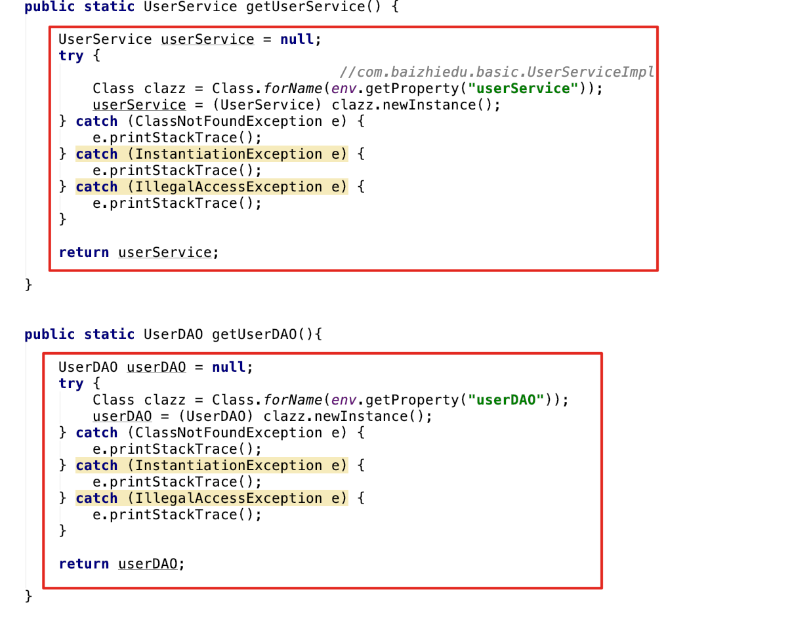
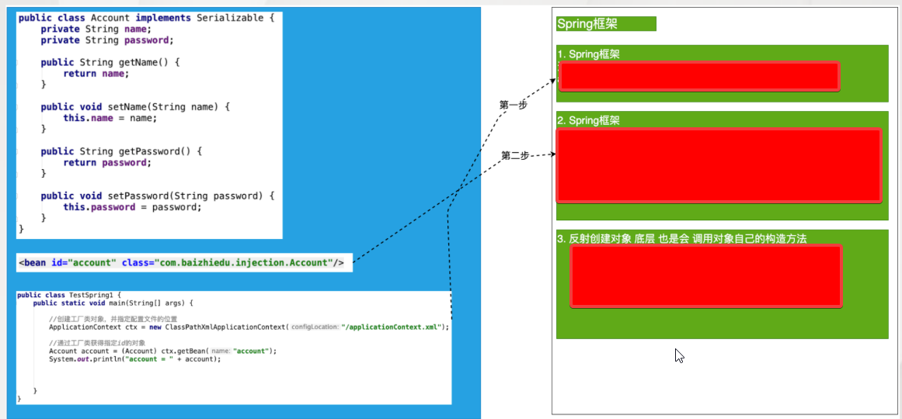
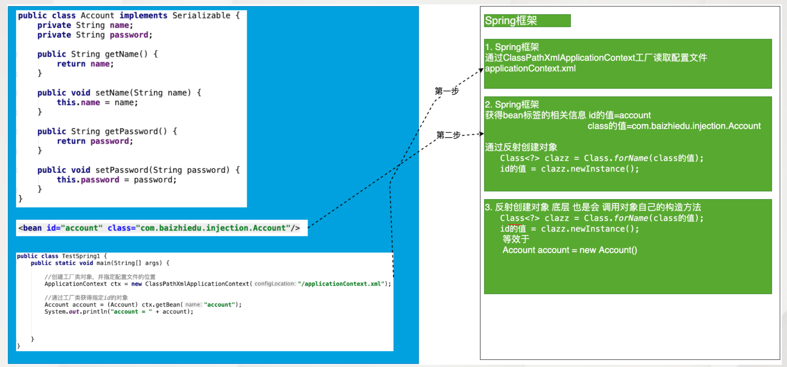

## 工厂

### EJB对比Spring

- EJB({{c1:: Enterprise Java Bean }})特点：
    1. {{c1:: 运行环境苛刻 }}
    2. {{c1:: 代码移植性差 }}
    3. {{c1:: 重量级的框架 }}
- Spring:{{c1:: 轻量级的JavaEE解决方案，整合众多优秀的设计模式 }}
  - 轻量级：{{c1:: 对于运行环境是没有额外要求的 }}
    - 开源运行环境：{{c1:: tomcat resion jetty }}
    - 收费运行环境：{{c1:: weblogic websphere }}
  - 代码移植性高,{{c1:: 不需要实现额外接口 }}
  - 整合设计模式
    1.  {{c1:: 工厂 }}
    2.  {{c1:: 代理 }}
    3.  {{c1:: 模板 }}
    4.  {{c1:: 策略 }}

### 设计模式

1. 广义概念:{{c1:: 面向对象设计中，解决特定问题的经典代码 }}
2. 狭义概念:{{c1:: GOF4人帮定义的23种设计模式：工厂、适配器、装饰器、门面、代理、模板... }}

### 通用工厂的设计
- 简单工厂会存在大量的代码冗余
- 通用工厂的代码
  ```java
  <!-- {{c1:: -->
  public class BeanFactory{
      public static Object getBean(String key){
          Object ret = null;
          try {
              Class clazz = Class.forName(env.getProperty(key));
              ret = clazz.newInstance();
          } catch (Exception e) {
              e.printStackTrace();
          }
          return ret;
      }

  }
  <!-- }} -->
  ```

##  Spring的核心API

### Spring的配置文件

1.  配置文件的放置位置：{{c1:: 没有硬性要求，可以任意位置 }}
2.  配置文件的命名 ：{{c1:: 没有硬性要求 ，通常使用`applicationContext.xml` }}

### ApplicationContext

+ 作用：工厂接口
- 主要实现类
  - 非web环境:(main junit)：{{c1::  `ClassPathXmlApplicationContext` }}
  - web环境 ：{{c1::   `XmlWebApplicationContext` }}
- 重量级资源含义：{{c1:: ApplicationContext工厂的对象占用大量内存，一个应用只会创建一个工厂对象，一定是线程安全的。 }}

### spring程序开发流程

1. 创建类型:{{c1:: `public class Person{...}` }}
2. 配置文件的配置 :{{c1:: `<bean id="person" class="com.baizhiedu.basic.Person"/>` }}
3. 通过工厂类，获得对象
   ```java
   //{{c1::
   ApplicationContext ctx = new ClassPathXmlApplicationContext("/applicationContext.xml");
   Person person = (Person)ctx.getBean("person");
   //}}
   ```
- 注意：Spring工厂创建的对象，叫做{{c1:: bean或者组件(componet) }}

### Spring工厂的相关的方法

+ 通过这种方式获得对象，就不需要强制类型转换:{{c1:: `Person person = ctx.getBean("person", Person.class);`}}
+ 当前Spring的配置文件中 只能有一个`<bean class ..>`是Person类型:{{c1:: `Person person = ctx.getBean(Person.class);`}}
+ 获取的是 Spring工厂配置文件中所有bean标签的id值:{{c1:: `String[] beanDefinitionNames = ctx.getBeanDefinitionNames();`}}
+ 根据类型获得Spring配置文件中对应的id值:{{c1:: `String[] beanNamesForType = ctx.getBeanNamesForType(Person.class);`}}
+ 用于判断是否存在指定id值得bean:{{c1:: `ctx.containsBeanDefinition("a")`}}
+ 用于判断是否存在指定id值得bean:{{c1:: `ctx.containsBean("person")`}}

### 配置文件细节
+ `<bean  class="com.baizhiedu.basic.Person"/>`自动分配的id值为:{{c1:: com.baizhiedu.basic.Person#0 }}
+ name属性与id属性的区别
  1. 多个别名：{{c1:: 别名可以定义多个,但是id属性只能有一个值}}
  2. 命名要求：{{c1:: XML的id属性的值有命名要求：必须以字母开头，字母 数字 下划线 连字符 不能以特殊字符开头 /person，但现在这个限制已经没有了。name属性的值没有命名要求。}}
  3. ctx.containsBean("p"):{{c1:: 也可以判断name值}}
  4. ctx.containsBeanDefinition("person"):{{c1:: 不可以判断name值}}

### Spring工厂的底层实现原理(简易版)


{{c1::}}