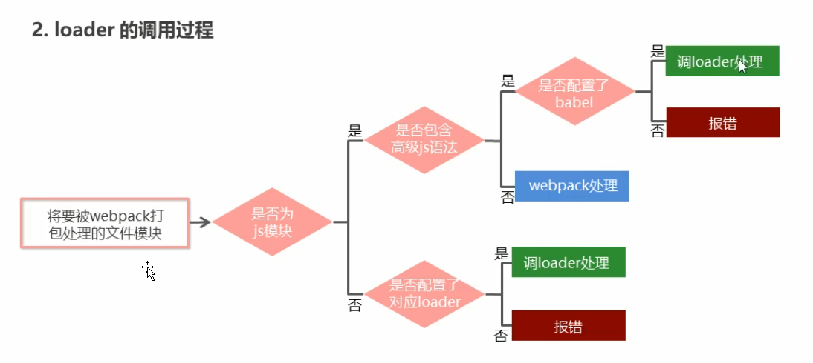

## 模块化 [	](buildTool_20200626090144132)

### 模块化进化史 [	](buildTool_20200626090144133)
1. 全局function模式
    + 例子：
    ```js
        //{{c1::
        let data2 = 'other data'
        function foo() {  //与另一个模块中的函数冲突了
        console.log(`foo() ${data2}`)
        }
        //}}
    ```
    + 特点： {{c1:: 将不同的功能封装成不同的全局函数 }}
    + 缺点： {{c1:: Global被污染，容易命名冲突 }}

2. namespace模式
    + 例子：
    ```js
        //{{c1::
        let myModule2 = {
            data: 'atguigu.com2222',
            foo() {
                console.log(`foo() ${this.data}`)
            },
            bar() {
                console.log(`bar() ${this.data}`)
            }
        }
        //}}
    ```
    + 特点： {{c1:: 简单对象封装 }}
    + 缺点： {{c1:: 不能隐藏模块中的细节 }}
3. IIFE模式
    + IIFE全称:{{c1:: immediately-invoked function expression(立即调用函数表达式) }}
    + 例子：
    ```js
        //{{c1::
        (function (window, $) {
            //数据
            let data = 'atguigu.com'
            //操作数据的函数
            function foo() { //用于暴露有函数
                console.log(`foo() ${data}`)
                $('body').css('background', 'red')
            }
            function bar() {//用于暴露有函数
                console.log(`bar() ${data}`)
                otherFun() //内部调用
            }
            function otherFun() { //内部私有的函数
                console.log('otherFun()')
            }
            //暴露行为
            window.myModule = {foo, bar}
        })(window, jQuery)
        //}}
    ```
    + 特点： {{c1:: 现代模块实现的基础。 }}
    + 缺点： {{c1:: 页面需要加载多个js文件导致请求过多，难以维护依赖关系 }}

### CommonJS规范：Nodejs端的模块化 [	](buildTool_20200626090144134)

+ 项目目录结构:
    {{c1::
    ```
    |-modules
        |-module1.js
        |-module2.js
        |-module3.js
    |-app.js
    |-package.json
    ```
    }}
+ 定义暴露模块：
    1.  {{c1:: `module.exports = value/{...};` }}
    2.  {{c1:: `exports.xxx = value/{...};` }}
+ 引入模块:
  
    1. {{c1:: `var module = require(模块名或模块路径);` }}

### CommonJS规范：浏览器端模块化 [	](buildTool_20200626090144135)

+ npm安装编译工具：
  + 全局: {{c1:: npm install browserify -g }}
  + 局部: {{c1:: npm install browserify --save-dev }}
+ 项目目录结构:
    {{c1::
    ```js
        |-js
            |-dist //打包生成文件的目录
            |-src //源码所在的目录
            |-module1.js
            |-module2.js
            |-module3.js
            |-app.js //应用主源文件
        |-index.html
        |-package.json
    ```
    }}
+ 定义暴露模块：
    1. {{c1:: `module.exports = value;` }}
    2. {{c1:: `exports.xxx = value;` }}
+ 引入模块:
  
    1. {{c1:: `var module = require(模块名或模块路径);` }}
+ 编译：
  
    1. {{c1:: browserify `js/src/app.js -o js/dist/bundle.js` }}
+ 页面使用引入:
  
    1. {{c1::`<script type="text/javascript" src="js/dist/bundle.js"></script>` }}


## webPack基本使用 [	](buildTool_20200626090144136)

### npm install 本地安装与全局安装的区别 [	](buildTool_20200626090144137)
+ 本地安装：
    1. {{c1:: 将安装包放在 ./node_modules 下（运行npm时所在的目录） }}
    2. {{c1:: 可以通过 require() 来引入本地安装的包 }}
    3. 命令：{{c1:: `npm install grunt`}}
+ 全局安装：
    1. {{c1:: 将安装包放在 ~\AppData\Roaming\npm 下 }}
    2. {{c1:: 可以直接在命令行里使用 }}
    3. 命令：{{c1:: `npm install -g grunt-cli`}}

### npm 中`--save-dev`与`--save`的区别 [	](buildTool_20200626090144138)
+ `npm install vue –save `：{{c1:: 依赖会保存到dependencies下，运行时依赖，开发完成后还会用到。}}
+ `npm install webpack –save-dev` ：{{c1:: 依赖会保存到devDependencies下，开发时依赖。}}

### webpack开发环境与生产环境的打包的区别 [	](buildTool_20200626090144139)

+ 开发环境打包：{{c1:: `webpack ./src/index.js -o ./build/built.js --mode=development` }}
+ 生产环境打包：{{c1:: `webpack ./src/index.js -o ./build/built.js --mode=development` }}
+ 区别：{{c1:: 生产环境比开发环境多一个压缩js代码。 }}

### webpack基本配置 [	](buildTool_20200722073620437)


+ 安装webpack命令：{{c1:: `npm install webpack webpack-cli -D` }}

+ 创建目录结构
  
    + 源代码目录: {{c1::`./src/index.js`}}
    + 配置文件：{{c1::`./webpack.config.js`}}
    
+ webpack的4.x版本中默认约定：
  
    + 打包的入口文件为:{{c1:: `./src/index.js`}}
    + 打包的输出文件为:{{c1:: `./dist/main.js`}}
    
+ 配置文件中最基本配置：
  
    + 五大核心概念属性:{{c1:: `output output module plugins mode` }}
    + 基本配置
      ```js
      //{{c1::
      module.exports = {
          mode:"development"
      }
      //}}
      ```
    + 修改项目中的package.json文件添加运行脚本，如下
      ```json
      //{{c1::
      "scripts":{
          "dev":"webpack"
      }
      //}}
      ```
+ 启动webpack进行项目打包命令：`npm run dev`

### webpack自动打包功能 [	](buildTool_20200722073620438)
+ 安装：{{c1:: `npm install webpack-dev-server -D` }}
+ 配置`html-webpack-plugin`生成预览页面：
    ```js
    //{{c1::
    const HtmlWebpackPlugin = require('html-webpack-plugin')
    const htmlWebpackPlugin = new HtmlWebpackPlugin({
      template: './src/index.html',
      filename: 'index.html'
    })
    //...
    plugins:[htmlPlguin]
    //}}
    ```
+ `package.json`配置：
    ```json
    //{{c1::
    "scripts": {
      "dev": "webpack-dev-server --open --host 127.0.0.1 --port 8888"
    }
    //}}
    ```

### npm install -S -D -g 有什么区别 [	](buildTool_20200722073620441)

- `npm install module_name -S` ： {{c1:: 即  `npm install module_name --save`  写入`dependencies` }}
- `npm install module_name -D` ：{{c1::  即  `npm install module_name --save-dev` 写入`devDependencies` }}
- `npm install module_name -g`： {{c1:: 全局安装(命令行使用) }}
- `npm install module_name`： {{c1:: 本地安装(将安装包放在`./node_modules`下) }}

## webpack开发环境配置 [	](buildTool_20200626090144141)

### webpack的loader调用过程（图） [	](buildTool_20200722073620443)

{{c1::}}

### webpack打包样式资源配置 [	](buildTool_20200626090144143)

```js
module: {
    rules: [
      // {{c1::
      { test: /\.css$/,use: ['style-loader','css-loader']},
      { test: /\.less$/,use: ['style-loader','css-loader','less-loader']}
      //}}
    ]
}
```
+ 作用:
    1. 'style-loader'：{{c1:: 将加载后的文件放置到`<style>`标签中 }}
    2. 'css-loader'：{{c1:: 将css文件加载到js入口文件中 }}
    3. 'less-loader'：{{c1:: 将less文件转换成css }}:


### webpack打包html资源 [	](buildTool_20200626090144144)

+ 配置代码如下：
    ```js
        new HtmlWebpackPlugin({
            template: './src/index.html'
        })
    ```
+ 完成任务：
    1. {{c1:: 复制 './src/index.html' 文件，并自动引入打包输出的所有资源（JS/CSS）}}
    2. 注意:{{c1:: 默认创建一个空的html，并自动引入打包输出的所有资源（JS/CSS）}}

### webpack打包图片资源 [	](buildTool_20200626090144145)

+ 配置代码如下：
    ```js
        {
            test: /\.(jpg|png|gif)$/,
            loader: 'url-loader',
            options: {
                limit: 8 * 1024,
                esModule: false,
                name: '[hash:10].[ext]'
                outputPath: 'imgs'
            }
        }，
        {
            test: /\.html$/,
            loader: 'html-loader'
        }
    ```
+ 作用：
    + `url-loader`: {{c1:: 处理图片资源，依赖于`file-loader` }}
        1. `limit`：{{c1:: 图片大小小于8kb，就会被base64处理 }}
        2. `esModule`：
            + {{c1:: 因为url-loader默认使用es6模块化解析，而html-loader引入图片是commonjs }}
            + {{c1:: 关闭url-loader的es6模块化，使用commonjs解析 }}
        3. `name`：给图片进行重命名
            + `[hash:10]`：{{c1:: 取图片的hash的前10位 }}
            + `[ext]`：{{c1:: 取文件原来扩展名 }}
        4. `outputPath`: {{c1:: 图片输出路径 }}
    + `html-loader`: {{c1:: 处理html中img资源 }}

### webpack打包其他资源 [	](buildTool_20200626090144146)

+ 配置代码如下：
    ```js
        {
            exclude: /\.(css|js|html|less)$/,
            loader: 'file-loader',
            options: {
             name: '[hash:10].[ext]',
             outputPath: 'media'
            }
        }
    ```
+ 作用：
    + `file-loader`：{{c1:: 复制对所有没有排除的文件打包· }}
        1. `outputPath`：{{c1:: 文件输出路径 }}

## webpack生产环境配置 [	](buildTool_20200626090144147)

### 提取css成单独文件 [	](buildTool_20200626090144149)

+ 配置代码如下：
```js
  module: {
    rules: [
      {
        test: /\.css$/,
        use: [
          MiniCssExtractPlugin.loader,
          'css-loader'
        ]
      }
    ]
  },
  plugins: [
    new HtmlWebpackPlugin({
      template: './src/index.html'
    }),
    new MiniCssExtractPlugin({
      filename: 'css/built.css'
    })
  ]
```
作用：
+ `MiniCssExtractPlugin.loader`:{{c1:: 取代style-loader,提取js中的css成单独文件 }}
+ `filename`:{{c1:: 对输出的css文件进行重命名 }}

### 配置postCSS自动添加css的兼容前缀 [	](buildTool_20200722073620444)

+ 安装所需模块：{{c1:: `npm i postcss-loader autoprefixer-D `}}

+ loader配置：
    ```js
    { test: /\.css$/, use: ['style-loader', 'css-loader', 'postcss-loader'] }
    ```
    
+ 配置文件：postcss.config.js
  
    ```js
    const autoprefixer = require('autoprefixer')
    module.exports = {
      plugins: [autoprefixer]
    }
    ```
    
+ 作用：处理各个浏览器不兼容的css属性

### 打包时压缩css [	](buildTool_20200626090144151)

```js
plugins: [
    new HtmlWebpackPlugin({
      template: './src/index.html'
    }),
    new MiniCssExtractPlugin({
      filename: 'css/built.css'
    }),
    // 压缩css
    //{{c1::
    new OptimizeCssAssetsWebpackPlugin()
    //}}
  ]
```

### 打包时执行js语法检查 [	](buildTool_20200626090144152)

+ 所需模块： {{c1:: `eslint-loader` `eslint` }}
+ package.json中eslintConfig中设置
    ```js
        //{{c1::
        "eslintConfig": {
            "extends": "airbnb-base"
        }
        //}}
    ```
+ airbnb风格检查所需模块：{{c1:: `eslint-config-airbnb-base` `eslint-plugin-import`  `eslint` }}
+ 配置：
    ```js
      {
        //{{c1::
        test: /\.js$/,
        exclude: /node_modules/,
        loader: 'eslint-loader',
        options: {
          // 自动修复eslint的错误
          fix: true
        }
        //}}
      }
    ```

### 打包时将js文件与html文件压缩 [	](buildTool_20200626090144154)

```js
  plugins: [
    new HtmlWebpackPlugin({
      template: './src/index.html',
      // 压缩html代码,移除空格,移除注释
      //{{c1::
      minify: {
        collapseWhitespace: true,
        removeComments: true
      }
      //}}
    })
  ],
  // 生产环境下会自动压缩js代码
  //{{c1::
  mode: 'production'
  //}}
```

### source-map [	](buildTool_20200626090144156)

+ `source-map`: 一种 提供源代码到构建后代码映射 技术 （如果构建后代码出错了，通过映射可以追踪源代码错误）
+ 可选值: {{c1:: `[inline-|hidden-|eval-][nosources-][cheap-[module-]]source-map` }}
+ 配置：
    ```java
        module.exports = {
        //{{c1:: 
            devtool: 'eval-source-map'
        //}}
        }
    ```


### oneOf [	](buildTool_20200626090144157)

+ 作用：{{c1:: 在oneOf中声明的loader数组，只会匹配一个loader }}
+ 注意：{{c1:: 不能有两个配置处理同一种类型文件 }}

### 打包处理js文件中的高级语法 [	](buildTool_20200722073620446)

+ 安装babel转换器
      `npm install babel-loader @babel/core @babel/runtime -D`
+ 安装babel语法插件包
      `npm install @babel/preset-env @babel/plugin-transform-runtime @babel/plugin-proposal-class-properties -D`
+ 在项目根目录创建并配置babel.config.js文件  
  ```js
  module.exports = {
          presets:["@babel/preset-env"],
          plugins:[ "@babel/plugin-transform-runtime", "@babel/plugin-proposal-class-properties" ]
  }
  ```
+ loader配置：
  ```js
  //{{c1::
  { test: /\.js$/, use: 'babel-loader', exclude: /node_modules/ }
  //}}
  ```

### 开启babel缓存 [	](buildTool_20200814021328759)
+ 添加babel-loader选项：{{c1:: `cacheDirectory: true` }}
+ 根据文件内容添加hash值，以便进行缓存：
  ```js
    //{{c1::
    output: {
        filename: 'js/built.[contenthash:10].js',
        path: resolve(__dirname, 'build')
    }
    //...
    new MiniCssExtractPlugin({
      filename: 'css/built.[contenthash:10].css'
    })
    //}}
  ```
+ babel缓存的原因：{{c1:: 只对内容修改过的js文件进行转换。 }}


### webpack 3种类型的hash值 [	](buildTool_20200722073620447)

1. `hash`:{{c1::  每次wepack构建时会生成一个唯一的hash值。}}
    问题: {{c1:: 因为js和css同时使用一个hash值，如果重新打包，会导致所有缓存失效。（可能我却只改动一个文件） }}
2. `chunkhash`：{{c1:: 根据chunk生成的hash值。如果打包来源于同一个chunk，那么hash值就一样}}
    问题: {{c1:: 因为css是在js中被引入的，所以同属于一个chunk,js和css的hash值还是一样的 }}
3. `contenthash`:{{c1::  根据文件的内容生成hash值。不同文件hash值一定不一样    }}

### 使用express构建一个node服务器向外暴露静态资源 [	](buildTool_20200626090144159)
```js
    //{{c1::
    const express = require('express');
    const app = express();
    // express.static向外暴露静态资源
    // maxAge 资源缓存的最大时间，单位ms
    app.use(express.static('build', { maxAge: 1000 * 3600 }));
    app.listen(3000);
    //}}
```

### treeShaking [	](buildTool_20200626090144160)

+ 开启条件：
    1. {{c1:: 必须使用ES6模块化   }}
    2. {{c1:: 开启production环境 }}
    3. 在package.json中配置:
        + `"sideEffects": false` :{{c1:: 所有代码都没有副作用,可能会把css / @babel/polyfill （副作用）文件干掉}}
        + `"sideEffects": ["*.css", "*.less"]`：{{c1:: 指定的文件不会treeShaking}}
+ 作用: {{c1:: 减少代码体积 }}


### code split的3种方式 [	](buildTool_20200626090144161)

+ 通过多入口方式来拆分js文件：
    + 配置：
    ```js
    //{{c1::
    entry: {
      index: './src/js/index.js',
      test: './src/js/test.js'
    }
    output: {
      filename: 'js/[name].[contenthash:10].js',
      path: resolve(__dirname, 'build')
    }
    //}}
    ```
    + 注意：{{c1:: 单页面应用通常是单入口，多页面应用对应多入口， }}
    + 问题：{{c1:: 不太灵活，每次添加js文件都需要添加入口。 }}
+  配置`optimization`
    ```js
      //{{c1::
      optimization: {
        splitChunks: {
          chunks: 'all'
        }
      }
      //}}
    ```
    + 作用：
        1. {{c1:: 可以将node_modules中代码单独打包一个chunk最终输出 }}
        2. {{c1:: 自动分析多入口chunk中，有没有公共的文件。如果有会打包成单独一个chunk }}
+  通过import动态导入语法将某个文件单独打包
    ```js
    //{{c1::
    import(/* webpackChunkName: 'test' */'./test')
    .then(({ mul, count }) => {
      // 文件加载成功~
      // eslint-disable-next-line
      console.log(mul(2, 5));
    })
    .catch(() => {
      // eslint-disable-next-line
      console.log('文件加载失败~');
    });
    //}}
  ```
+ 3种方式并不冲突

### webpack中的懒加载与预加载 [	](buildTool_20200626090144162)

- 懒加载：{{c1:: 当文件需要使用时才加载 }}
- 预加载：{{c1:: 等其他资源加载完毕，浏览器空闲了，再偷偷加载资源 }}
- 正常加载：{{c1:: 可以认为是并行加载（同一时间加载多个文件）  }}
- 配置：
```js
//{{c1::
document.getElementById('btn').onclick = function() {
  import(/* webpackChunkName: 'test', webpackPrefetch: true */'./test')
  .then(({ mul }) => {
    console.log(mul(4, 5));
  });
};
//}}
```

### PWA [	](buildTool_20200626090144163)

- PWA: {{c1:: 渐进式网络开发应用程序(离线可访问) }}
1. 所需模块： {{c1:: workbox-webpack-plugin }}
  ```js
//{{c1::
new WorkboxWebpackPlugin.GenerateSW({
  /*
          作用：
          1. 帮助serviceworker快速启动
          2. 删除旧的 serviceworker
          生成一个 serviceworker 配置文件~
        */  
  clientsClaim: true,
  skipWaiting: true
})
//}}
  ```
2. 在入口文件中，注册serviceworker配置文件
  ```js
  //{{c1::
    if ('serviceWorker' in navigator) {
      window.addEventListener('load', () => {
        navigator.serviceWorker
          .register('/service-worker.js')
          .then(() => {
            console.log('sw注册成功了~');
          })
          .catch(() => {
            console.log('sw注册失败了~');
          });
      });
    }
  //}}
  ```
3. eslint不认识 window、navigator全局变量问题的解决：
  ```js
  // 解决：需要修改package.json中eslintConfig配置
  //{{c1::
  "eslintConfig": {
    "extends": "airbnb-base",
      "env": {
        "browser": true
      }
  }
  //}}{{c1::  }}
  ```
- serviceworker代码必须运行在服务器上:
  1. {{c1:: `npm i serve -g` }}
  2. {{c1:: `serve -s build` :启动服务器，将build目录下所有资源作为静态资源暴露出去 }}

### 多进程打包 [	](buildTool_20200626090144164)

安装：npm i thread-loader -D

  ```js
{
  test: /\.js$/,
  exclude: /node_modules/,
  use: [
    /* 
      开启多进程打包。 
      进程启动大概为600ms，进程通信也有开销。
      只有工作消耗时间比较长，才需要多进程打包
    */
    //{{c1::
    {
      loader: 'thread-loader',
      options: {
        workers: 2 // 进程2个,默认是1
      }
    },
    //}}
    {
      loader: 'babel-loader',
      options: {
        presets: [
          [
            '@babel/preset-env',
            {
              useBuiltIns: 'usage',
              corejs: { version: 3 },
              targets: {
                chrome: '60',
                firefox: '50'
              }
            }
          ]
        ],
        // 开启babel缓存
        // 第二次构建时，会读取之前的缓存
        cacheDirectory: true
      }
    }
  ]
},
  ```

### dll技术 [	](buildTool_20200626090144165)

- 作用：{{c1:: 对某些库（第三方库：jquery、react、vue...）进行单独打包 }}
- 配置`webpack.dll.js`
  ```js
  const { resolve } = require('path');
  const webpack = require('webpack');
  module.exports = {
    entry: {
      // 最终打包生成的[name] --> jquery
      //{{c1::
      // ['jquery'] --> 要打包的库是jquery
      jquery: ['jquery'],
      //}}
    },
    output: {
      filename: '[name].js',
      path: resolve(__dirname, 'dll'),
      library: '[name]_[hash]' // 打包的库里面向外暴露出去的内容叫什么名字
    },
    plugins: [
      // 打包生成一个 manifest.json --> 提供和jquery映射
      //{{c1::
      new webpack.DllPlugin({
        name: '[name]_[hash]', // 映射库的暴露的内容名称
        path: resolve(__dirname, 'dll/manifest.json') // 输出文件路径
      })
      //}}
    ],
    mode: 'production'
  };
  ```
- 生成manifest.json文件命令：{{c1:: `webpack --config webpack.dll.js` }}
- 告诉webpack哪些库不参与打包，同时使用时的名称也得变~
  ```JS
    //{{c1::
      new webpack.DllReferencePlugin({
      manifest: resolve(__dirname, 'dll/manifest.json')
      }),
    //}}
  ```
- 将某个文件打包输出去，并在html中自动引入该资源
  ```JS
  //{{c1::
    new AddAssetHtmlWebpackPlugin({
    filepath: resolve(__dirname, 'dll/jquery.js')
    })
  //}}
  ```

### webpack entry的配置的3种值 [	](buildTool_20200626090144166)

- string: {{c1:: 只声明单个js文件，只输出一个bundle文件 }}

- array：{{c1:: 声明多个js文件，合并后只输出一个bundle文件 }}

- object：{{c1:: 会安装对象中的属性值为文件名生成多个bundle文件。 }}

- 混合用法：

  ```js
  //{{c1::
  {
    // 所有入口文件最终只会形成一个chunk, 输出出去只有一个bundle文件。
    index: ['./src/index.js', './src/count.js'], 
      // 形成一个chunk，输出一个bundle文件。
      add: './src/add.js'
  }
  //}}
  ```

### webpack output配置 [	](buildTool_20200626090144168)

```js
module.exports = {
  entry: './src/index.js',
  output: {
    // 文件名称（指定名称+目录）{{c1::
    filename: 'js/[name].js',
    //}}
    // 输出文件目录（将来所有资源输出的公共目录）{{c1::
    path: resolve(__dirname, 'build'),
    //}}
    // 所有资源引入公共路径前缀 --> 'imgs/a.jpg' --> '/imgs/a.jpg'{{c1::
    publicPath: '/',
    //}}
    // 非入口chunk的名称{{c1::
    chunkFilename: 'js/[name]_chunk.js', 
    //}}
    // 整个库向外暴露的变量名{{c1::
    library: '[name]', 
    //}}
    // 变量名添加到哪个上 browser{{c1::
    // libraryTarget: 'window' }}
    // 变量名添加到哪个上 node{{c1::
    // libraryTarget: 'global' }}
    // 指定模块标准{{c1::
    // libraryTarget: 'commonjs'}}
  },
  plugins: [new HtmlWebpackPlugin()],
  mode: 'development'
};
```

### webpack module 配置 [	](buildTool_20200626090144169)

```js
  module: {
    rules: [
      // loader的配置
      {
        test: /\.css$/,
        // 多个loader用use{{c1::
        use: ['style-loader', 'css-loader']
        //}}
      },
      {
        test: /\.js$/,
        // 排除node_modules下的js文件{{c1::
        exclude: /node_modules/,
        //}}
        // 只检查 src 下的js文件{{c1::
        include: resolve(__dirname, 'src'),
        //}}
        // 优先执行{{c1::
        enforce: 'pre',
        //}}
        // 延后执行{{c1::
        // enforce: 'post',}}
        // 单个loader用loader{{c1::
        loader: 'eslint-loader',
        //}}
        options: {}
      },
      {
        // 以下配置只会生效一个{{c1::
        oneOf: []
        // }}
      }
    ]
  },
```

###  webpack devServer [	](buildTool_20200626090144170)

```js
 devServer: {
    // 运行代码的目录
    // {{c1::
    contentBase: resolve(__dirname, 'build'),
    // }}
    // 监视 contentBase 目录下的所有文件，一旦文件变化就会 reload
    // {{c1::
    watchContentBase: true,
    // }}
    // 忽略文件
    // {{c1::
    watchOptions: {
      ignored: /node_modules/
    },
    // }}
    // 启动gzip压缩
    // {{c1::
    compress: true,
    // }}
    // 端口号
    // {{c1::
    port: 5000,
    // }}
    // 域名
    // {{c1::
    host: 'localhost',
    // }}
    // 自动打开浏览器
    // {{c1::
    open: true,
    // }}
    // 开启HMR功能
    // {{c1::
    hot: true,
    // }}
    // 不要显示启动服务器日志信息
    // {{c1::
    clientLogLevel: 'none',
    // }}
    // 除了一些基本启动信息以外，其他内容都不要显示
    // {{c1::
    quiet: true,
    // }}
    // 如果出错了，不要全屏提示~
    // {{c1::
    overlay: false,
    // }}
    // 服务器代理 --> 解决开发环境跨域问题.
    // 一旦devServer(5000)服务器接受到 /api/xxx 的请求，就会把请求转发到另外一个服务器(3000)
    //{{c1::
    proxy: {
      '/api': {
        target: 'http://localhost:3000',
        // 发送请求时，请求路径重写：将 /api/xxx --> /xxx （去掉/api）
        pathRewrite: {
          '^/api': ''
        }
      }
    }
    //}}
  }
```