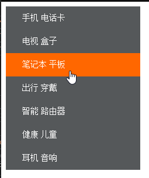
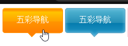
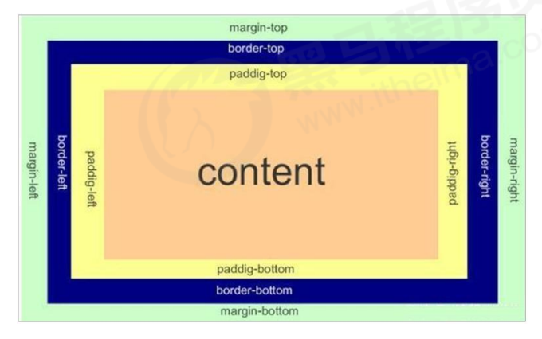
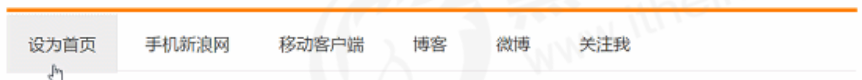
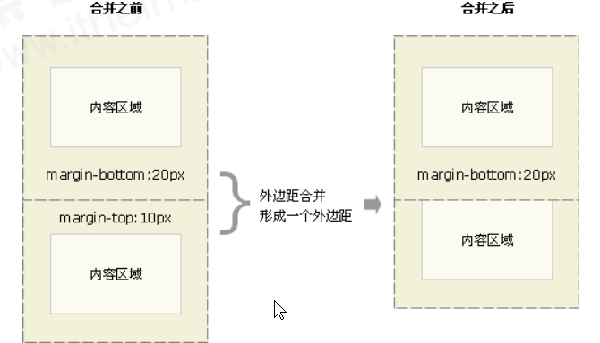
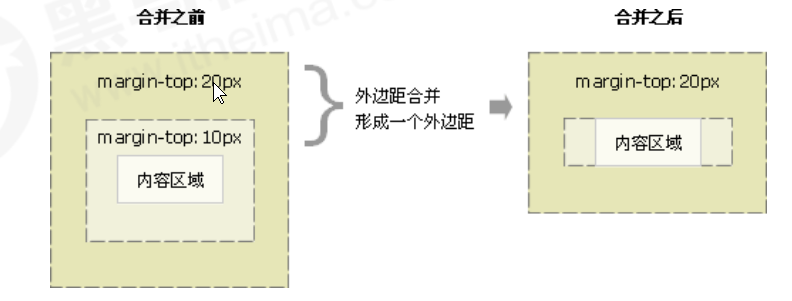
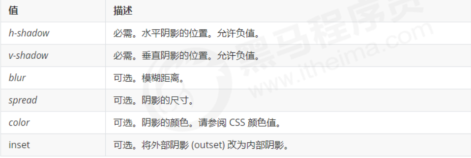
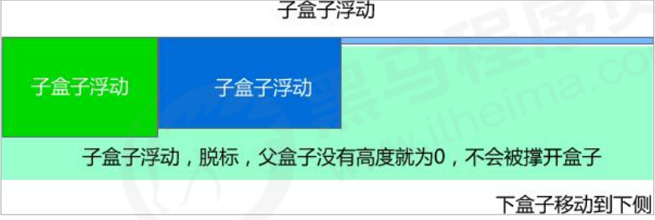

### 通配符选择器 [ ](css_20200722073620457)

```css
/* 设置所有的元素为红色 */
* {
  color: red;
}
```

### 快速生成 HTML 结构语法 [ ](css_20200722073620459)

1. **生成标签**：{{c1::  直接输入标签名 按 tab 键即可 比如 div 然后 tab 键， 就可以生成 `<div></div>` }}
2. **生成多个相同标签**：{{c1::  加上 * 就可以了 比如 div*3 就可以快速生成 3 个 div }}
3. **父子级关系**：{{c1:: 的标签，可以用 > 比如 ul > li 就可以了 }}
4. **兄弟关系的**：{{c1:: 标签，用 + 就可以了 比如 div+p }}
5. **生成带有类名或者 id**：{{c1:: 名字的， 直接写 .demo 或者 #two tab 键就可以了 }}
6. **生成的 div 类名是有顺序的**：{{c1:: ， 可以用 自增符号 \$ }}
7. **想要在生成的标签内部写内容**：{{c1:: 可以用 { } 表示 }}
8. **w200 按 tab**：{{c1::  可以 生成 width: 200px; }}
9. **lh26px 按 tab**：{{c1::  可以生成 line-height: 26px;  }}

### 字体属性的简写方式 [ ](css_20200722073620461)

- 下面属性的简写方式：
  - `font-style: italic;`
  - `font-weight: 700;`
  - `font-size: 16px;`
  - `font-family: 'Microsoft yahei';`
- 简写方式：{{c1:: `font: italic 700 16px 'Microsoft yahei';` }}
- 最少简写：{{c1:: `font: 16px 'Microsoft yahei'` }}

### 外观属性： [ ](css_20200722073620463)

- 颜色:{{c1:: `color: rgb(255, 0, 255);` }}
- 文字对齐:{{c1:: `text-align: right;` }}
- 装饰文本:
  1. 删除线:{{c1:: `text-decoration: line-through;` }}
  2. 上划线:{{c1:: `text-decoration: overline;` }}
  3. 取消`<a>`默认的下划线:{{c1:: `text-decoration: none;` }}
- 文本缩进:{{c1:: `text-indent: 2em;  ` }}
- 行间距:{{c1:: `line-height: 12px;` }}

### CSS 的复合选择器 [ ](css_20200722073620464)

- 后代选择器：{{c1:: 符号是`空格` 例：`.nav a` }}
- 子代选择器：{{c1:: 符号是`>` 例：`.nav>p` }}
- 并集选择器：{{c1:: 符号是`,` 例：`.nav,.header` }}
- 链接伪类：
  1. {{c1:: `a:link` }}
  2. {{c1:: `a:visited` }}
  3. {{c1:: `a:hover` }}
  4. {{c1:: `a:active` }}
- 焦点伪类：{{c1:: `input:focus` }}

### 外部样式表声明 [ ](css_20200722073620466)

```xml
<!-- {{c1:: -->
 <link rel="stylesheet" href="style.css">
 <!-- }} -->
```

### 元素显示模式总结 [ ](css_20200722073620467)

| 元素模式   | 元素排列                | 设置样式                    | 默认宽度                 | 包含                        |
| ---------- | ----------------------- | --------------------------- | ------------------------ | --------------------------- |
| 块级元素   | {{c1:: 一行只能放一个}} | {{c1:: 可以设置宽度高度  }} | {{c1:: 容器的%100    }}  | {{c1:: 任何标签        }}   |
| 行内元素   | {{c1:: 一行可以放多  }} | {{c1:: 不可以设置宽度高度}} | {{c1:: 本身内容的宽度 }} | {{c1:: 文本或其他行内元素}} |
| 行内块元素 | {{c1:: 一行可以放多个}} | {{c1:: 可以设置宽度与高度}} | {{c1:: 本身内容的宽度 }} |                             |

### 元素显示模式的转换 [ ](css_20200722073620469)

- 转换为块元素：{{c1:: `display:block;`}}
- 转换为行内元素：{{c1:: `display:inline;`}}
- 转换为行内块：{{c1:: `display: inline-block;`}}

### css 实现小米侧边栏效果 [ ](css_20200722073620471)

- 
- CSS 主要代码：
  ```css
  /* {{c1:: */
  a {
    display: block;
    width: 230px;
    height: 40px;
    background-color: #55585a;
    font-size: 14px;
    color: #fff;
    text-decoration: none;
    text-indent: 2em;
    line-height: 40px;
  }
  a:hover {
    background-color: #ff6700;
  }
  /* }} */
  ```

### 背景 [ ](css_20200722073620473)

- 背景颜色：{{c1:: `background-color: pink;`}}
- 背景图片：{{c1:: `background-image: url(images/logo.png);`}}
- 背景平铺
  1. 背景图片不平铺:{{c1:: `background-repeat: no-repeat;`}}
  2. 默认的情况下,背景图片是平铺的:{{c1:: `background-repeat: repeat;`}}
  3. 沿着 x 轴平铺:{{c1:: `background-repeat: repeat-x;`}}
  4. 沿着 Y 轴平铺:{{c1:: `background-repeat: repeat-y;`}}
- 背景图像位置:
  - 语法： {{c1:: `background-position: x y;` }}
  - 参数代表意思：
    - 数值:{{c1:: 百分比/像素 }}
    - 方位名词: {{c1:: `top | center | bottom | left | center | right` 方位 }}
- 背景图像固定：{{c1:: `background-attachment : scroll | fixed`}}
- 背景属性复合写法: {{c1:: `background: black url(images/bg.jpg) no-repeat fixed center top;` }}
  - 注意：没有固定的顺序
- 背景颜色半透明：{{c1:: `background: rgba(0, 0, 0, .3);`}}

### CSS 背景使用综合案例：五彩导航 [ ](css_20200722073620475)

- 效果：
- 主要 CSS 代码：
  ```css
  /*{{c1::*/
  .nav a {
    display: inline-block;
    width: 120px;
    height: 58px;
    background-color: pink;
    text-align: center;
    line-height: 48px;
    color: #fff;
    text-decoration: none;
  }
  .nav .bg1 {
    background: url(images/bg1.png) no-repeat;
  }
  .nav .bg1:hover {
    background-image: url(images/bg11.png);
  }
  .nav .bg2 {
    background: url(images/bg2.png) no-repeat;
  }
  .nav .bg2:hover {
    background-image: url(images/bg22.png);
  }
  /* }} */
  ```

### CSS 的三大特性 [ ](css_20200722073620476)

1. 层叠性：
   1. 冲突：{{c1:: 就近原则，那个样式离结构近，就用哪个}}
   2. 不冲突：{{c1:: 不会层叠}}
2. 继承性： {{c1:: 子标签会继承父标签的某些样式，主要`text- font- line- color`}}
   1. 设置子元素的行高倍数：{{c1:: `font: 12px/1.5 'Microsoft YaHei';`}}
3. 优先性：
   1. 继承 或 `*` :{{c1:: `0,0,0,0` }}
   2. 元素选择器:{{c1:: `0,0,0,1` }}
   3. 类选择器，伪类选择器:{{c1:: `0,0,1,0` }}
   4. ID 选择器：`0,1,0,0`
   5. 行内样式:{{c1:: `1,0,0,0` }}
   6. !important;:{{c1:: `无穷大` }}

- 注意：
  - {{c1:: 继承的样式的权重永远为 0}}
  - {{c1:: 权重叠加：复合选择器会权重叠加，但不会进位}}

### 盒子模型 [ ](css_20200722073620478)

- 边框 border
  - 语法：{{c1:: `border : border-width || border-style || border-color` }}
    - border-style 常用值：{{c1:: `none` `solid` `dashed` `dotted` }}
- 盒子模型组成图
  - {{c1::  }}


### 通配符选择器 [ ](css_20200722073620457)
```css
/* {{c1:: */
/* 设置所有的元素为红色 */
* {
  color: red;
}
/* }} */
```

### 快速生成 HTML 结构语法 [ ](css_20200722073620459)

1. **生成标签**：{{c1::  直接输入标签名 按 tab 键即可 比如 div 然后 tab 键， 就可以生成 `<div></div>` }}
2. **生成多个相同标签**：{{c1::  加上 * 就可以了 比如 div*3 就可以快速生成 3 个 div }}
3. **父子级关系**：{{c1:: 的标签，可以用 > 比如 ul > li 就可以了 }}
4. **兄弟关系的**：{{c1:: 标签，用 + 就可以了 比如 div+p }}
5. **生成带有类名或者 id**：{{c1:: 名字的， 直接写 .demo 或者 #two tab 键就可以了 }}
6. **生成的 div 类名是有顺序的**：{{c1:: ， 可以用 自增符号 \$ }}
7. **想要在生成的标签内部写内容**：{{c1:: 可以用 { } 表示 }}
8. **w200 按 tab**：{{c1::  可以 生成 width: 200px; }}
9. **lh26px 按 tab**：{{c1::  可以生成 line-height: 26px;  }}

### 字体属性的简写方式 [ ](css_20200722073620461)

- 下面属性的简写方式：
  - `font-style: italic;`
  - `font-weight: 700;`
  - `font-size: 16px;`
  - `font-family: 'Microsoft yahei';`
- 简写方式：{{c1:: `font: italic 700 16px 'Microsoft yahei';` }}
- 最少简写：{{c1:: `font: 16px 'Microsoft yahei'` }}

### 外观属性： [ ](css_20200722073620463) 

- 颜色:{{c1:: `color: rgb(255, 0, 255);` }}
- 文字对齐:{{c1:: `text-align: right;` }}
- 装饰文本:
  1. 删除线:{{c1:: `text-decoration: line-through;` }}
  2. 上划线:{{c1:: `text-decoration: overline;` }}
  3. 取消`<a>`默认的下划线:{{c1:: `text-decoration: none;` }}
- 文本缩进:{{c1:: `text-indent: 2em;  ` }}
- 行间距:{{c1:: `line-height: 12px;` }}

### CSS 的复合选择器 [ ](css_20200722073620464)

- 后代选择器：{{c1:: 符号是`空格` 例：`.nav a` }}
- 子代选择器：{{c1:: 符号是`>` 例：`.nav>p` }}
- 并集选择器：{{c1:: 符号是`,` 例：`.nav,.header` }}
- 链接伪类：
  1. {{c1:: `a:link` }}
  2. {{c1:: `a:visited` }}
  3. {{c1:: `a:hover` }}
  4. {{c1:: `a:active` }}
- 焦点伪类：{{c1:: `input:focus` }}

### 外部样式表声明 [ ](css_20200722073620466) 

```xml
<!-- {{c1:: -->
 <link rel="stylesheet" href="style.css">
 <!-- }} -->
```

### 元素显示模式总结 [ ](css_20200722073620467) 

| 元素模式   | 元素排列                | 宽高设置                    | 默认宽度                 | 包含                        |
| ---------- | ----------------------- | --------------------------- | ------------------------ | --------------------------- |
| 块级元素   | {{c1:: 一行只能放一个}} | {{c1:: 可以设置宽度高度  }} | {{c1:: 容器的%100    }}  | {{c1:: 任何标签        }}   |
| 行内元素   | {{c1:: 一行可以放多  }} | {{c1:: 不可以设置宽度高度}} | {{c1:: 本身内容的宽度 }} | {{c1:: 文本或其他行内元素}} |
| 行内块元素 | {{c1:: 一行可以放多个}} | {{c1:: 可以设置宽度与高度}} | {{c1:: 本身内容的宽度 }} |                             |

### 元素显示模式的转换 [ ](css_20200722073620469) 

- 转换为块元素：{{c1:: `display:block;`}}
- 转换为行内元素：{{c1:: `display:inline;`}}
- 转换为行内块：{{c1:: `display: inline-block;`}}

### css 实现小米侧边栏效果 [ ](css_20200722073620471) 

- 
- CSS 主要代码：
  ```css
  /* {{c1:: */
  a {
    display: block;
    width: 230px;
    height: 40px;
    background-color: #55585a;
    font-size: 14px;
    color: #fff;
    text-decoration: none;
    text-indent: 2em;
    line-height: 40px;
  }
  a:hover {
    background-color: #ff6700;
  }
  /* }} */
  ```

### 背景 [ ](css_20200722073620473)

- 背景颜色：{{c1:: `background-color: pink;`}}
- 背景图片：{{c1:: `background-image: url(images/logo.png);`}}
- 背景平铺
  1. 背景图片不平铺:{{c1:: `background-repeat: no-repeat;`}}
  2. 默认的情况下,背景图片是平铺的:{{c1:: `background-repeat: repeat;`}}
  3. 沿着 x 轴平铺:{{c1:: `background-repeat: repeat-x;`}}
  4. 沿着 Y 轴平铺:{{c1:: `background-repeat: repeat-y;`}}
- 背景图像位置:
  - 语法： {{c1:: `background-position: x y;` }}
  - 参数代表意思：
    - 数值:{{c1:: 百分比/像素 }}
    - 方位名词: {{c1:: `top | center | bottom | left | center | right` 方位 }}
- 背景图像固定：{{c1:: `background-attachment : scroll | fixed`}}
- 背景属性复合写法: {{c1:: `background: black url(images/bg.jpg) no-repeat fixed center top;` }}
  - 注意：没有固定的顺序
- 背景颜色半透明：{{c1:: `background: rgba(0, 0, 0, .3);`}}

### CSS 背景使用综合案例：五彩导航 [ ](css_20200722073620475)

- 效果：
- 主要 CSS 代码：
  ```css
  /*{{c1::*/
  .nav a {
    display: inline-block;
    width: 120px;
    height: 58px;
    background-color: pink;
    text-align: center;
    line-height: 48px;
    color: #fff;
    text-decoration: none;
  }
  .nav .bg1 {
    background: url(images/bg1.png) no-repeat;
  }
  .nav .bg1:hover {
    background-image: url(images/bg11.png);
  }
  .nav .bg2 {
    background: url(images/bg2.png) no-repeat;
  }
  .nav .bg2:hover {
    background-image: url(images/bg22.png);
  }
  /* }} */
  ```

### CSS 的三大特性 [ ](css_20200722073620476) 

1. 层叠性：
   1. 冲突：{{c1:: 就近原则，那个样式离结构近，就用哪个}}
   2. 不冲突：{{c1:: 不会层叠}}
2. 继承性： {{c1:: 子标签会继承父标签的某些样式，主要`text- font- line- color`}}
   1. 设置子元素的行高倍数：{{c1:: `font: 12px/1.5 'Microsoft YaHei';`}}
3. 优先性：
   1. 继承 或 `*` :{{c1:: `0,0,0,0` }}
   2. 元素选择器:{{c1:: `0,0,0,1` }}
   3. 类选择器，伪类选择器:{{c1:: `0,0,1,0` }}
   4. ID 选择器：`0,1,0,0`
   5. 行内样式:{{c1:: `1,0,0,0` }}
   6. !important;:{{c1:: `无穷大` }}

- 注意：
  - {{c1:: 继承的样式的权重永远为 0}}
  - {{c1:: 权重叠加：复合选择器会权重叠加，但不会进位}}

### 盒子模型 [ ](css_20200722073620478) 

- 边框 border
  - 语法：{{c1:: `border : border-width || border-style || border-color` }}
    - border-style 常用值：{{c1:: `none` `solid` `dashed` `dotted` }}
- 盒子模型组成图
  - {{c1::  }}

### 边框(border) [	](css_20200813094652545)
+ 语法：{{c1:: `border : border-width || border-style || border-color` }}
  + 边框样式可以设置如下值：
    + {{c1:: `none`：没有边框即忽略所有边框的宽度（默认值） }}
    + {{c1:: `solid`：边框为单实线(最为常用的)  }}
    + {{c1:: `dashed`：边框为虚线  }}
    + {{c1:: `dotted`：边框为点线 }}
+ 分开写法：
  1. {{c1:: `border-top: 5px solid pink;` }}
  2. {{c1:: `border-bottom: 10px dashed purple;` }}
  3. {{c1:: `border-left: 5px solid pink;` }}
  4. {{c1:: `border-right: 5px solid pink;` }}

### 控制表格中盒子的边框 [	](css_20200813094652547)

+ 合并表格中盒子的相邻边框：{{c1:: `border-collapse:collapse;`}}
+ 指定表格相邻边框的距离：{{c1:: `<table cellspacing="22"> ...`}}

### 内边距(padding)与外边距(margin) [	](css_20200813094652549)

+ `padding`与`margin`的写法基本一致。
+ 语法：`padding: 上 右 下 左`
+ 4种复合写法(重要)：
  1. {{c1::`padding: 5px`: 上右下左都是4}}
  2. {{c1::`padding: 5px 10px`:  上下:5px,左右：10px}}
  3. {{c1::`padding: 5px 10px 20px`: 上：5px,左右：10px,下：20px}}
  4. {{c1::`padding: 5px 10px 20px 30px`: 上：5px 右：10px 下：20px 左：30px}}
+ 分开写法：
  1. {{c1:: `padding-left : 1px ` }}
  2. {{c1:: `padding-right : 1px ` }}
  3. {{c1:: `padding-top : 1px ` }}
  4. {{c1:: `padding-bottom : 1px ` }}

### 给盒子指定`padding`的影响： [	](css_20200813094652551)

1. {{c1:: 内容和边框有了距离，添加了内边距。 }}
2. {{c1:: 如果盒子已经有了宽度和高度，此时再指定内边框，会撑大盒子。 }}
+ 好处：如果导航栏里面的字数不一样多,可以不用给每个盒子宽度了,直接给padding最合适.
  + 例子图：{{c1::}}

### 设置外边距使块级元素水平居中 [	](css_20200813094652553)

+ 必要条件：
  1. {{c1:: 盒子必须指定了宽度（width）。 }}
  2. {{c1:: 盒子左右的外边距都设置为 auto 。 }}
+ 常见写法：
  1. {{c1:: `margin-left: auto; margin-right: auto;` }}
  2. {{c1:: `margin: auto;` }}
  3. {{c1:: `margin: 0 auto;` }}
注意：{{c1:: 行内元素或者行内块元素水平居中给其父元素添加 `text-align:center` 即可。 }}

### 外边距合并 [	](css_20200813094652556)
1. 相邻块元素垂直外边距的合并(图)
  + 
  + 解决方法：{{c1:: 尽量只给一个盒子添加 margin 值 }}
2. 嵌套块元素垂直外边距的塌陷(图)
  + 
  + 解决方法：
    1. {{c1::可以为父元素定义上边框。 }}
    2. {{c1::可以为父元素定义上内边距。 }}
    3. {{c1::可以为父元素添加 overflow:hidden。 }}

### 清除浏览器默认内外边距 [	](css_20200813094652558)

```css
  /* {{c1:: */
  * {
  padding:0; /* 清除内边距 */
  margin:0; /* 清除外边距 */
  }
  /* }} */
```
### 去掉 li 前面的 项目符号(小圆点) [	](css_20200813094652561)

+ 语法 ：{{c1::`list-style: none;`}}

### CSS3圆角边框 [	](css_20200813094652563)

+ 语法：`border-radius:length;`
+ 4种复合写法(重要)：
  1. {{c1::`border-radius: 5px`: 上右下左都是4}}
  2. {{c1::`border-radius: 5px 10px`:  上下:5px,左右：10px}}
  3. {{c1::`border-radius: 5px 10px 20px`: 上：5px,左右：10px,下：20px}}
  4. {{c1::`border-radius: 5px 10px 20px 30px`: 上：5px 右：10px 下：20px 左：30px}}
+ 分开写法：
  1. {{c1:: `border-top-left-radius` }}
  2. {{c1:: `border-top-right-radius` }}
  3. {{c1:: `border-bottom-right-radius` }}
  4. {{c1:: `border-bottom-left-radius` }}

### 阴影 [	](css_20200813094652565)

+ 盒子阴影：
  + 语法：{{c1:: `box-shadow: h-shadow v-shadow blur spread color inset;` }}
  + 解释图：{{c1::}}
+ 文字阴影：
  + 语法：{{c1:: `text-shadow: h-shadow v-shadow blur color;` }}

### 传统网页布局的三种方式 [	](css_20200813094652569)

+ {{c1:: 普通流（标准流） }}
+ {{c1:: 浮动 }}
+ {{c1:: 定位 }}

### 浮动(float) [	](css_20200813094652571)

+ 什么是浮动：{{c1:: 浮动盒子将移动到左/右边，直到盒子的左/右边缘接触到包含块或者另一个浮动盒子的边缘。}}
+ 网页布局第一准则：{{c1:: 多个块级元素纵向排列找标准流，多个块级元素横向排列找浮动。}}
+ 语法：{{c1:: `float:none/left/right` }}

### 浮动特性 [	](css_20200813094652573)

+ 脱标：
  1. {{c1:: 脱离标准普通流的控制（浮）移动到指定位置（动）}}
  2. {{c1:: 浮动的盒子不在保留原先的位置}}
+ 同一行浮动元素：
  + {{c1:: 顶部对齐}}
  + {{c1:: 浮动的元素是互相贴靠在一起的（不会有缝隙），如果父级宽度装不下这些浮动的盒子， 多出的盒子会另起一行对齐。}}
+ 浮动元素具有行内块元素的特性:
  + {{c1:: 不需要转换块级\行内块元素就可以直接给高度和宽度}}
+ 注意：{{c1:: 浮动元素的兄弟元素也要是浮动元素，以防引起问题。 }}


### 清除浮动： [	](css_20200813094652576)

+ 为什么需要清除浮动(图)？：{{c1::  }}
+ 清除浮动方法:
  + 额外标签法:{{c1:: 在浮动元素末尾添加一个**空的块级元素**。例如 `<div style=”clear:both”></div>`}}
  + 父级添加:{{c1:: `overflow: hidden;` }}
+  伪元素法（了解）:
    1. {{c1:: 单伪元素,代表网站：小米、腾讯等 }}
    2. {{c1:: 双伪元素,代表网站： 百度、淘宝网、网易等 }}


## CSS3 [ ](css_20200722073620480) 

### CSS3 transform 属性 [ ](css_20200709073019512) 

- 作用：用于元素的 2D 或 3D 转换，将元素旋转，缩放，移动，倾斜等。
  | 值 | 描述 |
  | :-------------- | :----------------- |
  | `translateX(_x_)` | {{c1:: 距离盒子左边的距离}} |
  | `translateY(_y_)` | {{c1:: 距离盒子上边的距离}} |
  | `rotate(_angle_)` | {{c1:: 定义2D旋转}} |

### CSS3 transition 属性 [ ](css_20200709073019514) 

- 语法：{{c1:: `transition: property duration timing-function delay*; `}}

| 值                           | 描述                                                 |
| :--------------------------- | :--------------------------------------------------- |
| `transition-property`        | {{c1:: 指定 CSS 属性的 name，transition 效果      }} |
| `transition-duration`        | {{c1:: transition 效果需要指定多少秒或毫秒才能完成}} |
| `transition-timing-function` | {{c1:: 指定 transition 效果的转速曲线，默认 ease  }} |
| `transition-delay`           | {{c1:: 定义 transition 效果开始的时候             }} |