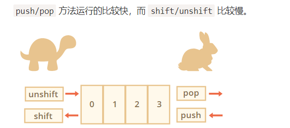
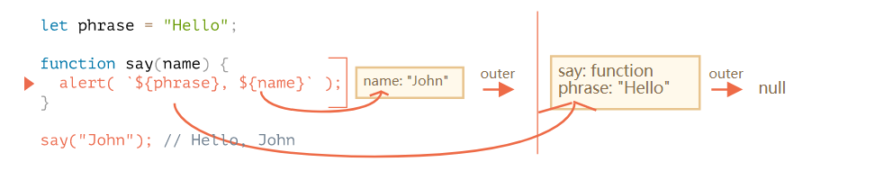
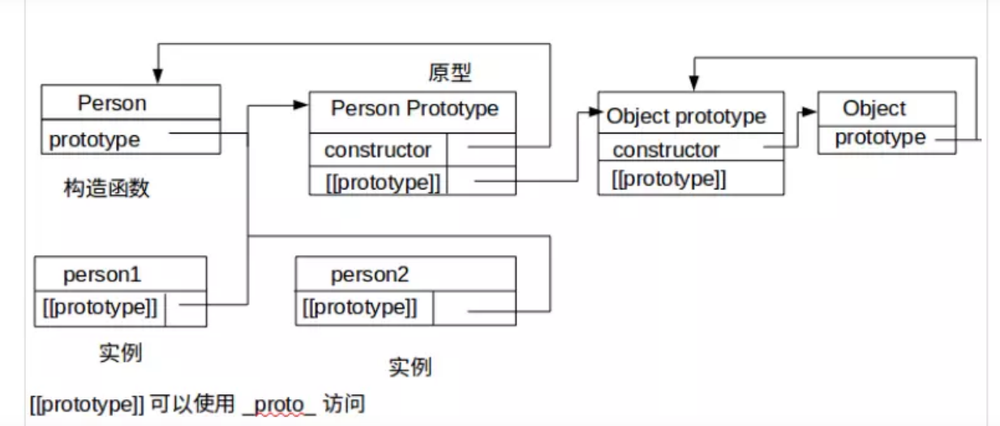
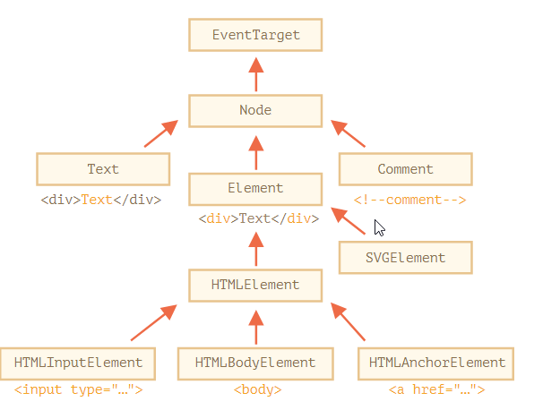
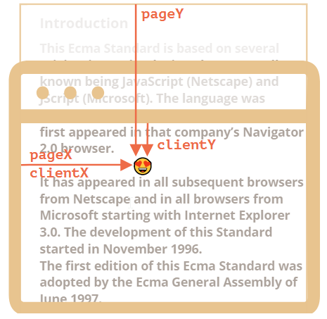
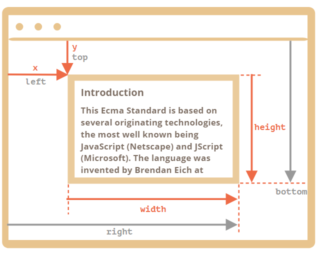
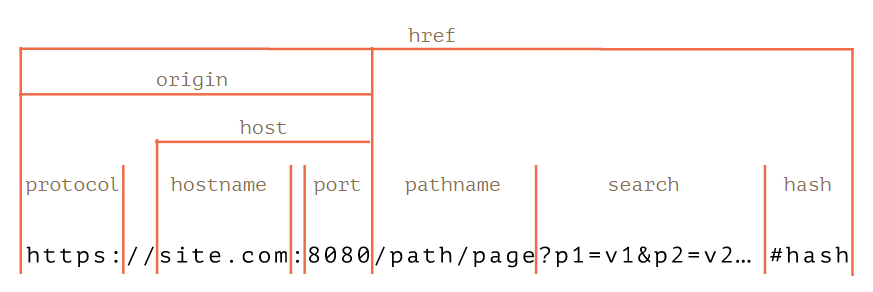

### 关系`与用户交互的 3 个浏览器指定的函数：[ ](javascript_info_20191219101334387)

我们使用浏览器作为工作环境，所以基本的 UI 功能将是：

+ {{c1::  prompt(question[, default])}}

询问一个问题，并返回访问者输入的内容，如果他按下「取消」则返回 `null`。

+ {{c1::  confirm(question)}}7

提出一个问题，并建议在确定和取消之间进行选择。该选项以 `true/false` 形式返回。

+ {{c1::  alert(message)}}

输出一个 `消息`。

所有这些函数都会产生**模态框**，它们会暂停代码执行并阻止访问者与页面交互，直到用户输入内容。

### 使用幂运算符 [ ](javascript_info_20191219101334390)

{{c1::

```javascript
alert(2 ** 2); // 4  (2 * 2)
alert(2 ** 3); // 8  (2 * 2 * 2)
alert(2 ** 4); // 16 (2 * 2 * 2 * 2)
```

}}

### 函数表达式 vs 函数声明 [ ](javascript_info_20191219101334391)

{{c1::

**严格模式下，当一个函数声明在一个代码块内运行时，它在该块内的任何地方都是可见的。但块外则相反。**

函数表达式需要执行到以后才会生效。

```javascript
sayHi("John"); // error!
let sayHi = function (name) {
  // (*) no magic any more
  alert(`Hello, ${name}`);
};
```

}}

### `typeof` 运算符返回值的类型，但有两个例外： [ ](javascript_info_20191219101334394)

| `typeof`使用例子      | 结果                 | 原因                   |
| --------------------- | -------------------- | ---------------------- |
| `typeof null`         | {{c1::`"object"  `}} | {{c1::语言的设计错误}} |
| `typeof function(){}` | {{c1::`"function"`}} | {{c1::函数被特殊对待}} |

### “switch” 结构 [ ](javascript_info_20191219101334395)

“switch” 结构可以替代多个 `if` 检查，它内部使用 {{c1::   `===`}}（严格相等）进行比较。

例如：

```javascript
let age = prompt("Your age?", 18);

switch (age) {
  case 18:
    alert("Won't work");

  case "18":
    alert("This works!");
    break;

  default:
    alert("Any value not equal to one above");
}
```

//{{c1::   提示的结果是一个字符串，而不是数字}}

### Debugger 命令 [>](https://zh.javascript.info/debugging-chrome#debugger-ming-ling) [ ](javascript_info_20191219101334397)

{{c1::

我们也可以使用 `debugger` 命令来暂停代码，像这样：

```javascript
function hello(name) {
  let phrase = `Hello, ${name}!`;
  debugger; // <-- 调试器会在这停止
  say(phrase);
}
```

当我们在一个代码编辑器中并且不想切换到浏览器在开发者工具中查找脚本来设置断点时，这真的是非常方便啦。

}}

## Objects（对象）：基础知识 [》](https://zh.javascript.info/object-basics) [ ](javascript_info_20191219101334399)

### 可以用下面两种语法的任一种来创建一个空的对象（“空柜子”）： [ ](javascript_info_20191219101334400)

{{c1::

```javascript
let user = new Object(); // “构造函数” 的语法
let user = {}; // “字面量” 的语法
```

}}

### 可以用多字词语来作为属性名： [ ](javascript_info_20191219101334402)

{{c1::

```javascript
let user = {
  name: "John",
  age: 30,
  "likes birds": true, // 多词属性名必须加引号
};
```

```javascript
// 语法错误
user.likes birds = true
```

```javascript
// set
user["likes birds"] = true;

// get
alert(user["likes birds"]); // true
```

}}

### 什么是计算属性？ [ ](javascript_info_20191219101334404)

{{c1::

```javascript
let fruit = prompt("Which fruit to buy?", "apple");
let bag = {
  [fruit]: 5, // 属性名从 fruit 变量中计算
};
alert(bag.apple); // 5 如果 fruit="apple"
```

}}

### 用存在的变量当做属性名时的简写 [ ](javascript_info_20191219101334407)

{{c1::  
我们可以把简写方式和正常方式混用：

```javascript
let user = {
  name, // 与 name:name 相同
  age: 30,
};
```

}}

### 对象的存在值检查 [ ](javascript_info_20191219101334408)

```javascript
let user = {};
//{{c1::
alert( user.noSuchProperty === undefined ); }}// true 意思是没有这个属性

//同样也有一个特别的操作符 "in" 来检查是否属性存在。
//{{c1::
"key" in object
//注意 in 的左边必须是属性名。通常是一个字符串，如果不用字符串，那就是一个字符串变量。}}
```

### 对象属性的顺序？ [ ](javascript_info_20191219101334411)

{{c1::

”有特别的顺序“：整数属性有顺序，其他的是按照创建的顺序排序。}}

### 整数属性是什么？ [ ](javascript_info_20191219101334412)

{{c1::

```javascript
//“49” 是一个整数属性名，因为我们把它转换成整数，再转换回来，它还是一样。但是 “+49” 和 “1.2” 就不行了：
// Math.trunc 是内置的去除小数部分的方法。
alert(String(Math.trunc(Number("49")))); // "49"，同样，整数属性
alert(String(Math.trunc(Number("+49")))); // "49"，不同于 "+49" ⇒ 不是整数属性
alert(String(Math.trunc(Number("1.2")))); // "1"，不同于 "1.2" ⇒ 不是整数属性
```

}}

### `Object.assign()`的使用 [ ](javascript_info_20191219101334415)

```javascript
let user = { name: "John" };

let permissions1 = { canView: true };
let permissions2 = { canEdit: true };

// 把 permissions1 和 permissions2 的所有属性都拷贝给 user
//{{c1::
Object.assign(user, permissions1, permissions2);
 }}
// 现在 user = { name: "John", canView: true, canEdit: true }
// 如果接收的对象（user）已经有了同样属性名的属性，{{c1:: 前面的会被覆盖}}
```

### 按下面的要求写代码： [ ](javascript_info_20191219101334421)

1. 创建一个空的 `user` 对象.
2. 为这个对象增加一个属性，键是 `name` 值是 `John`。
3. 再增加一个属性键`surname`值 `Smith`。
4. 把 `name` 属性的值改成 `Pete`。
5. 从对象中删除 `name` 属性

---

{{c1::

```javascript
let user = {};
user.name = "John";
user.surname = "Smith";
user.name = "pete";
delete user.name;
```

}}

### Symbol 类型 [ ](javascript_info_20191219101334424)

+ Symbol 总是不同的值，即使它们有相同的名称。如果我们希望同名 Symbol 相等，那么{{c1::  我们应该使用全局注册表：`Symbol.for(key)` 返回（如果需要的话创建）一个以 `key` 作为名称的全局 Symbol。`Symbol.for` 的多次调用完全返回相同的 Symbol。}}

  ```js
  //{{c1::
  let s = Symbol();
  let one = Symbol("蚂蚁部落");
  let two = Symbol("蚂蚁部落");
  console.log(one == two);

  let one = Symbol.for("蚂蚁部落");
  let two = Symbol.for("蚂蚁部落");
  console.log(typeof one);
  console.log(one == two);
  //}}
  ```

* Symbol 不是 100% 隐藏的。有一个内置方法 {{c1::  [Object.getOwnPropertySymbols(obj)](https://developer.mozilla.org/zh/docs/Web/JavaScript/Reference/Global_Objects/Object/getOwnPropertySymbols) }}允许我们获取所有的 Symbol。
* 还有一个名为{{c1::   [Reflect.ownKeys(obj)](https://developer.mozilla.org/zh/docs/Web/JavaScript/Reference/Global_Objects/Reflect/ownKeys) }}返回**所有**键，包括 Symbol。

### 对象方法与 "this" [ ](javascript_info_20191219101334426)

this 总是指向{{c1::  该方法所属的对象。}}

非严格模式下，函数中(没有定义在对象中的函数)的`this` 将会是{{c1::  **全局对象**（浏览器中的 `window`）。}}

### 箭头函数没有自己的 “this” [ ](javascript_info_20191219101334428)

{{c1::

箭头函数的 this 指向当前函数内的 this。

```javascript
let user = {
  firstName: "Ilya",
  sayHi() {
    let arrow = () => alert(this.firstName);
    arrow();
  },
};
//this 值取决于外部『正常的』函数
user.sayHi(); // Ilya
```

}}

### 在对象字面量中使用 "this" [ ](javascript_info_20191219101334432)

这里 `makeUser` 函数返回了一个对象。

访问 `ref` 的结果是什么？为什么？

```javascript
function makeUser() {
  return {
    name: "John",
    ref: this,
  };
}

let user = makeUser();

alert(user.ref.name); // What's the result?
```

---

{{c1::

1. 这里的 this 实际上取得的是 window 对象，也就是说 user.ref.name 被看作成 window 的属性。
2. 严格模式下的这里的 `this` 值为 `undefined`
3. 在方法中的 this 返回的是该方法所属的对象。
   }}

### `Symbol.toPrimitive` 对象原始值转换的使用？ [ ](javascript_info_20191219101334436)

```javascript
//第一种方式
let obj={};
//{{c1::
obj[Symbol.toPrimitive] = function(hint) {
  // 返回一个原始值
  // hint = "string"，"number" 和 "default" 中的一个
}
}}

//第二种方式
//{{c1::
let user = {
  name: "John",
  money: 1000,

  [Symbol.toPrimitive](hint) {
    alert(`hint: ${hint}`);
    return hint == "string" ? `{name: "${this.name}"}` : this.money;
  }
};
}}

// 转换演示：
alert(user); // hint: string -> {name: "John"}
alert(+user); // hint: number -> 1000
alert(user + 500); // hint: default -> 1500
```

### 为了进行转换，JavaScript 尝试查找并调用三个对象方法： [ ](javascript_info_20191219101334438)

{{c1::

1. 调用 `obj[Symbol.toPrimitive](hint)` 如果这个方法存在的话，

2. 否则如果暗示是"string"
   + 尝试 `obj.toString()` 和 `obj.valueOf()`，无论哪个存在。
3. 否则，如果暗示"number"或者"default"
   + 尝试 `obj.valueOf()` 和 `obj.toString()`，无论哪个存在。

}}

### 对象中方法定义的简写 [ ](javascript_info_20191219101334439)

{{c1::

```javascript
// 方法简写看起来更好，对吧？
let user = {
  sayHi() {
    // 与 "sayHi: function()" 一样
    alert("Hello");
  },
};
```

}}

### 解释 "this" 的值 [ ](javascript_info_20191219101334441)

在下面的代码中，我们试图连续调用 4 次 `user.go()` 方法。

但是 `(1)` 和 `(2)` 次 `(3)` 和 `(4)` 调用结果不同，为什么呢？

```javascript
let obj, method;

obj = {
  go: function () {
    alert(this);
  },
};

obj.go(); // (1) [object Object]

obj.go(); // (2) [object Object]

(method = obj.go)(); // (3) undefined

(obj.go || obj.stop)(); // (4) undefined
```

---

这里是解释。

{{c1::

1. 它是一个常规的方法调用。

2. 同样，括号没有改变执行的顺序，点总是首先执行。

3. 这里我们有一个更复杂的 `(expression).method()` 调用。这个调用就像被分成了两行（代码）一样：

   ```javascript
   f = obj.go; // calculate the expression
   f(); // call what we have
   ```

这里的 `f()` 是作为一个没有（设定）`this` 的函数执行的。

1. 与 `(3)` 相类似，在点 `.` 的左边也有一个表达式。

要解释 `(3)` 和 `(4)` 的原因，我们需要回顾一下属性访问器（点或方括号）返回的值是引用类型的。

}}

{{c1::

除了方法调用之外的任何操作（如赋值 `=` 或 `||` 等）把它变为了一个没有设定 `this` 信息的普通值。

}}

## 构造函数 [ ](javascript_info_20191219101334443)

### 构造函数概念 [ ](javascript_info_20191219101334445)

构造函数在技术上是常规函数。不过有两个约定：

{{c1::

1. 他们首先用大写字母命名。
2. 它们只能用 `new` 操作符来执行。

}}

### 当一个函数作为 `new User(...)`执行时，它执行以下步骤 [ ](javascript_info_20191219101334447)

{{c1::

1. 一个新的空对象被创建并分配给 `this`。
2. 函数体执行。通常它会修改 `this`，为其添加新的属性。
3. 返回 `this` 的值。

}}

从技术上讲，**任何函数都可以用作构造函数**。即：任何函数都可以运行 `new`，它会执行上面的算法。

如果没有参数我们 `new` 可以省略括号：

{{c1::

```javascript
let user = new User(); // <-- no parentheses
// same as
let user = new User();
//这里省略括号不被认为是一种“好风格”，但是规范允许使用该语法。
```

}}

### 双语法构造函数：`new.target`的含义? [ ](javascript_info_20191219101334449)

{{c1::

**`new.target`**属性允许你检测函数或构造方法是否是通过[new](https://developer.mozilla.org/zh-CN/docs/Web/JavaScript/Reference/Operators/new)运算符被调用的。在通过[new](https://developer.mozilla.org/zh-CN/docs/Web/JavaScript/Reference/Operators/new)运算符被初始化的函数或构造方法中，`new.target`返回一个指向构造方法或函数的引用。在普通的函数调用中，`new.target` 的值是[`undefined`](https://developer.mozilla.org/zh-CN/docs/Web/JavaScript/Reference/Global_Objects/undefined)。

```javascript
function User() {
  alert(new.target);
}

// 不带 new：
User(); // undefined

// 带 new：
new User(); // function User { ... }
```

}}

### task: 构造函数 Return 返回的是什么? [ ](javascript_info_20191219101334450)

是否可以创建函数 `A` 和 `B`，如 `new A()==new B()`？

```javascript
function A() { ... }
function B() { ... }

let a = new A;
let b = new B;

alert( a == b ); // true
```

如果可以，请提供他们的代码示例?

{{c1::

**带有对象的 `return` 返回该对象**，在所有其他情况下返回 `this`。

```javascript
let obj = {};

function A() {
  return obj;
}
function B() {
  return obj;
}

alert(new A() == new B()); // true
```

}}

## 数据类型 [ ](javascript_info_20191219101334452)

### 在 JavaScript 中有 6 种基本类型： [ ](javascript_info_20191219101334454)

{{c1::

+ `string`、`number`、`boolean`、`symbol`、`null` 和 `undefined`。

  }}

### 基本类型的包装对象 [ ](javascript_info_20191219101334455)

极其不推荐使用构造函数 `String/Number/Boolean`，为什么？

特殊的基本类型 {{c1::    `null` 和 `undefined` }}是个例外。他们没有相应的“包装对象”，

基本类型不是{{c1::    对象。}}

基本类型{{c1:: 不能存储数据。}}

所有的属性/方法操作都是在{{c1:: 临时对象}}的帮助下执行的。

---

```javascript
alert(typeof 1); // "number"
alert(typeof new Number(1)); // "object"!
//导致下面问题
let zero = new Number(0);
if (zero) {
  // zero is true, because it's an object
  alert("zero is truthy?!?");
}
```

### `js`中编写数字的更多方法 [ ](javascript_info_20191219101334459)

```javascript
//数字简写
1e-3 =//{{c1:: 1 / 1000 (=0.001)}}
1.23e-6 =//{{c1:: 1.23 / 1000000 (=0.00000123) }}
//16进制
//{{c1::
alert( 0xff ); // 255
alert( 0xFF ); // 255 (the same, case doesn't matter)
 }}
//2进制
//{{c1::
let a = 0b11111111; // binary form of 255
}}
////8进制
//{{c1::
let b = 0o377; // octal form of 255
 }}
alert( a == b ); // true, the same number 255 at both sides
```

### `num.toString(base)` [ ](javascript_info_20191219101334460)

{{c1::

```javascript
let num = 255;

alert(num.toString(16)); // ff
alert(num.toString(2)); // 11111111
```

常见的用例如下：

+ **base=16** 用于十六进制颜色，字符编码等，数字可以是 `0..9` 或 `A..F`。

+ **base=2** 主要用于调试按位操作，数字可以是 `0` 或 `1`。

+ **base=36** 是最大值，数字可以是 `0..9` 或 `A..Z`。整个拉丁字母用来表示一个数字。对于 `36` 来说，一个有趣而有用的例子是，当我们需要将一个较长的数字标识符变成较短的时候，例如做一个简短的 URL。可以简单地用基数为 `36` 的数字系统表示：

  }}

### 数字调用方法的两个点 [ ](javascript_info_20191219101334462)

```javascript
alert((123456).toString(36)); // 2n9c
```

---

{{c1::请注意 `123456..toString(36)` 中的两个点不是拼写错误。如果我们想直接在一个数字上调用一个方法，比如上面例子中的 `toString`，那么我们需要在它后面放置两个点 `..`。

如果我们放置一个点：`123456.toString(36)`，那么会出现错误，因为 JavaScript 语法暗示了第一个点之后的小数部分。如果我们再放一个点，那么 JavaScript 知道小数部分是空的，现在进入方法。

也可以写 `(123456).toString(36)`。}}

### `Math.trunc`方法 [ ](javascript_info_20191219101334464)

{{c1::

删除小数点后的所有内容而不舍入：`3.1` 变成 `3`，`-1.1` 变成 `-1`。}}

### `num.toFixed(n)`方法 [ ](javascript_info_20191219101334465)

{{c1::函数 [toFixed(n)](https://developer.mozilla.org/en-US/docs/Web/JavaScript/Reference/Global_Objects/Number/toFixed) 将点数后的数字**四舍五入到 `n` 个数字**并返回结果的**字符串**表示。}}

```javascript
let num = 12.34;
alert( num.toFixed(1) ); {{c1::// "12.3"}}

let num = 12.36;
alert( num.toFixed(1) ); {{c1::// "12.4"}}
```

### `js`中`isNaN`和`Number.isNaN`的区别 [ ](javascript_info_20191219101334468)

{{c1::

`Number.isNaN`与`isNaN`最的区别是，`Number.isNaN` 不存在类型转换的行为。

```java
console.log(isNaN('测试')) //true 因为字符串是有可能转换成数字的
console.log(Number.isNaN('测试')) //false
alert( NaN === NaN ); // false
```

}}

### 测试：`isFinite` [ ](javascript_info_20191219101334470)

+ `isFinite(value)`: {{c1::将其参数转换为数字，如果是常规数字，则返回 `true`，而不是 `NaN / Infinity / -Infinity`：

  ```javascript
  alert(isFinite("15")); // true
  alert(isFinite("str")); // false, because a special value: NaN
  alert(isFinite(Infinity)); // false, because a special value: Infinity
  ```

  }}

+ `Object.is`可以比较 `===` 等值，但对于两种边缘情况更可靠：{{c1::

  1. 它适用于 `NaN`： `Object.is（NaN，NaN）=== true`，这是件好事。
  2. 值 `0` 和 `-0` 是不同的：`Object.is（0，-0）=== false`，它不是很重要，但这些值在技术上是不同的。}}

### `parseInt` 和`parseFloat` [ ](javascript_info_20191219101334472)

{{c1::

使用加号 `+` 或 `Number()` 的数字转换是严格的。如果一个值不完全是一个数字，就会失败：

```javascript
alert(+"100px"); // NaN
```

`parseInt` 和 `parseFloat` 从字符串中“读出”一个数字，直到他们可以。如果发生错误，则返回收集的数字:

+ `parseInt(str，base)` 解析来自任何数字系统的整数，其基数为：`2≤base≤36`。

```javascript
alert(parseInt("100px")); // 100
alert(parseFloat("12.5em")); // 12.5
alert(parseInt("12.3")); // 12, only the integer part is returned
alert(parseFloat("12.3.4")); // 12.3, the second point stops the reading

alert(parseInt("a123")); // NaN, the first symbol stops the process
```

}}

## 字符串 [ ](javascript_info_20191219101334473)

### 3 种字符串类型： [ ](javascript_info_20191219101334474)

{{c1::

在 JavaScript 中，字符串不可更改。改变字符是不可能的。

字符串可以包含在单引号、双引号或反引号中：

```javascript
let single = "single-quoted";
let double = "double-quoted";
let backticks = `backticks`;
```

}}

### 可以使用 `for..of` 遍历字符： [ ](javascript_info_20191219101334476)

{{c1::

```javascript
for (let char of "Hello") {
  alert(char); // H,e,l,l,o （char 变为“H”，然后是“e”，然后是“l”等）
}
```

}}

### 按位（bitwise）NOT 使用`indexOf`的技巧 [ ](javascript_info_20191219101334477)

{{c1::

```javascript
let str = "Widget";

if (~str.indexOf("Widget")) {
  alert("Found it!"); // 正常运行
}
```

}}

### `str.includes(substr, pos)` [ ](javascript_info_20191219101334479)

{{c1::

更现代的方法 [str.includes(substr, pos)](https://developer.mozilla.org/zh/docs/Web/JavaScript/Reference/Global_Objects/String/includes) 取决于 `str` 是否包含 `substr` 来返回 `true/false`。

```javascript
alert("Widget with id".includes("Widget")); // true
alert("Hello".includes("Bye")); // false
alert("Midget".includes("id")); // true
alert("Midget".includes("id", 3)); // false, 位置 3 没有“id”
```

}}

### JavaScript 中有三种获取字符串的方法：`substring`、`substr` 和 `slice`。 [ ](javascript_info_20191219101334481)

| 方法                    | 选择方式……                                         | 负号参数            |
| :---------------------- | -------------------------------------------------- | :------------------ |
| `slice(start, end)`     | **{{c1:: 从** `start` 到 `end` (不含 `end`)}}      | 允许                |
| `substring(start, end)` | `{{c1:: start` 与 `end` 之间}}                     | 负值代表 `0`        |
| `substr(start, length)` | {{c1:: 从 `start` 开始获取长为 `length` 的字符串}} | 允许 `start` 为负数 |

## 数组 [ ](javascript_info_20191219101334483)

### 创建一个空数组有两种语法： [ ](javascript_info_20191219101334484)

{{c1::

```javascript
let arr = new Array();
let arr = [];
```

}}

### 数组可以存储任何类型的元素。 [ ](javascript_info_20191219101334485)

+ 数组和对象一样， 都可以在末尾{{c1::冗余一个逗号。}}
+ 数组是一种特殊的对象。{{c1:: 使用方括号来访问属性 `arr[0]` 实际上是来自于对象的语法。这个数字被用作键值。他们扩展了对象，提供了特殊的方法来处理有序的数据集合，还添加了 `length` 属性。但是核心还是一个对象。}}
+ 数组有自己的 `toString` 方法的实现，会返回以逗号隔开的元素列表。

```javascript
// 混合值
let arr = [
  "Apple",
  { name: "John" },
  true,
  function () {
    alert("hello");
  },
];

// 获取索引为 1 的对象然后显示它的 name
alert(arr[1].name); // John

// 获取索引为 3 的函数并执行
arr[3](); // hello
```

### pop/push, shift/unshift 方法 [ ](javascript_info_20191219101334487)

+ `push` {{c1:: 在末端添加一个元素。}}
+ `shift` {{c1:: 取出队列最前端的一个元素，整个队列往前移，这样原先排第二的元素现在排在了第一。}}
+ `pop` {{c1:: 从末端取出一个元素。}}
+ `unshift` {{c1:: 在数组的前端添加元素。
  }}

### 数组误用的几种方式: [ ](javascript_info_20191219101334489)

+ 添加一个非数字的属性比如 `arr.test = 5`。}}
+ 制造空洞，比如：{{c1::  添加 `arr[0]` 后添加 `arr[1000]` (它们中间什么都没有)。}}
+ 以倒序填充数组, {{c1::  比如 `arr[1000]`，`arr[999]` 等等。}}

### 2 种简化 for 循环的格式区别： [ ](javascript_info_20191219101334491)

+ `for..in`： {{c1::  遍历对象的属性名。}}
+ `for..of`： {{c1::  遍历数据元素。}}

### `length` 代表数组的大小 [ ](javascript_info_20191219101334492)

`length` 属性的特点是：

+ {{c1::它是可写的。}}
+ {{c1::且自动更新。}}

所以，清空数组最好的方法就是： {{c1::  ``arr.length = 0;``   }}。

## 数组方法 [ ](javascript_info_20191219101334493)

### `arr.splice(index[, deleteCount, elem1, ..., elemN])` [ ](javascript_info_20191219101334495)

{{c1:: 从 `index` 开始：删除 `deleteCount` 元素并在当前位置插入 `elem1, ..., elemN`。最后返回已删除元素的数组。 }}

**允许负向索引**

### `arr.slice(start, end)` [ ](javascript_info_20191219101334496)

{{c1:: 它从所有元素的开始索引 `"start"` 复制到 `"end"` (不包括 `"end"`) 返回一个新的数组。 }}

### `arr.concat(arg1, arg2...)` [ ](javascript_info_20191219101334497)

结果是一个{{c1:: 包含`arr`，`arg1`，`arg2`等元素的新数组。}}

如果参数是一个数组或具有 `Symbol.isConcatSpreadable` 属性， {{c1:: 则其所有元素都将被复制。否则，复制参数本身。

```javascript
let arr = [1, 2];
let arrayLike = {
  0: "something",
  length: 1,
};
alert(arr.concat(arrayLike)); // 1,2,[object Object]
//[1, 2, arrayLike]

let arr = [1, 2];

let arrayLike = {
  0: "something",
  1: "else",
  [Symbol.isConcatSpreadable]: true,
  length: 2,
};

alert(arr.concat(arrayLike)); // 1,2,something,else
```

}}

### `indexOf` `lastIndexOf` `includes` [ ](javascript_info_20191219101334499)

+ `arr.indexOf(item, from)` {{c1:: 从索引 `from` 查询 `item`，如果找到返回索引，否则返回 `-1`。}}
+ `arr.lastIndexOf(item, from)` — {{c1:: 和上面相同，只是从尾部开始查询。}}
+ `arr.includes(item, from)` — {{c1:: 从索引 `from` 查询 `item`，如果找到则返回 `true`。}}

### JS 数组中使用 lambda 表达式的方法 [ ](javascript_info_20191219101334501)

| [filter()](https://www.runoob.com/jsref/jsref-filter.html)       | {{c1::检测数值元素，并返回符合条件所有元素的数组。}}         |
| ---------------------------------------------------------------- | ------------------------------------------------------------ |
| [find()](https://www.runoob.com/jsref/jsref-find.html)           | {{c1::返回符合传入测试（函数）条件的数组元素。}}             |
| [findIndex()](https://www.runoob.com/jsref/jsref-findindex.html) | {{c1::返回符合传入测试（函数）条件的数组元素索引。}}         |
| [forEach()](https://www.runoob.com/jsref/jsref-foreach.html)     | {{c1::数组每个元素都执行一次回调函数。}}                     |
| [map()](https://www.runoob.com/jsref/jsref-map.html)             | {{c1::通过指定函数处理数组的每个元素，并返回处理后的数组。}} |

```js
//参数函数
//{{c1::
    let func=function(item, index, array) {
      // 如果查询到返回 true
    };
}}
    let result = arr.find(func);

//箭头函数版
//{{c1::
    let someUsers = users.filter(item => item.id < 3);
}}
    alert(someUsers.length); // 2
```

+ {{c1:: `item` 是元素。
+ `index` 是它的索引。
+ `array` 是数组本身。}}

### `arr.sort(fn)` [ ](javascript_info_20191219101334502)

**默认情况下按字符串排序。**

自定义排序例子：

{{c1::

```javascript
function compareNumeric(a, b) {
  if (a > b) return 1;
  if (a == b) return 0;
  if (a < b) return -1;
}

let arr = [1, 2, 15];

arr.sort(compareNumeric);

alert(arr); // 1, 2, 15
```

}}

### `arr.reverse` [ ](javascript_info_20191219101334504)

{{c1::

[arr.reverse](https://developer.mozilla.org/zh/docs/Web/JavaScript/Reference/Global_Objects/Array/reverse) 方法颠倒 `arr` 中元素的顺序。

}}

### `str.split`和`arr.join` [ ](javascript_info_20191219101334506)

`str.split`: {{c1::  分割字符串为一个数组。}}

`arr.join`: {{c1::  将数据拼接成字符串}}

### `arr.reduce()`与`reduceRight()` [ ](javascript_info_20191219101334508)

| [reduce()](https://www.runoob.com/jsref/jsref-reduce.html)           | {{c1::将数组元素计算为一个值（从左到右）。}} |
| -------------------------------------------------------------------- | :------------------------------------------- |
| [reduceRight()](https://www.runoob.com/jsref/jsref-reduceright.html) | {{c1::将数组元素计算为一个值（从右到左）。}} |

**参数列表示例**：
{{c1::

```javascript
let value = arr.reduce(function (previousValue, item, index, arr) {
  // ...
}, initial);
```

}}

### `Array.isArray` 的作用 [ ](javascript_info_20191219101334509)

{{c1::

数组基于对象，`type []` 返回的是`"object"`,基于此提供了 Array.isArray 方法。

```javascript
alert(Array.isArray({})); // false

alert(Array.isArray([])); // true
```

}}

### `thisArg`的含义 [ ](javascript_info_20191219101334511)

thisArg 为当前函数的运行环境

```javascript
let user = {
  age: 18,
  younger(otherUser) {
    return otherUser.age < this.age;
  },
};

let users = [{ age: 12 }, { age: 16 }, { age: 32 }];

// 找到比 user 小的所有 users
let youngerUsers = users.filter(user.younger, user);

alert(youngerUsers.length); // 2
```

{{c1::

在上面我们使用 `user.younger` 作为过滤器，并提供 `user` 作为它的上下文。如果我们没有提供上下文，`users.filter(user.younger)` 会调用`user.younger` 作为一个独立的函数，这时 `this=undefined`。

}}

### 数组方法总结 [ ](javascript_info_20191219101334512)

+ 添加/删除元素：
  + `push(...items)` — 从结尾添加元素，
  + `pop()` — 从结尾提取元素，
  + `shift()` — 从开头提取元素，
  + `unshift(...items)` — 从开头添加元素，
  + `splice(pos, deleteCount, ...items)` — 从 `index` 开始：删除 `deleteCount` 元素并在当前位置插入元素。
  + `slice(start, end)` — 它从所有元素的开始索引 `"start"` 复制到 `"end"` (不包括 `"end"`) 返回一个新的数组。
  + `concat(...items)` — 返回一个新数组：复制当前数组的所有成员并向其中添加 `items`。如果有任何`items` 是一个数组，那么就取其元素。
+ 查询元素：
  + `indexOf/lastIndexOf(item, pos)` — 从 `pos` 找到 `item`，则返回索引否则返回 `-1`。
  + `includes(value)` — 如果数组有 `value`，则返回 `true`，否则返回 `false`。
  + `find/filter(func)` — 通过函数过滤元素，返回 `true` 条件的符合 find 函数的第一个值或符合 filter 函数的全部值。
  + `findIndex` 和 `find` 类似，但返回索引而不是值。
+ 转换数组：
  + `map(func)` — 从每个元素调用 `func` 的结果创建一个新数组。
  + `sort(func)` — 将数组倒序排列，然后返回。
  + `reverse()` — 在原地颠倒数组，然后返回它。
  + `split/join` — 将字符串转换为数组并返回。
  + `reduce(func, initial)` — 通过为每个元素调用 `func` 计算数组上的单个值并在调用之间传递中间结果。
+ 迭代元素：
  + `forEach(func)` — 为每个元素调用 `func`，不返回任何东西。
+ 其他： – `Array.isArray(arr)` 检查 `arr` 是否是一个数组。

请注意，`sort`，`reverse` 和 `splice` 方法修改数组本身。

这些方法是最常用的方法，它们覆盖 99％ 的用例。但是还有其他几个：

+ [arr.some(fn)](https://developer.mozilla.org/zh/docs/Web/JavaScript/Reference/Global_Objects/Array/some)/[arr.every(fn)](https://developer.mozilla.org/zh/docs/Web/JavaScript/Reference/Global_Objects/Array/every) 检查数组。

  在类似于 `map` 的数组的每个元素上调用函数 `fn`。如果任何/所有结果为 `true`，则返回 `true`，否则返回 `false`。

+ [arr.fill(value, start, end)](https://developer.mozilla.org/zh/docs/Web/JavaScript/Reference/Global_Objects/Array/fill) — 从 `start` 到 `end` 用 `value` 重复填充数组。

+ [arr.copyWithin(target, start, end)](https://developer.mozilla.org/zh/docs/Web/JavaScript/Reference/Global_Objects/Array/copyWithin) —将其元素从 `start` 到 `end` 在 `target` 位置复制到 **本身**（覆盖现有）。

## `Symbol.iterator`（可迭代对象） [ ](javascript_info_20191219101334513)

### 可迭代对象概念 [ ](javascript_info_20191219101334515)

+ `obj[Symbol.iterator]` 方法返回的结果被称为 {{c1::   **迭代器**}}。由它处理更深入的迭代过程。
+ 一个迭代器必须有 {{c1::   `next()` 方法}}，它返回一个 {{c1::   `{done: Boolean, value: any}`，这里 `done:true` 表明迭代结束，否则 `value` 就是下一个值。}}

### 实现`Symbol.iterator` 的两种方式 [ ](javascript_info_20191219101334516)

+ 第一种：{{c1::每次调用`obj[Symbol.iterator]`都返回一个实现了next()方法的新对象。}}
  + 特点：{{c1::每次会返回新的迭代器从头开始迭代。}}
+ 第二种: 每次调用`obj[Symbol.iterator]`都返回`this`,对象本身实现了 next 方法。
  + 特点：{{c1::对象内部会记住迭代的状态。}}

### 显式调用字符串的迭代器 [ ](javascript_info_20191219101334518)

```javascript
let str = "Hello";
// 要和下面代码完成的功能一致
// for (let char of str) alert(char);
//{{c1::
let iterator = str[Symbol.iterator]();
while (true) {
  let result = iterator.next();
  if (result.done) break;
  alert(result.value); // 一个一个输出字符
}
}}
```

### 类数组对象 [ ](javascript_info_20191219101334520)

**Array-likes** 是有{{c1:: 索引和 `length` 属性}}的对象，所以它们很像数组。

```javascript
//{{c1::
let arrayLike = { // 有索引和长度 => 类数组对象
  0: "Hello",
  1: "World",
  length: 2
};
}}
// 错误（没有 Symbol.iterator）
for (let item of arrayLike) {}
```

### `Array.from` [ ](javascript_info_20191219101334521)

有一个全局方法 [Array.from](https://developer.mozilla.org/zh/docs/Web/JavaScript/Reference/Global_Objects/Array/from) 可以以一个{{c1::  **可迭代对象**或者**类数组对象**}}作为参数并返回一个真正的 `Array` 数组。

```javascript
Array.from(obj[, mapFn, thisArg])
```

+ `mapFn` {{c1::  应是一个在元素被添加到数组前，施加于每个元素的方法 }}
+ `thisArg` {{c1:: 允许设置方法的 `this` 对象 }}

```javascript
let arrayLike = {
  0: "Hello",
  1: "World",
  length: 2,
};

let arr = Array.from(arrayLike); // (*)
alert(arr.pop()); // World（pop 方法生效）
```

## `Map、Set、WeakMap` 和 `WeakSet` [ ](javascript_info_20191219101334523)

### Map [ ](javascript_info_20191219101334524)

[Map](https://developer.mozilla.org/zh/docs/Web/JavaScript/Reference/Global_Objects/Map) 是一个键值对的集合，很像 `Object`。但主要的区别是，`Map` 允许所有数据类型作为键。。

`NaN`{{c1::  也可以作为键}}

主要的方法包括：

+ `new Map()` –{{c1::  创建 map。}}
+ `map.set(key, value)` – {{c1:: 根据键（key）存储值（value），**可以链式调用**。}}
+ `map.get(key)` – {{c1:: 根据键返回值，如果 map 中该键不存在，返回 `undefined`。}}
+ `map.has(key)` – {{c1:: 如果键存在，返回 `true`，否则返回 `false`。}}
+ `map.delete(key)` – {{c1:: 移除该键的值。}}
+ `map.clear()` – {{c1:: 清空 map。}}
+ `map.size` – {{c1:: 返回当前元素个数。}}
+ `map.forEach` – {{c1:: 遍历map。}}

### `Object.entries(obj)` [ ](javascript_info_20191219101334526)

{{c1:: 它可以返回一个对象的键值对数组}}

{{c1::

```javascript
let map = new Map(
  Object.entries({
    name: "John",
    age: 30,
  })
);
```

}}

这里，`Object.entries` 返回了键值对数组：{{c1:: `[ ["name","John"], ["age", 30] ]`}}

### 有三种方法可以循环遍历 `map`： [ ](javascript_info_20191219101334528)

{{c1::

+ `map.keys()` – 返回键的迭代器，
+ `map.values()` – 返回值的迭代器，
+ `map.entries()` – 返回 `[key, value]` 迭代器入口，`for..of` 循环会默认使用它。

注意：map 的迭代顺序是值的插入顺序。

}}

### Set [ ](javascript_info_20191219101334529)

`Set` 是一个值的集合，这个集合中所有的值仅出现一次。

主要方法包括：

+ `new Set(iterable)` – {{c1:: 创建 set，利用数组来创建是可选的（任何可迭代对象都可以）。}}
+ `set.add(value)` – {{c1:: 添加值，返回 set 自身。}}
+ `set.delete(value)` –{{c1::  删除值，如果该 `value` 在调用方法的时候存在则返回 `true` ，否则返回 `false`。}}
+ `set.has(value)` – {{c1:: 如果 set 中存在该值则返回 `true` ，否则返回 `false`。}}
+ `set.clear()` –{{c1::  清空 set。}}
+ `set.size` – {{c1:: 元素个数。}}

我们可以使用 {{c1:: `for..of` 或者 `forEach` }}来循环查看 set

### `WeakMap`和 `WeakSet` [ ](javascript_info_20191219101334531)

+ `WeakMap` —— {{c1:: `Map` 的一个变体，仅允许对象作为键，并且当对象由于其他原因不可引用的时候将其删除。

  + 它不支持整体的操作：没有 `size` 属性，没有 `clear()` 方法，没有迭代器。}}

+ `WeakSet` —— {{c1:: `Set` 的一个变体，仅存储对象，并且当对象由于其他原因不可引用的时候将其删除。
+ 同样不支持 `size/clear()` 和迭代器。}}

## 对象的键、值、项 [ ](javascript_info_20191219101334535)

### `Object.keys、values、entries` 三个方法 [ ](javascript_info_20191219101334538)

+ [Object.keys(obj)](https://developer.mozilla.org/zh/docs/Web/JavaScript/Reference/Global_Objects/Object/keys) —— {{c1:: 返回一个包含该对象全部的键的**数组**。}}
+ [Object.values(obj)](https://developer.mozilla.org/zh/docs/Web/JavaScript/Reference/Global_Objects/Object/values) —— {{c1::  返回一个包含该对象全部的值的**数组**。}}
+ [Object.entries(obj)](https://developer.mozilla.org/zh/docs/Web/JavaScript/Reference/Global_Objects/Object/entries) —— {{c1:: 返回一个包含该对象全部 [key, value] 键值对的**数组**。}}

跟 map 的区别：

|          | Map                  | Object                                          |
| :------- | :------------------- | :---------------------------------------------- |
| 调用语法 | `{{c1::map.keys()`}} | {{c1::`Object.keys(obj)`，而不是 `obj.keys()`}} |
| 返回值   | {{c1::可迭代项}}     | {{c1::「真正的」数组}}                          |

`Object.keys/values/entries` 忽略 {{c1:: Symbol 类型}}的属性

## 解构赋值 [ ](javascript_info_20191219101334540)

### 在方法参数列表中使用解构赋值 [ ](javascript_info_20191219101334543)

```javascript
let options = {
  title: "My menu",
  items: ["Item1", "Item2"]
};
//{{c1::
function showMenu({
  title = "Untitled",
  width: w = 100,  // width 赋值给 w
  height: h = 200, // height 赋值给 h
  items: [item1, item2] // items 第一个元素赋值给 item1, 第二个元素赋值给 item2
})
}}{
  alert( `${title} ${w} ${h}` ); // My Menu 100 200
  alert( item1 ); // Item1
  alert( item2 ); // Item2
}

showMenu(options);
```

注意：

+ 对象属性需要相同的名字
+ 数组元素名称任意但是要注意顺序

我们可以通过指定空对象 `{}` 为整个函数参数的默认值。

## 日期和时间 [ ](javascript_info_20191219101334546)

### 日期对象 [ ](javascript_info_20191219101334548)

构造函数：

`new Date()`

{{c1:: 不带参数 —— 创建一个表示当前日期和时间的 `Date` 对象：}}

`new Date(milliseconds)`

{{c1:: 创建一个 `Date` 对象，参数是从 1970-01-01 00:00:00 UTC+0 开始所经过的毫秒（一秒的千分之一）数。}}

`new Date(datestring)`

{{c1:: 如果只有一个参数，并且是字符串，那么该参数会通过 `Date.parse` 算法解析（下面会提到）。}}

`new Date(year, month, date, hours, minutes, seconds, ms)`

{{c1:: 创建一个 Date 对象，参数是当地时区的日期组合信息。只有前两个参数是必须的。}}

常用函数：

`Date.now()`:返回当前的时间戳。

`Date.parse()`:会转化一个特定格式的字符串，返回一个时间戳（自 1970-01-01 00:00:00 起的毫秒数），如果格式不正确，返回 `NaN`。

### 日期字符串格式（年-月-日 T 小时：分钟：秒：毫秒） [ ](javascript_info_20191219101334549)

{{c1::

字符串的格式是：`YYYY-MM-DDTHH:mm:ss.sssZ`，其中：

+ `YYYY-MM-DD` —— 日期：年-月-日。
+ 字符串 `"T"` 是一个分隔符。
+ `HH:mm:ss.sss` —— 时间：小时，分钟，秒，毫秒。
+ 可选字符 `'Z'` 代表时区。单个字符 `Z` 代表 UTC+0。

简短形式也是可以的，比如 `YYYY-MM-DD` 或者 `YYYY-MM` 又或者 `YYYY`。

}}

### JavaScript 日期对象小结 [ ](javascript_info_20191219101334552)

+ 在 JavaScript 中，日期和时间使用 [Date](https://developer.mozilla.org/zh/docs/Web/JavaScript/Reference/Global_Objects/Date) 对象来表示{{c1:: 。不能只创建日期，或者只创建时间，`Date` 对象总是两个都创建。}}
+ 月份从 {{c1:: 0 开始计数（对，一月是 0）。}}
+ 一周的某一天 `getDay()` 同样从{{c1::  0 开始计算（0 代表星期天）。}}
+ 当超出范围的信息被设置时，{{c1:: `Date` 会做自我校准。这一点对于日/月/小时 的加减很有效。}}
+ 日期可以相减{{c1:: ，得到的是两者的差值，用毫秒表示。因为当转化为数字时，`Date` 对象变为时间戳。}}

## JSON 方法，toJSON [ ](javascript_info_20191219101334554)

### JSON 编码的对象与对象字面量有几个重要的区别： [ ](javascript_info_20191219101334555)

{{c1::

+ 字符串使用双引号。JSON 中没有单引号或反引号。所以 `'John'` 转成 `"John"`。
+ JSON 对象属性名称也是双引号的。这是强制性的。所以 `age:30` 转成 `"age":30`。

}}

### js 中将对象转换为字符串 [ ](javascript_info_20191219101334556)

```javascript
let student = {
  name: 'John',
  age: 30,
  isAdmin: false,
  courses: ['html', 'css', 'js'],
  wife: null
};
//{{c1::
let json = JSON.stringify(student);
//}}
alert(typeof json); // we've got a string!
 }
alert(json);
/* JSON-encoded object:
{
  "name": "John",
  "age": 30,
  "isAdmin": false,
  "courses": ["html", "css", "js"],
  "wife": null
}
*/
```

### `JSON.stringify` 会跳过的 3 种类型的值 [ ](javascript_info_20191219101334558)

+ {{c1::函数属性（方法）。}}

+ {{c1::Symbolic 属性。}}

+ {{c1::存储 `undefined` 的属性。}}解构赋值总结

{{c1::

```javascript
let user = {
  sayHi() {
    // ignored
    alert("Hello");
  },
  [Symbol("id")]: 123, // ignored
  something: undefined, // ignored
};
alert(JSON.stringify(user)); // {} (empty object)
```

}}

### `JSON.stringify` 的方法签名： [ ](javascript_info_20191219101334560)

{{c1::

```javascript
let json = JSON.stringify(value, replacer, space);
```

+ value

  要编码的值。

+ replacer

  要编码的属性数组**或**映射函数 `function(key, value)`。

+ space

  文本添加缩进、空格和换行符

  这里 `spacer = 2` 告诉 JavaScript 在多行上显示嵌套对象，并在对象中缩进 2 个空格。

}}

### 对象中的`toJSON()`方法 [ ](javascript_info_20191219101334561)

{{c1::

像 `toString` 进行字符串转换，对象可以提供 `toJSON` 方法来进行 JSON 转换。如果可用，`JSON.stringify` 会自动调用它。

}}

### `JSON.parse(str, reviver);` :reviver 参数例子： [ ](javascript_info_20191219101334563)

```javascript
let str = '{"title":"Conference","date":"2017-11-30T12:00:00.000Z"}';
//将JSON中的属性为“date"的字符串转换成成日期对象
let meetup = JSON.parse(str,
                        //{{c1::
                        function(key, value) {
                          if (key == 'date') return new Date(value);
                          return value;
                        }}});

alert( meetup.date.getDate() ); // now works!
```

### Rest 参数（剩余参数）`...` [ ](javascript_info_20191219101334564)

**Rest 参数必须{{c1:: 放到参数列表的末尾}}**

下面的例子即把前两个参数定义为变量，同时把剩余的参数收集到 `titles` 数组中：

{{c1::

```javascript
function showName(firstName, lastName, ...titles) {
  alert(firstName + " " + lastName); // Julius Caesar
  // titles 数组中包含了剩余的参数
  // 也就是有 titles = ["Consul", "Imperator"]
  alert(titles[0]); // Consul
  alert(titles[1]); // Imperator
  alert(titles.length); // 2
}

showName("Julius", "Caesar", "Consul", "Imperator");
```

}}

### arguments 变量 [ ](javascript_info_20191219101334566)

+ 含义：{{c1::所有的参数被按序放置的类数组且可遍历的对象}}
+ 类数组且可遍历的对象不是数组，{{c1::不能调用对应的数组方法}}

### `Array.from(obj)` 和 `[...obj]` 的 2 点差别： [ ](javascript_info_20191219101334567)

+ {{c1::`Array.from` 同时适用于类数组对象和可遍历对象。}}
+ {{c1::Spread 操作符只能操作可遍历对象。}}

### Rest 参数与 Spread 操作符的区分 [ ](javascript_info_20191219101334569)

+ {{c1::若 `...` 出现在函数的参数列表，那它表示的就是 Rest 参数，它会把函数多余的实参收集到一个数组中。}}
+ {{c1::若 `...` 出现在函数调用或类似的表达式中，那它就是 Spread 操作符，它会把一个数组展开为逗号分隔的元素列表。}}

### `var` 声明的变量与`let`声明的变量有两点主要区别： [ ](javascript_info_20191219101334570)

+ {{c1::变量没有块作用域，它们在最小函数级可见。}}
+ {{c1::变量声明在函数开头处理。}}

## 全局对象 [ ](javascript_info_20191219101334572)

### `<script type="module">`的作用？ [ ](javascript_info_20191219101334573)

{{c1::

可以将作用域与顶级作用域（window 对象）分开。

`<script>` 与页面中的`JS`中的作用域默认为顶级作用域。

}}

## 函数对象 [ ](javascript_info_20191219101334575)

### 函数对象的属性 [ ](javascript_info_20191219101334576)

+ name:{{c1::该函数的名字}}
+ length:{{c1::该函数的参数个数}}

+ 自定义属性{{c1::

```javascript
function sayHi() {
  alert("Hi");

  // 我们记录一下运行次数
  sayHi.counter++;
}
sayHi.counter = 0; // 初始值

sayHi(); // Hi
sayHi(); // Hi

alert(`调用了 ${sayHi.counter} 次`); // 调用了 2 次
```

}}

## 命名函数表达式（NFE） [ ](javascript_info_20191219101334577)

{{c1::

如果函数是通过函数表达式被声明的（不是在主代码流里），它附带了名字，那么它被称为命名的函数表达式。可以用来在函数内部引用自己，或者递归调用等诸如此类场景。

```javascript
let sayHi = function func(who) {
  alert(`Hello, ${who}`);
};
```

}}

### Lexical Environment [ ](javascript_info_20191230080406348)

在 JavaScript 中，每个运行的函数、代码块或整个程序，都有一个称为{{c1:: **词法环境（Lexical Environment）** }}的关联对象。

词法环境对象由两部分组成：

1. **环境记录（Environment Record）**—— {{c1::  一个把所有局部变量作为其属性（包括一些额外信息，比如 `this` 值）的对象。}}
2. **外部词法环境（outer lexical environment）**的引用 —— {{c1::通常是嵌套当前代码（当前花括号之外）之外代码的词法环境。}}

总结一下：

+ 变量是特定内部对象的属性，与当前执行的（代码）块/函数/脚本有关。
+ 操作变量实际上操作的是该对象的属性。

**当代码试图访问一个变量时 —— 它首先会在内部词法环境中进行搜索，然后是外部环境，然后是更外部的环境，直到（词法环境）链的末尾。**



### task: 为 `counter` 添加 `set` 和 `decrease` 方法 [ ](javascript_info_20191219101334579)

```javascript
function makeCounter() {
  function counter() {
    return counter.count++;
  }
  counter.count = 0;
  return counter;
}

let counter = makeCounter();

counter.count = 10;
alert(counter()); // 10
```

修改 `makeCounter()` 代码，使得 counter 可以减一和赋值：

+ `counter()` 应该返回下一个数字（同以前逻辑）。
+ `counter.set(value)` 应该设置 `count` 为 `value`。
+ `counter.decrease(value)` 应该把 `count` 减 1。

P.S. 你也可以使用闭包或者函数属性来保持当前的计数，或者两者的变体

---

{{c1::

该解在局部变量中使用 `count`，但是在 `counter` 中直接添加了方法。它们共享同一个外部词法环境，并且可以访问当前 `count`。

```javascript
function makeCounter() {
  function counter() {
    return counter.count++;
  }
  counter.count = 0;
  counter.set = function (value) {
    counter.count = value;
    return this.count;
  };
  counter.decrease = function () {
    counter.count--;
    return this.count;
  };
  return counter;
}

let counter = makeCounter();

counter.count = 10;
alert(counter()); // 10
alert(counter.decrease()); // 10
alert(counter.decrease()); // 10
alert(counter.decrease()); // 10
alert(counter.decrease()); // 10
alert(counter()); // 10
```

}}

### task:任意多个括号求和 [ ](javascript_info_20191219101334581)

写一个函数 `sum`，它有这样的功能：

```javascript
sum(1)(2) == 3; // 1 + 2
sum(1)(2)(3) == 6; // 1 + 2 + 3
sum(5)(-1)(2) == 6;
sum(6)(-1)(-2)(-3) == 0;
sum(0)(1)(2)(3)(4)(5) == 15;
```

{{c1::

1. **无论**整体如何工作，`sum` 的结果必须是函数。
2. 这个函数必须在内存里保留调用之间的当前值。
3. 根据任务，当函数被用在 `==` 左右时，它必须返回数字。函数是对象，所以转换如 [对象原始值转换](https://zh.javascript.info/object-toprimitive) 章节所述，我们可以提供自己的方法来返回数字。

代码如下：

```javascript
function sum(a) {
  let currentSum = a;

  function f(b) {
    currentSum += b;
    return f;
  }

  f.toString = function () {
    return currentSum;
  };

  return f;
}

alert(sum(1)(2)); // 3
alert(sum(5)(-1)(2)); // 6
alert(sum(6)(-1)(-2)(-3)); // 0
alert(sum(0)(1)(2)(3)(4)(5)); // 15
```

请注意 `sum` 函数只工作一次，它返回了函数 `f`。

然后，接下来的每一次调用，`f` 都会把自己的参数加到求和 `currentSum` 上，然后返回自己。

}}

## new Function 语法 [ ](javascript_info_20191219101334583)

### 使用构造函数 `new Function` 创建函数 [ ](javascript_info_20191219101334584)

构造方法签名如下：

{{c1::

```javascript
let func = new Function(arg1, arg2, ..., body);
```

由于历史原因，参数也可以按逗号分隔符的形式给出。

以下三种形式表现一致：

```javascript
new Function("a", "b", "return a + b"); // 基础语法
new Function("a,b", "return a + b"); // 逗号分隔
new Function("a , b", "return a + b"); // 逗号和空格分隔
```

}}

### new Function 语法的闭包 [ ](javascript_info_20191219101334586)

使用 `new Function` 创建出来的函数，它的{{c1:: `[[Environment]]` 指向全局词法环境}}，而不是函数所在的外部词法环境。因此，我们不能在新函数中直接使用外部变量。不过这样也挺好，这有助于{{c1::减少我们代码中可能出现的错误}}。同时使用参数显式地传值也有助于维护良好的代码结构且避免了因使用 minifier 带来的问题。

## 调度：`setTimeout`和`setInterval` [ ](javascript_info_20191219101334588)

### `setTimeout` [ ](javascript_info_20191219101334589)

方法签名：{{c1::

```javascript
let timerId = setTimeout(func|code, delay[, arg1, arg2...])
```

参数说明：

`func|code` ：想要执行的函数或代码字符串。 一般传入的都是函数，介于某些历史原因，代码字符串也支持，但是不建议使用这种方式。

`delay` ：执行前的延时，以毫秒为单位（1000 毫秒 = 1 秒）；

`arg1`，`arg2`… ：要传入被执行函数（或代码字符串）的参数列表（IE9 以下不支持）

}}

调用例子：

{{c1::

```javascript
setTimeout(sayHi, 1000, "Hello", "John"); // Hello, John
```

**要函数，但不要执行函数**}}

### `clearTimeout` [ ](javascript_info_20191219101334591)

{{c1::

`setTimeout` 在调用时会返回一个“定时器 id”—— 例子中为变量 `timerId` 持有，接下来用它取消调度。

取消调度的语法：

```javascript
let timerId = setTimeout(...);
clearTimeout(timerId);
```

}}

### `setInterval` [ ](javascript_info_20191219101334592)

{{c1::

`setInterval` 方法和 `setTimeout` 的用法是相同的：

```javascript
let timerId = setInterval(func|code, delay[, arg1, arg2...])
```

所有参数的意义也是相同的，不过相对于 `setTimeout` 只执行一次，`setInterval` 是每间隔一定时间周期性执行。

想要阻止后续调用，我们需要调用 `clearInterval(timerId)`。

}}

### 递归版`setTimeout`(实践) [ ](javascript_info_20191219101334597)

```javascript
/** 这是一种：
let timerId = setInterval(() => alert('tick'), 2000);
*/
//递归版` setTimeout`
//{{c1::
let timerId = setTimeout(function tick() {
  alert('tick');
  timerId = setTimeout(tick, 2000); // (*)
}, 2000);
}}
```

**递归版 `setTimeout` 能保证每次执行间的延时都是准确的，`setInterval` 却不能够。**

### `setTimeout(…,0)` [ ](javascript_info_20191219101334599)

{{c1::

还有一种特殊的用法：`setTimeout(func, 0)`。

这样调度可以让 `func` 尽快执行，但是只有在当前代码执行完后，调度器才会对其进行调用。

下面例子中，代码会先输出 “Hello”，然后紧接着输出 “World”：

```javascript
setTimeout(() => alert("World"), 0);
alert("Hello");
```

}}

### 用 `setTimeout` 分割 CPU 高占用任务的技巧。 [ ](javascript_info_20191219101334600)

**给浏览器渲染的机会**

```javascript
<div id="progress"></div>

<script>
  let i = 0;

  function count() {

	    // 每次只完成一部分 (*)
//{{c1::
      do {
        i++;
        progress.innerHTML = i;
      } while (i % 1e3 != 0);

      if (i < 1e9) {
        setTimeout(count, 0);
      }
}}
  }

  count();
</script>
```

## 装饰和转发，call/apply [ ](javascript_info_20191219101334602)

## 透明缓存: 装饰器 [ ](javascript_info_20191219101334604)

```javascript
function slow(x) {
  // 这里可能会有重负载的CPU密集型工作
  alert(`Called with ${x}`);
  return x;
}

function cachingDecorator(func) {
  let cache = new Map();

  return function(x) {
//{{c1::
    if (cache.has(x)) { // 如果结果在 map 里
      return cache.get(x); // 返回它
    }

    let result = func(x); // 否则就调用函数

    cache.set(x, result); // 然后把结果缓存起来
    return result;
}}
  };
}

slow = cachingDecorator(slow);

alert( slow(1) ); // slow(1) 被缓存起来了
alert( "Again: " + slow(1) ); // 一样的

alert( slow(2) ); // slow(2) 被缓存起来了
alert( "Again: " + slow(2) ); // 也是一样
```

### 使用 `“func.call”`作为上下文 [ ](javascript_info_20191219101334605)

一个特殊的内置函数方法 [func.call(context, …args)](https://developer.mozilla.org/zh/docs/Web/JavaScript/Reference/Global_Objects/Function/call)，允许调用一个显式设置 `this` 的函数。

语法如下：

{{c1::

```javascript
func.call(context, arg1, arg2, ...)
```

```javascript
function sayHi() {
  alert(this.name);
}

let user = { name: "John" };
let admin = { name: "Admin" };

// 使用 call 将不同的对象传递为 "this"
sayHi.call(user); // this = John
sayHi.call(admin); // this = Admin
```

}}

### 使用 `“func.call”`实现装饰器 [ ](javascript_info_20191219101334607)

```javascript
let worker = {
  someMethod() {
    return 1;
  },

  slow(x) {
    alert("Called with " + x);
    return x * this.someMethod(); // (*)
  }
};

function cachingDecorator(func) {
  let cache = new Map();

  return function(x) {
//{{c1::
      if (cache.has(x)) {
        return cache.get(x);
      }
      let result = func.call(this, x); // "this" 现在被正确的传递了
      cache.set(x, result);
      return result;
}}
  };
}

worker.slow = cachingDecorator(worker.slow); // 现在让他缓存起来

alert( worker.slow(2) ); // 生效了
alert( worker.slow(2) ); // 生效了, 不会调用原始的函数了。被缓存起来了
```

### 使用 `“func.apply”`来传递多参数 [ ](javascript_info_20191219101334608)

`call` 和 `apply` 之间唯一的语法区别是 {{c1:: `call` 接受一个参数列表，而 `apply` 则接受带有一个类似数组的对象。 }}

这两个调用结果几乎相同：

```javascript
let args = [1, 2, 3];
//{{c1::
func.call(context, ...args); //}} 使用 spread 运算符将数组作为参数列表传递
//{{c1::
func.apply(context, args); //}} 与使用 apply 相同
```

### `func.call` 和 `func.apply` 细微的差别。 [ ](javascript_info_20191219101334609)

{{c1::

+ 扩展运算符 `...` 允许将 **可迭代的** `参数列表` 作为列表传递给 `call`。
+ `apply` 只接受 **类似数组一样的** `参数列表`。

}}

### `apply` 最重要的用途之一是将调用传递给另一个函数，如下所示： [ ](javascript_info_20191219101334611)

{{c1::

```javascript
let wrapper = function () {
  return anotherFunction.apply(this, arguments);
};
```

这叫做 **呼叫转移**。`wrapper` 传递它获得的所有内容：上下文 `this` 和 `anotherFunction` 的参数并返回其结果。

}}

## 函数绑定 [ ](javascript_info_20191219101334612)

### task:对同一个函数调用两次`bind` [ ](javascript_info_20191219101334614)

下面代码输出是什么？

```javascript
function f() {
  alert(this.name);
}
//第二次调用` bind `改变 `this` 吗
f = f.bind({ name: "John" }).bind({ name: "Ann" });

f();
```

---

{{c1::

答案：**John**.

```javascript
function f() {
  alert(this.name);
}

f = f.bind({ name: "John" }).bind({ name: "Pete" });

f(); // John
```

`f.bind(...)` 返回的外来的 [绑定函数](https://tc19.github.io/ecma262/#sec-bound-function-exotic-objects) 对象仅在创建的时候记忆上下文（如果提供了参数）。

一个函数不能作为重复边界。

}}

### task:`bind` 过后的函数属性 [ ](javascript_info_20191219101334615)

下面代码输出是什么？

```javascript
function sayHi() {
  alert(this.name);
}
sayHi.test = 5; //添加一个属性

let bound = sayHi.bind({
  //调用bind
  name: "John",
});

alert(bound.test); // 输出会是什么?
```

---

{{c1::

答案：`undefined`.

`bind` 的结果是另一个对象，它并没有 `test` 属性。

}}

### task:为什么 `this`会丢失 [ ](javascript_info_20191219101334617)

下面代码中对 `askPassword()` 的调用将会检查密码然后基于结果调用 `user.loginOk/loginFail`。

但是它导致了一个错误。为什么？

```javascript
function askPassword(ok, fail) {
  let password = prompt("Password?", "");
  if (password == "rockstar") ok();
  else fail();
}

let user = {
  name: "John",

  loginOk() {
    alert(`${this.name} logged in`);
  },

  loginFail() {
    alert(`${this.name} failed to log in`);
  },
};

askPassword(user.loginOk, user.loginFail); //修改这一行代码,让一切开始正常运行
```

---

{{c1::

`bind` 上下文：

```javascript
askPassword(user.loginOk.bind(user), user.loginFail.bind(user));
```

}}

另一个可以用来替换的解决办法是：

{{c1::

```javascript
//...
askPassword(
  () => user.loginOk(),
  () => user.loginFail()
);
```

}}

通常情况下它也能正常运行，但是可能会·在更复杂的场景下失效，例如在{{c1::  asking 到运行 `() => user.loginOk()` 之间，`user` 可能会被重写。}}

### 利用 `bind` 实现偏函数 [ ](javascript_info_20191219101334621)

`bind` 的方法签名：

{{c1::

```javascript
let bound = func.bind(context, arg1, arg2, ...);
```

}}

举个例子，我们有一个做乘法运算的函数 `mul(a,b)`：

```javascript
function mul(a, b) {
  return a * b;
}
```

基于它，我们利用 `bind` 创造一个新函数 `double`：

```javascript
let double = mul.bind(null, 2);

alert(double(3)); // = mul(2, 3) = 6
alert(double(4)); // = mul(2, 4) = 8
alert(double(5)); // = mul(2, 5) = 10
```

## [属性的标志和描述符](https://zh.javascript.info/property-descriptors) [ ](javascript_info_20191219101334630)

### 对象属性除 **`value`** 外还有三个特殊属性（所谓的“标志”）： [ ](javascript_info_20191230080406353)

{{c1::

+ **`writable`** — 如果为 `true`，则可以修改，否则它是只读的。
+ **`enumerable`** — 如果是 `true`，则可在循环中列出，否则不列出。
+ **`configurable`** — 如果是 `true`，则此属性可以被删除，相应的特性也可以被修改，否则不可以。

}}

### 获得属性的标志 [ ](javascript_info_20191219101334632)

```javascript
let user = {
  name: "John"
};

let descriptor ={{c1::  Object.getOwnPropertyDescriptor(user, 'name');}}

alert( JSON.stringify(descriptor, null, 2 ) );

/* property descriptor:
{
  "value": "John",
  "writable": true,
  "enumerable": true,
  "configurable": true
}
*/
```

{{c1::   [Object.getOwnPropertyDescriptor](https://developer.mozilla.org/zh/docs/Web/JavaScript/Reference/Global_Objects/Object/getOwnPropertyDescriptor) 方法 }}允许查询有关属性的**完整**信息。

```javascript
let descriptor = Object.getOwnPropertyDescriptor(obj, propertyName); //{{c1::
//}}
```

### 修改属性的标志 [ ](javascript_info_20191219101334634)

为了修改标志，我们可以使用 [Object.defineProperty](https://developer.mozilla.org/zh/docs/Web/JavaScript/Reference/Global_Objects/Object/defineProperty)。

语法是：

```javascript
Object.defineProperty(obj, propertyName, descriptor);
```

```javascript
let user = {};
//{{c1::
Object.defineProperty(user, "name", {
  value: "John",
});
//}}

let descriptor = Object.getOwnPropertyDescriptor(user, "name");

alert(JSON.stringify(descriptor, null, 2));
/*
{
  "value": "John",
  "writable": false,
  "enumerable": false,
  "configurable": false
}
 */
```

在非严格模式下，写入只读属性等时不会发生错误。但操作仍然不会成功。非严格模式下违反标志的行为只是默默地被忽略。

### `Object.defineProperties` [ ](javascript_info_20191219101334636)

有一个方法 {{c1:: [Object.defineProperties(obj, descriptors)](https://developer.mozilla.org/zh/docs/Web/JavaScript/Reference/Global_Objects/Object/defineProperties)，}}允许一次定义多个属性。

例如：

```javascript
//{{c1::
Object.defineProperties(user, {
  name: { value: "John", writable: false },
  surname: { value: "Smith", writable: false },
  // ...
});
//}}
```

### `Object.getOwnPropertyDescriptors` [ ](javascript_info_20191219101334638)

要一次获取所有属性描述符，我们可以使用 [Object.getOwnPropertyDescriptors(obj)](https://developer.mozilla.org/zh/docs/Web/JavaScript/Reference/Global_Objects/Object/getOwnPropertyDescriptors) 方法。

与 `Object.defineProperties` 一起，它可以用作克隆对象的“标志感知”方式：{{c1::

```javascript
let clone = Object.defineProperties({}, Object.getOwnPropertyDescriptors(obj));
```

}}

通常，当我们克隆一个对象时，我们使用赋值的方式来复制属性，如下所示：

```javascript
for (let key in user) {
  clone[key] = user[key];
}
```

…但是，这并不能复制标志。所以如果我们想要一个“更好”的克隆，那么 `Object.defineProperties` 是首选。

另一个区别是 `for..in` 忽略了 symbolic 属性，但是{{c1::  `Object.getOwnPropertyDescriptors` }}返回包含 symbolic 属性在内的**所有**属性描述符。

## 属性的 getter 和 setter [ ](javascript_info_20191219101334640)

### getter 和 setter 简单使用 [ ](javascript_info_20191219101334641)

```javascript
let user = {
  name: "John",
  surname: "Smith",
  //{{c1::
  get fullName() {
    return `${this.name} ${this.surname}`;
  },
  set fullName(value) {
    [this.name, this.surname] = value.split(" ");
  },
  //}}
};

// set fullName is executed with the given value.
user.fullName = "Alice Cooper";

alert(user.name); // Alice
alert(user.surname); // Cooper
```

### 访问器描述符 [ ](javascript_info_20191219101334643)

对于访问器属性，没有 `value` 和 `writable`，但是有 `get` 和 `set` 函数。

所以访问器描述符可能有：

{{c1::

+ **`get`** —— 一个没有参数的函数，在读取属性时工作，
+ **`set`** —— 带有一个参数的函数，当属性被设置时调用，
+ **`enumerable`** —— 与数据属性相同，
+ **`configurable`** —— 与数据属性相同。}}

如果我们试图在同一个描述符中提供 `get` 和 `value`，则会出现错误

### 要使用 `defineProperty` 创建 `fullName` 的访问器 [ ](javascript_info_20191219101334645)

```javascript
let user = {
  name: "John",
  surname: "Smith",
};
//{{c1::
Object.defineProperty(user, "fullName", {
  get() {
    return `${this.name} ${this.surname}`;
  },

  set(value) {
    [this.name, this.surname] = value.split(" ");
  },
});
//}}
alert(user.fullName); // John Smith

for (let key in user) alert(key); // name, surname
```

# 原型，继承 [ ](javascript_info_20191219101334647)

## 原型继承 [ ](javascript_info_20191219101334648)

### JS 中的原型继承总结 [ ](javascript_info_20191219101334654)

+ JavaScript 中，所有的对象都有一个隐藏的 `[[Prototype]]` 属性，它可以是另一个对象或者 `null`。
+ 我们可以使用 `obj.__proto__` 进行访问`[[Prototype]]` ，`[[Prototype]]` 引用的对象称为“原型”。

+ 请注意 `__proto__` 与 `[[Prototype]]` **不一样**。这是一个 getter/setter。
+ 如果我们想要读取 `obj` 属性或者调用一个方法，而且它不存在，那么 {{c1:: JavaScript 就会尝试在原型中查找它。写/删除直接在对象上进行操作，它们不使用原型（除非属性实际上是一个 setter）。}}
+ 如果我们调用 `obj.method()`，而且 `method` 是从原型中获取的， {{c1::`this` 仍然会引用 `obj`。因此方法总是与当前对象一起工作，即使它们是继承的。}}

### task: 与原型一起工作 [ ](javascript_info_20191219101334660)

如下创建一对对象的代码，然后对它们进行修改。

过程中显示了哪些值？

```javascript
let animal = {
  jumps: null,
};
let rabbit = {
  __proto__: animal,
  jumps: true,
};

alert(rabbit.jumps); // ? (1)

delete rabbit.jumps;

alert(rabbit.jumps); // ? (2)

delete animal.jumps;

alert(rabbit.jumps); // ? (3)
```

应该有 3 个答案。{{c1::

---

1. `true`，来自于 `rabbit`。

2. `null`，来自于 `animal`。

3. `undefined`,不再有这样的属性存在。}}

## 函数原型 [ ](javascript_info_20191219101334662)

### `F.prototype`的使用？ [ ](javascript_info_20191219101334665)

```javascript
let animal = {
  eats: true,
};

function Rabbit(name) {
  this.name = name;
}
//{{c1::
Rabbit.prototype = animal;
let rabbit = new Rabbit("White Rabbit"); //  rabbit.__proto__ == animal
//}}
alert(rabbit.eats); // true
```

设置 `Rabbit.prototype = animal` 的这段代码表达的意思是：“当 `new Rabbit` 创建时，把它的 `[[Prototype]]` 赋值为 `animal`” 。

### 函数默认的 `"prototype"`是什么? [ ](javascript_info_20191219101334666)

函数默认的 `"prototype"` 是{{c1::一个只有属性 `constructor` 的对象，它指向函数本身。 }}

```javascript
function Rabbit() {}
//{{c1::
/* default prototype
Rabbit.prototype = { constructor: Rabbit };
*/
//}}
```

### 函数原型总结 [ ](javascript_info_20191219101334668)

+ `F.prototype` 属性与 `[[Prototype]]` 不同。`F.prototype` 唯一的作用是：{{c1::当 `new F()` 被调用时，它设置新对象的 `[[Prototype]]`。}}
+ `F.prototype` 的值应该是{{c1::一个对象或 null：其他值将不起作用。}}
+ Person 类的原型实例图{{c1::
  }}

### task:`new user.constructor('Pete')` 的工作原理是： [ ](javascript_info_20191219101334669)

```javascript
function User(name) {
  this.name = name;
}
User.prototype = {}; // (*)

let user = new User("John");
let user2 = new user.constructor("Pete");

alert(user2.name); // undefined
```

为什么 `user2.name` 是 `undefined`？

---

{{c1::

`new user.constructor('Pete')` 的工作原理是：

1. 首先，它在 `user` 中寻找 `constructor`。什么也没有。
2. 然后它追溯原型链。`user` 的原型是 `User.prototype`，它也什么都没有。
3. `User.prototype` 的值是一个普通对象 `{}`，其原型是 `Object.prototype`。还有 `Object.prototype.constructor == Object`。所以就用它了。

最后，我们有 `let user2 = new Object('Pete')`。内置  的 `Object` 构造函数忽略参数，它总是创建一个空对象 —— 这就是我们在 `user2` 中所拥有的东西。

}}

## 验证内置原型[ ](javascript_info_20191230080406355)

```javascript
let arr = [1, 2, 3];
// it inherits from Array.prototype?
// true 与第一层原型比较
//{{c1::
alert(arr.__proto__ === Array.prototype);
//}}
// then from Object.prototype?
// true  与第二层原型比较
//{{c1::
alert(arr.__proto__.__proto__ === Object.prototype);
//}}
// and null on the top.
// null 与第二层原型比较
//{{c1::
alert(arr.__proto__.__proto__.__proto__);
//}}
```

### 使用原型进行方法借用： [ ](javascript_info_20191230080406356)

```javascript
function showArgs() {
  // 从数组借用 join 方法并在 arguments 的上下文中调用
  alert([].join.call(arguments, " + "));
}

showArgs("John", "Pete", "Alice"); // John + Pete + Alice
```

因为 `join` 方法在 `Array.prototype` 对象上，我们可以直接调用它并且重写上面的代码：

```javascript
function showArgs() {
  //{{c1::
  alert(Array.prototype.join.call(arguments, " + "));
  //}}
}
```

## 原生的原型总结 [ ](javascript_info_20191219101334671)

+ 所有的内置对象都遵循一样的模式：
  + 方法都存储在{{c1::原型对象上（`Array.prototype`、`Object.prototype`、`Date.prototype` 等）。}}
  + 对象本身只存储{{c1::数据（数组元素、对象属性、日期）。}}
+ 基本数据类型同样在{{c1::包装对象的原型}}上存储方法：{{c1::`Number.prototype`、`String.prototype` 和 `Boolean.prototype`。只有 `undefined` 和 `null` 没有包装对象。}}
+ 内置对象的原型可以被修改或者被新的方法填充。但是这样做是不被推荐的。只有当添加一个还没有被 JavaScript 引擎支持的新方法的时候才可能允许这样做。

### 装饰器方法 “defer()“（实践） [ ](javascript_info_20191219101334673)

实现 defer()方法，具有以下功能

```javascript
function f(a, b) {
  alert(a + b);
}
f.defer(1000)(1, 2); // 1 秒钟后显示 3
```

请注意参数应该被传给原函数。

---

```javascript
//{{c1::
Function.prototype.defer = function (ms) {
  //千万注意：这里的this实际上是函数的this
  let f = this;
  return function (...args) {
    //这里的this是调用当前函数的上下文，本例中为window。
    //在这里直接调用f的话会传入当前闭包的上下文，因此要使用apply。
    setTimeout(() => f.apply(this, args), ms);
  };
};
//}}
// check it
function f(a, b) {
  alert(a + b);
}

f.defer(1000)(1, 2); // shows 3 after 1 sec
```

## 原型方法 [ ](javascript_info_20191219101334675)

获取/设置原型的方式有很多，我们已知的有：

+ Object.create(proto\[, descriptors\]) : {{c1::利用 `proto` 作为 `[[Prototype]]` 和可选的属性描述来创建一个空对象。}}
+ Object.getPrototypeOf(obj) : {c1:: 返回 `obj` 对象的 `[[Prototype]]`。}}
+ Object.setPrototypeOf(obj, proto) : {c1:: 将 `obj` 对象的 `[[Prototype]]` 设置为 `proto`。}}

对原型的操作

```javascript
let animal = {
  eats: true,
};
// 以 animal 为原型创建一个新对象
let rabbit = Object.create(animal);
alert(rabbit.eats); // true
alert(Object.getPrototypeOf(rabbit) === animal); // 获取 rabbit 的原型
Object.setPrototypeOf(rabbit, {}); // 将 rabbit 的原型更改为 {}
```

### 我们可以利用 `Object.create` 来实现比 `for..in` 循环赋值属性方式更强大的对象复制功能： [ ](javascript_info_20191219101334676)

```javascript
// obj 对象的浅复制

let clone = Object.create(
  //{{c1::
  Object.getPrototypeOf(obj),
  Object.getOwnPropertyDescriptors(obj)
);
//}}
```

### 「极简」对象 [ ](javascript_info_20191230080406358)

```javascript
//创建没有原型的极简对象
//{{c1::
let chineseDictionary = Object.create(null);
//}}
chineseDictionary.hello = "ni hao";
chineseDictionary.bye = "zai jian";

//和对象关系最密切的方法是 Object.something(...),极简对象也可以使用Object中的工具方法
//获取极简对象的键集合 {{c1::
alert(Object.keys(chineseDictionary)); // hello,bye}}
```

### 获取所有属性 [ ](javascript_info_20191219101334677)

+ [Object.keys(obj)](https://developer.mozilla.org/zh/docs/Web/JavaScript/Reference/Global_Objects/Object/keys) / [Object.values(obj)](https://developer.mozilla.org/zh/docs/Web/JavaScript/Reference/Global_Objects/Object/values) / [Object.entries(obj)](https://developer.mozilla.org/zh/docs/Web/JavaScript/Reference/Global_Objects/Object/entries) ——{{c1::返回一个数组，包含所有可枚举字符串属性名称/值/键值对。这些方法只会列出**可枚举**属性，而且它们**键名为字符串形式**。}}

如果我们想要 symbol 属性：

+ [Object.getOwnPropertySymbols(obj)](https://developer.mozilla.org/zh/docs/Web/JavaScript/Reference/Global_Objects/Object/getOwnPropertySymbols) —— {{c1::返回包含所有 symbol 属性名称的数组。}}

如果我们想要非可枚举属性：

+ [Object.getOwnPropertyNames(obj)](https://developer.mozilla.org/zh/docs/Web/JavaScript/Reference/Global_Objects/Object/getOwnPropertyNames) —— {{c1::返回包含所有字符串属性名的数组。}}

如果我们想要**所有**属性：

+ [Reflect.ownKeys(obj)](https://developer.mozilla.org/zh/docs/Web/JavaScript/Reference/Global_Objects/Reflect/ownKeys) —— {{c1::返回包含所有属性名称的数组。}}

+ [obj.hasOwnProperty(key)](https://developer.mozilla.org/zh/docs/Web/JavaScript/Reference/Global_Objects/Object/hasOwnProperty)：{{c1::如果 `obj` 有名为 `key` 的自身属性（而非继承），返回值为 `true`。}}

### task:原型方法调用方式的差异 [ ](javascript_info_20191230080406360)

以下调用得到的结果是否相同？

```javascript
rabbit.sayHi();
Rabbit.prototype.sayHi();
Object.getPrototypeOf(rabbit).sayHi();
rabbit.__proto__.sayHi();
```

{{c1::

第一个调用中 `this == rabbit`，其他的 `this` 等同于 `Rabbit.prototype`，因为它是逗号之前的对象。

```javascript
function Rabbit(name) {
  this.name = name;
}
Rabbit.prototype.sayHi = function () {
  alert(this.name);
};

let rabbit = new Rabbit("Rabbit");

rabbit.sayHi(); // Rabbit
Rabbit.prototype.sayHi(); // undefined
Object.getPrototypeOf(rabbit).sayHi(); // undefined
rabbit.__proto__.sayHi(); // undefined
```

}}

## 类 [ ](javascript_info_20191230080406363)

### 什么是 class？ [ ](javascript_info_20191230080406365)

```javascript
class User {
  constructor(name) {
    this.name = name;
  }
  sayHi() {
    alert(this.name);
  }
}
// 类是函数
//{{c1::
alert(typeof User); // function}}
// ...或者，更确切地说是构造方法
//{{c1::
alert(User === User.prototype.constructor); // true}}
// User.prototype 中的方法，比如：
//{{c1::
alert(User.prototype.sayHi); // alert(this.name);}}
// 实际上在原型中有两个方法
//{{c1::
alert(Object.getOwnPropertyNames(User.prototype)); // constructor, sayHi}}
```

### 基本的类语法看起来是这样的： [ ](javascript_info_20191230080406367)

```javascript
class MyClass {
  //{{c1::
  prop = value; // field

  constructor(...) { // 构造器
    // ...
  }

  method(...) {} // 方法

  get something(...) {} // getter 方法
  set something(...) {} // setter 方法

  [Symbol.iterator]() {} // 计算 name/symbol 名方法
  // ...}}
}
```

技术上来说，`MyClass` 是一个函数（我们提供作为 `constructor` 的那个），而 methods，getters 和 settors 都被写入 `MyClass.prototype`。

### 调用父类的方法 [ ](javascript_info_20191230080406369)

+ 执行{{c1:: `super.method(...)` }}调用父类方法。
+ 执行{{c1:: `super(...)` }}调用父类构造函数（只能在子类的构造函数中运行）

### 如果一个类继承了另一个类并且没有 `constructor`，那么将生成以下“空” `constructor`： [ ](javascript_info_20191230080406370)

```javascript
class Rabbit extends Animal {
  // 为没有构造函数的继承类生成以下的构造函数
  //{{c1::
  constructor(...args) {
    super(...args);
  }
  //}}
}
```

### 调用父类方法时`Error: Maximum call stack size exceeded`的原因,以及如何解决? [ ](javascript_info_20191230080406373)

```javascript
let animal = {
  name: "Animal",
  eat() {
    alert(`${this.name} eats.`);
  },
};

let rabbit = {
  __proto__: animal,
  eat() {
    // ...围绕 rabbit-style 和 调用父类（animal）方法
    this.__proto__.eat.call(this); // (*)
  },
};

let longEar = {
  __proto__: rabbit,
  eat() {
    // ...用长耳朵做一些事情，并调用父类（rabbit）的方法
    this.__proto__.eat.call(this); // (**)
  },
};

longEar.eat(); // Error: Maximum call stack size exceeded
```

+ {{c1::为了提供解决方法，JavaScript 为函数额外添加了一个特殊的内部属性：`[[HomeObject]]`。

  当一个函数被定义为类或者对象方法时，它的 `[[HomeObject]]` 属性就成为那个对象。

  然后 `super` 使用它来解析父类原型和它自己的方法。}}

+ {{c1::在 (*) 和 (**) 这两行中，`this.__proto__` 的值是完全相同的：都是 `rabbit`。在这个无限循环中，他们都调用了 `rabbit.eat`，而不是在原型链上向上寻找方法。}}

### 方法，不是函数属性，以下代码出错原因 [ ](javascript_info_20191230080406377)

```javascript
let animal = {
  eat: function () {
    // 可以使用简短写法：eat() {...}
    // ...
  },
};

let rabbit = {
  __proto__: animal,
  eat: function () {
    super.eat();
  },
};

rabbit.eat(); // 错误调用 super（因为这里并没有 [[HomeObject]]）
```

{{c1::

+ `[[HomeObject]]` 是为类和普通对象中的方法定义的。但是对于对象来说，方法必须确切指定为 `method()`，而不是 `"method: function()"`。
+ 这个差别对我们来说可能不重要，但是对 JavaScript 来说却是非常重要的。}}

### JS 中的类继承 [ ](javascript_info_20191230080406379)

1. 扩展类：

   ```javascript
   class Child extends Parent
   ```

   + 这就意味着{{c1:: `Child.prototype.__proto__` 将是 `Parent.prototype`}}，所以方法被继承。

2. 重写构造函数：

   + 在使用 `this` 之前，我们必须在{{c1::  `Child` 构造函数中将父构造函数调用为 `super()`。}}

3. 重写方法：

   + 我们可以在 `Child` 方法中使用{{c1::  `super.method()` }}来调用 `Parent` 方法。

4. 内部工作：

   + 方法在内部{{c1::  `[[HomeObject]]` }}属性中记住它们的类/对象。这就是 `super` 如何解析父类方法的。
   + 因此，将一个带有 `super` 的方法从一个对象复制到另一个对象是不安全的。

补充：

+ 箭头函数没有自己的 `this` 或 `super`，所以它们能融入到就近的上下文，像透明似的。

### `class Rabbit`与`class Rabbit extends Object`声明的区别 [ ](javascript_info_20191230080406381)

|              | class Rabbit                                      | class Rabbit extends Object                    |
| ------------ | :------------------------------------------------ | :--------------------------------------------- |
| **构造器：** | {{c1:: – }}                                       | {{c1::needs to call `super()` in constructor}} |
| **原型： **  | {{c1::`Rabbit.__proto__ === Function.prototype`}} | {{c1::`Rabbit.__proto__ === Object`}}          |

### js 中的静态类 [ ](javascript_info_20191230080406383)

```javascript
class MyClass {
  static property = ...;

  static method() {
    ...
  };
}
```

技术上来说，静态声明等同于直接给类本身赋值：

```javascript
//如下所示
//{{c1::
MyClass.property = ...
MyClass.method = ...
//}}
```

静态属性和方法是可以被继承的。

### 私有的受保护属性 [ ](javascript_info_20191230080406385)

为了隐藏内部接口，我们使用受保护的或私有的属性：

+ 受保护的字段以 {{c1::`_`}} 开头。
+ 私有字段以 {{c1::`#` }}开头。JavaScript 确保我们只能访问类中的内容。
+ 私有字段不与公共字段发生冲突。{我们可以同时拥有{c1::私有属性 `#waterAmount` 和公共属性 `waterAmount`。}}

目前，在各浏览器中不支持私有字段，但可以用 polyfill 解决。

### 继承内置类 [ ](javascript_info_20191230080406386)

如果我们希望类似 `map` 或者 `filter` 这样的内置方法返回常规的数组，我们应该在 `Symbol.species` 中返回 `Array`，就像这样：

```javascript
class PowerArray extends Array {
  isEmpty() {
    return this.length === 0;
  }

  // 内置方法会使用这个作为构造函数 (constructor)
  //{{c1::
  static get [Symbol.species]() {
    return Array;
  }
  //}}
}

let arr = new PowerArray(1, 2, 5, 10, 50);
alert(arr.isEmpty()); // false

// filter 使用 arr.constructor[Symbol.species] 作为构造函数 (constructor) 创建新数组
let filteredArr = arr.filter((item) => item >= 10);

// filteredArr 不是 PowerArray, 而是 Array
alert(filteredArr.isEmpty()); // Error: filteredArr.isEmpty is not a function
```

### 内置类的静态方法不被继承 [ ](javascript_info_20191230080406387)

+ 比如，`Array` 和 `Data` 都是继承自 `Object`，所以它们的实例都有来自 `Object.prototype` 的方法
+ 但是{{c1:: `Array.[[Prototype]]` 不指向 `Object`，所以它们没有例如 `Array.keys()`(或者 `Data.keys()`)的静态方法。}}

### 类型检测：静态方法 `Symbol.hasInstance` 的使用例子 [ ](javascript_info_20191230080406389)

```javascript
// 假设具有 canEat 属性的对象为动物类
class Animal {
  //{{c1::
  static [Symbol.hasInstance](obj) {
    if (obj.canEat) return true;
  }
  //}}
}

let obj = { canEat: true };
alert(obj instanceof Animal); // 返回 true：调用 Animal[Symbol.hasInstance](obj)
```

### `obj instanceof Class` 语句的大致执行过程如下： [ ](javascript_info_20191230080406391)

+ {{c1::如果提供了静态方法 `Symbol.hasInstance`，那就直接用这个方法进行检测}}

+ {{c1::没有 `Symbol.hasInstance` 方法，这时会检查 `Class.prototype` 是否与 `obj` 的原型链中的任何一个原型相等。}}

+ [objA.isPrototypeOf(objB)](https://developer.mozilla.org/zh/docs/Web/JavaScript/Reference/Global_Objects/object/isPrototypeOf):{{c1::如果 `objA` 处在 `objB` 的原型链中，调用结果为 `true`。}}

### 技巧：使用 Object 的 toString 方法来揭示类型 [ ](javascript_info_20191230080406393)

```javascript
let s = Object.prototype.toString;
//注意这里是调用的call，参数作为context用。{{c1::
alert(s.call(123)); // [object Number]
alert(s.call(null)); // [object Null]
alert(s.call(alert)); // [object Function]}}
```

### 自定义 obj.toString 方法中揭示类型[ ](javascript_info_20191230080406395)

+ 使用{{c1::  Symbol.toStringTag }}这个特殊的对象属性进行自定义输出。

```javascript
//{{c1::
let user = {
  [Symbol.toStringTag]: "User",
};
//}}
alert({}.toString.call(user)); // [object User]
```

### 类型检测的方式 [ ](javascript_info_20191230080406397)

| 类型检测方式  | 用于                                                                   | 返回               |
| :------------ | :--------------------------------------------------------------------- | ------------------ |
| `typeof`      | {{c1::基本数据类型}}                                                   | {{c1::string}}     |
| `{}.toString` | {{c1::基本数据类型、内置对象以及包含 `Symbol.toStringTag` 属性的对象}} | {{c1::string}}     |
| `instanceof`  | {{c1::任意对象}}                                                       | {{c1::true/false}} |

`{}.toString` 基本就是一增强版 `typeof`。

`instanceof` 在涉及多层类结构的场合中比较实用，这种情况下需要将类的继承关系考虑在内。

### EventMixin [ ](javascript_info_20191230080406400)

> 思考拓展:如果同时订阅多个相同`select`事件，不同事件处理器，处理器的执行顺序如何自定义?

+ `.on(eventName, handler)` — 分配给事件处理器给某个事件。
+ `.off(eventName, handler)` — 在事件处理函数列表中移除指定的函数。
+ `.trigger(eventName, ...args)` — 触发事件：所有被指定到对应事件的事件处理函数都会被调用并且 `args` 会被作为参数传递给它们。

```javascript
let eventMixin = {
  /**
   * 订阅事件，用法：
   *  menu.on('select', function(item) { ... }
   */
  on(eventName, handler) {
    //{{c1::
    if (!this._eventHandlers) this._eventHandlers = {};
    if (!this._eventHandlers[eventName]) {
      this._eventHandlers[eventName] = [];
    }
    this._eventHandlers[eventName].push(handler);
    //}}
  },

  /**
   * 取消订阅，用法：
   *  menu.off('select', handler)
   */
  off(eventName, handler) {
    //{{c1::
    let handlers = this._eventHandlers && this._eventHandlers[eventName];
    if (!handlers) return;
    for (let i = 0; i < handlers.length; i++) {
      if (handlers[i] === handler) {
        handlers.splice(i--, 1);
      }
    }
    //}}
  },

  /**
   * 触发事件并传递参数
   *  this.trigger('select', data1, data2);
   */
  trigger(eventName, ...args) {
    //{{c1::
    if (!this._eventHandlers || !this._eventHandlers[eventName]) {
      return; // 对应事件名没有事件处理函数。
    }

    // 调用事件处理函数
    this._eventHandlers[eventName].forEach((handler) =>
      handler.apply(this, args)
    );
    //}}
  },
};
```

使用例：

```javascript
// 新建一个 class
class Menu {
  choose(value) {
    this.trigger("select", value);
  }
}
// 添加 mixin
Object.assign(Menu.prototype, eventMixin);

let menu = new Menu();

// 被选中时调用事件处理函数：
menu.on("select", (value) => alert(`Value selected: ${value}`));

// 触发事件 => 展示被选中的值：123
menu.choose("123"); // 被选中的值
```

## `try..catch` 结构 [ ](javascript_info_20191230080406402)

语法如下：{{c1::

```javascript
try {
  // 执行此处代码
} catch (err) {
  // 如果发生异常，跳到这里
  // err 是一个异常对象
} finally {
  // 不管 try/catch 怎样都会执行
}
```

}}

可能会没有 `catch` 代码块，或者没有 `finally` 代码块。所以 `try..catch` 或者 `try..finally` 都是可用的。

异常对象包含下列属性：

+ `message` —— {{c1::我们能阅读的异常提示信息。}}
+ `name` ——{{c1:: 异常名称（异常对象的构造函数的名称）。}}
+ `stack`（没有标准） ——{{c1:: 异常发生时的调用栈。}}

### 全局 catch `window.onerror`的使用 [ ](javascript_info_20200114084259605)

```javascript
//{{c1::
window.onerror = function (message, url, line, col, error) {
  alert(`${message}\n At ${line}:${col} of ${url}`);
};
//}}

function readData() {
  badFunc(); // 哦，出问题了！
}

readData();
```

### task:自定义异常：继承 SyntaxError [ ](javascript_info_20200114084259607)

创造一个继承自内置类 `SyntaxError` 的 `FormatError` 类。

它应该支持 `message`，`name` 和 `stack` 属性。

用例：

```javascript
let err = new FormatError("formatting error");

alert(err.message); // formatting error
alert(err.name); // FormatError
alert(err.stack); // stack

alert(err instanceof FormatError); // true
alert(err instanceof SyntaxError); // true（因为它继承自 SyntaxError）
```

解决方案:{{c1::

```javascript
class FormatError extends SyntaxError {
  constructor(message) {
    super(message);
    this.name = "FormatError";
    // 更通用的方式，使之后继承的类不必再次设置this.name
    // this.name = this.constructor.name;
  }
}

let err = new FormatError("formatting error");

alert(err.message); // formatting error
alert(err.name); // FormatError
alert(err.stack); // stack

alert(err instanceof SyntaxError); // true
```

}}

## 异步编程 [ ](javascript_info_20200114084259608)

### Promise 对象的构造方法签名是： [ ](javascript_info_20200114084259610)

+ promise 对象的主要作用：{{c1:: 解决异步深层嵌套问题（回调地狱）,因为调整异步调用的顺序所造成的问题。 }}

```javascript
//{{c1::
let promise = new Promise(function (resolve, reject) {
  // executor (生产者代码，"singer")
});
//}}
```

### `promise` 对象有内部属性： [ ](javascript_info_20200114084259612)

+ `state` —— {{c1:: 最初是 “pending”，然后被改为 “fulfilled” 或 “rejected” }}
+ `result` —— {{c1:: 一个任意值，最初是 `undefined`。}}

### 当`promise`中`executor` 完成任务时，应调用以下两个方法之一： [ ](javascript_info_20200114084259614)

`resolve(value)` ——{{c1:: 说明任务已经完成：}}

+ {{c1:: 将 `state` 设置为 `"fulfilled"` }}
+ {{c1:: 将`result` 设置为 `value` }}

`reject(error)` —— {{c1:: 表明有错误发生：}}

+ {{c1:: 将 `state` 设置为 `"rejected"`}}
+ {{c1:: 将 `result` 设置为 `error`}}

### 使用 promise 示例：loadScript [ ](javascript_info_20200114084259616)

```javascript
function loadScript(src) {
  //{{c1::
  return new Promise(function (resolve, reject) {
    let script = document.createElement("script");
    script.src = src;

    script.onload = () => resolve(script);
    script.onerror = () => reject(new Error("Script load error: " + src));

    document.head.append(script);
  });
  //}}
}
```

用法：

```javascript
let promise = loadScript(
  "https://cdnjs.cloudflare.com/ajax/libs/lodash.js/3.2.0/lodash.js"
);

promise.then(
  (script) => alert(`${script.src} is loaded!`),
  (error) => alert(`Error: ${error.message}`)
);

promise.then((script) => alert("One more handler to do something else!"));
```

### 基于 Promise 发送 Ajax 请求示例： [ ](javascript_info_20200713065313191)

```js
function queryData(url) {
  var p = new Promise(function (resolve, reject) {
    // {{c1::
    var xhr = new XMLHttpRequest();
    xhr.onreadystatechange = function () {
      if (xhr.readyState != 4) return;
      if (xhr.readyState == 4 && xhr.status == 200) {
        // 处理正常的情况
        resolve(xhr.responseText);
      } else {
        // 处理异常情况
        reject("服务器错误");
      }
    };
    xhr.open("get", url);
    xhr.send(null);
    //}}
  });
  return p;
}
```

### task:下列代码会输出什么？ [ ](javascript_info_20200114084259618)

```javascript
let promise = new Promise(function (resolve, reject) {
  resolve(1);

  setTimeout(() => resolve(2), 1000);
});

promise.then(alert);
```

---

{{c1::

输出为：`1`。

对 `resolve` 的第二次调用会被忽略，因为只有对 `reject/resolve` 的第一次调用会被处理。更深层的调用都会被忽略。

}}

### **The `state` and `result` are internal** [ ](javascript_info_20200114084259620)

{{c1::

Promise 的 `state` 和 `result` 属性是内部的。我们不能从代码中直接访问它们，但是我们可以使用 `.then/catch` 来访问

调用 `.catch(f)` 是 `.then(null, f)` 的模拟，这只是一个简写。

}}

### promises 链中，`.then`方法 3 种返回值 [ ](javascript_info_20200114084259621)

+ {{c1:: 作为`result`传给下一个then的属性}}
+ {{c1:: 原生的`Promise`的对象 }}
+ {{c1:: thenable 对象（一个具有 `.then` 方法的任意对象）}}

### promises 链中,thenable 对象的概念 [ ](javascript_info_20200114084259623)

+ {{c1:: JavaScript 会检查 promises链中`.then` 方法返回的对象。}}
+ {{c1:: 如果它有一个名为 `then` 的可调用方法，那么它会调用该方法，并提供原生函数 `resolve`，`reject `作为参数（类似于 executor）并在它被调用前一直等待。}}

### fetch 的 promises 链调用示例 [ ](javascript_info_20200114084259624)

+ 作为一个规律，一个异步动作应该永远返回一个 promise。

```javascript
function loadJson(url) {
  // {{c1::
  return fetch(url).then((response) => response.json());
  // }}
}

function loadGithubUser(name) {
  // {{c1::
  return fetch(`https://api.github.com/users/${name}`).then((response) =>
    response.json()
  );
  // }}
}

function showAvatar(githubUser) {
  // {{c1::
  return new Promise(function (resolve, reject) {
    let img = document.createElement("img");
    img.src = githubUser.avatar_url;
    img.className = "promise-avatar-example";
    document.body.append(img);

    setTimeout(() => {
      img.remove();
      resolve(githubUser);
    }, 3000);
  });
  // }}
}

// 使用它们
loadJson("/article/promise-chaining/user.json")
  .then((user) => loadGithubUser(user.name))
  .then(showAvatar)
  .then((githubUser) => alert(`Finished showing ${githubUser.name}`));
// ...
```

### 全局`unhandledrejection` 事件来捕获 Promise 中的异常 [ ](javascript_info_20200114084259626)

```javascript
//{{c1::
window.addEventListener("unhandledrejection", function (event) {
  // the event object has two special properties:
  alert(event.promise); // [object Promise] + 产生错误的 promise
  alert(event.reason); // Error: Whoops! + 未处理的错误对象
});
//}}
new Promise(function () {
  throw new Error("Whoops!");
}); // 没有 catch 处理错误
```

### Promise 中 setTimeout 里的异常 [ ](javascript_info_20200114084259627)

你怎么看？`.catch` 会触发么？解释你的答案。

```javascript
new Promise(function (resolve, reject) {
  setTimeout(() => {
    throw new Error("Whoops!");
  }, 1000);
}).catch(alert);
```

---

{{c1::

答案是：**不，它不会触发**：

```javascript
new Promise(function (resolve, reject) {
  setTimeout(() => {
    throw new Error("Whoops!");
  }, 1000);
}).catch(alert);
```

正如本章所述，函数代码周围有个“隐式 `try..catch`”。所以所有同步错误都被处理。

但是这里的错误并不是在执行阶段生成的，而是在执行阶段之后才生成错误。所以 promise 无法处理它。

}}

## `Promise` 类的 5 种静态方法 [ ](javascript_info_20200308041234740)

### `Promise.resolve`静态方法 [ ](javascript_info_20200114084259629)

用途：{{c1:: 当我们已经有一个 value 的时候，就会使用该方法，但希望将它“封装”进 promise。}}

例如，下面的 `loadCached` 函数会获取 `url` 并记住结果，以便以后对同一 URL 进行调用时可以立即返

```javascript
function loadCached(url) {
  let cache = loadCached.cache || (loadCached.cache = new Map());
  //{{c1::
  if (cache.has(url)) {
    return Promise.resolve(cache.get(url)); // (*)
  }
  //}}
  //{{c1::
  return fetch(url)
    .then((response) => response.text())
    .then((text) => {
      cache.set(url, text);
      return text;
    });
  //}}
}
```

### `Promise.reject`静态方法 [ ](javascript_info_20200114084259630)

语法：

```javascript
let promise = Promise.reject(error);
```

等价于：

```javascript
// {{c1::
let promise = new Promise((resolve, reject) => reject(error));
// }}
```

### `Promise.all`静态方法 [ ](javascript_info_20200114084259632)

+ 用途:假设我想要并行执行多个 promise，并等待所有 promise 准备就绪。
+ 它们的相对顺序是相同的。
+ **如果任意一个 promise 为 reject，`Promise.all` 返回的 promise 就会立即 reject 这个错误。**
+ **如果出现错误，其他 promise 就会被忽略**

```javascript
Promise.all(
  //{{c1::
  [
    new Promise((resolve) => setTimeout(() => resolve(1), 3000)), // 1
    new Promise((resolve) => setTimeout(() => resolve(2), 2000)), // 2
    new Promise((resolve) => setTimeout(() => resolve(3), 1000)), // 3
  ]
  //}}
).then(alert); // 1,2,3 当 promise 就绪：每一个 promise 即成为数组中的一员
```

### `Promise.all(iterable)` 允许“迭代”中的非 promise（non-promise）的 “常规“ [ ](javascript_info_20200308041234742)

```javascript
Promise.all([
  //{{c1::
  new Promise((resolve, reject) => {
    setTimeout(() => resolve(1), 1000);
  }),
  2, // 视为 Promise.resolve(2)
  3, // 视为 Promise.resolve(3)
  //}}
]).then(alert); // 1, 2, 3
```

### `Promise.allSettled`静态方法 [ ](javascript_info_20200308041234744)

```javascript
let urls = [
  "https://api.github.com/users/iliakan",
  "https://api.github.com/users/remy",
  "https://no-such-url",
];
//使用promise异步访问以上3个链接，并打印出链接与状态码或者错误。
Promise.allSettled(urls.map((url) => fetch(url))).then((results) => {
  // (*)
  results.forEach((result, num) => {
    if (result.status == "fulfilled") {
      alert(`${urls[num]}: ${result.value.status}`);
    }
    if (result.status == "rejected") {
      alert(`${urls[num]}: ${result.reason}`);
    }
  });
});
```

上面的 `(*)` 行，`results` 将会是：

```javascript
// {{c1::
[
  {status: 'fulfilled', value: ...response...},
  {status: 'fulfilled', value: ...response...},
  {status: 'rejected', reason: ...error object...}
]
//}}
```

返回所有 promise 的处理结果，返回的数组元素有 2 种类型：

+ {{c1::`{status:"fulfilled", value:result}` 对于成功的响应。}}
+ {{c1::`{status:"rejected", reason:error}` 对于错误的响应。}}

### 如果浏览器不支持 `Promise.allSettled`的，使用`promise.all`的替代方式 [ ](javascript_info_20200308041234746)

```javascript
if (!Promise.allSettled) {
  Promise.allSettled = function (promises) {
    //{{c1::
    return Promise.all(
      promises.map((p) =>
        Promise.resolve(p).then(
          (v) => ({
            state: "fulfilled",
            value: v,
          }),
          (r) => ({
            state: "rejected",
            reason: r,
          })
        )
      )
    );
    //}}
  };
}
```

### `Promise.race` [ ](javascript_info_20200308041234747)

+ 在第一个 promise 被解决（“赢得比赛[wins the race]”）后，所有后面的结果/错误都会被忽略。

```javascript
Promise.race([
  new Promise((resolve, reject) => setTimeout(() => resolve(1), 1000)),
  new Promise((resolve, reject) =>
    setTimeout(() => reject(new Error("Whoops!")), 2000)
  ),
  new Promise((resolve, reject) => setTimeout(() => resolve(3), 3000)),
]).then(alert); // 1
```

### 微任务队列（Microtasks queue） [ ](javascript_info_20200308041234749)

+ {{c1:: Promise 处理始终是异步的，因为所有 promise 操作都被放入内部的“promise jobs”队列执行，也被称为“微任务队列”（v8 术语）。}}

+ {{c1:: 当一个 promise 准备就绪时，它的 `.then/catch/finally` 处理程序就被放入队列中。但是不会立即被执行。当 JavaScript 引擎执行完当前的代码，它会从队列中获取任务并执行它。}}

以下程序的结果?

```javascript
let promise = Promise.resolve();

promise.then(() => alert("promise done"));

alert("code finished");
```

{{c1:: 先会看到 `code finished` 的消息，然后才是 promise done,{{c1:: 微任务比 `setTimeout` 具有更高的优先级}}。 }}

## 未处理的 rejection [ ](javascript_info_20200308041234750)

```javascript
let promise = Promise.reject(new Error("Promise Failed!"));
setTimeout(() => promise.catch((err) => alert("caught")));

// Error: Promise Failed!
window.addEventListener("unhandledrejection", (event) => alert(event.reason));
```

上面代码的运行含义

{{c1::

现在，如果你运行以上的代码，我们先会看到 `Promise Failed!` 的消息，然后才是 `caught`。

如果我们并不了解微任务队列，我们可能想知道：“为什么 `unhandledrejection` 的处理程序会运行？我们已经去捕捉（catch）这个错误了！”

但是现在我们知道 `unhandledrejection` 在 microtask 队列完成时才会被生成：引擎会检查 promise，如果其中的任何一个出现“rejected”状态，`unhandledrejection` 事件就会被触发。

在这个例子中，被添加到 `setTimeout` 的 `.catch` 也会执行，只是会在 `unhandledrejection` 事件出现之后才执行，所以并没有改变什么（没有发挥作用）。

}}

### `async`关键值的作用(实践）： [ ](javascript_info_20200308041234752)

```javascript
async function f() {
  return 1;
}
f().then(alert); // 1
```

相当于以下代码：

```javascript
//{{c1::
new Promise(resolve ->{
	resolve(1);
}).then(alert);
//}}
```

### Await 关键值的使用: [ ](javascript_info_20200308041234753)

最简单的例子：

```javascript
async function f() {
  let promise = new Promise((resolve, reject) => {
    setTimeout(() => resolve("done!"), 1000);
  });

  let result = await promise; // 等待直到 promise 决议 (*)

  alert(result); // "done!"
}

f();
```

**不能在普通函数中使用** `await`：{{c1:: 在非 async 函数中使用 `await` 的话，就会报语法错误 }}

### `await` **不能在顶层代码运行** [ ](javascript_info_20200308041234755)

```javascript
// 用在顶层代码中会报语法错误
let response = await fetch("/article/promise-chaining/user.json");
let user = await response.json();
```

解决办法：可以将其包裹在一个匿名 async 函数中

```javascript
//{{c1::
(async () => {
  let response = await fetch('/article/promise-chaining/user.json');
  let user = await response.json();
  ...
})();
// }}
```

### **Async methods** [ ](javascript_info_20200308041234757)

如果想定义一个 async 的类方法，在方法前面添加 `async` 就可以了：

```javascript
//{{c1::
class Waiter {
  async wait() {
    return await Promise.resolve(1);
  }
}
//}}
new Waiter().wait().then(alert); // 1
```

## Async 中的错误处理 [ ](javascript_info_20200308041234759)

```javascript
async function f() {
  throw new Error("Whoops!");
}
```

相当于如下代码：

```javascript
//{{c1::
async function f() {
  await Promise.reject(new Error("Whoops!"));
}
//}}
```

如果我们不使用 `try..catch`，由`f()` 产生的 promise 就会被拒绝。我们可以在函数调用后添加 `.catch` 来处理错误

当我们使用 `async/await` 时，几乎就不会用到 `.then` 了，因为为我们 `await` 处理了异步等待。并且我们可以用 `try..catch` 来替代 `.catch`。这通常更加方便（当然不是绝对的）。

但是当我们在顶层代码，外面并没有任何 `async` 函数，我们在语法上就不能使用 `await` 了，所以这时候就可以用 `.then/catch` 来处理结果和异常。

### `async/await` **可以和** `Promise.all` **一起使用** [ ](javascript_info_20200308041234760)

当我们需要同时等待多个 promise 时，我们可以用 `Promise.all` 来包裹他们，然后使用 `await`：

```javascript
// 等待多个 promise 结果
//{{c1::
let results = await Promise.all([
  fetch(url1),
  fetch(url2),
  ...
]);
//}}
```

如果发生错误，也会正常传递：先从失败的 promise 传到 `Promise.all`，然后变成我们能用 `try..catch` 处理的异常。

### `async` 使用总结 [ ](javascript_info_20200308041234761)

函数前面的关键字 `async` 有两个作用：

1. {{c1::让这个函数返回一个 promise。}}
2. {{c1::允许在函数内部使用 `await`。}}

这个 `await` 关键字又让 JavaScript 引擎等待直到 promise 完成，然后：

1. {{c1::如果有错误，就会抛出异常，就像那里有一个 `throw error` 语句一样。}}

2. {{c1::否则，就返回结果，并赋值。}}

## Generator，高级 iteration [ ](javascript_info_20200512080327643)

### Generator 函数:以下代码将会输出什么？ [ ](javascript_info_20200512080327644)

```javascript
function* generateSequence() {
  yield 1;
  yield 2;
  return 3;
}
let generator = generateSequence();
alert(JSON.stringify(generator.next()));
alert(JSON.stringify(generator.next()));
alert(JSON.stringify(generator.next()));
```

结果：
{{c1::

```json
{value: 1, done: false}
{value: 2, done: false}
{value: 3, done: true}
```

}}

### 使用遍历 Generator 函数例子 [ ](javascript_info_20200512080327645)

+ 注意当 done: true 时，for..of 循环会忽略最后一个 value

```javascript
function* generateSequence() {
  yield 1;
  yield 2;
  return 3;
}
// 遍历Generator函数
//for..of 循环遍历
//{{c1::
let generator = generateSequence();
for (let value of generator) {
  alert(value); // 1，然后是 2
}
//}}
//spread 语法 ...
//{{c1::
let sequence = [0, ...generateSequence()];
alert(sequence); // 0, 1, 2, 3
//}}
```

### 使用 generator 函数创建迭代器 [ ](javascript_info_20200512080327646)

```javascript
let range = {
  from: 1,
  to: 5,
  //{{c1::
  *[Symbol.iterator]() {
    // [Symbol.iterator]: function*() 的简写形式
    for (let value = this.from; value <= this.to; value++) {
      yield value;
    }
  },
  //}}
};

alert([...range]); // 1,2,3,4,5
```

### `function*`嵌套调用  [ ](javascript_info_20200512080327647)

```javascript
function* generateSequence(start, end) {
  for (let i = start; i <= end; i++) yield i;
}
//{{c1::
function* generatePasswordCodes() {
  // 0..9
  yield* generateSequence(48, 57);
  // A..Z
  yield* generateSequence(65, 90);
  // a..z
  yield* generateSequence(97, 122);
}
//}}

let str = "";
for (let code of generatePasswordCodes()) {
  str += String.fromCharCode(code);
}
alert(str); // 0..9A..Za..z
```

### yield 是一条双向路（two-way street） [ ](javascript_info_20200512080327648)

+ 下面代码的执行结果与流程

```javascript
function* gen() {
  let ask1 = yield "2 + 2 = ?";

  alert(ask1);

  let ask2 = yield "3 * 3 = ?";

  alert(ask2);
}

let generator = gen();

alert(generator.next().value);

alert(generator.next(4).value);

alert(generator.next(9).done);
```

结果：{{c1::

```log
2 + 2 = ?
4
3 * 3 = ?
9
true
```

}}

### `generator.throw`的 2 种使用例子 [ ](javascript_info_20200512080327650)

+ 在 generator 函数内部处理异常例子。
  ```javascript
  function* gen() {
    //{{c1::
    try {
      let result = yield "2 + 2 = ?"; // (1)
      alert("The execution does not reach here, because the exception is thrown above");
    } catch(e) {
      alert(e); // 显示这个 error
    }
    //}}
  }
  let generator = gen();
  let question = generator.next().value;
  //{{c1::
  generator.throw(new Error("The answer is not found in my database"));
  }}
  ```
+ 在 generator 函数调用处，处理异常例子。
  ```javascript
  function* generate() {
    let result = yield "2 + 2 = ?"; // 这行出现 error
  }
  //{{c1::
  let generator = generate();
  let question = generator.next().value;
  try {
    generator.throw(new Error("The answer is not found in my database"));
  } catch (e) {
    alert(e); // 显示这个 eor
  }
  //}}
  ```

### Async iterator 与常规 iterator 区别 [ ](javascript_info_20200512080327651)

|                          | **Iterator**              | Async Iterable                 |
| :----------------------- | :------------------------ | ------------------------------ |
| 提供 iterator 的对象方法 | {{c1::`Symbol.iterator`}} | {{c1::`Symbol.asyncIterator`}} |
| `next()` 返回的值是      | {{c1::任意值}}            | {{c1::`Promise`}}              |
| 要进行循环，使用         | {{c1::`for..of`}}         | {{c1::`for await..of`}}        |

+ Async iterator 例子：{{c1::

```javascript
let range = {
  from: 1,
  to: 5,
  [Symbol.asyncIterator]() {
    // (1)
    return {
      current: this.from,
      last: this.to,
      async next() {
        await new Promise((resolve) => setTimeout(resolve, 1000)); // (3)
        if (this.current <= this.last) {
          return { done: false, value: this.current++ };
        } else {
          return { done: true };
        }
      },
    };
  },
};
(async () => {
  for await (let value of range) {
    // (4)
    alert(value); // 1,2,3,4,5
  }
})();
```

}}
### Async generator 与常规 generator 区别 [	](javascript_info_20200512080327653)
+ Async generator例子：
  ```js
    //对象
    //{{c1::
    let range = {
      from: 1,
      to: 5,
      async *[Symbol.asyncIterator]() {
        for(let value = this.from; value <= this.to; value++) {
          await new Promise(resolve => setTimeout(resolve, 1000));
          yield value;
        }
      }
    };
    //}}
  ```
+ 迭代Async generator：
  ```js
    //{{c1::
    (async () => {
      for await (let value of range) {
        alert(value); // 1，然后 2，然后 3，然后 4，然后 5
      }
    })();
    //}}
  ```

## 模块 [ ](javascript_info_20200512080327654)

### 模块 [ ](javascript_info_20200520043218611)

+ 什么是模块：{{c1:: 一个模块（module）就是一个文件。一个脚本就是一个模块。}}
+ export：{{c1:: 关键字标记了可以从当前模块外部访问的变量和函数。}}
+ import：{{c1:: 关键字允许从其他模块导入功能。}}

### export 与 import 的使用 [ ](javascript_info_20200520043218613)

```javascript
//say.js
export function sayHi(user) {
  return `Hello, ${user}!`;
}
```

+ 使用上面的模块:
  {{c1::
  ```javascript
    <!doctype html>
    <script type="module">
      import {sayHi} from './say.js';
      document.body.innerHTML = sayHi('John');
    </script>
  ```
  }}

### 模块相较于常规脚本有几点差别： [ ](javascript_info_20200520043218617)

+ deferred:{{c1::默认是延迟解析的（deferred）。}}
+ Async:{{c1::Async 可用于内联脚本。}}
+ CORS:{{c1:: 要从另一个源（域/协议/端口）加载外部脚本，需要 CORS header。}}
+ 重复:{{c1::重复的外部脚本会被忽略}}

### 命名的`export`与默认的`export`区别 [ ](javascript_info_20200520043218619)

| 命名的导出                         | 默认的导出                                 |
| :--------------------------------- | :----------------------------------------- |
| {{c1:: `export class User {...}`}} | {{c1:: `export default class User {...}`}} |
| {{c1:: `import {User} from ...` }} | {{c1:: `import User from ...`           }} |

### `export` 语法总结 [ ](javascript_info_20200520043218621)

+ 在声明一个 class/function/… 之前：
  1. {{c1:: `export [default] class/function/variable ...`}}
+ 独立的导出：
  1. {{c1:: `export {x [as y], ...}`.}}
+ 重新导出：
  1. {{c1:: `export {x [as y], ...} from "module"`}}
  2. {{c1:: `export * from "module"`（不会重新导出默认的导出）。}}
  3. {{c1:: `export {default [as y]} from "module"`（重新导出默认的导出）}}

### `import`语法总结 [ ](javascript_info_20200520043218623)

+ 模块中命名的导出：
  1. {{c1:: `import {x [as y], ...} from "module"`}}
+ 默认的导出：
  1. {{c1:: `import x from "module"`}}
  2. {{c1:: `import {default as x} from "module"`}}
+ 所有：
  1. {{c1:: `import * as obj from "module"`}}
+ 导入模块（它的代码，并运行），但不要将其赋值给变量：
  1. {{c1:: `import "module"`}}

### 使用 import() 表达式 [ ](javascript_info_20200520043218625)

1. 直接调用 promise 方式
   {{c1::

```javascript
import(modulePath)
  .then(obj => <module object>)
  .catch(err => <loading error, e.g. if no such module>)
```

}}

2. async 语法方式
   {{c1::

```javascript
async function load() {
  let say = await import("./say.js");
  say.hi(); // Hello!
  say.bye(); // Bye!
  say.default(); // Module loaded (export default)!
}
```

}}

## Document DOM [ ](javascript_info_20200525035508017)

### 直接访问`<html> <body> <head>`的 DOM 元素 [ ](javascript_info_20200521062435052)

{{c1::

```xml
<html> = document.documentElement
<body> = document.body
<head> = document.head
```

}}

### 表格的导航属性 [ ](javascript_info_20200521062435054)

+ `table.rows`: {{c1:: `<tr> `元素的集合。}}
+ `table.caption/tHead/tFoot`: {{c1:: 引用元素` <caption>，<thead>，<tfoot>` }}
+ `table.tBodies`: {{c1:: `<tbody>` 元素的集合 }}
+ `tbody.rows`: {{c1:: 表格内部 `<tr>` 元素的集合。}}
+ `tr.cells`: {{c1:: 在给定 `<tr> `中的 `<td>` 和 `<th>` 单元格的集合 }}
+ `tr.sectionRowIndex`:{{c1::  给定的 `<tr>` 在封闭的 `<thead>/<tbody>/<tfoot> `中的位置（索引）。}}
+ `tr.rowIndex`: {{c1:: 在整个表格中 `<tr>`  的编号（包括表格的所有行）。}}
+ `td.cellIndex`: {{c1:: 在封闭的 `<tr> `中单元格的编号。}}

### 遍历 DOM 主要属性 [ ](javascript_info_20200521062435055)

| 主要属性           | 对于所有节点              | 仅对于元素节点                   |
| ------------------ | ------------------------- | -------------------------------- |
| 获取父节点         | {{c1:: `parentNode`}}     | {{c1::`parentElement`}}          |
| 获取所有子节点     | {{c1:: `childNodes`}}     | {{c1::`children`}}               |
| 获取第一个子节点   | {{c1:: `firstChild`}}     | {{c1::`firstElementChild`}}      |
| 获取最后一个子节点 | {{c1:: `lastChild`}}      | {{c1::`lastElementChild`}}       |
| 获取前一个兄弟节点 | {{c1::`previousSibling`}} | {{c1::`previousElementSibling`}} |
| 获取后一个兄弟节点 | {{c1:: `nextSibling`}}    | {{c1::`nextElementSibling`}}     |

### 兄弟节点问题 [ ](javascript_info_20200521062435057)

+ 如果 elem 是任意一个 DOM 元素节点……
  + elem.lastChild.nextSibling 值一直都是 null，这个判定是不是真的？
  + elem.children[0].previousSibling 值一直都是 null，这个判定是不是真的？
+ 回答：
  1. {{c1:: 是的，这是真的。elem.lastChild 就是最后一个元素，它没有 nextSibling。}}
  2. {{c1:: 不，这是错的，因为 elem.children[0] 是元素中的第一个子元素。但是在它前面可能存在非元素的节点。所以 previousSibling 可能是一个文本节点。}}

### 6 种主要的 DOM 搜索方法 [ ](javascript_info_20200521062435058)

| Method                   | Searches by...           | Can call on an element? | Live?       |
| ------------------------ | ------------------------ | ----------------------- | ----------- |
| `querySelector`          | {{c1:: CSS-selector   }} | {{c1:: ✔}}              | {{c1:: -}}  |
| `querySelectorAll`       | {{c1:: CSS-selector   }} | {{c1:: ✔}}              | {{c1:: -}}  |
| `getElementById`         | {{c1:: `id`           }} | {{c1:: + }}             | {{c1:: + }} |
| `getElementsByName`      | {{c1:: `name`         }} | {{c1:: + }}             | {{c1:: ✔}}  |
| `getElementsByTagName`   | {{c1:: tag or `'*'`   }} | {{c1:: ✔}}              | {{c1:: ✔}}  |
| `getElementsByClassName` | {{c1:: class          }} | {{c1:: ✔ }}             | {{c1:: ✔}}  |

}}

### DOM 搜索匹配方法 [ ](javascript_info_20200521062435060)

+ `elem.matches(css)`:{{c1:: 用于检查 `elem` 与给定的 CSS 选择器是否匹配。}}
+ `elem.closest(css)`:{{c1:: 用于查找与给定 CSS 选择器相匹配的最近的祖先。`elem` 本身也会被检查。}}
+ `elemA.contains(elemB)`:{{c1::如果 `elemB` 在 `elemA` 内（`elemA` 的后代）或者 `elemA==elemB`，`elemA.contains(elemB)` 将返回 true。}}

### console.dir(elem) 与 console.log(elem) [ ](javascript_info_20200521062435062)

+ `console.log(elem)`: {{c1:: 显示元素的 DOM 树。}}
+ `console.dir(elem)`: {{c1:: 将元素显示为 DOM 对象，非常适合探索其属性。}}

### 每个 DOM 节点都属于一个特定的类,这些类形成层次结构如下 [ ](javascript_info_20200521062435064)

{{c1:: }}

### “nodeType” 属性：过时获取 DOM 节点类型方法 [ ](javascript_info_20200521062435066)

+ 对于元素节点:{{c1:: `elem.nodeType` == 1}}
+ 对于文本节点:{{c1:: `elem.nodeType` == 3}}
+ 对于 document 对象:{{c1:: `elem.nodeType` == 9}}

### `tagName`属性 和 `nodeName`属性 之间有什么不同吗？ [ ](javascript_info_20200521062435068)

+ {{c1:: `tagName` 属性仅适用于 `Element` 节点。}}
+ {{c1:: `nodeName` 是为任意 `Node` 定义的：}}
  1. {{c1:: 对于元素，它的意义与 `tagName` 相同。}}
  2. {{c1:: 对于其他节点类型（`text`，`comment` 等），它拥有一个对应节点类型的字符串。}}

1. alert( document.tagName ); {{c1:: // undefined（不是一个元素）}}
2. alert( document.nodeName ); {{c1:: // #document }}
3. alert( document.body.firstChild.tagName ); {{c1:: // undefined（不是一个元素）}}
4. alert( document.body.firstChild.nodeName ); {{c1:: // #comment }}

### `div.outerHTML='<p>A new element</p>'` 中发生的事情是： [ ](javascript_info_20200521062435070)

1. {{c1:: div 被从文档（document）中移除。}}
2. {{c1:: 另一个 HTML 片段 `<p>A new element</p>` 被插入到其位置上。}}
3. {{c1:: 包含div的变量仍拥有其旧的值。新的 HTML 没有被赋值给任何变量。}}

### `innerHTML+= "..."`做了以下工作: [ ](javascript_info_20200521062435072)

1. {{c1:: 移除旧的内容。}}
2. {{c1:: 然后写入新的` innerHTML`（新旧结合）。}}

### 主要的通用 DOM 节点属性有： [ ](javascript_info_20200521062435074)

| DOM 节点属性       | 作用                                                                                                                                                                |
| ------------------ | ------------------------------------------------------------------------------------------------------------------------------------------------------------------- |
| `nodeType`         | {{c1::我们可以使用它来查看节点是文本节点还是元素节点。它具有一个数值型值（numeric value）：1 表示元素，3 表示文本节点，其他一些则代表其他节点类型。只读。 }}        |
| `nodeName/tagName` | {{c1::用于元素名，标签名（除了 XML 模式，都要大写）。对于非元素节点，`nodeName` 描述了它是什么。只读。 }}                                                           |
| `innerHTML`        | {{c1::元素的 HTML 内容。可以被修改。                               }}                                                                                               |
| `outerHTML`        | {{c1::元素的完整 HTML。对  `elem.outerHTML` 的写入操作不会触及 `elem` 本身。而是在外部上下文中将其替换为新的 HTML。 }}                                              |
| `nodeValue/data`   | {{c1::非元素节点（文本、注释）的内容。两者几乎一样，我们通常使用  data。可以被修改。 }}                                                                             |
| `textContent`      | {{c1::元素内的文本：HTML 减去所有 `<tags>`。写入文本会将文本放入元素内，所有特殊字符和标签均被视为文本。可以安全地插入用户生成的文本，并防止不必要的 HTML 插入。 }} |
| `hidden`           | {{c1::当被设置为 true 时，执行与 CSS  `display:none` 相同的事。    }}                                                                                               |

### HTML 中所有特性都可以通过使用以下方法进行访问： [ ](javascript_info_20200521062435076)

+ `elem.hasAttribute(name)`：{{c1:: 检查特性是否存在。 }}
+ `elem.getAttribute(name)`：{{c1:: 获取这个特性值。 }}
+ `elem.setAttribute(name, value)`：{{c1:: 设置这个特性值。 }}
+ `elem.removeAttribute(name)`：{{c1:: 移除这个特性。 }}
+ `elem.attributes`:{{c1:: 读取所有特性,属于内建 `Attr` 类的对象的集合，具有 `name` 和` value` 属性。 }}

### 特性（attribute）与属性（property）对比 [ ](javascript_info_20200521062435078)

|      | 属性                                            | 特性                                  |
| :--- | :---------------------------------------------- | ------------------------------------- |
| 类型 | {{c1:: 任何值，标准的属性具有规范中描述的类型}} | {{c1:: 字符串}}                       |
| 名字 | {{c1:: 名字（name）是大小写敏感的}}             | {{c1:: 名字（name）是大小写不敏感的}} |

### 获取特性 [ ](javascript_info_20200525035508020)

编写代码，从文档（document）中获取带有 `data-widget-name` 特性（attribute）的元素，并读取它的值。

```html
<!DOCTYPE html>
<html>
  <body>
    <div data-widget-name="menu">Choose the genre</div>

    <script>
      /* your code */
    </script>
  </body>
</html>
```

回答：
{{c1::

```html
<!DOCTYPE html>
<html>
  <body>
    <div data-widget-name="menu">Choose the genre</div>
    <script>
      // 获取它
      let elem = document.querySelector("[data-widget-name]");
      // 读取值
      alert(elem.dataset.widgetName);
      // 或
      alert(elem.getAttribute("data-widget-name"));
    </script>
  </body>
</html>
```

}}

### 创建新节点的方法 [ ](javascript_info_20200525035508021)

+ `document.createElement(tag)`:{{c1::用给定的标签创建一个元素节点。}}
+ `document.createTextNode(value)`:{{c1::创建一个文本节点（很少使用）。}}
+ `elem.cloneNode(deep)`:{{c1::克隆元素，如果 `deep==true` 则与其后代一起克隆。}}

### 插入和移除节点的 node 方法： [ ](javascript_info_20200525035508024)

+ {{c1:: `node.append(...nodes or strings)`:在 `node` 末尾插入。}}
+ {{c1:: `node.prepend(...nodes or strings)`:在 `node` 开头插入。}}
+ {{c1:: `node.before(...nodes or strings)`:在 `node` 之前插入。}}
+ {{c1:: `node.after(...nodes or strings)`:在 `node` 之后插入。}}
+ {{c1:: `node.replaceWith(...nodes or strings)`:替换 `node`。文本字符串被“作为文本”插入。}}
+ {{c1:: `node.remove()`:移除 `node`。}}

### “旧式”的插入和移除节点的 node 方法： [ ](javascript_info_20200525035508026)

1. {{c1:: `parent.appendChild(node)`}}
2. {{c1:: `parent.insertBefore(node, nextSibling)`}}
3. {{c1:: `parent.removeChild(node)`}}
4. {{c1:: `parent.replaceChild(newElem, node)`}}

+ 这些方法都返回 {{c1:: `node` }}。

### `elem.insertAdjacentHTML/Text/Element`方法 [ ](javascript_info_20200525035508031)

+ 在 `html` 中给定一些 HTML，`elem.insertAdjacentHTML(where, html)` 会根据 `where` 的值来插入它：
  - `"beforebegin"`:{{c1::将 `html` 插入到 `elem` 前面。}}
  - `"afterbegin"`:{{c1::将 `html` 插入到 `elem` 的开头。}}
  - `"beforeend"`:{{c1::将 `html` 插入到 `elem` 的末尾。}}
  - `"afterend"`:{{c1::将 `html` 插入到 `elem` 后面。}}
+  `elem.insertAdjacentText(where, text)` 和`elem.insertAdjacentElement(where, Element)`：{{c1:: 它们会插入文本字符串和元素，但很少使用。}}

### 要在页面加载完成之前将 HTML 附加到页面： [ ](javascript_info_20200525035508034)

+ {{c1:: `document.write(html)`}}
  页面加载完成后，这样的调用将会擦除文档。多见于旧脚本。

### 要管理 class，有两个 DOM 属性： [ ](javascript_info_20200525035508040)

+ `className`: {{c1:: 字符串值，可以很好地管理整个类的集合。}}
+ `classList`: {{c1:: 具有 add/remove/toggle/contains 方法的对象，可以很好地支持单个类。}}

### `classList`属性的方法 [ ](javascript_info_20200525035508042)

+ `elem.classList.add/remove(class)`: {{c1:: 添加/移除类。}}
+ `elem.classList.toggle(class)`: {{c1:: 如果类不存在就添加类，存在就移除它。}}
+ `elem.classList.contains(class)`: {{c1:: 检查给定类，返回 `true/false`。}}
+ `classList`是可迭代的

### 元素样式访问规则 [ ](javascript_info_20200525035508044)

+ `background-color` : {{c1:: `elem.style.backgroundColor` }}
+ `z-index` : {{c1:: `elem.style.zIndex` }}
+ `border-left-width` : {{c1:: `elem.style.borderLeftWidth` }}
+ `-moz-border-radius` : {{c1:: `button.style.MozBorderRadius` }}
+ `style.cssText` ： {{c1:: 属性对应于整个 "style" 特性（attribute），即完整的样式字符串。 }}
+ `getComputedStyle(element, [pseudo])`： {{c1::  返回与 style 对象类似的，且包含了所有类的对象。只读 }}

### 创建一个通知 [ ](javascript_info_20200525035508045)

编写一个函数 `showNotification(options)`：该函数创建一个带有给定内容的通知 ``。该通知应该在 1.5 秒后自动消失。
参数：

```javascript
// 在窗口的右上角附近显示一个带有文本 "Hello" 的元素
showNotification({
  top: 10, // 距窗口顶部 10px（默认为 0px）
  right: 10, // 距窗口右边缘 10px（默认为 0px）
  html: "Hello!", // 通知中的 HTML
  className: "welcome", // div 的附加类（可选）
});
```

如图：

答案：
{{c1::

```html
<script>
  function showNotification({ top = 0, right = 0, className, html }) {
    let notification = document.createElement("div");
    notification.className = "notification";
    if (className) {
      notification.classList.add(className);
    }

    notification.style.top = top + "px";
    notification.style.right = right + "px";

    notification.innerHTML = html;
    document.body.append(notification);

    setTimeout(() => notification.remove(), 1500);
  }

  // test it
  let i = 1;
  setInterval(() => {
    showNotification({
      top: 10,
      right: 10,
      html: "Hello " + i++,
      className: "welcome",
    });
  }, 2000);
</script>
}}
```

### `offsetParent`元素与`offsetLeft/Top`属性 [ ](javascript_info_20200525035508047)

+ `offsetParent` 作用：{{c1:: 返回最接近的祖先定位元素 }}
  1. {{c1:: CSS 定位的（position 为 absolute，relative 或 fixed），}}
  2. {{c1:: 或 `<td>`，`<th>`，`<table>`，}}
  3. {{c1:: 或 `<body>`。}}
+ 有以下几种情况下，`offsetParent` 的值为 null：
  1. `display:none`：{{c1:: 对于未显示的元素（`display:none `或者不在文档中）。}}
  1. `<body>` `<html>`：{{c1:: 对于` <body>` 与` <html>`。}}
  1. `position:fixed`：{{c1:: 对于带有 `position:fixed `的元素。}}

### `offsetParent`：下面代码输出什么？ [	](javascript_info_20200525035508049)

```html
<main style="position: relative" id="main">
  <article>
    <div id="example" style="position: absolute; left: 180px; top: 180px">
      ...
    </div>
  </article>
</main>
<script>
  alert(example.offsetParent.id);
  alert(example.offsetLeft);
  alert(example.offsetTop);
</script>
```

结果：
{{c1::

```javascript
alert(example.offsetParent.id); // main
alert(example.offsetLeft); // 180（注意：这是一个数字，不是字符串 "180px"）
alert(example.offsetTop); // 180
```

}}

### 几何属性：画 [ ](javascript_info_20200525035508051)

+ `offsetParent`: {{c1::是最接近的 `CSS` 定位的祖先，或者是 `td，th，table，body`。}}
+ `offsetLeft/offsetTop`: {{c1::是相对于 `offsetParent` 的左上角边缘的坐标。}}
+ `offsetWidth/offsetHeight`: {{c1::元素的“外部” `width/height`，边框（border）尺寸计算在内。}}
+ `clientLeft/clientTop`: {{c1:: 左边框宽度/上边框宽度 包括滚动条  }}
+ `clientWidth/clientHeight`: {{c1::内容的 `width/height`，包括` padding`，但不包括滚动条（scrollbar）。}}
+ `scrollWidth/scrollHeight`: {{c1::内容的 `width/height`，就像 `clientWidth/clientHeight` 一样，但还包括元素的滚动出的不可见的部分。}}
+ `scrollLeft/scrollTop`: {{c1::从元素的左上角开始，滚动出元素的上半部分的 width/height。}}
+ 除了{{c1:: `scrollLeft/scrollTop`}} 外，所有属性都是只读的。
+ 如图所示：
  {{c1::}}

### Window 的大小 [ ](javascript_info_20200525035508053)

+ 文档可见部分的 width/height（内容区域的 width/height）：{{c1:: `document.documentElement.clientWidth/Height`}}
+ 整个文档的 width/height，其中包括滚动出去的部分：
  ```javascript
  //{{c1::
  let scrollHeight = Math.max(
    document.body.scrollHeight,
    document.documentElement.scrollHeight,
    document.body.offsetHeight,
    document.documentElement.offsetHeight,
    document.body.clientHeight,
    document.documentElement.clientHeight
  );
  //}}
  ```

### Window 的滚动 [ ](javascript_info_20200525035508055)

+ 滚动：
  + 读取当前的滚动：{{c1:: `window.pageYOffset/pageXOffset`。}}
  + 更改当前的滚动：
    + `window.scrollTo(pageX,pageY)`: {{c1:: 绝对坐标。}}
    + `window.scrollBy(x,y)`: {{c1:: 相对当前位置进行滚动。}}
    + `elem.scrollIntoView(true/false)`: {{c1:: 滚动以使 `elem` 可见（`elem` 与窗口的顶部/底部对齐）。}}
  * 禁止滚动: {{c1:: `document.body.style.overflow = ‘hidden’` }}
  * 恢复滚动：{{c1:: `document.body.style.overflow = ‘’` }}

### 大多数 JavaScript 方法处理的是以下两种坐标系中的一个 [ ](javascript_info_20200525035508056)

+ `pageY`{{c1:: 元素在文档中的相对坐标保持不变，从文档顶部（现在已滚动出去）开始计算。}}
+ `clientY`{{c1:: 窗口相对坐标确实发生了变化（箭头变短了），因为同一个点越来越靠近窗口顶部。}}
  {{c1:: }}

### 元素坐标：`getBoundingClientRect` [ ](javascript_info_20200525035508058)

+ 作用: {{c1:: 返回最小矩形的窗口坐标 }}
+ x/y: {{c1::矩形原点相对于窗口的 X/Y 坐标，}}
+ width/height: {{c1::矩形的 width/height（可以为负）。}}
+ top/bottom: {{c1::顶部/底部矩形边缘的 Y 坐标，}}
+ left/right: {{c1::左/右矩形边缘的 X 坐标。}}
  {{c1::}}

### 页面上的任何点都有坐标： [ ](javascript_info_20200525035508060)

+ 相对于窗口的坐标: {{c1::`elem.getBoundingClientRect()`。}}

+ 相对于文档的坐标: {{c1::`elem.getBoundingClientRect() `加上当前页面滚动。}}

+ 窗口坐标非常适合和 {{c1:: `position:fixed`}} 一起使用，文档坐标非常适合和 {{c1:: `position:absolute`}}一起使用。

+ `document.elementFromPoint(x, y)`: {{c1::返回在窗口坐标 (x, y) 处嵌套最多（the most nested）的元素。}}

## 事件 [ ](javascript_info_20200604111305675)

### `addEventListener`添加事件 [ ](javascript_info_20200525035508064)

+ 语法`element.addEventListener(event, handler[, options]);`
+ event:{{c1:: 事件名，例如："click"。}}
+ handler:{{c1:: 处理程序。}}
+ options
  + `once`：{{c1:: 如果为 `true`，那么会在被触发后自动删除监听器。}}
  + `capture`：{{c1:: 在捕获阶段设置处理程序}}
  + `passive`：{{c1:: 如果为 `true`，那么处理程序将不会 `preventDefault()`}}
+ 当 `addEventListener` 接收一个对象作为处理程序(handler)时，{{c1:: 在事件发生时，它就会调用 `object.handleEvent(event)` }}
+ 如果我们 `addEventListener(..., true)`，那么我们应该在 {{c1:: `removeEventListener(..., true)` }} 中提到同一阶段，以正确删除处理程序。

### event 对象的一些属性： [ ](javascript_info_20200525035508066)

+ `event.type`: {{c1:: 事件类型，这里是 "click"。}}
+ `event.currentTarget`: {{c1:: 处理事件的元素。这与 this 相同}}
+ `event.clientX / event.clientY`: {{c1:: 鼠标事件的指针的窗口相对坐标。}}
+ `event.target`: {{c1:: 引发事件的层级最深的元素。}}
+ `event.eventPhase`: {{c1:: 当前阶段（capturing=1，target=2，bubbling=3）。}}

### 停止事件 [ ](javascript_info_20200525035508068)

+ `event.stopPropagation()`:{{c1:: 停止事件向上移动，但是当前元素上的其他处理程序都会继续运行 }}
+ `event.stopImmediatePropagation()`:{{c1:: 可以用于停止冒泡事件，并阻止当前元素上的处理程序运行。 }}
+ `event.preventDefault()`:{{c1:: 阻止浏览器执行默认行为 }}
+ `event.defaultPrevented`:{{c1:: 如果默认行为被阻止，那么 event.defaultPrevented 属性为 true，否则为 false。 }}

### 阻止浏览器行为 [ ](javascript_info_20200525035508070)

+ 有两种方式来告诉浏览器我们不希望它执行默认行为：
  ```html
  <!-- {{c1:: -->
  <a href="/" onclick="return false">Click here</a>
  or
  <a href="/" onclick="event.preventDefault()">here</a>
  <!-- }} -->
  ```

### 常见默认的浏览器行为事件 [ ](javascript_info_20200525035508074)

+ `mousedown`: {{c1::开始选择（移动鼠标进行选择）。}}
+ 在 `<input type="checkbox">`上的 click: {{c1::选中/取消选中的 input。}}
+ `submit`: {{c1::点击 `<input type="submit">` 或者在表单字段中按下 Enter 键会触发该事件，之后浏览器将提交表单。}}
+ `keydown`: {{c1::按下一个按键会导致将字符添加到字段，或者触发其他行为。}}
+ `contextmenu`: {{c1::事件发生在鼠标右键单击时，触发的行为是显示浏览器上下文菜单。}}

### 自定义事件 [ ](javascript_info_20200525035508076)

语法：`let event = new Event(type[, options]);`
参数：

+ type: {{c1::事件类型，可以是像这样 "click" 的字符串，或者我们自己的像这样 "my-event" 的参数。}}
+ options: 具有两个可选属性的对象
  + bubbles: true/false: {{c1::如果为 true，那么事件会冒泡。}}
  + cancelable: true/false: {{c1::如果为 true，那么“默认行为”就会被阻止。稍后我们会看到对于自定义事件，它意味着什么。}}
+ 默认情况下，以上两者都为 false： {{c1:: {bubbles: false, cancelable: false}。}}

### 自定义事件冒泡示例 [ ](javascript_info_20200525035508078)

```html
<h1 id="elem">Hello from the script!</h1>
<script>
  // 在 document 上捕获...
  //{{c1::
  document.addEventListener("hello", function (event) {
    // (1)
    alert("Hello from " + event.target.tagName); // Hello from H1
  });
  //}}
  // ...在 elem 上 dispatch！
  //{{c1::
  let event = new Event("hello", { bubbles: true }); // (2)
  elem.dispatchEvent(event);
  //}}
  // 在 document 上的处理程序将被激活，并显示消息。
</script>
```

## UI 事件 [ ](javascript_info_20200604111305676)

### 鼠标事件 [ ](javascript_info_20200604111305677)

1. 简单事件

+ mousedown/mouseup：{{c1:: 在元素上点击/释放鼠标按钮。 }}
+ mouseover/mouseout：{{c1:: 鼠标指针从一个元素上移入/移出。 }}
+ mousemove：{{c1:: 鼠标在元素上的每个移动都会触发此事件。 }}
+ contextmenu：{{c1:: 尝试打开上下文菜单时触发。 }}
+ mousedown 的默认浏览器操作：{{c1:: 是文本选择，如果它对界面不利，则应避免它。}}

2. 复杂事件

+ 作用：{{c1:: 复杂事件是由简单事件组成的 }}
+ click：{{c1:: 如果使用的是鼠标左键，则在同一个元素上的 mousedown 及 mouseup 相继触发后，触发该事件。}}
+ dblclick：{{c1:: 双击一个元素后触发。}}
+ 一个行为可能会触发多个事件:{{c1:: 在按下鼠标按钮时，点击会首先触发 mousedown，然后释放鼠标按钮时，会触发 mouseup 和 click。}}

### 鼠标事件属性：which [ ](javascript_info_20200604111305678)

+ 作用：{{c1:: 与点击相关的事件始终具有 which 属性，该属性允许获取确切的鼠标按钮。}}
+ event.which == 1：{{c1:: 左按钮}}
+ event.which == 2：{{c1:: 中间按钮}}
+ event.which == 3：{{c1:: 右按钮}}

### 鼠标事件的组合键属性 [ ](javascript_info_20200604111305679)

+ `shiftKey`：{{c1:: `Shift` }}
+ `altKey`：{{c1:: `Alt`（或对于 Mac 是 `Opt`） }}
+ `ctrlKey`：{{c1:: `Ctrl` }}
+ `metaKey`：{{c1:: 对于 Mac 是 `Cmd` }}

* 下面这个按钮仅在 Alt+Shift+click 时才有效：
  {{c1::
  ```javascript
    <button id="button">Alt+Shift+Click on me!</button>
    <script>
      button.onclick = function(event) {
        if (event.altKey && event.shiftKey) {
          alert('Hooray!');
        }
      };
    </script>
  ```
  }}

### 为元素设置禁用选择与防止复制 [ ](javascript_info_20200604111305680)

1. 禁用选择:

```xml
  <!-- {{c1:: -->
  <b ondblclick="alert('Click!')" onmousedown="return false">
    Double-click me
  </b>
  <!-- }} -->
```

2. 防止复制

```xml
  <!-- {{c1:: -->
  <div oncopy="alert('Copying forbidden!');return false">
    Dear user,
    The copying is forbidden for you.
    If you know JS or HTML, then you can get everything from the page source though.
  </div>
  <!-- }} -->
```

### 创建一个可以选择元素的列表，例如在文件管理器中。 [ ](javascript_info_20200604111305681)

+ 点击列表元素，只选择该元素（添加 `.selected` 类），取消选择其他所有元素。
+ 如果点击时，按键 Ctrl（在 Mac 中为 Cmd）是被按下的，则选择会被切换到被点击的元素上，但其他元素不会被改动。
  
  一种结果：

```javascript
//{{c1::
ul.onclick = function(event) {
    if (event.target.tagName != "LI") return;
    if (event.ctrlKey || event.metaKey) {
        toggleSelect(event.target);
    } else {
        singleSelect(event.target);
    }
}
ul.onmousedown = function{
    return false;
};
function toggleSelect(li) {
    li.classList.toggle('selected');
}
function singleSelect(li) {
    let selected = ul.querySelectorAll('.selected');
    for(let elem of selected) {
        elem.classList.remove('selected');
    }
    li.classList.add('selected');
}
//}}
```

### 事件 mouseover/mouseout，relatedTarget [ ](javascript_info_20200604111305682)

1. 对于 mouseover：

+ event.target:{{c1:: 是鼠标移过的那个元素。}}
+ event.relatedTarget:{{c1:: 是鼠标来自的那个元素（relatedTarget → target）。}}

2. mouseout 则与之相反：

+ event.target:{{c1:: 是鼠标离开的元素。}}
+ event.relatedTarget:{{c1:: 是鼠标移动到的，当前指针位置下的元素（target → relatedTarget）。}}

3. relatedTarget 属性可以为 null : {{c1:: 意味着来自窗口之外 }}
4. 如果 mouseover 被触发了，则必须有 mouseout

### `mouseenter/mouseleave`与 `mouseover/mouseout` 的区别 [ ](javascript_info_20200604111305683)

+ 事件 `mouseenter/mouseleave` 不会冒泡。
  {{c1::  }}

### 使用事件委托实现类似以下效果 [ ](javascript_info_20200604111305684)

+ 例如：
  ```xml
  <div data-tooltip="Here – is the house interior" id="house">
    <div data-tooltip="Here – is the roof" id="roof"></div>
    ...
    <a href="https://en.wikipedia.org/wiki/The_Three_Little_Pigs" data-tooltip="Read on…">Hover over me</a>
  </div>
  ```
+ 效果图：
  
+ 参考思路:

```javascript
//{{c1::
document.onmouseover = function (event) {
  let anchorElem = event.target.closest("[data-tooltip]");
  if (!anchorElem) return;
  tooltip = showTooltip(anchorElem, anchorElem.dataset.tooltip);
};

document.onmouseout = function () {
  if (tooltip) {
    tooltip.remove();
    tooltip = false;
  }
};
function showTooltip(anchorElem, html) {
  let tooltipElem = document.createElement("div");
  tooltipElem.className = "tooltip";
  tooltipElem.innerHTML = html;
  document.body.append(tooltipElem);
  let coords = anchorElem.getBoundingClientRect();
  let left =
    coords.left + (anchorElem.offsetWidth + tooltipElem.offsetWidth) / 2;
  if (left < 0) left = 0;
  let top = coords.top + tooltipElem.offsetHeight + 5;
  if (top < 0) {
    top = coords.top + anchorElem.offsetHeight + 5;
  }
  tooltipElem.style.left = left + "px";
  tooltipElem.style.top = top + "px";
  return tooltipElem;
}
//}}
```

### 实现图中拖放一个球的算法 [ ](javascript_info_20200604111305685)


```javascript
ball.onmousedown = function (event) {
  // (1) 启动处理
  //获取光标在球内的相对位置
  //{{c1::
  let shiftX = event.clientX - ball.getBoundingClientRect().left;
  let shiftY = event.clientY - ball.getBoundingClientRect().top;
  //}}

  // (2) 准备移动：确保 absolute，并通过设置 z-index 以确保球在顶部
  //{{c1::
  ball.style.position = "absolute";
  ball.style.zIndex = 1000;
  //}}
  // 将其从当前父元素中直接移动到 body 中
  // 以使其定位是相对于 body 的
  //{{c1::
  document.body.append(ball);
  //}}
  // ...并将绝对定位的球放在鼠标指针下方
  //{{c1::
  moveAt(event.pageX, event.pageY);
  //}}

  // 现在球的中心在 (pageX, pageY) 坐标上
  //{{c1::
  function moveAt(pageX, pageY) {
    ball.style.left = pageX - shiftX + "px";
    ball.style.top = pageY - shiftY + "px";
  }
  function onMouseMove(event) {
    moveAt(event.pageX, event.pageY);
  }
  //}}

  // (3) 在 mousemove 事件上移动球
  //{{c1::
  document.addEventListener("mousemove", onMouseMove);
  //}}
  // (4) 放下球，并移除不需要的处理程序
  //{{c1::
  ball.onmouseup = function () {
    document.removeEventListener("mousemove", onMouseMove);
    ball.onmouseup = null;
  };
  //}}
  //(5) 禁用浏览器自己对图片和一些其他元素的拖放处理
  //{{c1::
  ball.ondragstart = function () {
    return false;
  };
  //}}
};
```

### 在下面这个示例中，当球被拖到球门上时，球门会被高亮显示。 [ ](javascript_info_20200604111305687)


```javascript
// 当前飞过的droppable
//{{c1::
let currentDroppable = null;
//}}

function onMouseMove(event) {
  moveAt(event.pageX, event.pageY);

  //将拖动中的元素隐藏，获取当前光标位置下嵌套最深的元素
  //{{c1::
  ball.hidden = true;
  let elemBelow = document.elementFromPoint(event.clientX, event.clientY);
  ball.hidden = false;
  //}}

  // 嵌套最深的元素为null时，代表光标在浏览器外
  if (!elemBelow) return;

  // 从嵌套最深的元素开始找出带有.droppable的元素
  // 找到了，渲染颜色
  // 没有找到，判断上一次move是否是.droppable的元素
  // 如果是，取消效果
  //{{c1::
  let droppableBelow = elemBelow.closest(".droppable");
  if (currentDroppable != droppableBelow) {
    if (currentDroppable) {
      leaveDroppable(currentDroppable);
    }
    currentDroppable = droppableBelow;
    if (currentDroppable) {
      enterDroppable(currentDroppable);
    }
  }
  //}}
}
```

### 使用 keydown 事件，实现一个`<input>`,它不会接受除数字，+，() 和 + 以外的按键 [ ](javascript_info_20200604111305688)

```html
<script>
  //{{c1::
  function checkPhoneKey(key) {
    return (
      (key >= "0" && key <= "9") ||
      key == "+" ||
      key == "(" ||
      key == ")" ||
      key == "-" ||
      key == "ArrowLeft" ||
      key == "ArrowRight" ||
      key == "Delete" ||
      key == "Backspace"
    );
  }
  //}}
</script>
<!-- {{c1:: -->
<input
  onkeydown="return checkPhoneKey(event.key)"
  placeholder="Phone, please"
  type="tel"
/>
<!-- }} -->
```

### 键盘：`keydown` 和 `keyup` [ ](javascript_info_20200604111305689)

+ 键盘事件：
  + `keydown`:{{c1:: 在按下键时（如果长按按键，则将自动重复），}}
  + `keyup`:{{c1:: 释放按键时。}}
+ 键盘事件的主要属性：
  + `code`:{{c1:: “按键代码”（`"KeyA"`，`"ArrowLeft"` 等），特定于键盘上按键的物理位置。}}
    + 字符键的代码为：{{c1::  `"Key<letter>"`：`"KeyA"`，`"KeyB"` 等。}}
    + 数字键的代码为：{{c1:: `"Digit<number>"`：`"Digit0"`，`"Digit1"` 等。}}
    + 特殊按键的代码为按键的名字：{{c1:: `"Enter"`，`"Backspace"`，`"Tab"` 等。}}
  + `key`:{{c1:: 字符（`"A"`，`"a"` 等），对于非字符（non-character）的按键，通常具有与 `code` 相同的值。}}

## [表单，控件](https://zh.javascript.info/forms-controls) [ ](javascript_info_20200609045144089)

### 表单属性 [ ](javascript_info_20200608063412709)

+ `document.forms`：{{c1:: 一个表单元素可以通过 `document.forms[name/index]` 访问到。 }}
+ `form.elements`：{{c1:: 表单元素可以通过 `form.elements[name/index]` 的方式访问，或者也可以使用 `form[name/index]`。`elements` 属性也适用于 `<fieldset>`。 }}
+ `element.form`：{{c1:: 元素通过 form 属性来引用它们所属的表单。}}
+ `value` 可以被通过 {{c1::  `input.value`，`textarea.value`，`select.value`  }}等来获取到，对于单选按钮和复选框来说可以使用 {{c1:: `input.checked`。}}

### select 和 option [ ](javascript_info_20200608063412711)

+ 三种为 `<select>` 设置 `value` 的不同方式：

```html
<select id="select">
  <option value="apple">Apple</option>
  <option value="pear">Pear</option>
  <option value="banana">Banana</option>
</select>

<script>
  // 所有这三行做的是同一件事
  //{{c1::
  select.options[2].selected = true;
  select.selectedIndex = 2;
  select.value = "banana";
  //}}
</script>
```

### 聚焦：focus/blur [ ](javascript_info_20200608063412712)

+ 在元素获得/失去焦点时会触发 {{c1:: `focus 和 blur` }}事件。
+ 它们的特点是：
  + 它们不会冒泡。但是可以改为在捕获阶段触发，或者使用 {{c1:: `focusin/focusout`}}。
  + 大多数元素默认不支持聚焦。使用{{c1::  `tabindex` }}可以使任何元素变成可聚焦的。
+ 可以通过{{c1::  `document.activeElement` }}来获取当前所聚焦的元素。

### 事件：change，input，cut，copy，paste [ ](javascript_info_20200608063412713)

| 事件             | 描述                          | 特点                                                                     |
| :--------------- | :---------------------------- | :----------------------------------------------------------------------- |
| `change`         | {{c1:: 值被改变。}}           | {{c1:: 对于文本输入，当失去焦点时触发。}}                                |
| `input`          | {{c1:: 文本输入的每次更改。}} | {{c1:: 立即触发，与 `change` 不同。}}                                    |
| `cut/copy/paste` | {{c1:: 剪贴/拷贝/粘贴行为。}} | {{c1:: 行为可以被阻止。`event.clipboardData` 属性可以用于读/写剪贴板。}} |

### submit 和 click 的关系 [ ](javascript_info_20200608063412714)

+ {{c1:: 在输入框中使用 Enter 发送表单时，会在 `<input type="submit"> `上触发一次 click 事件。 }}

### 手动将表单提交到服务器 [ ](javascript_info_20200608063412715)

```javascript
//{{c1::
let form = document.createElement("form");
form.action = "https://google.com/search";
form.method = "GET";
form.innerHTML = '<input name="q" value="test">';
// 该表单必须在文档中才能提交
document.body.append(form);
form.submit();
//}}
```

## 加载文档和其他资源 [ ](javascript_info_20200609045144090)

### HTML页面的主要生命周期事件： [ ](javascript_info_20200608063412716)

+ `DOMContentLoaded` 事件:{{c1:: 发生在document上，DOM 已经就绪，因此处理程序可以查找 DOM 节点，并初始化接口。}}
+ `load` 事件:{{c1:: window上，外部资源已加载完成，样式已被应用，图片大小也已知了。}}
+ `beforeunload` 事件:{{c1::window上，用户正在离开：我们可以检查用户是否保存了更改，并询问他是否真的要离开。}}
+ `unload` 事件:{{c1::window上，用户几乎已经离开了，但是我们仍然可以启动一些操作，例如发送统计数据。}}

### window.onbeforeunload [ ](javascript_info_20200608063412717)

+ 下面代码的输出是什么？

  ```html
  <script>
    log("initial readyState:" + document.readyState);

    document.addEventListener("readystatechange", () =>
      log("readyState:" + document.readyState)
    );
    document.addEventListener("DOMContentLoaded", () =>
      log("DOMContentLoaded")
    );

    window.onload = () => log("window onload");
  </script>

  <iframe src="iframe.html" onload="log('iframe onload')"></iframe>

  
  <script>
    img.onload = () => log("img onload");
  </script>
  ```

+ 典型输出：
  1. {{c1:: [1] initial readyState:loading }}
  2. {{c1:: [2] readyState:interactive }}
  3. {{c1:: [2] DOMContentLoaded }}
  4. {{c1:: [3] iframe onload }}
  5. {{c1:: [4] img onload }}
  6. {{c1:: [4] readyState:complete }}
  7. {{c1:: [4] window onload }}
  8. {{c1:: 方括号中的数字表示发生这种情况的大致时间。标有相同数字的事件几乎是同时发生的（± 几毫秒）。 }}

### document.readyState [ ](javascript_info_20200608063412718)

+ 可以在 {{c1:: `readystatechange` }} 事件中跟踪状态更改：
+ `loading`:{{c1:: 文档正在被加载。}}
+ `interactive`:{{c1:: 文档已被解析完成，与 `DOMContentLoaded` 几乎同时发生，但是在 `DOMContentLoaded` 之前发生。}}
+ `complete`:{{c1:: 文档和资源均已加载完成，与 `window.onload` 几乎同时发生，但是在 `window.onload` 之前发生。}}

### `navigator.sendBeacon(url, data)` 方法 [ ](javascript_info_20200608063412719)

```javascript
let analyticsData = { /* 带有收集的数据的对象 */ };
//{{c1::
window.addEventListener("unload", function() {
  //浏览器离开页面，但仍然在执行 sendBeacon。
  navigator.sendBeacon("/analytics", JSON.stringify(analyticsData));
};
//}}
```

### 动态脚本 [ ](javascript_info_20200608063412720)

```javascript
function loadScript(src) {
  //{{c1::
  let script = document.createElement("script");
  script.src = src;
  // 默认情况下，动态脚本的行为是“异步”的,为true
  script.async = false;
  document.body.append(script);
  //}}
}
// long.js 先执行，因为代码中设置了 async=false
loadScript("/article/script-async-defer/long.js");
loadScript("/article/script-async-defer/small.js");
```

### `async特性` 和 `defer特性`区别 [ ](javascript_info_20200608063412722)

`async` 和 `defer` 有一个共同点：{{c1:: 加载这样的脚本都不会阻塞页面的渲染。因此，用户可以立即阅读并了解页面内容。}}
| | 顺序 | `DOMContentLoaded` |
| :------ | :----------------------------------------------------------- | :----------------------------------------------------------- |
| `async` | {{c1::**加载优先顺序**。}} | {{c1::不相关。可能在文档加载完成前加载并执行完毕。如果脚本很小或者来自于缓存，同时文档足够长，就会发生这种情况。}} |
| `defer` | {{c1::**文档顺序**}} | {{c1::在文档加载和解析完成之后（如果需要，则会等待），即在 `DOMContentLoaded` 之前执行。}} |

### 资源加载：onload，onerror [ ](javascript_info_20200608063412723)

+ 图片 ``，外部样式，脚本和其他资源都提供了{{c1:: `load` 和 `error` }}事件以跟踪它们的加载：
  + `load` ：{{c1:: 在成功加载时被触发。}}
  + `error` ：{{c1:: 在加载失败时被触发。}}
+ 唯一的例外是 `<iframe>`：{{c1:: 出于历史原因，不管加载成功还是失败，即使页面没有被找到，它都会触发 `load` 事件。}}

## 杂项 [ ](javascript_info_20200609045144091)

### DOM 变动观察器 声明与使用 [ ](javascript_info_20200608063412724)

+ 语法：
  ```javascript
  //{{c1::
  let observer = new MutationObserver(function (mutationRecord) {
    //...
  });
  observer.observe(node, config);
  //}}
  ```

### DOM 变动观察器 mutationRecord 对象 [	](javascript_info_20200814021328775)

+ MutationRecord 对象具有以下属性：
  + `type`:{{c1:: 变动类型，以下类型之一：}}
    + `"attributes"`：{{c1:: 特性被修改了， }}
    + `"characterData"`：{{c1:: 数据被修改了，用于文本节点， }}
    + `"childList"`：{{c1:: 添加/删除了子元素。 }}
  + `target`:{{c1:: 更改发生在何处：`"attributes"` 所在的元素，或 `"characterData"` 所在的文本节点，或 `"childList"` 变动所在的元素，}}
  + `addedNodes/removedNodes`:{{c1:: 添加/删除的节点，}}
  + `previousSibling/nextSibling`:{{c1:: 添加/删除的节点的上一个/下一个兄弟节点，}}
  + `attributeName/attributeNamespace`:{{c1:: 被更改的特性的名称/命名空间（用于 XML），}}
  + `oldValue`:{{c1:: 之前的值，仅适用于特性或文本更改，如果设置了相应选项 `attributeOldValue`/`characterDataOldValue`。}}

### DOM 变动观察器 被观察对象的 config 配置 [	](javascript_info_20200814021328779)

+ `observer.observe(node, config)` config 的各个布尔选项：
  + `childList`:{{c1:: node 的直接子节点的更改}}
  + `subtree`:{{c1:: node 的所有后代的更改 }}
  + `attributes`:{{c1:: node 的特性（attribute）}}
  + `attributeFilter`:{{c1:: 特性名称数组，只观察选定的特性。 }}
  + `characterData`:{{c1:: 是否观察 node.data（文本内容） }}
  + `attributeOldValue`:{{c1:: 如果为 true，则将特性的旧值和新值都传递给回调（参见下文），否则只传新值（需要 attributes 选项）}}
  + `characterDataOldValue`:{{c1:: 如果为 true，则将 node.data 的旧值和新值都传递给回调（参见下文），否则只传新值（需要 characterData 选项）}}

### Range 对象方法 [ ](javascript_info_20200608063412725)

+ 设置范围的起点：
  + `setStart(node, offset)`:{{c1:: 将起点设置在：node 中的位置 offset}}
  + `setStartBefore(node)`:{{c1:: 将起点设置在：node 前面}}
  + `setStartAfter(node)`:{{c1:: 将起点设置在：node 后面}}
+ 设置范围的终点（类似的方法）：
  + `setEnd(node, offset)`:{{c1:: 将终点设置为：node 中的位置 offset}}
  + `setEndBefore(node)`:{{c1:: 将终点设置为：node 前面}}
  + `setEndAfter(node)`:{{c1:: 将终点设置为：node 后面}}
+ `node 既可以是文本节点，也可以是元素节点`:{{c1:: 对于文本节点，offset 偏移的是字符数，而对于元素节点则是子节点数。}}
+ 其他
  + `selectNode(node)`:{{c1:: 设置范围以选择整个 node}}
  + `selectNodeContents(node)`:{{c1:: 设置范围以选择整个 node 的内容}}
  + `collapse(toStart)`:{{c1:: 如果 toStart=true 则设置 end=start，否则设置 start=end，从而折叠范围}}
  + `cloneRange()`:{{c1:: 创建一个具有相同起点/终点的新范围}}
+ 如要操纵范围内的内容：
  + `deleteContents()`:{{c1:: 从文档中删除范围内容}}
  + `extractContents()`:{{c1:: 从文档中删除范围内容，并将删除的内容作为 DocumentFragment 返回}}
  + `cloneContents()`:{{c1:: 复制范围内容，并将删除的内容作为 DocumentFragment 返回}}
  + `insertNode(node)`:{{c1:: 在范围的起始处将 node 插入文档}}
  + `surroundContents(node)`:{{c1:: 使用 node 将所选范围内容包裹起来。要使此操作有效，则该范围必须包含其中所有元素的开始和结束标签:不能像 <i>abc 这样的部分范围。}}

### 选择 [ ](javascript_info_20200608063412726)

+ 文档选择是由{{c1:: `Selection` }} 对象表示的，可通过{{c1:: `window.getSelection(`) }} 或{{c1:: `document.getSelection()`  }}来获取。
+ 主要的选择属性有:
  + `anchorNode`:{{c1::  选择的起始节点，}}
  + `anchorOffse`:{{c1::  选择开始的 anchorNode 中的偏移量，}}
  + `focusNod`:{{c1::  选择的结束节点，}}
  + `focusOffse`:{{c1::  选择开始处 focusNode 的偏移量，}}
  + `isCollapse`:{{c1::  如果未选择任何内容（空范围）或不存在，则为 true 。}}
  + `rangeCoun`:{{c1::  选择中的范围数，除 Firefox 外，其他浏览器最多为 1。}}
+ 要获取整个选择:
  + 作为文本:{{c1:: 只需调用 document.getSelection().toString()。}}
  + 作为 DOM 节点:{{c1:: `selection.getRangeAt(i).cloneContents()`（如果我们不支持 Firefox 多选的话，则仅取第一个范围）。}}

### 选择事件 [ ](javascript_info_20200608063412727)

+ elem.onselectstart:{{c1:: 当选择从 elem 上开始时，例如，用户按下鼠标键并开始移动鼠标。}}
  + 阻止默认行为会使选择无法开始。
+ document.onselectionchange:{{c1:: 当选择变动时。}}
  + 请注意:此处理程序只能在 document 上设置。

### 实现选择跟踪演示效果 [ ](javascript_info_20200608063412728)


代码如下:

```javascript
// {{c1::
<p id="p">Select me: <i>italic</i> and <b>bold</b></p>

From <input id="from" disabled> – To <input id="to" disabled>
<script>
  document.onselectionchange = function() {
    let {anchorNode, anchorOffset, focusNode, focusOffset} = document.getSelection();

    from.value = `${anchorNode && anchorNode.data}:${anchorOffset}`;
    to.value = `${focusNode && focusNode.data}:${focusOffset}`;
  };
</script>
// }}
```

### 表单控件中的选择 [ ](javascript_info_20200608063412729)

+ `input.selectionStart`:{{c1:: 选择的起始位置（可写），}}
+ `input.selectionEnd`:{{c1:: 选择的结束位置（可写），}}
+ `input.selectionDirection`:{{c1:: 选择方向，其中之一:“forward”，“backward” 或 “none”（例如使用鼠标双击进行的选择），}}
+ `input.onselect`:{{c1:: 当某个东西被选择时触发。}}

### 要使某些内容不可选，有三种方式: [ ](javascript_info_20200608063412730)

1. `user-select: none`:{{c1:: 使用 CSS 属性 user-select: none。}}
2. `onselectstart 或 mousedown`:{{c1:: 防止 onselectstart 或 mousedown 事件中的默认行为。}}
3. `document.getSelection().empty()`:{{c1:: 我们还可以使用 document.getSelection().empty() 来在选择发生后清除选择。很少使用这种方法，因为这会在选择项消失时导致不必要的闪烁。}}

### 用于选择的两种不同的 API: [ ](javascript_info_20200608063412731)

1. {{c1:: 对于文档:`Selection` 和 `Range` 对象。}}
2. {{c1:: 对于 `input`，`textarea`:其他方法和属性。}}
   []

### 选择（Selection)与范围（Range) 最常用的方案一般是: [ ](javascript_info_20200608063412732)

1. 获取选择:

   ```javascript
   //{{c1::
    let selection = document.getSelection();
    let cloned = /* 要将所选的节点克隆到的元素 */;
    // 然后将 Range 方法应用于 selection.getRangeAt(0)
    // 或者，像这样，用于所有范围，以支持多选
    for (let i = 0; i < selection.rangeCount; i++) {
      cloned.append(selection.getRangeAt(i).cloneContents());
    }
   //}}
   ```

2. 设置选择
   ```javascript
   //{{c1::
   let selection = document.getSelection();
   // 直接:
   selection.setBaseAndExtent(anchorNode, anchorOffset, focusNode, focusOffset);
   // 或者我们可以创建一个范围并:
   selection.removeAllRanges();
   selection.addRange(range);
   //}}
   ```

### 宏任务和微任务的关系 [ ](javascript_info_20200608063412734)

+ 安排（schedule）一个新的 宏任务:{{c1:: 使用零延迟的 setTimeout(f)。}}
+ 安排一个新的 微任务:
  1. {{c1:: 使用 queueMicrotask(f)。}}
  2. {{c1:: promise 处理程序也会通过微任务队列。}}
+ 关系:{{c1:: 每个宏任务之后，引擎会立即执行微任务队列中的所有任务，然后再执行其他的宏任务，或渲染，或进行其他任何操作。 }}

```javascript
setTimeout(() => alert("timeout"));
Promise.resolve().then(() => alert("promise"));
alert("code");
```

+ 这里的执行顺序是怎样的？
  1. {{c1:: `code` 首先显示，因为它是常规的同步调用。 }}
  2. {{c1:: `promise` 第二个出现，因为 `then` 会通过微任务队列，并在当前代码之后执行。 }}
  3. {{c1:: `timeout` 最后显示，因为它是一个宏任务。 }}

### 事件循环图示 [ ](javascript_info_20200608063412735)

+ 顺序是从上到下，即:首先是脚本，然后是微任务，渲染等
+ 示意图:
  {{c1::  }}

## Frame 和 window [ ](javascript_info_20200609045144092)

### `window.open` [ ](javascript_info_20200608063412736)

+ 开一个弹窗的语法是: {{c1:: `window.open(url, name, params);` }}
+ focus() 和 blur() 方法:{{c1:: 允许聚焦/失焦于窗口。但它们并不是一直都有效。 }}
+ focus 和 blur 事件:{{c1:: 允许跟踪窗口的切换。但是请注意，在 blur 之后，即使窗口在背景状态下，窗口仍有可能是可见 }}的。
+ 要关闭弹窗::{{c1:: 使用 close() 调用。 }}
+ 关闭之后:{{c1:: ，window.closed 为 true。 }}

### Iframe:错误文档陷阱（实践） [ ](javascript_info_20200608063412737)

+ 含义:{{c1:: 在创建 iframe 后，iframe 会立即就拥有了一个文档。但是该文档不同于加载到其中的文档！ }}
+ 解决方案:利用 `setInterval` 定时检查新文档是否加载
  ```html
  <iframe src="/" id="iframe"></iframe>
  <script>
    // 解决方案代码如下:
    //{{c1::
    let oldDoc = iframe.contentDocument;
    // 每 100ms 检查一次文档是否为新文档
    let timer = setInterval(() => {
      let newDoc = iframe.contentDocument;
      if (newDoc == oldDoc) return;
      alert("New document is here!");
      clearInterval(timer); // 取消 setInterval，不再需要它做任何事儿
    }, 100);
    //}}
  </script>
  ```

### 集合:window.frames [ ](javascript_info_20200608063412738)

+ 通过索引获取:window.frames[0]:{{c1:: 文档中的第一个 iframe 的 window 对象。 }}
+ 通过名称获取:window.frames.iframeName:{{c1:: 获取 name="iframeName" 的 iframe 的 window 对象。 }}
+ 一个 iframe 内可能嵌套了其他的 iframe。相应的 window 对象会形成一个层次结构（hierarchy）。
  + window.frames:{{c1:: “子”窗口的集合（用于嵌套的 iframe）。 }}
  + window.parent:{{c1:: 对“父”（外部）窗口的引用。 }}
  + window.top:{{c1:: 对最顶级父窗口的引用。 }}

### 对于弹窗，我们有两个引用: [ ](javascript_info_20200608063412739)

+ 从打开窗口的（opener）窗口:`window.open`:{{c1:: 打开一个新的窗口，并返回对它的引用， }}
+ 从弹窗:`window.opener`:{{c1:: 是从弹窗中对打开此弹窗的窗口（opener）的引用。 }}

### 对于 iframe，我们可以使用以下方式访问父/子窗口: [ ](javascript_info_20200608063412740)

+ 如果几个窗口的源相同（域，端口，协议），那么这几个窗口可以彼此进行所需的操作。
  + `window.frames`:{{c1::一个嵌套的 window 对象的集合，}}
  + `window.parent`，`window.top`:{{c1:: 是对父窗口和顶级窗口的引用，}}
  + `iframe.contentWindow`:{{c1:: `<iframe>` 标签内的 window 对象。}}
+ 如果几个窗口的源不相同，只能进行以下操作:
  1. {{c1:: 更改另一个窗口的 `location`（只能写入）。 }}
  2. {{c1:: 向其发送一条消息。 }}
+ 例外情况:
  1. 对于二级域相同的窗口:`a.site.com` 和 `b.site.com`。通过在这些窗口中均设置 {{c1:: `document.domain='site.com'` }}，可以使它们处于“同源”状态。
  2. 如果一个 iframe 具有 `sandbox` 特性（attribute），则{{c1:: 它会被强制处于“非同源”状态，除非在其特性值中指定了 `allow-same-origin`。这可用于在同一网站的 iframe 中运行不受信任的代码。}}

### `targetWindow.postMessage(data,targetOrigin)` 方法允许两个具有任何源的窗口之间进行通信: [ ](javascript_info_20200608063412741)

1. 发送方调用 {{c1:: `targetWindow.postMessage(data, targetOrigin)`。}}

+ data:{{c1:: 要发送的数据对象，IE只支持字符串 }}
+ targetOrigin:{{c1:: 指定目标窗口的源，可以是`URL`与`*`}}
  + `URL`: {{c1:: 检查目标窗口的源是否是来自该URL的文档 }}
  + `*`: {{c1:: 不希望做URL检查时可以设置为`*` }}

2. 接受方收到消息会触发`window`对象的`message`事件，该事件带有特殊属性如下:
   + `origin`:{{c1:: 发送方窗口的源（比如 `http://my.site.com`）。}}
   + `source`:{{c1:: 发送方窗口的引用。}}
   + `data`:{{c1:: 收到的数据，可以是任何对象。但是 IE 浏览器只支持字符串，因此最好调用 `JSON.stringify`方法进行处理}}

## 二进制数据，文件 [ ](javascript_info_20200609045144093)

### 例子：使用`Uint32Array`遍历一个`ArrayBuffer` [ ](javascript_info_20200609045144094)

```javascript
let buffer = new ArrayBuffer(16); // 创建一个长度为 16 的 buffer
//{{c1::
let view = new Uint32Array(buffer); // 将 buffer 视为一个 32 位整数的序列
alert(Uint32Array.BYTES_PER_ELEMENT); // 每个整数 4 个字节
alert(view.length); // 4，它存储了 4 个整数
alert(view.byteLength); // 16，字节中的大小
// 让我们写入一个值
view[0] = 123456;
//}}
// 遍历值
for (let num of view) {
  alert(num); // 123456，然后 0，0，0（一共 4 个值）
}
```

### TypedArray 构造器与方法 [ ](javascript_info_20200609045144095)

作用：{{c1:: TypedArray是所有视图（Uint8Array，Uint32Array 等）的通用术语，有同一组方法与属性。 }}

1. `new TypedArray(buffer, [byteOffset], [length]);`:{{c1:: 如果给定的是 ArrayBuffer 参数，则会在其上创建视图。 }}
2. `new TypedArray(object);`:{{c1:: 如果给定的是 Array，或任何类数组对象，则会创建一个相同长度的类型化数组，并复制其内容。 }}
3. `new TypedArray(typedArray);`:{{c1:: 创建一个相同长度的类型化数组，并复制其内容。}}
4. `new TypedArray(length);`:{{c1::  创建类型化数组以包含这么多元素。它的字节长度将是 length 乘以单个 TypedArray.BYTES_PER_ELEMENT 中的字节数}}
5. `new TypedArray();`:{{c1:: 创建长度为零的类型化数组}}

+ 除第一种情况（已提供 ArrayBuffer）外，{{c1:: 其他所有情况都会自动创建 ArrayBuffer。 }}
+ 如要访问 ArrayBuffer，可以用以下属性：
  1. arr.buffer:{{c1:: 引用 ArrayBuffer。 }}
  2. arr.byteLength:{{c1:: ArrayBuffer 的长度。 }}

### DataView [ ](javascript_info_20200609045144097)

+ 作用：{{c1:: `DataView `是在 `ArrayBuffer` 上的一种特殊的超灵活“未类型化”视图。 }}
+ 语法：{{c1:: `new DataView(buffer, [byteOffset], [byteLength])` }}

  ```javascript
  // 4 个字节的二进制数组，每个都是最大值 255
  let buffer = new Uint8Array([255, 255, 255, 255]).buffer;
  let dataView = new DataView(buffer);
  // 在偏移量为 0 处获取 8 位数字 {{c1::
  alert(dataView.getUint8(0)); // 255}}

  // 现在在偏移量为 0 处获取 16 位数字，它由 2 个字节组成，一起解析为 65535{{c1::
  alert(dataView.getUint16(0)); // 65535（最大的 16 位无符号整数）}}

  // 在偏移量为 0 处获取 32 位数字 {{c1::
  alert(dataView.getUint32(0)); // 4294967295（最大的 32 位无符号整数）}}

  // 将 4 个字节的数字设为 0，即将所有字节都设为 0  {{c1::
  dataView.setUint32(0, 0); //}}
  ```

### BufferSource 术语 [ ](javascript_info_20200609045144098)

+ 作用：{{c1:: 指“任何类型的二进制数据” —— ArrayBuffer 或其上的视图。 }}
+ BufferSource 体系图：{{c1::  }}

### TextDecoder 和 TextEncoder [ ](javascript_info_20200609045144099)

+ TextDecoder 构造器：`new TextDecoder([label], [options]);`
+ TextEncoder 构造器：`new TextEncoder();`
+ 将"hello"编码与解码例子：

  ```javascript
  let uint8Array = new Uint8Array([0, 72, 101, 108, 108, 111, 0]);
  //解码{{c1::
  let binaryString = uint8Array.subarray(1, -1);
  alert(new TextDecoder().decode(binaryString)); // Hello
  //}}

  //编码{{c1::
  let encoder = new TextEncoder();
  let uint8Array = encoder.encode("Hello");
  alert(uint8Array); // 72,101,108,108,111
  //}}
  ```

### Blob [ ](javascript_info_20200609045144100)

+ 全称：Binary Large Object 直译为二进制大对象
+ 构造函数的语法:{{c1:: `new Blob(blobParts, options);` }}
+ `blobParts`:{{c1::  `Blob`/`BufferSource`/`String` 类型的值的**数组**。}}
+ `options`可选对象：
  + `type`:{{c1::  用来表示文件类型，例如 'text/json' 代表一个JSON文件，`image/png`为图片文件}}
  + `endings`:{{c1:: 是否转换换行符，使 `Blob` 对应于当前操作系统的换行符（`\r\n` 或 `\n`）。默认为`"transparent"`（啥也不做），不过也可以是 `"native"`（转换）。}}
+ `blob.slice([start[, end[, contentType]]])`方法:
  1. `byteStart`:{{c1:: 起始字节，默认为 0。}}
  2. `byteEnd`:{{c1:: 最后一个字节（专有，默认为最后）。}}
  3. `contentType`:{{c1:: 新 blob 的 `type`，默认与源 blob 相同。}}
+ 生成 Blob 链接的两个方法：
  + `URL.createObjectURL(blob);`:{{c1:: 如果传入的参数是blob对象的话，则可以生成一个blob链接}}
  + `URL.revokeObjectURL(url);`:{{c1:: 静态方法用来释放一个之前通过调用 URL.createObjectURL() 创建的已经存在的 URL 对象。}}

### 使用 Blob 实现文件下载，以及销毁 URL 例子（实践） [ ](javascript_info_20200611040825987)

```html
<a id="id" download="a.txt">点我</a>
<button id="btn">销毁</button>
<script>
  // {{c1::
  let blob = new Blob(["hello world"], { type: "text/plain" });
  let url = URL.createObjectURL(blob);
  document.getElementById("id").href = url;
  document.getElementById("btn").onclick = function () {
    URL.revokeObjectURL(url);
  };
  // }}
</script>
```

### File 对象 [ ](javascript_info_20200609045144102)

+ 拓展自 Blob，有一个构造器：`new File(fileParts, fileName, [options])`
  + `fileParts`:{{c1:: Blob/BufferSource/String 类型值的数组。}}
  + `fileName`:{{c1:: 文件名字符串。}}
  + `options`:{{c1:: 可选对象：}}
    + `lastModified`:{{c1:: 最后一次修改的时间戳（整数日期）。}}
+ 除了 Blob 方法和属性外，File 对象还有 `name` 和 `lastModified` 属性

### 例子：从 `<input type="file">`中获取 `File对象` [ ](javascript_info_20200609045144103)

```javascript
<input type="file" onchange="showFile(this)">
<script>
function showFile(input) {
  //{{c1::
  let file = input.files[0];
  alert(`File name: ${file.name}`); // 例如 my.png
  alert(`Last modified: ${file.lastModified}`); // 例如 1552830408824
  //}}
}
</script>
```

### FileReader 对象 [ ](javascript_info_20200609045144104)

+ 作用：{{c1:: 唯一目的是从 Blob（因此也从 File）对象中读取数据。 }}
  + readAsArrayBuffer(blob)：{{c1:: 将数据读取为二进制格式的 ArrayBuffer。 }}
  + readAsText(blob, [encoding])：{{c1:: 将数据读取为给定编码（默认为 utf-8 编码）的文本字符串。 }}
  + readAsDataURL(blob)：{{c1:: 读取二进制数据，并将其编码为 base64 的 data url。 }}
  + abort()：{{c1:: 取消操作。 }}
+ 读取过程中，有以下事件：
  + `loadstart`:{{c1:: 开始加载。 }}
  + `progress`:{{c1:: 在读取过程中出现。 }}
  + `load`:{{c1:: 读取完成，没有 error。 }}
  + `abort`:{{c1:: 调用了 abort()。 }}
  + `error`:{{c1:: 出现 error。 }}
  + `loadend`:{{c1:: 读取完成，无论成功还是失败。 }}
+ 读取完成后，我们可以通过以下方式访问读取结果：
  + `reader.result`:{{c1:: 是结果（如果成功）}}
  + `reader.error`:{{c1:: 是 error（如果失败）。}}

### FileReader 读取文件示例 [ ](javascript_info_20200611040825989)

```html
<input type="file" onchange="readFile(this)" />
<script>
  function readFile(input) {
    //{{c1::
    let file = input.files[0];
    let reader = new FileReader();
    reader.readAsText(file);
    reader.onload = function () {
      console.log(reader.result);
    };
    reader.onerror = function () {
      console.log(reader.error);
    };
    //}}
  }
</script>
```

### 示例:读取一个文本文件并且显示所有的内容 [ ](javascript_info_20200609045144105)

```javascript
<input type="file" onchange="readFile(this)">
<script>
function readFile(input) {
  //{{c1::
  let file = input.files[0];

  let reader = new FileReader();
  reader.readAsText(file);

  reader.onload = function() {
    console.log(reader.result);
  };

  reader.onerror = function() {
    console.log(reader.error);
  };
  // }}
}
```

</script>

## 网络请求 [ ](javascript_info_20200604111305690)

### 典型的 fetch 请求由两个 await 调用组成： [ ](javascript_info_20200604111305691)

```javascript
//{{c1::
let response = await fetch(url, options); // 解析 response header
let result = await response.json(); // 将 body 读取为 json
//}}
```

或者以 promise 形式：

```javascript
//{{c1::
fetch(url, options)
  .then(response => response.json())
  .then(result => /* process result */)
//}}
```

### fetch 请求响应的属性： [ ](javascript_info_20200604111305692)

+ response.status:{{c1:: response 的 HTTP 状态码， }}
+ response.ok:{{c1:: HTTP 状态码为 200-299，则为 true。 }}
+ response.headers:{{c1:: 类似于 Map 的带有 HTTP header 的对象。 }}

### 获取 fetch 请求返回的 response body 的方法： [ ](javascript_info_20200604111305693)

1. `response.text()`：{{c1:: 读取 response，并以文本形式返回 response，}}
2. `response.json()`：{{c1:: 将 response 解析为 JSON 对象形式，}}
3. `response.formData()`：{{c1:: 以 `FormData` 对象（form/multipart 编码，参见下一章）的形式返回 response，}}
4. `response.blob()`：{{c1:: 以 Blob（具有类型的二进制数据）形式返回 response，}}
5. `response.arrayBuffer()`：{{c1:: 以` ArrayBuffer`（低级别的二进制数据）形式返回 response。}}

+ 注意：{{c1:: 同一个response执行一次以上body的方法 }}

### 获取 Response header [ ](javascript_info_20200604111305694)

```javascript
let response = await fetch(
  "https://api.github.com/repos/javascript-tutorial/en.javascript.info/commits"
);
// 获取一个 header
// {{c1::
alert(response.headers.get("Content-Type")); // application/json; charset=utf-8
// }}
// 迭代所有 header
// {{c1::
for (let [key, value] of response.headers) {
  alert(`${key} = ${value}`);
}
// }}
```

### fetch 设置 request header [ ](javascript_info_20200604111305695)

```javascript
// {{c1::
let response = fetch(url, {
  headers: {
    Authentication: "secret",
  },
});
// }}
```

### `fetch()`方法选项 [ ](javascript_info_20200604111305696)

+ `method`：{{c1:: HTTP 方法，}}
+ `headers`：{{c1:: 具有 request header 的对象（不是所有 header 都是被允许的）}}
+ `body`：{{c1:: 要以` string，FormData，BufferSource，Blob` 或 `UrlSearchParams `对象的形式发送的数据（request body）。}}

### 使用 fetch,以 JSON 形式发送 `user` 对象 [ ](javascript_info_20200604111305697)

```javascript
let user = {
  name: "John",
  surname: "Smith",
};
//使用fetch,以JSON 形式发送 `user` 对象
//{{c1::
let response = await fetch("/article/fetch/post/user", {
  method: "POST",
  headers: {
    "Content-Type": "application/json;charset=utf-8",
  },
  body: JSON.stringify(user),
});
//}}
let result = await response.json();
alert(result.message);
```

### FormData [ ](javascript_info_20200612065930959)

+ 作用：用于捕获 HTML 表单，并使用 fetch 或其他网络方法提交。
+ 构造函数：`let formData = new FormData([form]);`
+ FormData 方法
  + `formData.append(name, value)`:{{c1:: 添加具有给定 name 和 value 的表单字段， }}
  + `formData.append(name, blob, fileName)`:{{c1:: 添加一个字段，就像它是` <input type="file">`，第三个参数 + fileName  }}设置文件名（而不是表单字段名），因为它是用户文件系统中文件的名称，
  + `formData.delete(name)`:{{c1:: 移除带有给定 name 的字段， }}
  + `formData.get(name)`:{{c1:: 获取带有给定 name 的字段值， }}
  + `formData.has(name)`:{{c1:: 如果存在带有给定 name 的字段，则返回 true，否则返回 false。 }}
  + `formData.set(name, value)`:{{c1:: 设值 }}
  + `formData.set(name, blob, fileName)`:{{c1:: 设置文件到表单 }}
+ 注意点:
  1. 迭代：{{c1:: 可以使用 for..of 循环迭代 formData}}
  2. 设值：{{c1:: set 方法会移除具有相同名称（name）的字段，而 append 不会。}}
  3. 文件：{{c1:: 要发送文件，需要使用三个参数的语法，最后一个参数是文件名，一般是通过` <input type="file">` 从用户文件系统中获取的。}}

### 使用 fetch 发送一个简单的 FormData [ ](javascript_info_20200612065930961)

```javascript
//{{c1::
let response = await fetch("/article/formdata/post/user", {
  method: "POST",
  body: new FormData(form),
});
//}}
```

### Fetch 实例：从 response 的 ReadableStream 读取 2 进制内容，并且转换成字符串。 [ ](javascript_info_20200612065930962)

```javascript
// Step 1：启动 fetch，并获得一个 reader
//{{c1::
let response = await fetch(
  "https://api.github.com/repos/javascript-tutorial/en.javascript.info/commits?per_page=100"
);
const reader = response.body.getReader();
//}}

// Step 2：获得总长度（length）
//{{c1::
const contentLength = +response.headers.get("Content-Length");
//}}

// Step 3：读取数据
//{{c1::
let receivedLength = 0; // 当前接收到了这么多字节
let chunks = []; // 接收到的二进制块的数组（包括 body）
while (true) {
  const { done, value } = await reader.read();

  if (done) {
    break;
  }

  chunks.push(value);
  receivedLength += value.length;

  console.log(`Received ${receivedLength} of ${contentLength}`);
}
//}}

// Step 4：将块连接到单个 Uint8Array
//{{c1::
let chunksAll = new Uint8Array(receivedLength); // (4.1)
let position = 0;
for (let chunk of chunks) {
  chunksAll.set(chunk, position); // (4.2)
  position += chunk.length;
}
//}}

// Step 5：解码成字符串
//{{c1::
let result = new TextDecoder("utf-8").decode(chunksAll);
//}}

// 我们完成啦！
let commits = JSON.parse(result);
alert(commits[0].author.login);
```

### Fetch：中止（Abort） [ ](javascript_info_20200612065930963)

```javascript
  let urls = [...];
  // 1.创建控制器
  //{{c1::
  let controller = new AbortController();
  //}}
  let ourJob = new Promise((resolve, reject) => { // 我们的任务
    ...
    // 2.监听终止对象
    //{{c1::
    controller.signal.addEventListener('abort', reject);
    //}}
  });
  // 设置批量终止fetch
  // {{c1::
  let fetchJobs = urls.map(url => fetch(url, { // fetches
    signal: controller.signal
  }));
  //}}

  // 等待完成我们的任务和所有 fetch
  let results = await Promise.all([...fetchJobs, ourJob]);
  // 如果 controller.abort() 被从其他地方调用，
  // 它将中止所有 fetch 和 ourJob
```

### Fetch：跨源请求 [ ](javascript_info_20200612065930964)

+ 这里的核心概念是 源（origin）：{{c1:: 域（domain）/端口（port）/协议（protocol）的组合。}}
+ 跨源请求需要：{{c1::  需要来自远程端的特殊 header。}}
+ 这个策略被称为 “CORS”：{{c1:: 跨源资源共享（Cross-Origin Resource Sharing）。 }}

### 跨源简单请求必须满足下列条件： [ ](javascript_info_20200612065930965)

+ 方法：{{c1:: GET，POST 或 HEAD。 }}
+ header —— 我们仅能设置：

  1. {{c1:: Accept}}
  2. {{c1:: Accept-Language}}
  3. {{c1:: Content-Language}}
  4. {{c1:: Content-Type 的值为 application/x-www-form-urlencoded，multipart/form-data 或 text/plain。}}

### Fetch：两种跨源请求：跨源简单请求和跨源其他请求 [ ](javascript_info_20200612065930966)

+ 对于跨源简单请求：
  + → 浏览器发送{{c1:: 带有源的 `Origin` header。 }}
  + ← 对于没有凭据的请求（默认不发送），服务器应该设置：
    1. {{c1:: `Access-Control-Allow-Origin` 为 `*` 或与 `Origin` 的值相同}}
  + ← 对于具有凭据的请求，服务器应该设置：
    1. {{c1:: `Access-Control-Allow-Origin` 值与 `Origin` 的相同}}
    2. {{c1:: `Access-Control-Allow-Credentials` 为 `true`}}
+ 要授予 JavaScript 访问任何 response header 的权限:{{c1:: 服务器应该在 header Access-Control-Expose-Headers 中列出允许的那些 header}}
+ 对于跨源非简单请求，{{c1:: 会在请求之前发出初步“预检”请求 }}
  + → 浏览器将具有以下 header 的{{c1:: `OPTIONS` }}请求发送到相同的 URL：
    1. {{c1:: `Access-Control-Request-Method` 有请求方法。}}
    2. {{c1:: `Access-Control-Request-Headers` 以逗号分隔的“非简单” header 列表。}}
  + ← 服务器应该响应状态码为 200 和 header：
    1. {{c1:: `Access-Control-Allow-Methods` 带有允许的方法的列表，}}
    2. {{c1:: `Access-Control-Allow-Headers` 带有允许的 header 的列表，}}
    3. {{c1:: `Access-Control-Max-Age` 带有指定缓存权限的秒数。}}
  + 然后，{{c1:: 发出实际请求，应用先前的“简单”方案。 }}

### `fetch()`方法选项:`referrer`与`referrerPolicy` [ ](javascript_info_20200612065930967)

+ `referrer`：{{c1:: 默认发出请求的页面的 url，可以设置为，或者当前域内的另一个url.}}
+ `referrerPolicy`:决定 referrer 中发送的内容规则，如下表:
  | 值 | 同源 | 跨源 | HTTPS→HTTP |
  | -------------------------------------------- | ---------- | ---------- | ---------- |
  | `no-referrer` | {{c1::-}} | {{c1::+         }} |{{c1:: +        }} |
  | `no-referrer-when-downgrade 或 （默认）` | {{c1::完整的 url}} | {{c1::完整的 url }}| {{c1::+        }} |
  | `origin` | {{c1::仅域}} | {{c1::仅域    }} | {{c1::仅域    }} |
  | `origin-when-cross-origin` | {{c1::完整的 url}} | {{c1::仅域    }} | {{c1::仅域     }} |
  | `same-origin` | {{c1::完整的 url}} | {{c1::+       }} | {{c1::+        }} |
  | `strict-origin` | {{c1::仅域  }} | {{c1::仅域    }} | {{c1::+        }} |
  | `strict-origin-when-cross-origin` | {{c1::完整的 url }}| {{c1::仅域    }} | {{c1::+        }} |
  | `unsafe-url` | {{c1::完整的 url }}| {{c1::完整的 url }}| {{c1::完整的 url}} |

### `fetch()`方法选项:`mode`与`credentials` [ ](javascript_info_20200612065930968)

+ `mode` :{{c1:: 是一种安全措施，可以防止偶发的跨源请求：}}
  1. "cors":{{c1:: 默认值，允许跨源请求，如 Fetch：跨源请求 一章所述，}}
  2. "same-origin":{{c1:: 禁止跨源请求，}}
  3. "no-cors":{{c1:: 只允许简单的跨源请求。}}
+ `credentials` : {{c1:: 指定 fetch 是否应该随请求发送 cookie 和 HTTP-Authorization header。}}
  + "same-origin":{{c1:: 默认值，对于跨源请求不发送，}}
  + "include":{{c1:: 总是发送，需要来自跨源服务器的 Accept-Control-Allow-Credentials，才能使 JavaScript 能够访问响应，详细内容在 Fetch：跨源请求 一章有详细介绍，}}
  + "omit":{{c1:: 不发送，即使对于同源请求。}}

### `fetch()`方法的其他选项 [ ](javascript_info_20200612065930969)

+ `cache`：{{c1:: 可以忽略 HTTP 缓存或者对其用法进行微调 }}
+ `redirect`:{{c1:: 遵循 HTTP 重定向的策略 }}
+ `integrity`:{{c1:: 检查响应是否与已知的预先校验和相匹配。 }}
+ `keepalive`:{{c1:: keepalive 选项告诉浏览器，即使在离开页面后，也要在后台执行请求。 }}

### URL 对象 [ ](javascript_info_20200612065930970)

+ 作用：所有使用 url 字符串的地方几乎都可以使用 URL 对象
+ 构造方法：`new URL(url, [base])`
  + url:{{c1:: 完整的 URL，或者仅路径（如果设置了 base），}}
  + base:{{c1:: 可选的 base URL：如果设置了此参数，且参数 url 只有路径，则会根据这个 base 生成 URL。}}
+ 常用属性：href,origin,host,protocol,hostname,port,pathname,search,hash.
+ 属性示意图：
  {{c1::  }}

### url.searchParams [ ](javascript_info_20200612065930971)

+ 作用：URLSearchParams 类型的对象，为搜索参数提供简便方法。
  + **`append(name, value)`** —— 按照 `name` 添加参数，
  + **`delete(name)`** —— 按照 `name` 移除参数，
  + **`get(name)`** —— 按照 `name` 获取参数，
  + **`getAll(name)`** —— 获取相同 `name` 的所有参数（这是可行的，例如 `?user=John&user=Pete`），
  + **`has(name)`** —— 按照 `name` 检查参数是否存在，
  + **`set(name, value)`** —— set/replace 参数，
  + **`sort()`** —— 按 name 对参数进行排序，很少使用，
  + ……并且它是可迭代的，类似于 `Map`。
  + URL 会将非拉丁字母与空格自动编码对 URL 字符串。
+ 包含空格和标点符号的参数的示例：
  ```javascript
  //{{c1::
  url.searchParams.set("q", "test me!"); // 添加带有一个空格和一个 ! 的参数
  alert(url); // https://google.com/search?q=test+me%21
  url.searchParams.set("tbs", "qdr:y"); // 添加带有一个冒号 : 的参数
  // 参数会被自动编码
  alert(url); // https://google.com/search?q=test+me%21&tbs=qdr%3Ay
  //}}
  ```

### URL 编码（encoding） [ ](javascript_info_20200612065930972)

+ 下面是用于编码/解码 URL 的内建函数：
  + encodeURI:{{c1:: 编码整个 URL。 }}
  + decodeURI:{{c1:: 解码为编码前的状态。 }}
  + encodeURIComponent:{{c1:: 编码 URL 组件，例如搜索参数，或者 hash，或者 pathname。 }}
  + decodeURIComponent:{{c1:: 解码为编码前的状态。 }}
+ 2 类方法的区别：
  encodeURI:{{c1:: 仅编码 URL 中完全禁止的字符。}}
  encodeURIComponent:{{c1:: 也编码这类字符，此外，还编码 #，$，&，+，,，/，:，;，=，? 和 @ 字符。}}

### 使用 XMLHttpRequest 步骤 [ ](javascript_info_20200612065930973)

1. 创建 XMLHttpRequest：`let xhr = new XMLHttpRequest();`
2. 初始化：`xhr.open(method, URL, [async, user, password])`

+ `async`如果为`false`:{{c1:: JavaScript 执行在 send() 处暂停，并在收到响应后恢复执行。 }}

3. 发送请求:`xhr.send([body])`
4. 监听 xhr 事件以获取响应。

+ load:{{c1:: 当请求完成（即使 HTTP 状态为 400 或 500 等），并且响应已完全下载。 }}
+ error:{{c1:: 当无法发出请求，例如网络中断或者无效的 URL。 }}
+ progress:{{c1:: 在下载响应期间定期触发，报告已经下载了多少。 }}
+ 完整例子如下：{{c1::
  ```javascript
  // 1. 创建一个 new XMLHttpRequest 对象
  let xhr = new XMLHttpRequest();
  // 2. 配置它：从 URL /article/.../load GET-request
  xhr.open("GET", "/article/xmlhttprequest/example/load");
  // 3. 通过网络发送请求
  xhr.send();
  // 4. 当接收到响应后，将调用此函数
  xhr.onload = function () {
    if (xhr.status != 200) {
      // 分析响应的 HTTP 状态
      alert(`Error ${xhr.status}: ${xhr.statusText}`); // 例如 404: Not Found
    } else {
      // 显示结果
      alert(`Done, got ${xhr.response.length} bytes`); // response 是服务器响应
    }
  };
  xhr.onprogress = function (event) {
    if (event.lengthComputable) {
      alert(`Received ${event.loaded} of ${event.total} bytes`);
    } else {
      alert(`Received ${event.loaded} bytes`); // 没有 Content-Length
    }
  };
  xhr.onerror = function () {
    alert("Request failed");
  };
  ```
  }}

### XMLHttpRequest:一旦服务器有了响应，我们可以在以下 xhr 属性中接收结果： [ ](javascript_info_20200612065930974)

+ status:{{c1::HTTP 状态码（一个数字）：200，404，403 等，如果出现非 HTTP 错误，则为 0。}}
+ statusText:{{c1::HTTP 状态消息（一个字符串）：状态码为 200 对应于 OK，404 对应于 Not Found，403 对应于 Forbidden。}}
+ response（旧脚本可能用的是 responseText）:{{c1::服务器 response body。}}
+ 可以使用相应的属性指定超时:
  1. {{c1::`xhr.timeout = 10000;` }}
     + 作用：{{c1:: 如果在给定时间内请求没有成功执行，请求就会被取消，并且触发 timeout 事件。 }}

### XMLHttpRequest 结合 URL 保证正确的编码例子 [ ](javascript_info_20200612065930975)

```javascript
//{{c1::
let url = new URL("https://google.com/search");
url.searchParams.set("q", "test me!");
//}}
// 参数 'q' 被编码
xhr.open("GET", url);

// https://google.com/search?q=test+me%21
```

### xhr 响应类型 [ ](javascript_info_20200612065930976)

+ 我们可以使用 `xhr.responseType` 属性来设置响应格式：

* `""`（默认）:{{c1:: 响应格式为字符串，}}
* `"text"`:{{c1::  响应格式为字符串，}}
* `"arraybuffer"`:{{c1::  响应格式为 `ArrayBuffer`}}
* `"blob"`:{{c1::  响应格式为 `Blob`}}
* `"document"`:{{c1::  响应格式为 XML document（可以使用 XPath 和其他 XML 方法），}}
* `"json"`:{{c1::  响应格式为 JSON（自动解析）。}}

+ 例如，我们以 JSON 格式获取响应：
  ```javascript
  let xhr = new XMLHttpRequest();
  xhr.open("GET", "/article/xmlhttprequest/example/json");
  xhr.responseType = "json";
  xhr.send();
  // 响应为 {"message": "Hello, world!"}
  xhr.onload = function () {
    let responseObj = xhr.response;
    alert(responseObj.message); // Hello, world!
  };
  ```

### xhr.readyState [ ](javascript_info_20200612065930977)

+ 可以通过 xhr.readyState 来了解当前状态
  + `UNSENT = 0;`:{{c1:: // 初始状态}}
  + `OPENED = 1;`:{{c1:: // open 被调用}}
  + `HEADERS_RECEIVED = 2;`:{{c1:: // 接收到 response header}}
  + `LOADING = 3;`:{{c1:: // 响应正在被加载（接收到一个数据包）}}
  + `DONE = 4;`:{{c1:: // 请求完成}}
+ 可以使用 readystatechange 事件来跟踪,如今，它已被 load/error/progress 事件处理程序所替代。

### xhr.abort()方法 [ ](javascript_info_20200612065930978)

+ 作用： 1.{{c1:: 终止请求 }} 2.{{c1:: 触发 abort 事件。 }} 3.{{c1:: 且 xhr.status 变为 0 }}

### xhr 操作 header 的方法 [ ](javascript_info_20200612065930979)

+ `xhr.setRequestHeader('Content-Type', 'application/json');`
  + 注意：{{c1:: 一旦设置了 header，就无法撤销了。 }}
+ `xhr.getResponseHeader('Content-Type');`
+ `getAllResponseHeaders();`
  + 注意：{{c1:: header 之间的换行符始终为 "\r\n" }}

### 使用 xhr 发送 POST 请求 [ ](javascript_info_20200612065930980)

+ 使用内建的`FormData`对象发送请求
  ```javascript
  //{{c1::
  let xhr = new XMLHttpRequest();
  xhr.open("POST", "/article/xmlhttprequest/post/user");
  xhr.send(formData);
  //}}
  ```
+ 使用`JSON`字符串发送请求
  ```javascript
  //{{c1::
  xhr.open("POST", "/submit");
  xhr.setRequestHeader("Content-type", "application/json; charset=utf-8");
  xhr.send(jsonString);
  //}}
  ```

### 上传进度 [ ](javascript_info_20200612065930981)

+ xhr.upload:{{c1:: 专门用于跟踪上传事件 }}
  + loadstart：{{c1:: 上传开始。}}
  + progress：{{c1:: 上传期间定期触发。}}
  + abort：{{c1:: 上传中止。}}
  + error：{{c1:: 非 HTTP 错误。}}
  + load：{{c1:: 上传成功完成。}}
  + timeout：{{c1:: 上传超时（如果设置了 timeout 属性）。}}
  + loadend：{{c1:: 上传完成，无论成功还是 error。}}
+ 跟踪上传进度例子

```javascript
//{{c1::
xhr.upload.onprogress = function (event) {
  console.log(`Uploaded ${event.loaded} of ${event.total}`);
};
//}}
```

### xhr 的跨源请求设置。 [ ](javascript_info_20200612065930982)

+ 默认情况下不会将 cookie 和 HTTP 授权发送到其他域。要启用它们，可以将 {{c1:: xhr.withCredentials 设置为 true }}

```javascript
let xhr = new XMLHttpRequest();
//例子
//{{c1::
xhr.withCredentials = true;
xhr.open("POST", "http://anywhere.com/request");
//}}
```

## 在浏览器中存储数据 [ ](javascript_info_20200615060136002)

### js Cookie 操作 [ ](javascript_info_20200615060136003)

+ 访问 coockie:document.cookie
+ 注意点:
  1. {{c1:: 写入操作只会修改其中提到的 cookie。 }}
  2. {{c1:: name/value 必须被编码。 }}
  3. {{c1:: 一个 cookie 最大为 4kb，每个网站最多有 20+ 个左右的 cookie（具体取决于浏览器）。 }}
+ Cookie 选项：
  + path=/:{{c1:: 默认为当前路径，使 cookie 仅在该路径下可见。 }}
  + domain=site.com:{{c1:: 默认 cookie 仅在当前域下可见，如果显式设置了域，可以使 cookie 在子域下也可见。 }}
  + expires:{{c1:: 或 max-age 设置 cookie 过期时间，如果没有设置，则当浏览器关闭时 cookie 就失效了。 }}
  + secure:{{c1:: 使 cookie 仅在 HTTPS 下有效。 }}
  + samesite:{{c1:: 如果请求来自外部网站，禁止浏览器发送 cookie，这有助于防止 XSRF 攻击。 }}
+ XSRF 攻击全称：{{c1:: Cross-Site Request Forgery }}

### `LocalStorage`，`sessionStorage` [ ](javascript_info_20200615060136004)

+ 两个存储对象都提供相同的方法和属性：
  + `setItem(key, value)`:{{c1:: 存储键/值对。 }}
  + `getItem(key)`:{{c1:: 按照键获取值。 }}
  + `removeItem(key)`:{{c1:: 删除键及其对应的值。 }}
  + `clear()`:{{c1:: 删除所有数据。 }}
  + `key(index)`:{{c1:: 获取该索引下的键名。 }}
  + `length`:{{c1:: 存储的内容的长度。}}
+ `localStorage`最主要的特点是：
  + {{c1:: 在同源的所有标签页和窗口之间共享数据。 }}
  + {{c1:: 数据不会过期。它在浏览器重启甚至系统重启后仍然存在。}}
  + {{c1:: 可以类对象形式访问，但是通常不建议}}
+ `sessionStorage`最主要的特点是：
  + {{c1:: sessionStorage 的数据只存在于当前浏览器标签页。}}
    + {{c1:: 具有相同页面的另一个标签页中将会有不同的存储。}}
    + {{c1:: 但是，它在同一标签页下的 iframe 之间是共享的（假如它们来自相同的源）。}}
  + {{c1:: 数据在页面刷新后仍然保留，但在关闭/重新打开浏览器标签页后不会被保留。}}

### 遍历`LocalStorage`，`sessionStorage` [ ](javascript_info_20200615060136005)

+ 像遍历数组那样遍历:

```js
//{{c1::
for (let i = 0; i < localStorage.length; i++) {
  let key = localStorage.key(i);
  alert(`${key}: ${localStorage.getItem(key)}`);
}
//}}
```

+ `for key in localStorage`:

```js
//{{c1::
for (let key in localStorage) {
  if (!localStorage.hasOwnProperty(key)) {
    continue; // 跳过像 "setItem"，"getItem" 等这样的键
  }
  alert(`${key}: ${localStorage.getItem(key)}`);
}
//}}
```

+ Object.keys 获取只属于“自己”的键:

```js
//{{c1::
let keys = Object.keys(localStorage);
for (let key of keys) {
  alert(`${key}: ${localStorage.getItem(key)}`);
}
//}}
```

### Storage 事件 [ ](javascript_info_20200615060136006)

+ 作用：{{c1:: 当 localStorage 或 sessionStorage 中的数据更新后，storage 事件就会触发 }}
+ 属性：
  + `key`:{{c1:: 发生更改的数据的 key（如果调用的是 .clear() 方法，则为 null）。}}
  + `oldValue`:{{c1:: 旧值（如果是新增数据，则为 null）。}}
  + `newValue`:{{c1:: 新值（如果是删除数据，则为 null）。}}
  + `url`:{{c1:: 发生数据更新的文档的 url。}}
  + `storageArea`:{{c1:: 发生数据更新的 localStorage 或 sessionStorage 对象。}}
+ 注意：{{c1:: 在所有可访问到存储对象的 window 对象上触发`window.onstorage` }}