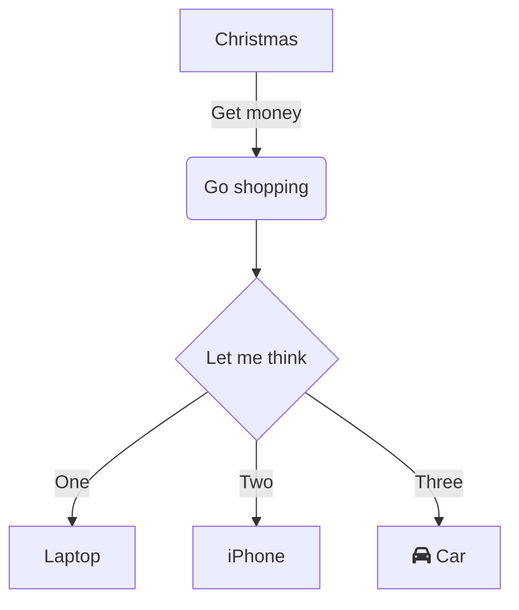

## 流程图

### mermaid flow chart

+ 4种图表方向:{{c1:: `TB` `BT` `RL` `LR` }}
+ 示例：

+ 代码：
  {{c1::
  ```text
  graph TD
      A[Christmas] -->|Get money| B(Go shopping)
      B --> C{Let me think}
      C -->|One| D[Laptop]
      C -->|Two| E[iPhone]
      C -->|Three| F[fa:fa-car Car]
  ```
  }}

### mermaid 流程图:节点定义
+ 示例：
  ```mermaid
  graph TB
  A[文字]
  B(文字)
  C((文字))
  D>文字]
  E{文字}
  ```
+ 代码：{{c1::
  ```
  graph TB
  A[文字]
  B(文字)
  C((文字))
  D>文字]
  E{文字}
  ```
  }}
### mermaid 流程图:节点间的连线（图）

+ 示例：
  ```mermaid
  graph TB
    A1 --> B1
    A2 --- B2
    A3 --test--> B3
    A4 ==> B4
    A5 ==test==> B5
    A6 -.- B6
    A7 -.text.- B8
  ```
+ 代码：{{c1::
  ```text
  graph TB
    A1 --> B1
    A2 --- B2
    A3 --test--> B3
    A4 ==> B4
    A5 ==test==> B5
    A6 -.- B6
    A7 -.text.- B8
  ```
  }}

### mermaid 子流程图
+ 示例：

+ 代码：{{c1::
  ```
  graph TB
      id1(圆角矩形)--普通线-->id2[矩形]
      subgraph 子图表
          id2==粗线==>id3{菱形}
          id3-.虚线.->id4>右向旗帜]
          id3--无箭头---id5((圆形))
      end
  ```
  }}

## 序列图

### mermaid Sequence Diagram

+ 示例：
  ```mermaid
  sequenceDiagram
      Alice->>+John: Hello John, how are you?
      Alice->>+John: John, can you hear me?
      activate John
      John-->>Alice: Hi Alice, I can hear you!
      John-->>Alice: I feel great!
  ```
  
+ 代码：{{c1::
    ```text
  sequenceDiagram
      Alice->>+John: Hello John, how are you?
      Alice->>+John: John, can you hear me?
      John-->>-Alice: Hi Alice, I can hear you!
      John-->>-Alice: I feel great!
  ```
	}}
  


### mermaid 序列图 完整例子

  + 示例：
    ```mermaid
    sequenceDiagram
        participant z as 张三
        participant l as 李四
        loop 日复一日
            z->>l: 吃了吗您呐？
            l-->>z: 吃了，您呢？
            activate z
            Note left of z: 想了一下
            alt 还没吃
                z-xl: 还没呢，正准备回去吃
            else 已经吃了
                z-xl: 我也吃过了，哈哈
            end
            opt 大过年的
                l-->z: 祝您新年好啊
            end
        end
    ```
  + 代码：{{c1::
    ```
      sequenceDiagram
      participant z as 张三
      participant l as 李四
      loop 日复一日
          z->>l: 吃了吗您呐？
          l-->>z: 吃了，您呢？
          activate z
          Note left of z: 想了一下
          alt 还没吃
              z-xl: 还没呢，正准备回去吃
          else 已经吃了
              z-xl: 我也吃过了，哈哈
          end
          opt 大过年的
              l-->z: 祝您新年好啊
          end
      end
    ```
    }}
### mermaid 序列图:标注

+ 语法:{{c1:: `Note 位置表述 参与者: 标注文字1`  }}
+ 其中位置表述可以为:
  | 表述                       | 含义     |
  | -------------------------- | -------- |
  | 右侧                       | {{c1:: right of}} |
  | 左侧                       | {{c1:: left of }} |
  | 在当中，可以横跨多个参与者 | {{c1:: over    }} |

## 类图

### mermaid class Diagram

+ 示例
  ```mermaid
  classDiagram
      Animal <|-- Duck
      Animal <|-- Fish
      Animal <|-- Zebra
      Animal : +int age
      Animal : +String gender
      Animal: +isMammal()
      Animal: +mate()
      
      class Animal{
        +String beakColor
        +swim()
        +quack()
      }
      
      class Duck{
        +String beakColor
        +swim()
        +quack()
      }
      class Fish{
        -int sizeInFeet
        -canEat()
      }
      class Zebra{
        +bool is_wild
        +run()
      }
  ```
+ 代码：{{c1::
  ```text
  classDiagram
      Animal <|-- Duck
      Animal <|-- Fish
      Animal <|-- Zebra
      Animal : +int age
      Animal : +String gender
      Animal: +isMammal()
      Animal: +mate()
      class Duck{
        +String beakColor
        +swim()
        +quack()
      }
      class Fish{
        -int sizeInFeet
        -canEat()
      }
      class Zebra{
        +bool is_wild
        +run()
      }
  ```
  }}

## 状态图

### mermaid State Diagram

+ 示例
  ```mermaid
  stateDiagram
    [*] --> Still
    Still --> [*]
    Still --> Moving
    Moving --> Still
    Moving --> Crash
    Crash --> [*]
            
  ```
  
+ 代码：{{c1::
  ```text
  stateDiagram
    [*] --> Still
    Still --> [*]
    Still --> Moving
    Moving --> Still
    Moving --> Crash
    Crash --> [*]
  ```
  }}

## 饼图

### mermaid pie Chart

+ 示例
  ```mermaid
  pie title Pets adopted by volunteers
    "Dogs" : 386
    "Cats" : 85
    "Rats" : 15
  ```
+ 代码：{{c1::
  ```text
  pie title Pets adopted by volunteers
    "Dogs" : 386
    "Cats" : 85
    "Rats" : 15
  ```
  }}
