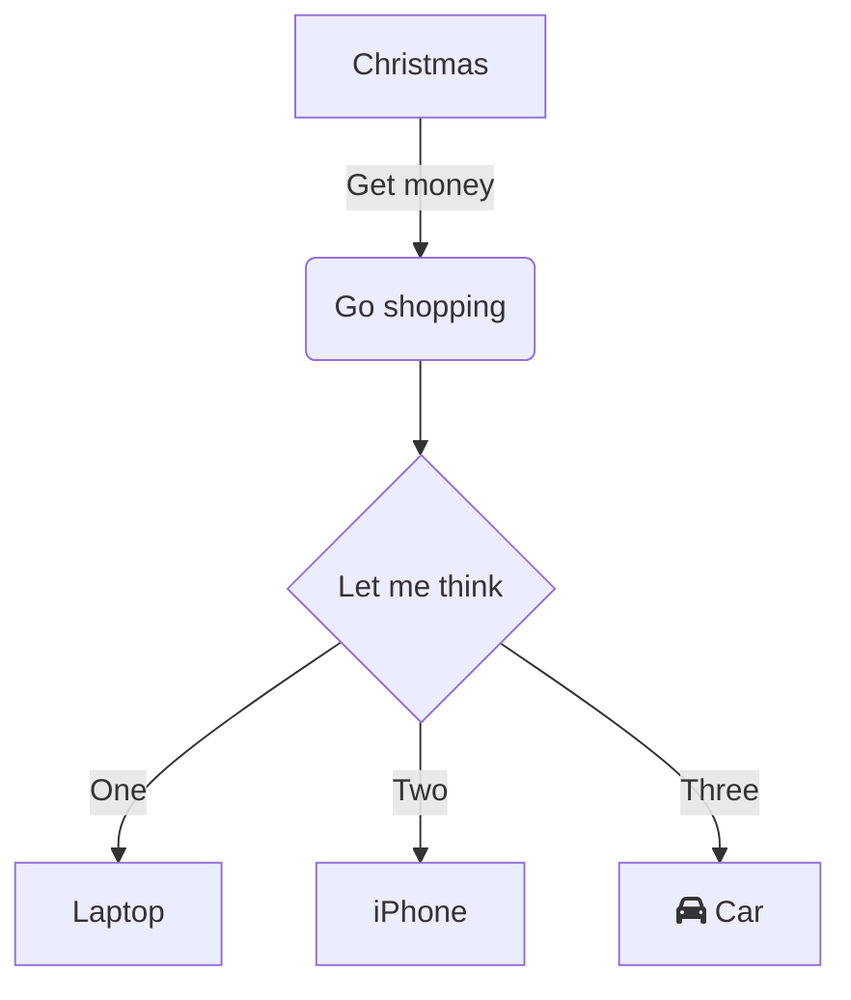
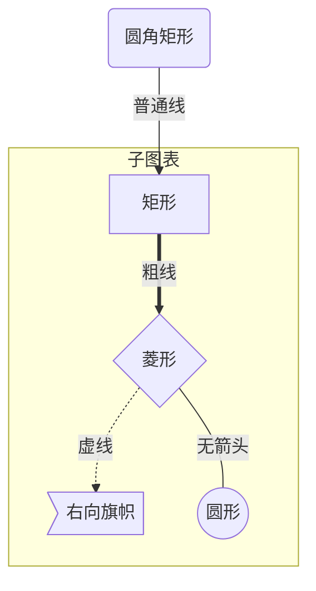

## 流程图 [	](mermaid_20200927095114605)

### mermaid flow chart [	](mermaid_20200927095114608)

+ 4种图表方向:{{c1:: `TB` `BT` `RL` `LR` }}
+ 示例：

+ 代码：
  {{c1::
  ```text
  graph TD
      A[Christmas] -->|Get money| B(Go shopping)
      B --> C{Let me think}
      C -->|One| D[Laptop]
      C -->|Two| E[iPhone]
      C -->|Three| F[fa:fa-car Car]
  ```
  }}

### mermaid 流程图:节点定义 [	](mermaid_20200927095114610)
+ 示例：
  ```mermaid
  graph TB
  A[文字]
  B(文字)
  C((文字))
  D>文字]
  E{文字}
  ```
+ 代码：{{c1::
  ```
  graph TB
  A[文字]
  B(文字)
  C((文字))
  D>文字]
  E{文字}
  ```
  }}
### mermaid 流程图:节点间的连线（图） [	](mermaid_20200927095114612)

+ 示例：
  ```mermaid
  graph TB
    A1 --> B1
    A2 --- B2
    A3 --test--> B3
    A4 ==> B4
    A5 ==test==> B5
    A6 -.- B6
    A7 -.text.- B8
  ```
+ 代码：{{c1::
  ```text
  graph TB
    A1 --> B1
    A2 --- B2
    A3 --test--> B3
    A4 ==> B4
    A5 ==test==> B5
    A6 -.- B6
    A7 -.text.- B8
  ```
  }}

### mermaid 子流程图 [	](mermaid_20200927095114614)
+ 示例：

+ 代码：{{c1::
  ```
  graph TB
      id1(圆角矩形)--普通线-->id2[矩形]
      subgraph 子图表
          id2==粗线==>id3{菱形}
          id3-.虚线.->id4>右向旗帜]
          id3--无箭头---id5((圆形))
      end
  ```
  }}

## 序列图 [	](mermaid_20200927095114616)

### mermaid Sequence Diagram [	](mermaid_20200927095114618)

+ 示例：
  ```mermaid
  sequenceDiagram
      Alice->>+John: Hello John, how are you?
      Alice->>+John: John, can you hear me?
      activate John
      John-->>Alice: Hi Alice, I can hear you!
      John-->>Alice: I feel great!
  ```
  
+ 代码：{{c1::
    ```text
  sequenceDiagram
      Alice->>+John: Hello John, how are you?
      Alice->>+John: John, can you hear me?
      John-->>-Alice: Hi Alice, I can hear you!
      John-->>-Alice: I feel great!
  ```
	}}
  


### mermaid 序列图 完整例子 [	](mermaid_20200927095114620)

  + 示例：
    ```mermaid
    sequenceDiagram
        participant z as 张三
        participant l as 李四
        loop 日复一日
            z->>l: 吃了吗您呐？
            l-->>z: 吃了，您呢？
            activate z
            Note left of z: 想了一下
            alt 还没吃
                z-xl: 还没呢，正准备回去吃
            else 已经吃了
                z-xl: 我也吃过了，哈哈
            end
            opt 大过年的
                l-->z: 祝您新年好啊
            end
        end
    ```
  + 代码：{{c1::
    ```
      sequenceDiagram
      participant z as 张三
      participant l as 李四
      loop 日复一日
          z->>l: 吃了吗您呐？
          l-->>z: 吃了，您呢？
          activate z
          Note left of z: 想了一下
          alt 还没吃
              z-xl: 还没呢，正准备回去吃
          else 已经吃了
              z-xl: 我也吃过了，哈哈
          end
          opt 大过年的
              l-->z: 祝您新年好啊
          end
      end
    ```
    }}
### mermaid 序列图:标注 [	](mermaid_20200927095114622)

+ 语法:{{c1:: `Note 位置表述 参与者: 标注文字1`  }}
+ 其中位置表述可以为:
  | 表述                       | 含义     |
  | -------------------------- | -------- |
  | 右侧                       | {{c1:: right of}} |
  | 左侧                       | {{c1:: left of }} |
  | 在当中，可以横跨多个参与者 | {{c1:: over    }} |

## 类图 [	](mermaid_20200927095114624)

### There are two ways to define a class: [	](mermaid_20201202040742287)

- Explicitly defining a class using keyword **class** like {{c1:: `class Animal` }}. This defines the Animal class
- Define two classes via a **relationship** between them{{c1:: `Vehicle <|-- Car`}}.. This defines two classes Vehicle and Car along with their relationship.

示例：{{c::}}


### There are two ways to define the members of a class [	](mermaid_20201202040742292)

- Associate a member of a class using **:** (colon) followed by member name, useful to define one member at a time. For example:{{c1::` BankAccount : +String owner`}}

- Associate members of a class using **{}** brackets, where members are grouped within curly brackets.  Suitable for defining multiple members at once. For example:

  ```text
  //{{c1::
  class BankAccount{
      +String owner
      +BigDecimal balance
      +deposit(amount) bool
      +withdrawl(amount)
  }
  //}}
  ```

  + note: Optionally you can end the method/function definition with the data type that will be returned

#### Generic Types [	](mermaid_20201202040742294)

+ Members can be defined using generic types, such as `List`, for fields, parameters and return types by enclosing the type within `~` (**tilde**). 

+ for excample:

+  {{c1::}}
  ```
  //{{c1::
  classDiagram
  class Square~Shape~{
      int id
      List~int~ position
      setPoints(List~int~ points)
      getPoints() List~int~
  }
  
  Square : -List~string~ messages
  Square : +setMessages(List~string~ messages)
  Square : +getMessages() List~string~
  //}}
  ```

### To specify the visibility of a class member: [	](mermaid_20201202040742297)
+ Visibility modifier
  - Public:{{c1:: `+` }}
  - Private:{{c1:: `-` }}
  - Protected:{{c1:: `#` }}
  - Package/Internal:{{c1:: `~` }}
+ additional classifiers
  - Abstract: {{c1:: `*` }} e.g.: `someAbstractMethod()*`
  - Static: {{c1:: `$` }} e.g.: `someStaticMethod()$`


### Defining Relationship between classes in mermaid [	](mermaid_20201202040742299)

+ Inheritance : {{c1:: `classB1 --|> classA1 : Inheritance` }}
+ Composition : {{c1:: `classB2 --* classA2 : Composition` }}
+ Aggregation : {{c1:: `classB3 --o classA3 : Aggregation` }}
+ Association : {{c1:: `classB4 --> classA4 : Association` }}
+ Link (Solid) : {{c1:: `classB5 -- classA5 : Link(Solid)` }}
+ Dependency : {{c1:: `classB6 ..> classA6 : Dependency` }}
+ Realization : {{c1:: `classB7 ..|> classA7 : Realization` }}
+ Link (Dashed) : {{c1:: `classB8 .. classA8 : Link(Dashed)` }}
+ 效果：{{c1::
  ```mermaid
  classDiagram
  classB1 --|> classA1 : Inheritance
  classB2 --* classA2 : Composition
  classB3 --o classA3 : Aggregation
  classB4 --> classA4 : Association
  classB5 -- classA5 : Link(Solid)
  classB6 ..> classA6 : Dependency
  classB7 ..|> classA7 : Realization
  classB8 .. classA8 : Link(Dashed)
  ```
  }}
+ 聚合与组合的区别:
  + 组合:{{c1::(Composition)"整体"拥有"部分"的生命 }}
  + 聚合:{{c1::(Aggregation)"整体"有管理"部分"的特有的职责 }}


### Cardinality / Multiplicity on relations [	](mermaid_20201202040742301)

- The different cardinality options are :
  - 0..1` Zero or one
  - `1` Only 1
  - `0..1` Zero or One
  - `1..*` One or more
  - `*` Many
  - `n` n {where n>1}
  - `0..n` zero to n {where n>1}
  - `1..n` one to n {where n>1}
+ 示例:
+ 对应代码:{{c1:: 
  ```
  classDiagram
      Customer "1" --> "*" Ticket
      Student "1" --> "1..*" Course
      Galaxy --> "many" Star : Contains
  ```
  }}

  

### Annotations on classes and Comments [	](mermaid_20201202040742303)
+ To annotate classes,there are two ways:
  + In a separate line after a class is defined. For example:{{c1::
    ```
    classDiagram
    class Shape
    <<interface>> Shape
    ```
    }}
  + In a nested structure along with class definition. For example:{{c1::
    ```
    classDiagram
    class Shape{
        <<interface>>
        noOfVertices
        draw()
    }
    ```
    }}
+ Some common annotations examples could be:
  + {{c1::`<<Interface>>` : To represent an Interface class }}
  + {{c1::`<<abstract>>` : To represent an abstract class }}
  + {{c1::`<<Service>>` : To represent a service class }}
  + {{c1::`<<enumeration>>` : To represent an enum }}
+ Comments:{{c1：： Comments can be entered within a class diagram, which will be ignored by the parser.  Comments need to be on their own line, and must be prefaced with %% (double percent signs).  }}

### Interaction in classDiagram [	](mermaid_20201202040742305)
+ Meaning:{{c1:: It is possible to bind a click event to a node, the click can lead to either a javascript callback or to a link which will be opened in a new browser tab. }}
+ samples:
   1. callback:{{c1:: `callback Shape "callbackFunction" "This is a tooltip for a callback"` }}
   2. link:{{c1:: `link Shape "http://www.github.com" "This is a tooltip for a link"` }}
## 状态图 [	](mermaid_20200927095114628)

### mermaid State Diagram [	](mermaid_20200927095114630)

+ 示例
  ```mermaid
  stateDiagram
    [*] --> Still
    Still --> [*]
    Still --> Moving
    Moving --> Still
    Moving --> Crash
    Crash --> [*]
            
  ```
  
+ 代码：{{c1::
  ```text
  stateDiagram
    [*] --> Still
    Still --> [*]
    Still --> Moving
    Moving --> Still
    Moving --> Crash
    Crash --> [*]
  ```
  }}

## 饼图 [	](mermaid_20200927095114632)

### mermaid pie Chart [	](mermaid_20200927095114634)

+ 示例
  ```mermaid
  pie title Pets adopted by volunteers
    "Dogs" : 386
    "Cats" : 85
    "Rats" : 15
  ```
+ 代码：{{c1::
  ```text
  pie title Pets adopted by volunteers
    "Dogs" : 386
    "Cats" : 85
    "Rats" : 15
  ```
  }}