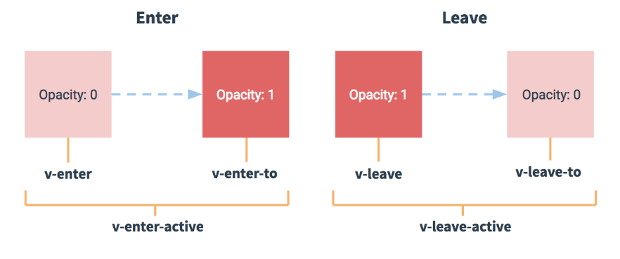
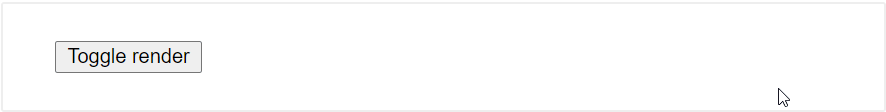
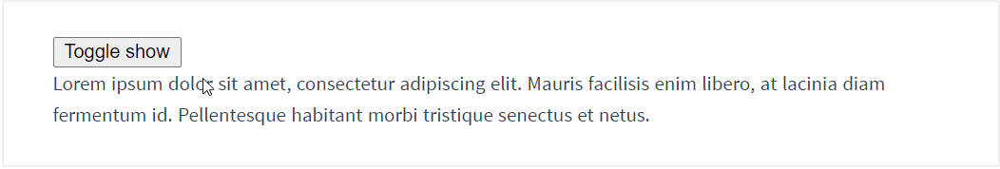
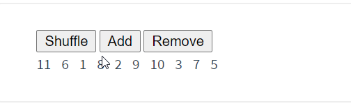

## 基本使用 [	](vue_20200709073019529)

### 声明式绑定,条件与循环 [	](vue_20200703080524558)

+ 绑定元素文本：{{c1::  `{{ message }}` }}
+ 绑定元素attribute指令:{{c1::  `<span v-bind:title="message"></span>` }}
+ 条件绑定指令：{{c1:: `<p v-if="seen">现在你看到我了</p>` }}
+ 循环绑定指令：{{c1:: `v-for="todo in todos"` }}
    + 元素声明:
    ```html
    <!-- {{c1:: -->
        <li v-for="todo in todos">
            {{ todo.text }}
        </li>
    <!-- }} -->
    ```
    + 传入数据:
    ```js
    //{{c1::
    var app4 = new Vue({
        el: '#app-4',
        data: {
            todos: [
            { text: '学习 JavaScript' },
            { text: '学习 Vue' },
            { text: '整个牛项目' }
            ]
        }
    })
    //}} 
    ```

### 常用指令 [	](vue_20200703080524559)

+ `v-on:click`
    + 作用：{{c1:: 指定一个在vue选项对象methods属性中的方法作为监听器 }}
    + 用法：{{c1:: `v-on:click="reverseMessage"` }}
+ `v-model`
    + 作用：{{c1:: 将某个表单对象的值**双向绑定**到指定`data`属性。 }}
    + 用法：{{c1:: `<input v-model="message">` }}
+ `v-once`
    + 作用：执行一次性地插值，当数据改变时，插值处的内容不会更新。
    + 用法：{{c1:: `<span v-once>这个将不会改变: {{ msg }}</span>` }}
+ `v-html`
    + 作用：输出真正的 HTML，`{{ msg }}`会将数据解释为普通文本
    + 用法: `<span v-html="rawHtml"></span>`
+ `v-bind`
    + 作用：{{c1::将`HTML attribute`绑定到**某个**data属性}}
    + 用法: {{c1::`<button v-bind:disabled="isButtonDisabled">Button</button>`}}
        + 注意：{{c1::如果 `isButtonDisabled` 的值是 `null`、`undefined` 或 `false`，则 `disabled` `attribute` 甚至不会被包含在渲染出来的 `<button>` 元素中。}}

### 组件化例子：列表 [	](vue_20200703080524561)

- 自定义组件实现下面效果：
    
- 组件使用：
  ```html
  <!-- {{c1:: -->
      <todo-item
        v-for="item in groceryList"
        v-bind:todo="item"
        v-bind:key="item.id"
      ></todo-item>
  <!-- }} -->
  ```
+ JS定义:
  ```js
  //{{c1::
  Vue.component('todo-item', {
    props: ['todo'],
    template: '<li>{{ todo.text }}</li>'
  })
  
  var app7 = new Vue({
    el: '#app-7',
    data: {
      groceryList: [
        { id: 0, text: '蔬菜' },
        { id: 1, text: '奶酪' },
        { id: 2, text: '随便其它什么人吃的东西' }
      ]
    }
  })
  //}}
  ```

### 生命周期钩子 [	](vue_20200703080524562)

+ created 钩子可以用来在一个实例被创建之后执行代码：
    ```js
    new Vue({
        //{{c1::
        data: {
            a: 1
        },
        created: function () {
            // `this` 指向 vm 实例
            console.log('a is: ' + this.a)
        }
        //}}
    })
    ```
+ 也有一些其它的钩子，在实例生命周期的不同阶段被调用，如 `mounted`、`updated` 和 `destroyed`

## 模板语法 [	](vue_20200703080524563)

### 对于所有的数据绑定，Vue.js 都提供了完全的 JavaScript 表达式支持 [	](vue_20200703080524564)
```js
    //{{c1::
    {{ number + 1 }}
    {{ ok ? 'YES' : 'NO' }}
    {{ message.split('').reverse().join('') }}
    <div v-bind:id="'list-' + id"></div>
    //}}
```

### 指令 [	](vue_20200703080524565)
+ 意义: {{c1:: 指令 (`Directives`) 是带有 `v-` 前缀的特殊 `attribute`。 }}
+ 作用: {{c1:: 当表达式的值改变时，将其产生的连带影响，响应式地作用于 DOM。 }}
+ 参数: {{c1:: 一些指令能够接收一个“参数”，在指令名称之后以冒号表示。`<a v-bind:href="url">...</a>` }}
+ 动态参数:
    + {{c1:: `<a v-bind:[attributeName]="url"> ... </a>`}}
        1. {{c1:: 这里的 attributeName 会被作为一个 JavaScript 表达式进行动态求值，求得的值将会作为最终的参数来使用。}}
        2. {{c1:: 如果你的 Vue 实例有一个 data property attributeName，其值为 "href"，那么这个绑定将等价于 v-bind:href。}}
    + 约束: {{c1:: 某些字符，如空格和引号，放在 HTML attribute 名里是无效的 }}
    + 注意：{{c1:: 直接在一个 HTML 文件里撰写模板时，避免使用大写字符来命名键名 }}
+ 修饰符：{{c1:: `<form v-on:submit.prevent="onSubmit">...</form>` }}

### 指令缩写 [	](vue_20200703080524566)
+ `v-bind` 缩写
    ```html
    <!-- 完整语法 -->
    <a v-bind:href="url">...</a>
    <!-- 缩写 -->
    <!-- {{c1:: -->
    <a :href="url">...</a>
    <!-- }} -->
    <!-- 动态参数的缩写 (2.6.0+) -->
    <!-- {{c1:: -->
    <a :[key]="url"> ... </a>
    <!-- }} -->
    ```
+ `v-on` 缩写
    ```html
    <!-- 完整语法 -->
    <a v-on:click="doSomething">...</a>
    <!-- 缩写 -->
    <!-- {{c1:: -->
    <a @click="doSomething">...</a>
    <!-- }} -->
    <!-- 动态参数的缩写 (2.6.0+) -->
    <!-- {{c1:: -->
    <a @[event]="doSomething"> ... </a>
    <!-- }} -->
    ```
### vue中的计算属性 [	](vue_20200703080524567)
+ 基础例子
    + html对应元素
    ```html
    <div id="example">
        <p>Original message: "{{ message }}"</p>
        <p>Computed reversed message: "{{ reversedMessage }}"</p>
    </div>
    ```
    + 对应的Vue代码
    ```js
    //{{c1::
    var vm = new Vue({
        el: '#example',
        data: {
        message: 'Hello'
        },
        computed: {
        // 计算属性的 getter
        reversedMessage: function () {
            // `this` 指向 vm 实例
            return this.message.split('').reverse().join('')
        }
        }
    })
    //}}
    ```
+ 计算属性缓存 vs 方法
    + {{c1::计算属性是基于它们的响应式依赖进行缓存的。}}
    + {{c1::调用方法将总会再次执行函数。}}

## 计算属性与监听器 [	](vue_20200703080524568)

### 计算属性的 setter [	](vue_20200703080524569)
```js
// ...
computed: {
  fullName: {
    // getter
    get: function () {
      return this.firstName + ' ' + this.lastName
    },
    // setter
    //{{c1::
    set: function (newValue) {
        var names = newValue.split(' ')
      this.firstName = names[0]
      this.lastName = names[names.length - 1]
    }
    //}}
  }
}
// ...
```
+ 现在再运行 vm.fullName = 'John Doe' 时，setter 会被调用，vm.firstName 和 vm.lastName 也会相应地被更新。

### 侦听器：vatch选项 [	](vue_20200703080524570)

```js
var watchExampleVM = new Vue({
  el: '#watch-example',
  data: {
    question: '',
    answer: 'I cannot give you an answer until you ask a question!'
  },
  watch: {
    // 如果 `question` 发生改变，这个函数就会运行
    //{{c1::
    question: function (newQuestion, oldQuestion) {
        this.answer = 'Waiting for you to stop typing...'
    }
    //}}
  })
```

## 绑定HTML Class [	](vue_20200703080524571)

### 绑定HTML Class:对象语法 [	](vue_20200703080524572)

+ 3种`v-bind:class`的调用方式
  1. 基本语法：{{c1:: `<div v-bind:class="{ active: isActive }"></div>`}}
  2. 与已有class属性混合：{{c1:: `<div class="static" v-bind:class="{ active: isActive, 'text-danger': hasError }"></div>`}}
  3. 属性对象：{{c1:: `<div v-bind:class="classObject"></div>`}}

+ 与计算属性结合返回对象
  ```js
        data: {
        isActive: true,
        error: null
        },
        computed: {
            classObject: function () {
                return {
                active: this.isActive && !this.error,
                'text-danger': this.error && this.error.type === 'fatal'
                }
            }
        }
  ```
### 绑定HTML Class:数组语法 [	](vue_20200703080524573)

  + 基本语法：{{c1:: `<div v-bind:class="[activeClass, errorClass]"></div>` }}
  + 使用三元表达式:{{c1:: `<div v-bind:class="[isActive ? activeClass : '', errorClass]"></div>` }}
  + 数组中使用对象：{{c1::  `<div v-bind:class="[{ active: isActive }, errorClass]"></div>` }}

### 绑定HTML Class:组件上的`v-bind:class` [	](vue_20200703080524574)

+ 如果你声明了这个组件：
    ```js
        Vue.component('my-component', {
        template: '<p class="foo bar">Hi</p>'
        })
    ```
+ 对于带数据绑定 class ：
    ```html
    <my-component v-bind:class="{ active: isActive }"></my-component>
    ```
+ 当 isActive 为true时，HTML 将被渲染成为：{{c1:: `<p class="foo bar active">Hi</p>` }}

### 绑定内联样式 [	](vue_20200703080524575)

+ 对象语法：{{c1:: `<div v-bind:style="styleObject"></div>`}}
+ 数组语法：{{c1:: `<div v-bind:style="[baseStyles, overridingStyles]"></div>`}}
+ 自动添加前缀：{{c1:: 当使用类似`transform`的样式时自动添加前缀}}
+ 多重值：{{c1:: `<div :style="{ display: ['-webkit-box', '-ms-flexbox', 'flex'] }"></div>`}}
  + {{c1:: 只会渲染数组中最后一个被浏览器支持的值}}

### 用 key 管理可复用的元素 [	](vue_20200707060718093)

```xml
<!-- {{c1:: -->
<template v-if="loginType === 'username'">
  <label>Username</label>
  <input placeholder="Enter your username" key="username-input">
</template>
<template v-else>
  <label>Email</label>
  <input placeholder="Enter your email address" key="email-input">
</template>
<!-- }} -->
```

### v-if vs v-show [	](vue_20200707060718094)

+ `v-if`:{{c1:: 如果在初始渲染时条件为假，则什么也不做——直到条件第一次变为真时，才会开始渲染条件块。}}
+ `v-show`:{{c1:: 不管初始条件是什么，元素总是会被渲染，并且只是简单地基于 CSS 进行切换。}}

## 列表渲染 [	](vue_20200707060718095)

### `v-for`指令 [	](vue_20200707060718098)

+ 在v-for里遍历数组
  1. {{c1:: `v-for="item in/of items"`  }}
  2. {{c1:: `v-for="(item, index) in items`  }}
+ 在v-for里遍历对象
  ```html
  <!-- {{c1:: -->
  <div v-for="(value, name, index) in object">
    {{ index } }. {{ name } }: {{ value } }
  </div>
  <!-- }} -->
  ```
+ 注意：{{c1:: 为了给 Vue 一个提示，以便它能跟踪每个节点的身份，建议尽可能在使用 v-for 时提供 key attribute }}
+ 不推荐在同一元素上使用 v-if 和 v-for:{{c1:: 当它们处于同一节点，`v-for` 的优先级比 `v-if` 更高}}

### Vue.js 为 `v-on` 提供了事件修饰符: [	](vue_20200707060718099)

+ `.stop`:{{c1:: 阻止冒泡 }}
+ `.prevent`:{{c1:: 拦截默认事件 }}
+ `.capture`:{{c1:: 捕获冒泡 }}
+ `.self`:{{c1:: 将事件绑定到自身，只有自身才能触发，通常用于避免冒泡事件的影响 }}
+ `.once`:{{c1:: 设置事件只能触发一次，比如按钮的点击等。 }}
+ `.passive`:{{c1:: 不拦截默认事件 }}
+ 例子:{{c1::
  ```xml
    <!-- 添加事件监听器时使用事件捕获模式 -->
    <!-- 即内部元素触发的事件先在此处理，然后才交由内部元素进行处理 -->
    <div v-on:click.capture="doThis">...</div>
  ```
  }}

### `v-on`按键修饰符 [	](vue_20200707060718100)

```xml
<!-- 只有在 `key` 是 `Enter` 时调用 `vm.submit()` -->
<!-- {{c1:: -->
<input v-on:keyup.enter="submit">
<!-- }} -->
<!-- key 等于 PageDown 时被调用onPageDown。 -->
<!-- {{c1:: -->
<input v-on:keyup.page-down="onPageDown">
<!-- }} -->
<!-- Alt + C -->
<!-- {{c1:: -->
<input v-on:keyup.alt.67="clear">
<!-- }} -->
<!-- Ctrl + Click -->
<!-- {{c1:: -->
<div v-on:click.ctrl="doSomething">Do something</div>
<!-- }} -->
```

### `.exact` 修饰符 [	](vue_20200707060718101)

```html
<!-- 即使 Alt 或 Shift 被一同按下时也会触发 -->
<!-- {{c1:: -->
<button v-on:click.ctrl="onClick">A</button>
<!-- }} -->
<!-- 有且只有 Ctrl 被按下的时候才触发 -->
<!-- {{c1:: -->
<button v-on:click.ctrl.exact="onCtrlClick">A</button>
<!-- }} -->
<!-- 没有任何系统修饰符被按下的时候才触发 -->
<!-- {{c1:: -->
<button v-on:click.exact="onClick">A</button>
<!-- }} -->
```


### v-model 在内部为不同的输入元素使用不同的 property 并抛出不同的事件： [	](vue_20200707060718102)

+ `text` 和 `textarea` 元素:{{c1:: 使用 value property 和 input 事件； }}
+ `checkbox` 和 radio:{{c1::  使用 checked property 和 change 事件； }}
  + 单个复选框，绑定到布尔值,多个复选框，绑定到同一个数组
+ `select`:{{c1::  字段将 value 作为 prop 并将 change 作为事件。 }}

### `v-model`修饰符 [	](vue_20200707060718103)

+ 转为在 change 事件之后进行同步：{{c1:: `<input v-model.lazy="msg">`  }}
+ 自动将用户的输入值转为数值类型:{{c1:: `<input v-model.number="age" type="number">`  }}
+ 自动过滤用户输入的首尾空白字符:{{c1:: `<input v-model.trim="msg">`  }}

### `v-model`把值绑定到 Vue 实例的一个动态 property [	](vue_20200707060718104)

```html

<input
  type="checkbox"
  v-model="toggle"
  true-value="yes"
  false-value="no"
>

<select v-model="selected">
  <option v-bind:value="{ number: 123 }">123</option>
</select>
<!-- {{c1:: -->
<script>
// 当选中时
vm.toggle === 'yes'
// 当没有选中时
vm.toggle === 'no'
// 当选中时
typeof vm.selected // => 'object'
vm.selected.number // => 123
<!-- }} -->
</script>
```

### 组件基础 [	](vue_20200707060718105)

### 监听子组件事件 [	](vue_20200707060718106)

+ 父级组件可以像处理 native DOM 事件一样通过 v-on 监听子组件实例的任意事件：
  ```xml
  <!-- {{c1:: -->
  <blog-post
    ...
    v-on:enlarge-text="postFontSize += 0.1"
  ></blog-post>
  <!-- }} -->
  ```
+ 子组件可以通过调用内建的 $emit 方法并传入事件名称来触发一个事件
  ```xml
  <!-- {{c1:: -->
  <!-- 这里的button可能是在父组件的template中定义的 -->
  <button v-on:click="$emit('enlarge-text')">
    Enlarge text
  </button>
  <!-- }} -->
  ```

### 使用子组件事件抛出一个值 [	](vue_20200707060718107)

+ 这时可以使用 $emit 的第二个参数来提供这个值：
  ```xml
  <!-- {{c1:: -->
  <button v-on:click="$emit('enlarge-text', 0.1)">
    Enlarge text
  </button>
  <!-- }} -->
  ```
+ 那么这个值将会作为第一个参数对应的绑定方法：
  ```js
  <blog-post
    ...
    v-on:enlarge-text="onEnlargeText"
  ></blog-post>
  
  //{{c1::
  methods: {
    onEnlargeText: function (enlargeAmount) {
      this.postFontSize += enlargeAmount
    }
  }
  //}}
  ```

### 在组件上使用 `v-model` [	](vue_20200707060718108)

+ 自定义事件也可以用于创建支持 `v-model` 的自定义输入组件。记住：
  ```html
  <input v-model="searchText">
  ```
+ 等价于：
  ```html
  <!-- {{c1:: -->
  <input
    v-bind:value="searchText"
    v-on:input="searchText = $event.target.value"
  >
  <!-- }} -->
  ```
+ 当用在组件上时，`v-model` 则会这样：
  ```html
  <!-- {{c1:: -->
  <custom-input
    v-bind:value="searchText"
    v-on:input="searchText = $event"
  ></custom-input>
  <!-- }} -->
  ```
+ 为了让它正常工作，这个组件内的 `<input>` 必须：
  - {{c1:: 将其 `value` attribute 绑定到一个名叫 `value` 的 prop 上 }}
  - {{c1:: 在其 `input` 事件被触发时，将新的值通过自定义的 `input` 事件抛出 }}
+ 写成组件代码之后是这样的：
  ```js
  //{{c1::
  Vue.component('custom-input', {
    props: ['value'],
    template: `
      <input
        v-bind:value="value"
        v-on:input="$emit('input', $event.target.value)">
    `
  })
  //}}
  ```
+ 现在 `v-model` 就应该可以在这个组件上完美地工作起来了：
  ```html
  <custom-input v-model="searchText"></custom-input>
  ```

### 动态组件 [	](vue_20200707060718109)

+ 动态组件的使用
  ```xml
  <!-- {{c1:: -->
  <component v-bind:is="currentTabComponent"></component>
  <!-- }} -->
  ```
+ 在上述示例中，currentTabComponent 可以包括
  + {{c1:: 已注册组件的名字，或 }}
  + {{c1:: 一个组件的选项对象 }}


### 特殊的 is attribute [	](vue_20200707060718110)

+ `is attribute`的使用：
  ```xml
  <!-- {{c1:: -->
  <table>
    <tr is="blog-post-row"></tr>
  </table>
  <!-- }} -->
  ```
+ 是为了解决HTML：
  ```xml
  <!-- {{c1:: -->
  <table>
    <!-- HTML会导致解析错误 -->
    <blog-post-row></blog-post-row>
  </table>
  <!-- }} -->
  ```

## 深入了解组件 [	](vue_20200707060718111)

### 组件注册 [	](vue_20200707060718113)

- 组件名
  - 使用 kebab-case (建议)：{{c1:: `Vue.component('my-component-name', { /* ... */ })`}}
  - 使用 PascalCase：{{c1:: `Vue.component('MyComponentName', { /* ... */ })`}}
- 全局注册
  ```js
  // {{c1::
  Vue.component('my-component-name', {
    // ... 选项 ...
  })
  // }}
  ```
- 局部注册
  - 通过一个普通的 JavaScript 对象来定义组件：
    ```js
    //{{c1::
    var ComponentA = { /* ... */ }
    var ComponentB = { /* ... */ }
    var ComponentC = { /* ... */ }
    //}}
    ```
  - 然后在 `components` 选项中定义你想要使用的组件：
    ```js
    //{{c1::
    new Vue({
      el: '#app',
      components: {
        'component-a': ComponentA,
        'component-b': ComponentB
      }
    })
    //}}
    ```
  - 局部注册的组件在其子组件中不可用，如果你希望 `ComponentA` 在 `ComponentB` 中可用，则你需要这样写：
    ```js
    //{{c1::
    var ComponentA = { /* ... */ }
    var ComponentB = {
      components: {
        'component-a': ComponentA
      },
      // ...
    }
    //}}
    ```

### 组件 Prop 的大小写注意点： [	](vue_20200707060718114)

+ js中:
  ```js
  Vue.component('blog-post', {
    // 在 JavaScript 中是 camelCase 的
    props: ['postTitle'],
    template: '<h3>{{ postTitle }}</h3>'
  })
  ```
+ html中:
  ```html
  <!-- 在 HTML 中是 kebab-case 的 -->
  <!-- {{c1:: -->
  <blog-post post-title="hello!"></blog-post>
  <!-- }} -->
  ```

### 组件Prop的类型 [	](vue_20200707060718115)

+ 数组形式：没有指定类型
  ```js
  //{{c1::
    props: ['title', 'likes', 'isPublished', 'commentIds', 'author']
  //}}
  ```
+ 对象形式：对应的值就是类型
  ```js
  //{{c1::
    props: {
      title: String,
      likes: Number,
      isPublished: Boolean,
      commentIds: Array,
      author: Object,
      callback: Function,
      contactsPromise: Promise // or any other constructor
    }
  //}}
  ```

### 传递静态或动态Prop [	](vue_20200707060718116)

```html
<!-- 传入一个静态的值 -->
<!-- {{c1:: -->
<blog-post title="My journey with Vue"></blog-post>
<!-- }} -->
<!-- 动态赋予一个变量的值 -->
<!-- {{c1:: -->
<blog-post v-bind:title="post.title"></blog-post>
<!-- }} -->
<!-- 动态赋予一个复杂表达式的值 -->
<!-- {{c1:: -->
<blog-post
  v-bind:title="post.title + ' by ' + post.author.name"
></blog-post>
<!-- }} -->
```

### 组件的Prop 验证 [	](vue_20200707060718117)

```js
Vue.component('my-component', {
  props: {
    // 基础的类型检查 (`null` 和 `undefined` 会通过任何类型验证)
    //{{c1::
    //}}
    propA: Number,
    // 多个可能的类型
    //{{c1::
    propB: [String, Number],
    //}}
    // 必填的字符串
    //{{c1::
    propC: {
      type: String,
      required: true
    },
    //}}
    // 带有默认值的数字
    //{{c1::
    propD: {
      type: Number,
      default: 100
    },
    //}}
    // 带有默认值的对象
    //{{c1::
    propE: {
      type: Object,
      // 对象或数组默认值必须从一个工厂函数获取
      default: function () {
        return { message: 'hello' }
      }
    },
    //}}
    // 自定义验证函数
    //{{c1::
    propF: {
      validator: function (value) {
        // 这个值必须匹配下列字符串中的一个
        return ['success', 'warning', 'danger'].indexOf(value) !== -1
      }
    }
    //}}
  }
})
```
+ type 可以是原生构造函数中的一个`String` `Number` `Boolean` `Array` `Object` `Date` `Function` `Symbol` 
+ type 还可以是一个自定义的构造函数，并且通过 instanceof 来进行检查确认
  ```js
    Vue.component('blog-post', {
      props: {
        //验证 author prop 的值是否是通过 new Person 创建的。
        //{{c1::
        author: Person
        //}}
      }
    })
  ```

### 禁用 Attribute 继承 [	](vue_20200707060718118)

```js
//{{c1::
Vue.component('my-component', {
  inheritAttrs: false,
  // ...
})
//}}
```

## 自定义事件 [	](vue_20200708060208394)

### 自定义组件的 v-model [	](vue_20200708060208396)

+ 一个组件上的 v-model 默认会利用:{{c1:: 名为 **value 的 prop** 和名为 **input 的事件** }}
+ model 选项可以自定prop与事件：
  ```js
  Vue.component('base-checkbox', {
    // model 选项可以自定prop与事件
    //{{c1::
    model: {
      prop: 'checked',
      event: 'change'
    },
    //}}
    props: {
      checked: Boolean
    },
    template: `
    <input
    type="checkbox"
    v-bind:checked="checked"
    v-on:change="$emit('change', $event.target.checked)"
    >
    `
  })
<base-checkbox v-model="lovingVue"></base-checkbox>
  ```

### 将组件根元素下子元素中原生事件绑定到组件 [	](vue_20200708060208397)

```js
Vue.component('base-input', {
  inheritAttrs: false,
  props: ['label', 'value'],
  computed: {
    // 将原生事件绑定到组件,下面是主要代码
    // {{c1::
    inputListeners: function () {
      var vm = this
      // `Object.assign` 将所有的对象合并为一个新对象
      return Object.assign({},
        // 我们从父级添加所有的监听器
        this.$listeners,
        // 然后我们添加自定义监听器，
        // 或覆写一些监听器的行为
        {
          // 这里确保组件配合 `v-model` 的工作
          input: function (event) {
            vm.$emit('input', event.target.value)
          }
        }
      )
    }
    //}}
  },
  template: `
    <label>
      {{ label }}
      <input
        v-bind="$attrs"
        v-bind:value="value"
        v-on="inputListeners"
      >
    </label>
  `
})
```

### `v-bind`指令中`.sync `修饰符 [	](vue_20200708060208398)

+ 主要作用：实现双向绑定，子组件修改父组件中的值。
  
+ 在一个包含 `title` prop 的假设的组件中，我们可以用以下方法表达对其赋新值的意图：
  
  ```js
  //{{c1::
  this.$emit('update:title', newTitle)
  //}}
  ```
  
+ 然后父组件可以监听那个事件并根据需要更新一个本地的数据 property。例如：
  ```xml
  <!-- {{c1:: -->
  <text-document
    v-bind:title="doc.title"
    v-on:update:title="doc.title = $event"
  ></text-document>
  <!-- }} -->
  ```
  
+ 为了方便起见，我们为这种模式提供一个缩写，即 `.sync` 修饰符：
  ```xml
  <!-- {{c1:: -->
  <text-document v-bind:title.sync="doc.title"></text-document>
  <!-- }} -->
  ```
  
+ 当我们用一个对象同时设置多个 prop 的时候，也可以将这个 `.sync` 修饰符和 `v-bind` 配合使用：
  ```xml
  <!-- {{c1:: -->
  <text-document v-bind.sync="doc"></text-document>
  <!-- }} -->
  ```

## 插槽 [	](vue_20200708060247087)

### 插槽 [	](vue_20200708060208399)

+ 编译作用域:{{c1:: **父级模板里的所有内容都是在父级作用域中编译的；子模板里的所有内容都是在子作用域中编译的。**}}
+ 插槽后备内容:
  ```html
  <!-- {{c1:: -->
    <button type="submit">
      <!-- 如果没有插槽内容就使用如下 -->
     <slot>Submit</slot>
    </button>
  <!-- }} -->
  ```

### 具名插槽 [	](vue_20200708060208400)

+ 具名插槽的模板定义
```xml
<!-- {{c1:: -->
  <div class="container">
    <header>
      <slot name="header"></slot>
    </header>
    <main>
      <slot></slot>
    </main>
    <footer>
      <slot name="footer"></slot>
    </footer>
  </div>
<!-- }} -->
```
+ 具名插槽调用
```html
<!-- {{c1:: -->
  <base-layout>
    <template v-slot:header>
      <h1>Here might be a page title</h1>
    </template>
    <p>A paragraph for the main content.</p>
    <p>And another one.</p>
    <template v-slot:footer>
      <p>Here's some contact info</p>
    </template>
  </base-layout>
<!-- }} -->
```

### 作用域插槽 [	](vue_20200708060208401)

+ 模板中使用作用域插槽声明：
  ```xml
    <!-- {{c1:: -->
    <span>
      <!-- 注意这里传入的user值，如果没有这里的值，组件插槽模板中将访问不到user对象 -->
      <slot v-bind:user="user">
        {{ user.lastName }}
      </slot>
    </span>
    <!-- }} -->
  ```
+ 插槽prop调用：
  ```xml
    <!-- {{c1:: -->
    <current-user>
      // 将包含所有插槽 prop 的对象命名为 slotProps
      <template v-slot:default="slotProps">
        {{ slotProps.user.firstName }}
      </template>
    </current-user>
    <!-- }} -->~
  ```

### 独占默认插槽的缩写语法 [	](vue_20200708060208402)

+ 不带参数的 `v-slot` 被假定对应默认插槽：
  ```xml
  <!-- {{c1:: -->
  <!-- <current-user v-slot:default="slotProps"> -->
  <current-user v-slot:default="slotProps">
    {{ slotProps.user.firstName }}
  </current-user>
  <!-- }} -->
  ```
+ 只要出现多个插槽，{{c1:: **必须使用完整的基于 `<template>` 的语法** }}
+ 解构插槽 Prop
  ```xml
    <!-- {{c1:: -->
  	<!-- 解构赋值，这里可以缩小范围不用接收整个对象 -->
    <current-user v-slot="{ user: person }">
      {{ person.firstName }}
    </current-user>
    <!-- }} -->
    <!-- 你甚至可以定义后备内容，用于插槽 prop 是 undefined 的情形： -->
    <!-- {{c1:: -->
    <current-user v-slot="{ user = { firstName: 'Guest' } }">
      {{ user.firstName }}
    </current-user>
    <!-- }} -->
  ```
+ 动态插槽名:
  ```xml
    <!-- {{c1:: -->
    <base-layout>
      <template v-slot:[dynamicSlotName]>
        ...
      </template>
    </base-layout>
    <!-- }} -->
  ```
+ 具名插槽的缩写:例如 v-slot:header 可以被重写为 {{c1:: `#header` }}
  
  + 解构赋值版： {{c1::`#default="{ user }"`}}

### `<keep-alive>`的使用 [	](vue_20200709073019531)

+ 作用：{{c1:: 包裹动态组件时，会缓存不活动的组件实例，而不是销毁它们。 }}
+ 示例代码：
  ```xml
  <!-- 失活的组件将会被缓存！-->
  <!-- {{c1:: -->
  <keep-alive>
    <component v-bind:is="currentTabComponent"></component>
  </keep-alive>
  <!-- }} -->
  ```

### vue引入异步组件 [	](vue_20200709073019533)

+ `setTimeout`模拟异步组件简单例子
  ```js
    //{{c1:: 
    Vue.component('async-example', function (resolve, reject) {
      setTimeout(function () {
        // 向 `resolve` 回调传递组件定义
        resolve({
          template: '<div>I am async!</div>'
        })
      }, 1000)
    })
    //}}
  ```
+ 返回一个 Promise
  ```js
    //{{c1:: 
    Vue.component(
      'async-webpack-example',
      // 这个动态导入会返回一个 `Promise` 对象。
      () => import('./my-async-component')
    )
    //}}
  ```
+ 局部注册：
  ```js
    //{{c1:: 
    new Vue({
      // ...
      components: {
        'my-component': () => import('./my-async-component')
      }
    })
    //}}
  ```
+ 自定义异步组件工厂函数:
  ```js
    const AsyncComponent = () => ({
    // 需要加载的组件 (应该是一个 `Promise` 对象)
    //{{c1::
    component: import('./MyComponent.vue'),
    //}}
    // 异步组件加载时使用的组件
    //{{c1::
    loading: LoadingComponent,
    //}}
    // 加载失败时使用的组件
    //{{c1::
    error: ErrorComponent,
    //}}
    // 展示加载时组件的延时时间。默认值是 200 (毫秒)
    //{{c1::
    delay: 200,
    //}}
    // 如果提供了超时时间且组件加载也超时了，
    // 则使用加载失败时使用的组件。默认值是：`Infinity`
    //{{c1::
    timeout: 3000
    //}}
  })
  ```

## 处理边界情况 [	](vue_20200709073019535)

### 访问元素 & 组件 [	](vue_20200709073019537)

+ 访问根实例:{{c1:: 在每个 `new Vue` 实例的子组件中，其根实例可以通过 `$root.property `进行访问 }}
+ 访问父级组件实例:{{c1:: `$parent property` 可以用来从一个子组件访问父组件的实例。它提供了一种机会，可以在后期随时触达父级组件，以替代将数据以 prop 的方式传入子组件的方式。 }}
+ 访问子组件实例或子元素:{{c1:: `<base-input ref="usernameInput"></base-input>` }}
  + 在父组件中调用：{{c1:: `this.$refs.usernameInput` }}


### vue组件:依赖注入 [	](vue_20200709073019539)
+ provide 选项允许我们指定我们想要提供给后代组件的数据/方法。
  ```js
  //{{c1::
  provide: function () {
    return {
      getMap: this.getMap
    }
  }
  //}}
  ```
+ 然后在任何后代组件里使用inject 选项接收：
  ```js
  //{{c1::
  inject: ['getMap']
  //}}
  ```

### 程序化的事件侦听器 [	](vue_20200709073019541)

+ 现在，你已经知道了 `$emit` 的用法，它可以被 `v-on` 侦听，但是 Vue 实例同时在其事件接口中提供了其它的方法。我们可以：
  + 通过 {{c1::`$on(eventName, eventHandler)`}} 侦听一个事件
  + 通过 {{c1::`$once(eventName, eventHandler)`}} 一次性侦听一个事件
  + 通过 {{c1::`$off(eventName, eventHandler)`}} 停止侦听一个事件

### 组件：循环引用 [	](vue_20200709073019543)
+ 当你使用 `Vue.component` 全局注册一个组件时，这个全局的 ID 会自动设置为该组件的{{c1:: `name` 选项}}


### 模板定义的替代品 [	](vue_20200709073019544)

+ 内联模板例子:
  ```html
  <!-- {{c1:: -->
  <div id="x">
    <my-component inline-template>
        <div>
            <p>{{message}}</p>
        </div>
    </my-component>
  <div>
  <script>
    var vm=new Vue({
      el:'#x'
      data:{
        message:'hello'
      }
      components:{
          'my-component':{
              props:["message"]
          }
      }
    })
  </script>
  <!-- }} -->
  ```
+ X-Template
  + 定义：
  ```html
  <!-- {{c1:: -->
  <script type="text/x-template" id="hello-world-template">
     <p>Hello hello hello</p>
  </script>
  <!-- }} -->
  ```
  + 引用：
  ```js
  //{{c1::
  Vue.component('hello-world', {
    template: '#hello-world-template'
  })
  //}}
  ```
## 动画 [	](vue_20200713065313204)

### 单元素/组件的过渡例子 [	](vue_20200709073019546)

```xml
<div id="demo">
  <button v-on:click="show = !show">
    Toggle
  </button>
  <!-- {{c1:: -->
  <transition name="fade">
    <p v-if="show">hello</p>
  </transition>
  <!-- }} -->
</div>
```

### 过渡的6个类名的关系 [	](vue_20200709073019548)

+ 过渡类的关系图：{{c1::
  }}
+ 过渡的类名：{{c1:: 对于这些在过渡中切换的类名来说，如果你使用一个没有名字的 `<transition>`，则 `v-` 是这些类名的默认前缀。}}

### VUE实现简单CSS过渡 [	](vue_20200709073019550)

+ 效果： 

+ css样式代码：

  ```css
  /* {{c1:: */
  .slide-fade-enter-active {
    transition: all .3s ease;
  }
  .slide-fade-leave-active {
    transition: all .8s cubic-bezier(1.0, 0.5, 0.8, 1.0);
  }
  .slide-fade-enter, .slide-fade-leave-to{
    transform: translateX(10px);
    opacity: 0;
  }
  /* }} */ 
  ```

### VUE实现简单CSS动画 [	](vue_20200709073019552)

+ 效果
+ css样式代码：
  ```css
  /* {{c1:: */
  .bounce-enter-active {
    animation: bounce-in .5s;
  }
  .bounce-leave-active {
    animation: bounce-in .5s reverse;
  }
  @keyframes bounce-in {
    0% {
      transform: scale(0);
    }
    50% {
      transform: scale(1.5);
    }
    100% {
      transform: scale(1);
    }
  }
  /* }} */
  ```

### 自定义过渡的类名 [	](vue_20200709073019554)

1. `v-enter`的自定义类名：{{c1:: `enter-class` }}
2. `v-enter-active`的自定义类名：{{c1:: `enter-active-class` }}
3. `v-enter-to`的自定义类名：{{c1:: `enter-to-class`  }}
4. `v-leave`的自定义类名：{{c1:: `leave-class` }}
5. `v-leave-active`的自定义类名：{{c1:: `leave-active-class` }}
6. `v-leave-to`的自定义类名：{{c1:: `leave-to-class` }}

### 显性的过渡持续时间 [	](vue_20200713065313206)

- 在这种情况下你可以用 `<transition>` 组件上的 `duration` prop 定制一个显性的过渡持续时间 (以毫秒计)：
  ```xml
  <!-- {{c1:: -->
  <transition :duration="1000">...</transition>
  <!-- }} -->
  ```
- 你也可以定制进入和移出的持续时间：
  ```xml
  <!-- {{c1:: -->
  <transition :duration="{ enter: 500, leave: 800 }">...</transition>
  <!-- }} -->
  ```

### VUE过渡：`<transition>`的attribute 中声明 JavaScript 钩子 [	](vue_20200713065313208)

```xml
<!-- {{c1:: -->
<transition
  v-on:before-enter="beforeEnter"
  v-on:enter="enter"
  v-on:after-enter="afterEnter"
  v-on:enter-cancelled="enterCancelled"
  v-on:before-leave="beforeLeave"
  v-on:leave="leave"
  v-on:after-leave="afterLeave"
  v-on:leave-cancelled="leaveCancelled"
>
</transition>
<!-- }} -->

<script>
...
methods: {
  // --------
  // 进入中
  // --------
  beforeEnter: function (el) {
    // ...
  },
  // ...
</script>
```

### 多个元素的过渡

+ 多个元素过渡代码
  ```js
  <transition>
    <button v-if="docState === 'saved'" key="saved">
      Edit
    </button>
    <button v-if="docState === 'edited'" key="edited">
      Save
    </button>
    <button v-if="docState === 'editing'" key="editing">
      Cancel
    </button>
  </transition>
  ```
  + 可以重写为：
    ```js
    //{{c1::
    <transition>
      <button v-bind:key="docState">
        {{ buttonMessage }}
      </button>
    </transition>
    // ...
    computed: {
      buttonMessage: function () {
        switch (this.docState) {
          case 'saved': return 'Edit'
          case 'edited': return 'Save'
          case 'editing': return 'Cancel'
        }
      }
    }
    //}}
    ```
+ 多组件过渡：
  ```xml
  <!-- {{c1:: -->
  <transition name="component-fade" mode="out-in">
    <component v-bind:is="view"></component>
  </transition>
  <!-- }} -->
  ```
+ 注意：给在 `<transition> `组件中的多个元素设置 key 是一个更好的实践。
+ Vue 提供了过渡模式
  + in-out：{{c1:: 新元素先进行过渡，完成之后当前元素过渡离开。  }}
  + out-in：{{c1:: 当前元素先进行过渡，完成之后新元素过渡进入。 }}

### 列表过渡

+ 效果：
+ html代码：
  ```html
  <!-- {{c1:: -->
  <transition-group name="list-complete" tag="p">
    <span
      v-for="item in items"
      v-bind:key="item"
      class="list-complete-item"
    >
      {{ item }}
    </span>
  </transition-group>
  <!-- }} -->
  ```
+ CSS代码:
  ```css
    /** {{c1:: */
    .list-complete-item {
      transition: all 1s;
      display: inline-block;
      margin-right: 10px;
    }
    .list-complete-enter, .list-complete-leave-to {
      opacity: 0;
      transform: translateY(30px);
    }
    .list-complete-leave-active {
      position: absolute;
    }
    /** }} */
  ```
+ 注意:{{c1:: 使用 FLIP 过渡的元素不能设置为 display: `inline` 。作为替代方案，可以设置为 `display: inline-block` 或者放置于 `flex` 中 }}


### vue对象的混入
```js
// 定义一个混入对象
// {{c1::
var myMixin = {
  created: function () {
    this.hello()
  },
  methods: {
    hello: function () {
      console.log('hello from mixin!')
    }
  }
}
//}}

// 定义一个使用混入对象的组件
// {{c1::
var Component = Vue.extend({
  mixins: [myMixin]
})
var component = new Component() // => "hello from mixin!
//}}
```
### 


### 当组件和混入对象含有同名选项时的合并策略

+ 数据对象：{{c1::在内部会进行递归合并，并在发生冲突时以组件数据优先。}}
+ 同名钩子函数：{{c1::将合并为一个数组，因此都将被调用，混入对象钩子先被调用}}
+ 值为对象的选项：{{c1::methods、components 和 directives，将被合并为同一个对象。两个对象键名冲突时，取组件对象的键值对。}}
+ 自定义选项合并策略：
  ```js 
    //{{c1::
    Vue.config.optionMergeStrategies.myOption = function (toVal, fromVal) {
      // 返回合并后的值
    }
    //}}
  ```
### 混入方式
+ `vue`实例混入：
  ```js
    //{{c1::
    var vm = new Vue({
      mixins:[mixin]
      //..
    })
    //}}
  ```
+ `Vue.extend()`混入：
  ```js
    // 定义一个使用混入对象的组件
    //{{c1::
    var Component = Vue.extend({
      mixins: [myMixin]
    })
    //}}
  ```
+ 全局混入：
  ```js
  Vue.mixin({
    created: function () {
      var myOption = this.$options.myOption
      if (myOption) {
        console.log(myOption)
      }
    }
  })
  ```


# 黑马内容 [	](vue_20200713065313210)

## 前后端交互 [	](vue_20200713065313212)

### Jquery Ajax API简单调用 [	](vue_20200713065313214)

```js
// {{c1::
  $.ajax({
    url: 'http://localhost:3000/data',
    success: function(data) {
      console.log(data)
    }
  });
// }}
```

## vue路由 [	](vue_20200713065313216)

### 模拟路由 [	](vue_20200713065313218)
```html
    <!-- 被 vue 实例控制的 div 区域 -->
      <!-- {{c1:: -->
    <div id="app">
      <a href="#/zhuye">主页</a> 
      <a href="#/keji">科技</a> 
      <a href="#/caijing">财经</a>
      <a href="#/yule">娱乐</a>
      <component :is="comName"></component>
    </div>
      <!-- }} -->

    <script>
      // #region vue 实例对象
      const vm = new Vue({
        el: '#app',
        data: {
          comName: 'zhuye'
        },
        // 注册私有组件
        components: {
          zhuye,keji,caijing,yule
        }
      })
      // 监听 window 的 onhashchange 事件，根据获取到的最新的 hash 值，切换要显示的组件的名称
        //{{c1::
      window.onhashchange = function() {
        // 通过 location.hash 获取到最新的 hash 值
        console.log(location.hash);
        switch(location.hash.slice(1)){
          case '/zhuye':
            vm.comName = 'zhuye'
          break
          case '/keji':
            vm.comName = 'keji'
          break
          case '/caijing':
            vm.comName = 'caijing'
          break
          case '/yule':
            vm.comName = 'yule'
          break
        }
      }
      //}}
    </script>
```

### vue-router的基本使用 [	](vue_20200713065313220)
1. 创建路由实例对象，定义路由规则:
    ```js
    //{{c1::
    const router = new VueRouter({
      routes: [
        { path: '/user', component: User },
        { path: '/register', component: Register }
      ]
    })
    //}}
    ```
2. 挂载到vue实例:
   ```js
    //{{c1::
   const vm = new Vue({
     el: '#app',
     data: {},
     // router: router
     router
   })
    //}}
   ```
3. 定义路由链接与占位符:
   ```html
    <!-- {{c1:: -->
   <div id="app">
     <router-link to="/user">User</router-link>
     <router-link to="/register">Register</router-link>
     <router-view></router-view>
   </div>
    <!-- }} -->
   ```

### 路由重定向 [	](vue_20200713065313222)
```js
    //{{c1::
      const router = new VueRouter({
        routes: [
          { path: '/', redirect: '/user'},
          { path: '/user', component: User },
          { path: '/register', component: Register }
        ]
      }) 
    //}}
```

### 路由嵌套 [	](vue_20200713065313224)
+ 嵌套路由的定义:
  ```js
    const router = new VueRouter({
      routes: [
        { path: '/', redirect: '/user'},
        { path: '/user', component: User },
        //嵌套路由
        //{{c1::
        { path: '/register', component: Register, children: [
          { path: '/register/tab1', component: Tab1 },
          { path: '/register/tab2', component: Tab2 }
        ] }
        //}}
        
      ]
    })
  ```
+ 对应的组件模板的定义
  ```js
    const Register = {
      //{{c1::
      template: `
      <div>
        <h1>Register 组件</h1>
        <hr/>
        <router-link to="/register/tab1">tab1</router-link>
        <router-link to="/register/tab2">tab2</router-link>
        <router-view />
      <div>`
      //}}
    }
  ```

### 动态路由匹配 [	](vue_20200713065313225)

1. 4种路由匹配组件时传递参数的方式:

   ```js
    //{{c1:: 
    { path: '/user/:id', component: User },
    { path: '/user/:id', component: User, props: true },
    { path: '/user/:id', component: User, props: { uname: 'lisi', age: 20 } },
    { path: '/user/:id', component: User, props: route => ({ uname: 'zs', age: 20, id: route.params.id })},
    //}}
   ```

2. 对应的组件定义

   - 不带props属性时：
     ```js
     //{{c1:: 
     const User = {
     template: '<h1>User 组件 -- 用户id为: {{$route.params.id}}</h1>'
     }
     //}}
     ```
   - 带props属性时：
     ```js
     //{{c1:: 
     const User = {
     props: ['id', 'uname', 'age'],
     template: '<h1>User 组件 -- 用户id为: {{id}} -- 姓名为:{{uname}} -- 年龄为：{{age}}</h1>'
     }
     //}}
     ```

3. 路由声明:

   ```html
   <!-- {{c1:: -->
   <div id="app">
   <router-link to="/user/1">User1</router-link>
   <router-link to="/user/2">User2</router-link>
   <router-link to="/user/3">User3</router-link>
   <router-link to="/register">Register</router-link>
   <router-view></router-view>
   </div>
   <!-- }} -->
   ```

### 命名路由 [	](vue_20200713065313227)

1. 路由规则对象：
   ```js
    //{{c1::
    {
    // 命名路由
    name: 'user',
    path: '/user/:id',
    component: User,
    props: route => ({ uname: 'zs', age: 20, id: route.params.id })
    },
    //}}
   ```

2. 路由链接：
   ```html
    <!-- {{c1:: -->
    <router-link :to="{ name: 'user', params: {id: 3} }">User3</router-link>
    <!-- }} -->
   ```

### 路由编程式导航 [	](vue_20200713065313229)

```js
      const User = {
        props: ['id', 'uname', 'age'],
        template: `<div>
          <h1>User 组件 -- 用户id为: {{id}} -- 姓名为:{{uname}} -- 年龄为：{{age}}</h1>
          <button @click="goRegister">跳转到注册页面</button>
        </div>`,
        methods: {
          goRegister() {
            //{{c1::
            this.$router.push('/register')
            //}}
          }
        },
      }

      const Register = {
        template: `<div>
          <h1>Register 组件</h1>
          <button @click="goBack">后退</button>
        </div>`,
        methods: {
          goBack() {
            //{{c1::
            this.$router.go(-1)
            //}}
          }
        }
      }
```

## 工程化 [	](vue_20200713065313231)

### vue单文件组件的使用 [	](vue_20200713065313233)
+ 单文件组件的声明
  ```html
    <!-- {{c1:: -->
    <template>
      <div>
        <h1>这是 App 根组件</h1>
      </div>
    </template>

    <script>
    export default {
      data() {
        return {};
      },
      methods: {}
    };
    </script>

    <style scoped>
    h1 {
      color: red;
    }
    </style>
    <!-- }} -->
  ```
+ 在入口文件中使用单文件组件
  ```js
    //{{c1::
    import Vue from 'vue'
    import App from './components/App.vue'
    const vm = new Vue({
      el: '#app',
      render: h => h(App)
    })
    //}}
  ```
  
### 使用vue单文件组件所需webpack配置 [	](vue_20200715110208950)

  1. 安装：{{c1:: `vue-loader` `vue-template-compiler` }}
  2. 引入：{{c1:: `const VueLoaderPlugin = require('vue-loader/lib/plugin')` }}
  3. 配置插件：{{c1:: `  plugins: [htmlPlguin, new VueLoaderPlugin()]` }}
  4. 配置loader:{{c1:: ` { test: /\.vue$/, use: 'vue-loader' }` }}


### vue脚手架 [	](vue_20200713065313236)
+ 安装：{{c1:: `npm install -g @vue/cli` }}  
+ 命令行创建vue项目：{{c1:: `vue create my-project` }}  
+ 可视化创建vue项目：{{c1:: `vue ui` }}  
+ 基于2.x旧模板创建vue项目：
  1. 安装命令工具：{{c1:: `npm install -g @vue/cli-init` }}  
  2. 创建项目：{{c1:: `vue init webpack my-project` }}  

### Vue脚手架的自定义配置 [	](vue_20200713065313238)
 1. 通过 package.json 进行配置 [不推荐使用]
    ```js
    //{{c1::
     "vue":{
         "devServer":{
             "port":"9990",
             "open":true
         }
     }
    //}}
    ```
 2. 通过单独的配置文件进行配置，创建vue.config.js
    ```js
    //{{c1::
     module.exports = {
         devServer:{
             port:8888,
             open:true
         }
     }
     //}}
    ```
## Element-UI [	](vue_20200713065313240)

### Element-UI的基本使用 [	](vue_20200713065313242)

+ 安装：{{c1:: `npm install element-ui -S` }}
+ 导入使用：
  ```js
  //{{c1::
  import ElementUI from "element-ui";
  import "element-ui/lib/theme-chalk/index.css";
  ...
  Vue.use(ElementUI)
  //}}
  ```