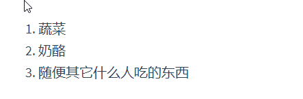

### 声明式绑定,条件与循环 [	](vue_20200703080524558)

+ 绑定元素文本：{{c1::  `{{ message }}` }}
+ 绑定元素attribute指令:{{c1::  `<span v-bind:title="message"></span>` }}
+ 条件绑定指令：{{c1:: `<p v-if="seen">现在你看到我了</p>` }}
+ 循环绑定指令：{{c1:: `v-for="todo in todos"` }}
    + 元素声明:
    ```html
    <!-- {{c1:: -->
        <li v-for="todo in todos">
            {{ todo.text }}
        </li>
    <!-- }} -->
    ```
    + 传入数据:
    ```js
    //{{c1::
    var app4 = new Vue({
        el: '#app-4',
        data: {
            todos: [
            { text: '学习 JavaScript' },
            { text: '学习 Vue' },
            { text: '整个牛项目' }
            ]
        }
    })
    //}} 
    ```

### 常用指令 [	](vue_20200703080524559)

+ `v-on:click`
    + 作用：{{c1:: 指定一个在vue选项对象methods属性中的方法作为监听器 }}
    + 用法：{{c1:: `v-on:click="reverseMessage"` }}
+ `v-model`
    + 作用：{{c1:: 将某个表单对象的值**双向绑定**到指定`data`属性。 }}
    + 用法：{{c1:: `<input v-model="message">` }}
+ `v-once`
    + 作用：执行一次性地插值，当数据改变时，插值处的内容不会更新。
    + 用法：{{c1:: `<span v-once>这个将不会改变: {{ msg }}</span>` }}
+ `v-html`
    + 作用：输出真正的 HTML，`{{ msg }}`会将数据解释为普通文本
    + 用法: `<span v-html="rawHtml"></span>`
+ `v-bind`
    + 作用：{{c1::将`HTML attribute`绑定到**某个**data属性}}
    + 用法: {{c1::`<button v-bind:disabled="isButtonDisabled">Button</button>`}}
        + 注意：{{c1::如果 `isButtonDisabled` 的值是 `null`、`undefined` 或 `false`，则 `disabled` `attribute` 甚至不会被包含在渲染出来的 `<button>` 元素中。}}

### 组件化例子：列表 [	](vue_20200703080524561)

- 自定义组件实现下面效果：
    
- 组件使用：
  ```html
  <!-- {{c1:: -->
      <todo-item
        v-for="item in groceryList"
        v-bind:todo="item"
        v-bind:key="item.id"
      ></todo-item>
  <!-- }} -->
  ```
+ JS定义:
  ```js
  //{{c1::
  Vue.component('todo-item', {
    props: ['todo'],
    template: '<li>{{ todo.text }}</li>'
  })
  
  var app7 = new Vue({
    el: '#app-7',
    data: {
      groceryList: [
        { id: 0, text: '蔬菜' },
        { id: 1, text: '奶酪' },
        { id: 2, text: '随便其它什么人吃的东西' }
      ]
    }
  })
  //}}
  ```

### 生命周期钩子 [	](vue_20200703080524562)

+ created 钩子可以用来在一个实例被创建之后执行代码：
    ```js
    new Vue({
        //{{c1::
        data: {
            a: 1
        },
        created: function () {
            // `this` 指向 vm 实例
            console.log('a is: ' + this.a)
        }
        //}}
    })
    ```
+ 也有一些其它的钩子，在实例生命周期的不同阶段被调用，如 `mounted`、`updated` 和 `destroyed`

## 模板语法 [	](vue_20200703080524563)

### 对于所有的数据绑定，Vue.js 都提供了完全的 JavaScript 表达式支持 [	](vue_20200703080524564)
```js
    //{{c1::
    {{ number + 1 }}
    {{ ok ? 'YES' : 'NO' }}
    {{ message.split('').reverse().join('') }}
    <div v-bind:id="'list-' + id"></div>
    //}}
```

### 指令 [	](vue_20200703080524565)
+ 意义: {{c1:: 指令 (`Directives`) 是带有 `v-` 前缀的特殊 `attribute`。 }}
+ 作用: {{c1:: 当表达式的值改变时，将其产生的连带影响，响应式地作用于 DOM。 }}
+ 参数: {{c1:: 一些指令能够接收一个“参数”，在指令名称之后以冒号表示。`<a v-bind:href="url">...</a>` }}
+ 动态参数:
    + {{c1:: `<a v-bind:[attributeName]="url"> ... </a>`}}
        1. {{c1:: 这里的 attributeName 会被作为一个 JavaScript 表达式进行动态求值，求得的值将会作为最终的参数来使用。}}
        2. {{c1:: 如果你的 Vue 实例有一个 data property attributeName，其值为 "href"，那么这个绑定将等价于 v-bind:href。}}
    + 约束: {{c1:: 某些字符，如空格和引号，放在 HTML attribute 名里是无效的 }}
    + 注意：{{c1:: 直接在一个 HTML 文件里撰写模板时，避免使用大写字符来命名键名 }}
+ 修饰符：{{c1:: `<form v-on:submit.prevent="onSubmit">...</form>` }}

### 指令缩写 [	](vue_20200703080524566)
+ `v-bind` 缩写
    ```html
    <!-- 完整语法 -->
    <a v-bind:href="url">...</a>
    <!-- 缩写 -->
    <!-- {{c1:: -->
    <a :href="url">...</a>
    <!-- }} -->
    <!-- 动态参数的缩写 (2.6.0+) -->
    <!-- {{c1:: -->
    <a :[key]="url"> ... </a>
    <!-- }} -->
    ```
+ `v-on` 缩写
    ```html
    <!-- 完整语法 -->
    <a v-on:click="doSomething">...</a>
    <!-- 缩写 -->
    <!-- {{c1:: -->
    <a @click="doSomething">...</a>
    <!-- }} -->
    <!-- 动态参数的缩写 (2.6.0+) -->
    <!-- {{c1:: -->
    <a @[event]="doSomething"> ... </a>
    <!-- }} -->
    ```
### vue中的计算属性 [	](vue_20200703080524567)
+ 基础例子
    + html对应元素
    ```html
    <div id="example">
        <p>Original message: "{{ message }}"</p>
        <p>Computed reversed message: "{{ reversedMessage }}"</p>
    </div>
    ```
    + 对应的Vue代码
    ```js
    //{{c1::
    var vm = new Vue({
        el: '#example',
        data: {
        message: 'Hello'
        },
        computed: {
        // 计算属性的 getter
        reversedMessage: function () {
            // `this` 指向 vm 实例
            return this.message.split('').reverse().join('')
        }
        }
    })
    //}}
    ```
+ 计算属性缓存 vs 方法
    + {{c1::计算属性是基于它们的响应式依赖进行缓存的。}}
    + {{c1::调用方法将总会再次执行函数。}}

## 计算属性与监听器 [	](vue_20200703080524568)

### 计算属性的 setter [	](vue_20200703080524569)
```js
// ...
computed: {
  fullName: {
    // getter
    get: function () {
      return this.firstName + ' ' + this.lastName
    },
    // setter
    //{{c1::
    set: function (newValue) {
        var names = newValue.split(' ')
      this.firstName = names[0]
      this.lastName = names[names.length - 1]
    }
    //}}
  }
}
// ...
```
+ 现在再运行 vm.fullName = 'John Doe' 时，setter 会被调用，vm.firstName 和 vm.lastName 也会相应地被更新。

### 侦听器：vatch选项 [	](vue_20200703080524570)

```js
var watchExampleVM = new Vue({
  el: '#watch-example',
  data: {
    question: '',
    answer: 'I cannot give you an answer until you ask a question!'
  },
  watch: {
    // 如果 `question` 发生改变，这个函数就会运行
    //{{c1::
    question: function (newQuestion, oldQuestion) {
        this.answer = 'Waiting for you to stop typing...'
    }
    //}}
  })
```

## 绑定HTML Class [	](vue_20200703080524571)

### 绑定HTML Class:对象语法 [	](vue_20200703080524572)

+ 3种`v-bind:class`的调用方式
  1. 基本语法：{{c1:: `<div v-bind:class="{ active: isActive }"></div>`}}
  2. 与已有class属性混合：{{c1:: `<div class="static" v-bind:class="{ active: isActive, 'text-danger': hasError }"></div>`}}
  3. 属性对象：{{c1:: `<div v-bind:class="classObject"></div>`}}

+ 与计算属性结合返回对象
  ```js
        data: {
        isActive: true,
        error: null
        },
        computed: {
            classObject: function () {
                return {
                active: this.isActive && !this.error,
                'text-danger': this.error && this.error.type === 'fatal'
                }
            }
        }
  ```
### 绑定HTML Class:数组语法 [	](vue_20200703080524573)

  + 基本语法：{{c1:: `<div v-bind:class="[activeClass, errorClass]"></div>` }}
  + 使用三元表达式:{{c1:: `<div v-bind:class="[isActive ? activeClass : '', errorClass]"></div>` }}
  + 数组中使用对象：{{c1::  `<div v-bind:class="[{ active: isActive }, errorClass]"></div>` }}

### 绑定HTML Class:组件上的`v-bind:class` [	](vue_20200703080524574)

+ 如果你声明了这个组件：
    ```js
        Vue.component('my-component', {
        template: '<p class="foo bar">Hi</p>'
        })
    ```
+ 对于带数据绑定 class ：
    ```html
    <my-component v-bind:class="{ active: isActive }"></my-component>
    ```
+ 当 isActive 为true时，HTML 将被渲染成为：{{c1:: `<p class="foo bar active">Hi</p>` }}

### 绑定内联样式 [	](vue_20200703080524575)

+ 对象语法：{{c1:: `<div v-bind:style="styleObject"></div>`}}
+ 数组语法：{{c1:: `<div v-bind:style="[baseStyles, overridingStyles]"></div>`}}
+ 自动添加前缀：{{c1:: 当使用类似`transform`的样式时自动添加前缀}}
+ 多重值：{{c1:: `<div :style="{ display: ['-webkit-box', '-ms-flexbox', 'flex'] }"></div>`}}
  + {{c1:: 只会渲染数组中最后一个被浏览器支持的值}}

### 用 key 管理可复用的元素

```xml
<!-- {{c1:: -->
<template v-if="loginType === 'username'">
  <label>Username</label>
  <input placeholder="Enter your username" key="username-input">
</template>
<template v-else>
  <label>Email</label>
  <input placeholder="Enter your email address" key="email-input">
</template>
<!-- }} -->
```

### v-if vs v-show

+ `v-if`:{{c1:: 如果在初始渲染时条件为假，则什么也不做——直到条件第一次变为真时，才会开始渲染条件块。}}
+ `v-show`:{{c1:: 不管初始条件是什么，元素总是会被渲染，并且只是简单地基于 CSS 进行切换。}}

## 列表渲染

### `v-for`指令

+ 在v-for里遍历数组
  1. {{c1:: `v-for="item in/of items"`  }}
  2. {{c1:: `v-for="(item, index) in items`  }}
+ 在v-for里遍历对象
  ```html
  <!-- {{c1:: -->
  <div v-for="(value, name, index) in object">
    {{ index } }. {{ name } }: {{ value } }
  </div>
  <!-- }} -->
  ```
+ 注意：{{c1:: 为了给 Vue 一个提示，以便它能跟踪每个节点的身份，建议尽可能在使用 v-for 时提供 key attribute }}
+ 不推荐在同一元素上使用 v-if 和 v-for:{{c1:: 当它们处于同一节点，`v-for` 的优先级比 `v-if` 更高}}

### Vue.js 为 `v-on` 提供了事件修饰符:

+ `.stop`:{{c1:: 阻止冒泡 }}
+ `.prevent`:{{c1:: 拦截默认事件 }}
+ `.capture`:{{c1:: 捕获冒泡 }}
+ `.self`:{{c1:: 将事件绑定到自身，只有自身才能触发，通常用于避免冒泡事件的影响 }}
+ `.once`:{{c1:: 设置事件只能触发一次，比如按钮的点击等。 }}
+ `.passive`:{{c1:: 不拦截默认事件 }}
+ 例子:{{c1::
  ```xml
    <!-- 添加事件监听器时使用事件捕获模式 -->
    <!-- 即内部元素触发的事件先在此处理，然后才交由内部元素进行处理 -->
    <div v-on:click.capture="doThis">...</div>
  ```
  }}

### `v-on`按键修饰符

```xml
<!-- 只有在 `key` 是 `Enter` 时调用 `vm.submit()` -->
<!-- {{c1:: -->
<input v-on:keyup.enter="submit">
<!-- }} -->
<!-- key 等于 PageDown 时被调用onPageDown。 -->
<!-- {{c1:: -->
<input v-on:keyup.page-down="onPageDown">
<!-- }} -->
<!-- Alt + C -->
<!-- {{c1:: -->
<input v-on:keyup.alt.67="clear">
<!-- }} -->
<!-- Ctrl + Click -->
<!-- {{c1:: -->
<div v-on:click.ctrl="doSomething">Do something</div>
<!-- }} -->
```

### `.exact` 修饰符

```html
<!-- 即使 Alt 或 Shift 被一同按下时也会触发 -->
<!-- {{c1:: -->
<button v-on:click.ctrl="onClick">A</button>
<!-- }} -->
<!-- 有且只有 Ctrl 被按下的时候才触发 -->
<!-- {{c1:: -->
<button v-on:click.ctrl.exact="onCtrlClick">A</button>
<!-- }} -->
<!-- 没有任何系统修饰符被按下的时候才触发 -->
<!-- {{c1:: -->
<button v-on:click.exact="onClick">A</button>
<!-- }} -->
```


### v-model 在内部为不同的输入元素使用不同的 property 并抛出不同的事件：

+ `text` 和 `textarea` 元素:{{c1:: 使用 value property 和 input 事件； }}
+ `checkbox` 和 radio:{{c1::  使用 checked property 和 change 事件； }}
  + 单个复选框，绑定到布尔值,多个复选框，绑定到同一个数组
+ `select`:{{c1::  字段将 value 作为 prop 并将 change 作为事件。 }}

### `v-model`修饰符

+ 转为在 change 事件之后进行同步：{{c1:: `<input v-model.lazy="msg">`  }}
+ 自动将用户的输入值转为数值类型:{{c1:: `<input v-model.number="age" type="number">`  }}
+ 自动过滤用户输入的首尾空白字符:{{c1:: `<input v-model.trim="msg">`  }}

### `v-model`把值绑定到 Vue 实例的一个动态 property

```html

<input
  type="checkbox"
  v-model="toggle"
  true-value="yes"
  false-value="no"
>

<select v-model="selected">
  <option v-bind:value="{ number: 123 }">123</option>
</select>
<!-- {{c1:: -->
<script>
// 当选中时
vm.toggle === 'yes'
// 当没有选中时
vm.toggle === 'no'
// 当选中时
typeof vm.selected // => 'object'
vm.selected.number // => 123
<!-- }} -->
</script>
```

### 组件基础

### 监听子组件事件

+ 父级组件可以像处理 native DOM 事件一样通过 v-on 监听子组件实例的任意事件：
  ```xml
  <!-- {{c1:: -->
  <blog-post
    ...
    v-on:enlarge-text="postFontSize += 0.1"
  ></blog-post>
  <!-- }} -->
  ```
+ 子组件可以通过调用内建的 $emit 方法并传入事件名称来触发一个事件
  ```xml
  <!-- {{c1:: -->
  <!-- 这里的button可能是在父组件的template中定义的 -->
  <button v-on:click="$emit('enlarge-text')">
    Enlarge text
  </button>
  <!-- }} -->
  ```

### 使用子组件事件抛出一个值

+ 这时可以使用 $emit 的第二个参数来提供这个值：
  ```xml
  <!-- {{c1:: -->
  <button v-on:click="$emit('enlarge-text', 0.1)">
    Enlarge text
  </button>
  <!-- }} -->
  ```
+ 那么这个值将会作为第一个参数对应的绑定方法：
  ```js
  <blog-post
    ...
    v-on:enlarge-text="onEnlargeText"
  ></blog-post>
  
  //{{c1::
  methods: {
    onEnlargeText: function (enlargeAmount) {
      this.postFontSize += enlargeAmount
    }
  }
  //}}
  ```

### 在组件上使用 `v-model`

+ 自定义事件也可以用于创建支持 `v-model` 的自定义输入组件。记住：
  ```html
  <input v-model="searchText">
  ```
+ 等价于：
  ```html
  <!-- {{c1:: -->
  <input
    v-bind:value="searchText"
    v-on:input="searchText = $event.target.value"
  >
  <!-- }} -->
  ```
+ 当用在组件上时，`v-model` 则会这样：
  ```html
  <!-- {{c1:: -->
  <custom-input
    v-bind:value="searchText"
    v-on:input="searchText = $event"
  ></custom-input>
  <!-- }} -->
  ```
+ 为了让它正常工作，这个组件内的 `<input>` 必须：
  - {{c1:: 将其 `value` attribute 绑定到一个名叫 `value` 的 prop 上 }}
  - {{c1:: 在其 `input` 事件被触发时，将新的值通过自定义的 `input` 事件抛出 }}
+ 写成组件代码之后是这样的：
  ```js
  //{{c1::
  Vue.component('custom-input', {
    props: ['value'],
    template: `
      <input
        v-bind:value="value"
        v-on:input="$emit('input', $event.target.value)">
    `
  })
  //}}
  ```
+ 现在 `v-model` 就应该可以在这个组件上完美地工作起来了：
  ```html
  <custom-input v-model="searchText"></custom-input>
  ```

### 动态组件

+ 动态组件的使用
  ```xml
  <!-- {{c1:: -->
  <component v-bind:is="currentTabComponent"></component>
  <!-- }} -->
  ```
+ 在上述示例中，currentTabComponent 可以包括
  + {{c1:: 已注册组件的名字，或 }}
  + {{c1:: 一个组件的选项对象 }}


### 特殊的 is attribute

+ `is attribute`的使用：
  ```xml
  <!-- {{c1:: -->
  <table>
    <tr is="blog-post-row"></tr>
  </table>
  <!-- }} -->
  ```
+ 是为了解决HTML：
  ```xml
  <!-- {{c1:: -->
  <table>
    <!-- HTML会导致解析错误 -->
    <blog-post-row></blog-post-row>
  </table>
  <!-- }} -->
  ```

## 深入了解组件

### 组件注册

- 组件名
  - 使用 kebab-case (建议)：{{c1:: `Vue.component('my-component-name', { /* ... */ })`}}
  - 使用 PascalCase：{{c1:: `Vue.component('MyComponentName', { /* ... */ })`}}
- 全局注册
  ```js
  // {{c1::
  Vue.component('my-component-name', {
    // ... 选项 ...
  })
  // }}
  ```
- 局部注册
  - 通过一个普通的 JavaScript 对象来定义组件：
    ```js
    //{{c1::
    var ComponentA = { /* ... */ }
    var ComponentB = { /* ... */ }
    var ComponentC = { /* ... */ }
    //}}
    ```
  - 然后在 `components` 选项中定义你想要使用的组件：
    ```js
    //{{c1::
    new Vue({
      el: '#app',
      components: {
        'component-a': ComponentA,
        'component-b': ComponentB
      }
    })
    //}}
    ```
  - 局部注册的组件在其子组件中不可用，如果你希望 `ComponentA` 在 `ComponentB` 中可用，则你需要这样写：
    ```js
    //{{c1::
    var ComponentA = { /* ... */ }
    var ComponentB = {
      components: {
        'component-a': ComponentA
      },
      // ...
    }
    //}}
    ```

### 组件 Prop 的大小写注意点：

+ js中:
  ```js
  Vue.component('blog-post', {
    // 在 JavaScript 中是 camelCase 的
    props: ['postTitle'],
    template: '<h3>{{ postTitle }}</h3>'
  })
  ```
+ html中:
  ```html
  <!-- 在 HTML 中是 kebab-case 的 -->
  <!-- {{c1:: -->
  <blog-post post-title="hello!"></blog-post>
  <!-- }} -->
  ```

### 组件Prop的类型

+ 数组形式：没有指定类型
  ```js
  //{{c1::
    props: ['title', 'likes', 'isPublished', 'commentIds', 'author']
  //}}
  ```
+ 对象形式：对应的值就是类型
  ```js
  //{{c1::
    props: {
      title: String,
      likes: Number,
      isPublished: Boolean,
      commentIds: Array,
      author: Object,
      callback: Function,
      contactsPromise: Promise // or any other constructor
    }
  //}}
  ```

### 传递静态或动态Prop

```html
<!-- 传入一个静态的值 -->
<!-- {{c1:: -->
<blog-post title="My journey with Vue"></blog-post>
<!-- }} -->
<!-- 动态赋予一个变量的值 -->
<!-- {{c1:: -->
<blog-post v-bind:title="post.title"></blog-post>
<!-- }} -->
<!-- 动态赋予一个复杂表达式的值 -->
<!-- {{c1:: -->
<blog-post
  v-bind:title="post.title + ' by ' + post.author.name"
></blog-post>
<!-- }} -->
```

### 组件的Prop 验证

```js
Vue.component('my-component', {
  props: {
    // 基础的类型检查 (`null` 和 `undefined` 会通过任何类型验证)
    //{{c1::
    //}}
    propA: Number,
    // 多个可能的类型
    //{{c1::
    propB: [String, Number],
    //}}
    // 必填的字符串
    //{{c1::
    propC: {
      type: String,
      required: true
    },
    //}}
    // 带有默认值的数字
    //{{c1::
    propD: {
      type: Number,
      default: 100
    },
    //}}
    // 带有默认值的对象
    //{{c1::
    propE: {
      type: Object,
      // 对象或数组默认值必须从一个工厂函数获取
      default: function () {
        return { message: 'hello' }
      }
    },
    //}}
    // 自定义验证函数
    //{{c1::
    propF: {
      validator: function (value) {
        // 这个值必须匹配下列字符串中的一个
        return ['success', 'warning', 'danger'].indexOf(value) !== -1
      }
    }
    //}}
  }
})
```
+ type 可以是原生构造函数中的一个`String` `Number` `Boolean` `Array` `Object` `Date` `Function` `Symbol` 
+ type 还可以是一个自定义的构造函数，并且通过 instanceof 来进行检查确认
  ```js
    Vue.component('blog-post', {
      props: {
        //验证 author prop 的值是否是通过 new Person 创建的。
        //{{c1::
        author: Person
        //}}
      }
    })
  ```

### 禁用 Attribute 继承

```js
//{{c1::
Vue.component('my-component', {
  inheritAttrs: false,
  // ...
})
//}}
```