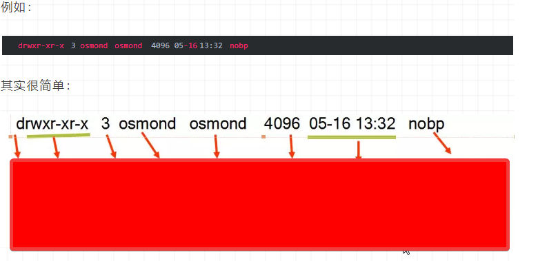
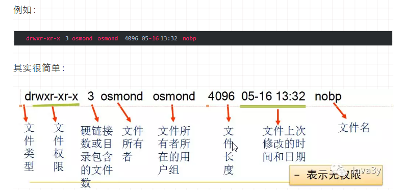
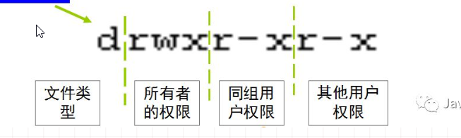
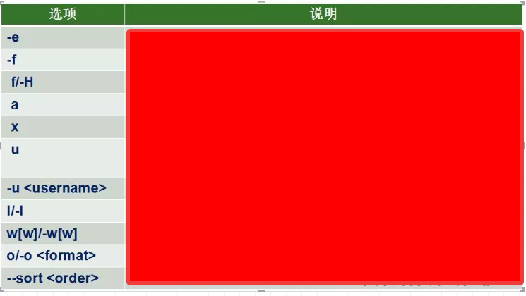
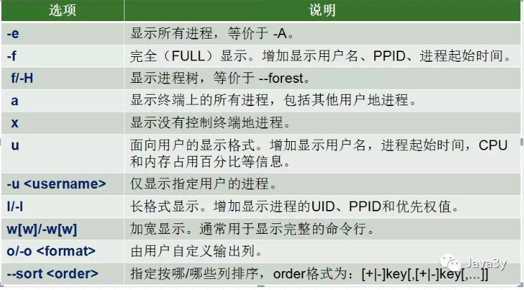
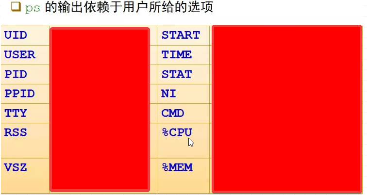
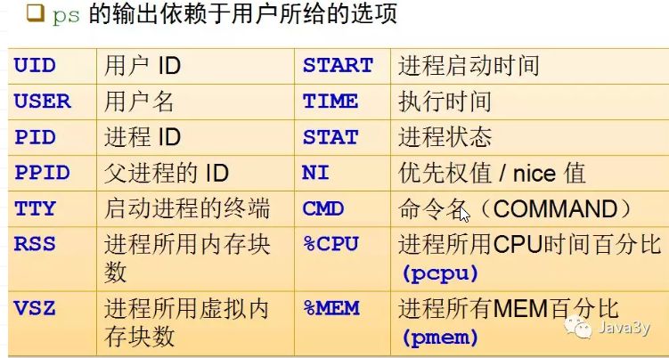

## 常用基本操作 

### linux 中的通配符 

+ `*`：{{c1:: 匹配任何字符和任何数目的字符 }}
+ `?`：{{c1:: 匹配单一数目的任何字符 }}
+ `[ ]`：{{c1:: 匹配[ ]之内的任意一个字符 }}
+ `[! ]`：{{c1:: 匹配除了[! ]之外的任意一个字符，!表示非的意思 }}

### Linux下文件的类型： 

+ 普通文件:{{c1:: `-`}}
+ 目录:{{c1:: `d`}}
+ 符号链接:{{c1:: ` l`}}
    + 硬链接： {{c1:: 与普通文件没什么不同，inode 都指向同一个文件在硬盘中的区块}}
    + 软链接： {{c1:: 保存了其代表的文件的绝对路径，是另外一种文件，在硬盘上有独立的区块，访问时替换自身路径(简单地理解为 Windows 中常见的快捷方式)。}}
    + 显示文件inode值命令：{{c1:: `ls -li` }}
+ 字符设备文件:{{c1:: ` c`}}
+ 块设备文件:{{c1:: `b`}}
+ 套接字:{{c1:: `s`}}
+ 命名管道:{{c1:: `p`}}

### 常用的文件、目录操作命令 
+ `pwd`:{{c1:: 命令查看用户的当前目录 }}
+ `cd`:{{c1::  命令来切换目录 }}
    + `.`:{{c1:: 表示当前目录 }}
    + `..`:{{c1::  表示当前目录的上一级目录（父目录） }}
    + `-`:{{c1:: 表示用 cd 命令切换目录前所在的目录 }}
    + `~`:{{c1::  表示用户主目录的绝对路径名 }}
+ 绝对路径：{{c1:: 以斜线（/）开头 ，描述到文件位置的完整说明 }}
+ 相对路径：{{c1:: 不以斜线（/）开头 ，指定相对于你的当前工作目录而言的位置  }}

### 常用的文件、目录操作命令 

+ `ls`：{{c1:: 显示文件或目录信息}}
+ `mkdir`：{{c1:: 当前目录下创建一个空目录}}
+ `rmdir`：{{c1:: 要求目录为空}}
+ `touch`：{{c1:: 生成一个空文件或更改文件的时间}}
+ `cp`：{{c1:: 复制文件或目录}}
+ `mv`：{{c1:: 移动文件或目录、文件或目录改名}}
+ `rm`：{{c1:: 删除文件或目录}}
+ `ln`：{{c1:: 建立链接文件}}
+ `find`：{{c1:: 查找文件}}
+ `file/stat`：{{c1:: 查看文件类型或文件属性信息}}
+ `cat`：{{c1::查看文本文件内容}}
+ `more`：{{c1:: 可以分页看}}
+ `less`：{{c1:: 不仅可以分页，还可以方便地搜索，回翻等操作}}
+ `tail -10`：{{c1::  查看文件的尾部的10行}}
+ `head -20`：{{c1:: 查看文件的头部20行}}
+ `echo`：{{c1:: 把内容重定向到指定的文件中 ，有则打开，无则创建}}
+ `管道命令 |` ：{{c1:: 将前面的结果给后面的命令，例如：{{c1:: `ls -la | wc`，将ls的结果加油wc命令来统计字数}}
+ `重定向 > 是覆盖模式，>> 是追加模式`，例如：{{c1:: `echo "Java3y,zhen de hen xihuan ni" > qingshu.txt`把左边的输出放到右边的文件里去}}

### linux文件打包和压缩命令 

+ 常用的压缩的命令就有：
    + {{c1:: `gzip filename` }}
    + {{c1:: `bzip2 filename` }}
    + {{c1:: `tar -czvf filename` }}
+ 常用的解压命令有：
    + {{c1:: `gzip -d filename.gz` }}
    + {{c1:: `bzip2 -d filename.bz2` }}
    + {{c1:: `tar -xzvf filename.tar.gz` }}

### grep命令 

+ 格式：{{c1:: `grep [options] PATTERN [FILE...]` }}
+ 在文件 myfile 中查找包含字符串 mystr的行:{{c1:: `grep -n mystr myfile` }}
+ 显示 myfile 中第一个字符为字母的所有行:{{c1:: `grep  '^[a-zA-Z]'  myfile` }}

### linux环境变量 

+ 显示当前Shell可见的全局变量
    + {{c1:: `export [-p]` }}
+ 定义变量值的同时声明为全局变量。
    + {{c1:: `export <变量名1=值1>  [<变量名2=值2> ...]` }}
+ 声明已经赋值的某个（些）**局部变量为全局变量**。
    + {{c1:: `export <变量名1> [<变量名2> ...]` }}
+ 声明已经赋值的某个（些）**全局变量为局部变量**。
    + {{c1:: `export -n <变量名1> [<变量名2> ...]` }}
+ 显示当前已经定义的所有变量
  + 所有**环境变量**：{{c1:: `env` }}
  + 所有**变量和函数**（包括环境变量） ：{{c1:: `set` }}
+ 显示某（些）个变量的值
  + {{c1:: `echo  $NAME1  [$NAME2 ……]` }}
+ 取消变量的声明或赋值
  + {{c1:: `unset  <NAME>` }}

### Vi编辑器，普通模式操作 

+ `G`:{{c1:: 用于直接跳转到文件尾}}
+ `ZZ`:{{c1:: 用于存盘退出Vi}}
+ `ZQ`:{{c1:: 用于不存盘退出Vi }}
+ `/和？`:{{c1:: 用于查找字符串}}
+ `n`:{{c1:: 继续查找下一个}}
+ `yy`:{{c1:: 复制一行}}
+ `p`:{{c1:: 粘帖在下一行，P粘贴在前一行}}
+ `dd`:{{c1:: 删除一行文本}}
+ `u`:{{c1:: 取消上一次编辑操作（undo）}}

### Vi编辑器，插入模式操作 

+ 进去插入模式:{{c1:: 使用i或a或o }}
+ 返回普通模式:{{c1:: 使用esc }}

### Vi编辑器，命令行模式操作 

+ `w `:{{c1:: 保存当前编辑文件，但并不退出}}
+ `w newfile`:{{c1:: 存为另外一个名为 “newfile” 的文件}}
+ `wq`:{{c1:: 用于存盘退出Vi}}
+ `q!`:{{c1:: 用于不存盘退出Vi}}
+ `q `:{{c1:: 用于直接退出Vi （未做修改)}}

### 设置Vi环境 

+ `set autoindent`:{{c1::  缩进,常用于程序的编写}}
+ `set noautoindent`:{{c1:: 取消缩进}}
+ `set number`:{{c1:: 在编辑文件时显示行号}}
+ `set tabstop=value`:{{c1:: 设置显示制表符的空格字符个数}}
+ `set`:{{c1:: 显示设置的所有选项}}

## 用户与权限管理 

### Linux中的账户包括 
+ 用户账户
  + 普通用户账户：{{c1:: 在系统上的任务是进行普通工作}}
  + 超级用户账户（或管理员账户）：{{c1:: 在系统上的任务是对普通用户和整个系统进行管理。}}
+ 组账户(组是用户的集合)
  + 标准组：{{c1:: 标准组可以容纳多个用户}}
  + 私有组：{{c1:: 私有组中只有用户自己}}

### 当一个用户同属于多个组时，将这些组分为 
+ 主组（初始组）：{{c1:: 用户登录系统时的组。 }}
+ 附加组：{{c1:: 登录后可切换的其他组 }}

### 账户的实质上就是用户在系统上的标识，这些标识是用文件保存起来的： 
|          | 文件                    | 权限                     | 各字段意义                                                   |
| -------- | ----------------------- | ------------------------ | ------------------------------------------------------------ |
| 用户     | {{c1:: `/etc/passwd`}}  | {{c1:: `(-rw-r--r--)`}}  | {{c1:: 用户名:口令：用户表示：组标识：描述:主目录：默认shell版本}} |
| 用户口令 | {{c1:: `/etc/shadow`}}  | {{c1:: `(-r--------)`}}  | {{c1:: 用户名:加密的口令：最后修改时间：最小时间间隔：最大事件间隔：警告事件：不活动时间：失效时间：保留位}} |
| 组       | {{c1:: `/etc/group`}}   | {{c1:: `(-rw-r--r-- )`}} | {{c1:: 组名:口令：组ID：组内用户列表}}                       |
| 组口令   | {{c1:: `/etc/gshadow`}} | {{c1:: `(-r--------)`}}  | {{c1:: 组名：加密的口令：组的管理员：组内用户列表}}          |

### linux创建用户的时候会发生什么： 

1. {{c1:: 用户名和 UID 被保存在 `/etc/passwd` 这个文件中，用户的口令通常用`shadow passwords`保护 }}
2. {{c1:: 当用户登录时，他们**被分配了一个主目录和一个运行的程序**（通常是 shell） }}
3. {{c1:: 若没有指定他所属于的组，RHEL/CentOS就建立一个和**该用户同名的私有组** }}

### Linux管理用户的命令 

+ 用户管理：
    + 添加用户： {{c1:: `useradd` }}
    + 修改用户： {{c1:: `usermod` }}
    + 删除用户： {{c1:: `userdel` }}
+ 组管理：
    + 添加组：{{c1:: `groupadd` }}
    + 修改组：{{c1:: `groupmod` }}
    + 删除组：{{c1:: `groupdel` }}
+ 批量管理用户：
    + 成批添加/更新一组账户：{{c1:: `newusers` }}
    + 成批更新用户的口令：{{c1:: `chpasswd` }}

### Linux组成员管理： 

+ 向标准组中添加用户
  1. {{c1:: `gpasswd -a <用户账号名> <组账号名>` }}
  2. {{c1:: `usermod -G <组账号名> <用户账号名>` }}
+ 从标准组中删除用户
  1. {{c1:: `gpasswd -d <用户账号名> <组账号名>` }}

### Linux口令维护： 

+ 设置用户口令:{{c1:: `passwd [<用户账号名>]` }}
+ 禁用用户账户口令:{{c1:: `passwd -l <用户账号名>` }}
+ 查看用户账户口令状态:{{c1:: `passwd -S <用户账号名>` }}
+ 恢复用户账户口令:{{c1:: `passwd -u <用户账号名>` }}
+ 清除用户账户口令:{{c1:: `passwd -d <用户账号名>` }}
+ 口令时效设置：{{c1:: 修改 /etc/login.defs 的相关配置参数:PASS_MAX_DAYS,PASS_MIN_DAYS,PASS_MIN_LEN,PASS_WARN_AGE }}
+ 设置已存在用户的口令时效：{{c1:: `chage命令` }}

### linux用户切换命令： 

+ 直接切换为超级用户:{{c1:: `su` }}
+ 切换为指定用户：{{c1:: `su username` }}

### 用户相关的命令： 

+ `id`：{{c1:: 显示用户当前的uid、gid和用户所属的组列表 }}
+ `groups`：{{c1:: 显示指定用户所属的组列表 }}
+ `whoami`：{{c1:: 显示当前用户的名称 }} 
+ `w/who`：{{c1:: 显示登录用户及相关信息 }}
+ `newgrp`：{{c1:: 用于转换用户的当前组到指定的组账号，用户必须属于该组才可以正确执行该命令 }}

### `ls -l`命令结果意义： 

+ 结果：
    + {{c1::}}
    + {{c1::}}

### `chmod 754 filename` 命令的含义： 

+ 7:{{c1:: = 4 + 2 + 1  读+写+运行}}
+ 5:{{c1:: = 4 + 1      读+运行}}
+ 4:{{c1:: = 4          读}}

### 管理Linux权限的常用命令 

+ 改变文件或目录的权限:{{c1::`chmod`}}
+ 改变文件或目录的属主（所有者）:{{c1::`chown`}}
+ 改变文件或目录所属的组:{{c1::`chgrp`}}
+ 设置文件的缺省生成掩码:{{c1::`umask`}}
  + 默认的`umask：022`含义:{{c1:: 无限制：不许写：不许写 }}

### Linux还提供了三种特殊的权限： 

+ `SUID`：{{c1:: 使用命令的**所属用户的权限来运行**，而不是命令执行者的权限,占用属主的x位置用s表示 }}
+ `SGID`：{{c1:: 使用命令的**组权限来运行**,占用组的x位置用s表示 }}
+ `Sticky-bit`：{{c1:: 目录中的文件**只能被文件的所属用户和root用户删除**。占用其他人的x位置用t表示 }}

## 进程管理 

### 使用PID区分不同的进程 

- 系统启动后的**第一个进程是{{c1:: `init` }}**，它的{{c1:: `PID是1` }}。{{c1:: init }}是唯一一个由系统内核直接运行的进程。
- 除了init之外，每个进程都有{{c1:: **父进程**（PPID标识） }}
- 每个进程还有四个{{c1::**与用户和组相关的识别号**}}
  1. {{c1:: 实际用户识别号  （real user ID，RUID） }}
  2. {{c1:: 实际组识别号     （real group ID，RGID）}}
  3. {{c1:: 有效用户识别号  （effect user ID，EUID）}}
  4. {{c1:: 有效组识别号     （effect group ID，EGID）}}
1. RUID和RGID的作用：{{c1:: **识别正在运行此进程的用户和组**。}}
2. EUID和EGID的作用：{{c1:: **确定一个进程对其访问的文件的权限**。}}

### ps命令各选项意义 

+ 
+ {{c1::  }}

### ps命令输出说明： 

+ 
+ {{c1::  }}

### linux进程常用命令 

+ 注销后继续运行进程:{{c1::  `nohup java -server -Xms128M -Xmx512M -XX:MetaspaceSize=128M -jar test.jar $1 $2 $3 &`}}
+ 杀死进程：{{c1:: `kill pid  -9`}}
+ 查看内存使用状况:{{c1:: `free` }}
+ 查看实时刷新的系统进程信息:{{c1:: `top` }}
+ 在启动进程时就指定优先级：{{c1:: `nice -<优先级改变量> 命令 [&]` }}
  + 注意：{{c1:: 优先级改变量默认为10，若为正则降低优先权 }}
+ 进程运行后调整优先级：{{c1:: `renice命令`}}

### 作业控制（进程控制）常用命令 

+ 暂时停止某个运行程序：{{c1:: `Ctrl+z` }}
+ 列举作业号码和名称：{{c1:: `jobs` }}
+ 在后台恢复运行：{{c1:: `bg [%作业号码]` }}
+ 在前台恢复运行：{{c1:: `fg [%作业号码]` }}
+ 发送信号：{{c1:: `kill -[信号] pid` }}

### 守护进程的启动方式： 

- 独立启动
  - 独立运行的守护进程由init脚本负责管理，脚本存放在{{c1::`/etc/rc.d/init.d/`}}目录下
  - 所有的**系统服务都是独立运行的**。如：crond、syslogd等
  - 一些**常用的网络守护进程是独立运行**的。如：httpd等
- 瞬态启动
  - 由网络超级服务器（xinetd）运行的守护进程，由xinetd管理的守护进程的配置文件存在{{c1::`/etc/xinetd.d/`}}目录下
  - 默认的xinetd的主配置文件是{{c1::`/etc/xinetd.conf`}}
  - 一些**不常用**的网络守护进程是由xinetd启动的，如：telnet、 tftp等
  - xinetd本身是独立运行的守护进程