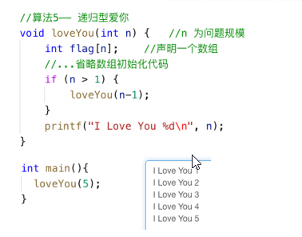
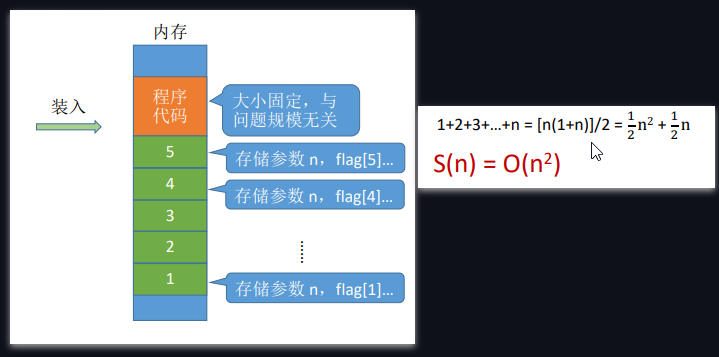

## 数据结构基本概念 

### 数据 
+ 含义：{{c1:: 数据是信息的载体，是描述客观事物属性的数、字符及所有能输入到计算机中并被计算机程序识别
和处理的符号的集合。 }}

### 数据元素、数据项 
+ 数据元素：{{c1:: 数据元素是数据的基本单位，通常作为一个整体进行考虑和处理。 }}
+ 数据项：{{c1:: 一个数据元素可由若干数据项组成，数据项是构成数据元素的不可分割的最小单位。 }}

### 数据对象、数据结构 
+ 数据结构:{{c1:: 相互之间存在一种或多种特定关系的数据元素的集合。 }}
+ 数据对象:{{c1:: 具有相同性质的数据元素的集合，是数据的一个子集。 }}

### 数据类型、抽象数据类型（ADT） 
+ 含义：{{c1:: （Abstract Data Type，ADT）用数学化的语言定义数据的逻辑结构、定义运算。与具体的实现无关。 }}
+ 定义一个ADT，就是定义了数据的逻辑结构、数据的运算。也就是定义了一个数据结构。

### 数据结构三要素 
1. 逻辑结构
    + 集合
        + 特点：{{c1:: 各个元素同属一个集合，别无其他关系 }}
    + 线性结构
        + 特点：{{c1:: 除了第一个元素，所有元素都有唯一前驱；除了最后一个元素，所有元素都有唯一后继； }}
    + 树形结构
        + 特点：{{c1:: 数据元素之间是一对多的关系 }}
    + 网状结构
        + 特点：{{c1:: 数据元素之间是多对多的关系 }}
2. 存储结构（物理结构）
    + 顺序存储
        + 特点：{{c1:: 逻辑上相邻的元素存储在物理位置上也相邻的存储单元中 }}
    + 链式存储
        + 特点：{{c1:: 逻辑上相邻的元素在物理位置上可以不相邻 }}
    + 索引存储
        + 特点：{{c1:: 索引表中的每项称为索引项，索引项的一般形式是（关键字，地址） }}
    + 散列存储
        + 特点：{{c1:: 根据元素的关键字直接计算出该元素的存储地址，又称哈希（Hash）存储 }}
3. 数据的运算：{{c1:: 运算的定义是针对逻辑结构的,指出运算的功能；运算的实现是针对存储结构的，指出运算的具体操作步骤 }}

## 算法的基本概念 

+ 什么是算法：{{c1:: 程序 = 数据结构 + 算法，（要处理的信息 + 处理信息的步骤） }}
+ 算法的五大特性：{{c1:: 有穷，确定，可行，输入，输出 }}
+ 好算法的特质：{{c1:: 正确，可读，健壮，高效率与低存储量需求 }}

### 算法的时间复杂度：概念
+ 大O表示“同阶”，同等数量级。即：{{c1:: 当n趋近无穷时，二者之比为常数 }}
  + 如图：{{c1::}}
+ 加法规则：{{c1:: `T(n) = T1(n) + T2(n) = O(f(n)) + O(g(n)) = O(max(f(n), g(n)))` }}
+ 乘法规则: {{c1:: `T(n) = T1(n)×T2(n) = O(f(n))×O(g(n)) = O(f(n)×g(n))` }}
+ 例(图):{{c1::  }}

### 算法的时间复杂度：判断时间复杂度大小
+ 口诀：{{c1::常对幂指阶 }}
+ 时间复杂度的几种类型，函数对比图：{{c1::  }}

### 计算代码算法的时间复杂度:计算步骤
+ 如何计算：
  1. {{c1:: 找到一个基本操作（最深层循环） }}
  2. {{c1:: 分析该基本操作的执行次数x与问题规模n的关系x=f(n) }}
  3. {{c1:: x的数量级O(x）就是算法时间复杂度T(n) }}

### 计算代码算法的时间复杂度T(n):指数递增型
+ C代码如图：
+ 解答：
  + {{c1::  }}

### 计算代码算法的时间复杂度T(n):搜索数字型
+ 
+ 解答：{{c1::  }}

### 计算代码算法的空间复杂度T(n):递归程序

+ 例题：
+ 解答：{{c1::  }}

+ 计算步骤:
  1. {{c1:: 找到递归调用的深度x与问题规模n的关系x=f(n) }}
  2. {{c1:: x的数量级O(x）就是算法空间复杂度S(n) }}
  3. {{c1:: 注：有的算法各层函数所需存储空间不同，分析方法略有区别 }}
## 线性表

### 线性表定义(Linear List)
+ 定义：{{c1:: 线性表是具有**相同类型**的n个数据元素的**有限序列** }}
+ 主要特点：{{c1:: 除第一个元素外，每个元素有且仅有一个直接前驱；除最后一个元素外，每个元素有且仅有一个直接后继 }}

### 线性表的基本运算/操作定义(C++定义)
+ `InitList(&L)`：{{c1:: **初始化**表。构造一个空的线性表L，**分配内存空间**。 }}
+ `DestroyList(&L)`：{{c1:: **销毁**操作。销毁线性表，并**释放**线性表L所占用的**内存空间**。 }}
+ `ListInsert(&L,i,e)`：**插入**操作。在表L中的第i个位置上插入指定元素e。
+ `ListDelete(&L,i,&e)`：{{c1:: **删除**操作。删除表L中第i个位置的元素，并用e返回删除元素的值。 }}
+ `LocateElem(L,e)`：{{c1:: **按值查找**操作。在表L中查找具有给定关键字值的元素。 }}
+ `GetElem(L,i)`：{{c1:: **按位查找**操作。获取表L中第i个位置的元素的值。 }}
+ 什么时候要传入引用`&`:{{c1:: 对参数的修改结果需要**带回来**}}

