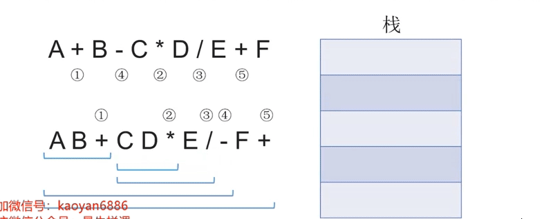

## c数据结构基本概念 [	](dataStructure_20200928050450150)

### 数据 [	](dataStructure_20200928050450152)
+ 含义：{{c1:: 数据是信息的载体，是描述客观事物属性的数、字符及所有能输入到计算机中并被计算机程序识别
和处理的符号的集合。 }}

### 数据元素、数据项 [	](dataStructure_20200928050450154)
+ 数据元素：{{c1:: 数据元素是数据的基本单位，通常作为一个整体进行考虑和处理。 }}
+ 数据项：{{c1:: 一个数据元素可由若干数据项组成，数据项是构成数据元素的不可分割的最小单位。 }}

### 数据对象、数据结构 [	](dataStructure_20200928050450156)
+ 数据结构:{{c1:: 相互之间存在一种或多种特定关系的数据元素的集合。 }}
+ 数据对象:{{c1:: 具有相同性质的数据元素的集合，是数据的一个子集。 }}

### 数据类型、抽象数据类型（ADT） [	](dataStructure_20200928050450158)
+ 含义：{{c1:: （Abstract Data Type，ADT）用数学化的语言定义数据的逻辑结构、定义运算。与具体的实现无关。 }}
+ 定义一个ADT，就是定义了数据的逻辑结构、数据的运算。也就是定义了一个数据结构。

### 数据结构三要素 [	](dataStructure_20200928050450160)
1. 逻辑结构
    + 集合
        + 特点：{{c1:: 各个元素同属一个集合，别无其他关系 }}
    + 线性结构
        + 特点：{{c1:: 除了第一个元素，所有元素都有唯一前驱；除了最后一个元素，所有元素都有唯一后继； }}
    + 树形结构
        + 特点：{{c1:: 数据元素之间是一对多的关系 }}
    + 网状结构
        + 特点：{{c1:: 数据元素之间是多对多的关系 }}
2. 存储结构（物理结构）
    + 顺序存储
        + 特点：{{c1:: 逻辑上相邻的元素存储在物理位置上也相邻的存储单元中 }}
    + 链式存储
        + 特点：{{c1:: 逻辑上相邻的元素在物理位置上可以不相邻 }}
    + 索引存储
        + 特点：{{c1:: 索引表中的每项称为索引项，索引项的一般形式是（关键字，地址） }}
    + 散列存储
        + 特点：{{c1:: 根据元素的关键字直接计算出该元素的存储地址，又称哈希（Hash）存储 }}
3. 数据的运算：{{c1:: 运算的定义是针对逻辑结构的,指出运算的功能；运算的实现是针对存储结构的，指出运算的具体操作步骤 }}

## 算法的基本概念 [	](dataStructure_20200928050450162)

+ 什么是算法：{{c1:: 程序 = 数据结构 + 算法，（要处理的信息 + 处理信息的步骤） }}
+ 算法的五大特性：{{c1:: 有穷，确定，可行，输入，输出 }}
+ 好算法的特质：{{c1:: 正确，可读，健壮，高效率与低存储量需求 }}

### 算法的时间复杂度：概念 [	](dataStructure_20201109090319176)
+ 大O表示“同阶”，同等数量级。即：{{c1:: 当n趋近无穷时，二者之比为常数 }}
  + 如图：{{c1::}}
+ 加法规则：{{c1:: `T(n) = T1(n) + T2(n) = O(f(n)) + O(g(n)) = O(max(f(n), g(n)))` }}
+ 乘法规则: {{c1:: `T(n) = T1(n)×T2(n) = O(f(n))×O(g(n)) = O(f(n)×g(n))` }}
+ 例(图):{{c1::  }}

### 算法的时间复杂度：判断时间复杂度大小 [	](dataStructure_20201109090319179)
+ 口诀：{{c1::常对幂指阶 }}
+ 时间复杂度的几种类型，函数对比图：{{c1::  }}

### 计算代码的时间复杂度:计算步骤 [	](dataStructure_20201109090319182)
+ 如何计算：
  1. {{c1:: 找到一个基本操作（最深层循环） }}
  2. {{c1:: 分析该基本操作的执行次数x与问题规模n的关系x=f(n) }}
  3. {{c1:: x的数量级O(x）就是算法时间复杂度T(n) }}

### 计算代码的时间复杂度T(n):指数递增型 [	](dataStructure_20201109090319185)
+ C代码如图：
+ 解答：
  + {{c1::  }}

### 计算代码的时间复杂度T(n):搜索数字型 [	](dataStructure_20201109090319189)
+ 
+ 解答：{{c1::  }}

### 计算代码算法的空间复杂度T(n):递归程序 [	](dataStructure_20201109090319194)

+ 例题：
+ 解答：{{c1::  }}

+ 计算步骤:
  1. {{c1:: 找到递归调用的深度x与问题规模n的关系x=f(n) }}
  2. {{c1:: x的数量级O(x）就是算法空间复杂度S(n) }}
  3. {{c1:: 注：有的算法各层函数所需存储空间不同，分析方法略有区别 }}
## 线性表 [	](dataStructure_20201109090319197)

### 线性表定义(Linear List) [	](dataStructure_20201109090319199)
+ 定义：{{c1:: 线性表是具有**相同类型**的n个数据元素的**有限序列** }}
+ 主要特点：{{c1:: 除第一个元素外，每个元素有且仅有一个直接前驱；除最后一个元素外，每个元素有且仅有一个直接后继 }}

### 线性表的基本运算/操作定义(C++定义) [	](dataStructure_20201109090319202)
+ `InitList(&L)`：{{c1:: **初始化**表。构造一个空的线性表L，**分配内存空间**。 }}
+ `DestroyList(&L)`：{{c1:: **销毁**操作。销毁线性表，并**释放**线性表L所占用的**内存空间**。 }}
+ `ListInsert(&L,i,e)`：**插入**操作。在表L中的第i个位置上插入指定元素e。
+ `ListDelete(&L,i,&e)`：{{c1:: **删除**操作。删除表L中第i个位置的元素，并用e返回删除元素的值。 }}
+ `LocateElem(L,e)`：{{c1:: **按值查找**操作。在表L中查找具有给定关键字值的元素。 }}
+ `GetElem(L,i)`：{{c1:: **按位查找**操作。获取表L中第i个位置的元素的值。 }}
+ 什么时候要传入引用`&`:{{c1:: 对参数的修改结果需要**带回来**}}

### 顺序表（顺序结构） [	](dataStructure_20201109090319204)
+ 定义：{{c1:: 用**顺序存储**的方式实现**线性表**。}}
+ 特点：{{c1:: 把**逻辑上相邻**的元素存储在**物理位置上**也**相邻**的存储单元中 }}
+ 元素间的关系：{{c1:: 元素之间的关系由**存储单元的邻接关系**来体现。 }}
### 顺序表实现：静态分配（数据结构定义） [	](dataStructure_20201109090319207)

+ 特点：{{c1:: 静态分配的存储空间一旦确定就不可变 }}
  ```c
  //{{c1::
  #define MaxSize 10					//定义最大长度
  typedef struct{
    ElemType data[MaxSize]; 	//用静态的“数组”存放数据元素
    int length;							  //顺序表的当前长度
  }SqList; 										//顺序表的类型定义（静态分配方式）
  //}}
  ```

### 顺序表的实现：动态分配（数据结构定义） [	](dataStructure_20201109090319209)

```c
//{{c1::
#define InitSize 10 //顺序表的初始长度
typedef struct{
  ElemType *data; 	//指示动态分配数组的指针
  int MaxSize; 			//顺序表的最大容量
  int length; 			//顺序表的当前长度
} SeqList; 					//顺序表的类型定义（动态分配方式）
//}}
```

### 顺序表的实现：动态分配（初始化表操作） [	](dataStructure_20201109090319212)

```c
//{{c1::
void initList(SeqList &L){
  	//申请内存空间
    L.data=(int *)malloc(InitSize*sizeof(int));
    L.length=0;
    L.MaxSize=InitSize;
}
//}}
```

### 顺序表的实现：动态分配（增加动态数据长度操作） [	](dataStructure_20201109090319214)

```c
//{{c1::
void IncreaseSize(SeqList &L,int len){
    int *p =L.data;
    L.data=(int *)malloc((L.MaxSize+len)*sizeof(int));
    for(int i=0;i<L.length;i++){
        L.data[i]=p[i];
    }
    L.MaxSize = L.MaxSize + len;
    free(p);
}
//}}
```

### 顺序表的实现：动态分配（插入操作） [	](dataStructure_20201109090319216)

```c
//{{c1::
bool ListInsert(SqList &L,int i,int e){
    if(i<1 || i>L.Length+1)  //判断i的范围
        return false;
    if(L.length>=MaxSize)    //存储空间是否已满
        return false;
    for(int j=L.length;j>=i;j--) //移出插入元素的位置
        L.data[j]=L.data[j-1];
    L.data[i-1]=e;
    L.length++;
    return true;
}
//}}
```

+ 时间复杂度分析：{{c1::}}

### 顺序表的特点：  [	](dataStructure_20201109090319218)

1. {{c1:: **随机访问** }}
2. {{c1:: **存储密度高** }}
3. {{c1:: **拓展容量不方便** }}
4. {{c1:: **插入、删除操作不方便** }}

### 单链表实现：数据结构定义 [	](dataStructure_20201109090319220)

```c
//{{c1::
typedef struct LNode{
    ElemType data;
    struct LNode *next;
}LNode,*LinkList;
//}}
```

### 单链表实现：头插法建立单链表 [	](dataStructure_20201109090319222)

```c
//{{c1::
LinkList List_HeadInsert(LinkList &L){
    LNode *s; int x;
    L = (LinkList) malloc(sizeof(LNode));
    L->next=NULL;
    scanf("%d",&x);
    while(x!=9999){
        s=(LNode*)malloc(sizeof(LNode));
        s->data=x;
        s->next=L->next;
        L->next=s;
        scanf("%d",&x);
    }
    return L;
}
//}}
```

+ 主要思路：{{c1::  }}

### 单链表实现：初始化操作 [	](dataStructure_20201109090319224)

+ 带头节点

  ```c
  //{{c1::
  bool InitList(LinkList &L){
    L = (LNode *) malloc(sizeof(LNode));
    if(L==NULL)
    		return false;
    L->next = NULL;
    return true;
  }
  //}}
  ```

+ 不带头结点

  ```c
  //{{c1::
  bool InitList(LinkList &L){
  	L = NULL；
  	return false;
  }
  //}}
  ```

### 单链表实现：按位插入 [	](dataStructure_20201124103028993)

+ 带头节点:
+ {{c1::  }}
+ 不带节点:
+ {{c1::  }}

### 单链表实现：前后插操作 [	](dataStructure_20201109090319226)

+ 后插操作:
+ {{c1::  }}

+ 前插操作:
+ {{c1::  }}

### 单链表实现：按位删除（带头节点） [	](dataStructure_20201109090319229)
+ 主要思路：找到i-1的节点
+ 边际问题注意：
  + 注意最后一个元素
  + 注意i是否超范围
{{c1::  }}

### 单链表实现：指定结点的删除 [	](dataStructure_20201109090319232)

{{c1::   }}

### 双链表实现：数据结构 [	](dataStructure_20201109090319234)

```c
//{{c1::
typedef struct DNode{
    ElemType data;
    struct DNode *prior,*next;
}DNode,*DLinkList;
//}}
```

### 双链表实现：初始化 [	](dataStructure_20201109090319237)

{{c1::  }}

### 双链表实现：插入 [	](dataStructure_20201109090319243)

{{c1::  }}

### 双链表实现：删除后继节点 [	](dataStructure_20201109051135495)

{{c1:: }}

### 双链表实现：遍历 [	](dataStructure_20201109051135498)

{{c1::}}

### 静态链表实现:定义 [	](dataStructure_20201109051135500)

{{c1::}}

### 循环链表概况 [	](dataStructure_20201109051135502)


{{c1::}}

## 栈 [	](dataStructure_20201115082829738)

### 栈（Stack):基本概念 [	](dataStructure_20201115082829740)
+ 定义:{{c1:: 只允许在一端进行插入或删除操作的**线性表** }}
+ 栈的基本操作
  + `InitStack(&S)`：{{c1:: 初始化栈。构造一个空栈 S，分配内存空间。 }}
  + `DestroyStack(&S)`：{{c1:: 销毁栈。销毁并释放栈 S 所占用的内存空间。 }}
  + `Push(&S,x)`：{{c1:: 进栈，若栈S未满，则将x加入使之成为新栈顶。 }}
  + `Pop(&S,&x)`：{{c1:: 出栈，若栈S非空，则弹出栈顶元素，并用x返回。 }}
  + `GetTop(S, &x)`：{{c1:: 读栈顶元素。若栈 S 非空，则用 x 返回栈顶元素 }}
  + `StackEmpty(S)`：{{c1:: 判断一个栈 S 是否为空。若S为空，则返回true，否则返回false。 }}
+ 出栈元素不同排列的个数计算：{{c1::  }}

### 栈的顺序存储实现 [	](dataStructure_20201115082829744)
+ 顺序存储定义
  ```c
  //{{c1::
  #define Maxsize 10 //定义栈中元素的最大个数
  typedef struct{
    Elemtype data [Maxsize]; //静态数组存放栈中元素
    int top; //栈顶指针
  } Sqstack；
  //}}
  ```
+ 初始化操作：
  ```c
  //{{c1::
  void InitStack(SqStack &S){
      S.top=-1;
  }
  //}}
  ```

### 共享栈的实现 [	](dataStructure_20201115082829747)
+ 顺序存储定义
  ```c
  //{{c1::
  #define Maxsize 10 //定义栈中元素的最大个数
  typedef struct{
    Elemtype data [Maxsize]; //静态数组存放栈中元素
    int top0; //0号栈顶指针
    int top1; //1号栈顶指针
  } Sqstack；
  //}}
  ```
  
+ 初始化操作：
  ```c
  //{{c1::
  void InitStack(SqStack &S){
      S.top=-1;
      S.top1=MaxSize;
  }
  //}}
  ```
  
+ 栈满的条件：{{c1:: `top0 + 1 == top1` }}

### 栈的应用：用栈实现字符串的括号匹配 [	](dataStructure_20201115082829750)
+ 主要思路：{{c1:: 依次扫描所有字符，遇到左括号入栈，遇到右括号则弹出栈顶元素检 }}
查是否匹配。
+ 匹配失败情况：{{c1:: ①左括号单身、②右括号单身、③左右括号不匹配 }}
+ 算法实现：
  + 正面：
  + 回答：{{c1::  }}

### 栈的应用：表达式求值 [	](dataStructure_20201115082829752)

### 后缀/前缀表达式的计算（机算） [	](dataStructure_20201115082829755)
+ 用栈实现后缀表达式的计算：
  1. {{c1:: 从左往右扫描下一个元素，直到处理完所有元素 }}
  2. {{c1:: 若扫描到操作数则压入栈，并回到①；否则执行③ }}
  3. {{c1:: 若扫描到运算符，则弹出两个栈顶元素，执行相应运算，运算结果压回栈顶，回到① }}
  + 注意：{{c1:: 第二步，先出栈的是“右操作数” }}
+ 过程动画：
  
  + {{c1:: }}
+ 用栈实现前缀表达式的计算：
  1. {{c1:: **从右往左**扫描下一个元素，直到处理完所有元素 }}
  2. {{c1:: 若扫描到操作数则压入栈，并回到①；否则执行③ }}
  3. {{c1:: 若扫描到运算符，则弹出两个栈顶元素，执行相应运算，运算结果压回栈顶，回到① }}

### 中缀表达式转后缀表达式（手算） [	](dataStructure_20201115082829758)

+ 转换成后缀表达式：
  
  + 
+ 手算步骤：
  1. {{c1:: 确定中缀表达式中**各个运算符的运算顺序** }}
  2. {{c1:: 选择下一个运算符，按照 **「左操作数 右操作数 运算符」** 的方式组合成一个新的操作数 }}
  3. {{c1:: 如果还有运算符没被处理，就继续② }}
  + 左优先”原则：{{C1:: 只要左边的运算符能先计算，就优先算左边的 }}
+ 结果：
  
  + {{c1::  }}

### 中缀表达式转前缀表达式（手算） [	](dataStructure_20201115082829761)
+ 转换成前缀表达式：
+ 手算步骤：
  1. {{c1:: 确定中缀表达式中各个运算符的**运算顺序** }}
  2. {{c1:: 选择下一个运算符，按照**「运算符 左操作 数右操作数」**的方式组合成一个新的操作数 }}
  3. {{c1:: 如果还有运算符没被处理，就继续② }}
  + 右优先”原则：{{C1:: 只要右边的运算符能先计算，就优先算右边的 }}
+ 结果：
  
  + {{c1::  }}

### 中缀表达式转后缀表达式（机算） [	](dataStructure_20201202040742332)
+ 初始化一个栈，用于保存暂时还不能确定运算顺序的运算符。
+ 从左到右处理各个元素，直到末尾。可能遇到三种情况：
  1. {{c1:: 遇到操作数。直接加入后缀表达式。 }}
  2. {{c1:: 遇到界限符。遇到“(”直接入栈；遇到“)”则依次弹出栈内运算符并加入后缀表达式，直到弹出“(”为止。注意：“(”不加入后缀表达式。 }}
  3. {{c1:: 遇到运算符。依次弹出栈中优先级**高于或等于当前**运算符的所有运算符，并加入后缀表达式，若碰到“(” 或栈空则停止。之后再把当前运算符入栈。 }}
+ 按上述方法处理完所有字符后，将栈中剩余运算符依次弹出，并加入后缀表达式。

### 中缀表达式的计算（用栈实现） [	](dataStructure_20201202040742335)
+ 两个算法的结合:{{c1:: 中缀转后缀 + 后缀表达式求值 }}
+ 用栈实现中缀表达式的计算：
  + 初始化两个栈，操作数栈和运算符栈
  + 若扫描到操作数，压入操作数栈
  + 若扫描到运算符或界限符，则按照“中缀转后缀”相同的逻辑压入运算符栈（期间也会弹出运算符，每当弹出一个运算符时，就需要再弹出两个操作数栈的栈顶元素并执行相应运算，运算结果再压回操作数栈）
+ 例：

### 栈的递归 [	](dataStructure_20201202040742338)

## 队列 [	](dataStructure_20201115082829764)

### 队列:基本概念 [	](dataStructure_20201115082829766)
+ 定义: {{c1::队列（Queue）是只允许在一端进行插入，在另一端删除的线性表 }}
+ 队列的特点：{{c1:: First In First Out（FIFO） }}
+ 基本操作:
  + `InitQueue(&Q)`：{{c1:: **初始化**队列，构造一个空队列Q。 }}
  + `DestroyQueue(&Q)`：{{c1:: **销毁**队列。销毁并释放队列Q所占用的内存空间。 }}
  + `EnQueue(&Q,x)`：{{c1:: **入队**，若队列Q未满，将x加入，使之成为新的队尾。 }}
  + `DeQueue(&Q,&x)`：{{c1:: **出队**，若队列Q非空，删除队头元素，并用x返回。 }}
  + `GetHead(Q,&x)`：{{c1:: **读队头元素**，若队列Q非空，则将队头元素赋值给x。 }}
+ 其他常用操作：
  + `QueueEmpty(Q)`：{{c1:: 判队列空，若队列Q为空返回true，否则返回false。 }}


### 队列顺序存储实现 [	](dataStructure_20201115082829769)
+ 顺序存储定义
  ```c
    //{{c1::
    #define Maxsize 10
    typedef struct{
      Elemtype data[Maxsize]; //用静态数组存放队列元素
      int front,rear; //队头指针和队尾指针
    }SqQueue;
    //}}
  ```
+ 循环队列实现思路：{{c1:: 用模运算（取余）将存储空间在逻辑上变为"环状 }}
  
  + 例：{{c1:: `Q.rear=(Q.rear+1)%MaxSize` }}
+ 循环队列确定**判空判满**的方法:
  1. {{c1:: 牺牲一个存储单元 }}
  2. {{c1:: 增加`size`变量记录队列长度 }}
  3. {{c1:: 增加`tag=0/1`用于标记 }}

### 队列的链式存储定义 [	](dataStructure_20201115082829774)
+ 链式存储定义：
  ```c
    //{{c1::
      typedef struct Linknode{//链式队列结点
        Elemtype data;
        struct Linknode *next;
      }LinkNode;
      typedef struct{       //链式队列
        Linknode* front,*rear;//队列的队头和队尾指针
      }LinkQueue;
    //}}
  ```
+ 初始化注意点:注意是否带头节点

### 队列变种:双端队列 [	](dataStructure_20201115082829778)
+ 双端队列：{{c1:: 允许从两端插入、两端删除的队列 }}
+ 输入受限的双端队列：{{c1:: 允许从两端刑除、从一端插入的队列 }}
+ 输出受限的双端队列：{{c1:: 允许从两端插入、从一端删刪除的队列 }}

### 对称矩阵的压缩存储 [	](dataStructure_20201202040742340)
+ 正面：
+ 回答：{{c1::  }}

### 串的存储结构总结 [	](dataStructure_20201202040742342)
+ 正面：
+ 回答：{{c1::  }}

### KMP算法总结 [	](dataStructure_20201202040742344)
+ 朴素模式匹配算法的缺点：{{c1:: 若模式串长度为m，主串长度为h，则直到匹配成功/匹配失败最多需要`（n-m+1)*m`次比较,最坏时间复杂度：`O(nm)` }}
+ KMP算法：{{c1:: 当子串和模式串不匹配时，主串指针 i 不回溯，模式串指针`j=next[j]`算法平均时间复杂度：`O(n+m)` }}
+ next数组手算方法：{{c1:: 当第j个字符匹配失败，由前 `1~j-1` 个字符组成的串记为`S`，则：**`next[j]=S`的最长相等前后缀长度+1**,特别地，`next[1]=0` }}
+ nextval数组的求法：{{c1::  }}


### test [	](dataStructure_20201202040742346)