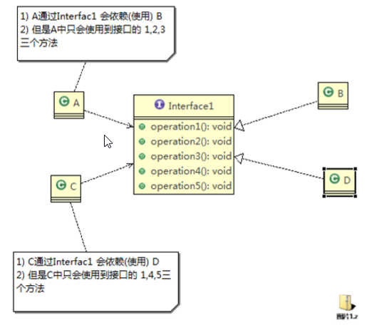
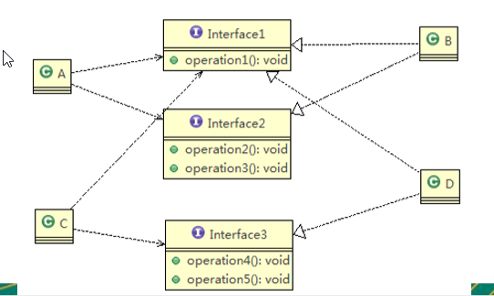
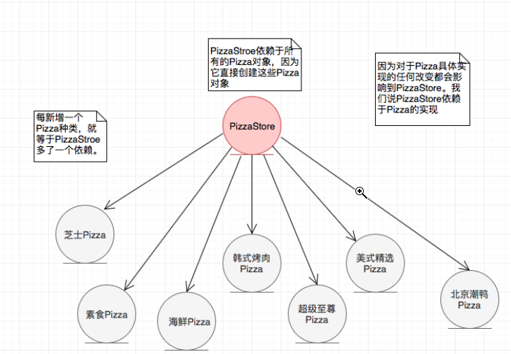
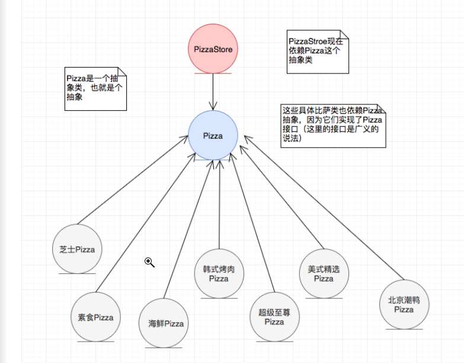

### 设计模式的目的 

- 代码重用性:{{c1::  (即：相同功能的代码，不用多次编写)  }}
- 可读性 :{{c1:: (即：编程规范性, 便于其他程序员的阅读和理解) }}
- 可扩展性:{{c1::  (即：当需要增加新的功能时，非常的方便，称为可维护) }}
- 可靠性 :{{c1:: (即：当我们增加新的功能后，对原来的功能没有影响) }}
- 使程序呈现{{c1:: 高内聚，低耦合 }}的特性 

### 单一职责原则 

**SRP**：Single Responsibility Principle

注意：我们应当遵守单一职责原则，只有逻辑足够简单，才可以在代码级违反单一职责原则；只有类中方法数量足够少，可以在方法级别保持单一职责原则

### 接口隔离原则 

**ISP**：**Interface  Segregation Principle**

反例图：{{c1::  }}

改进后接口隔离原则例图：{{c1::}}

### 依赖倒转原则 

+ 定义：
    1. {{c1:: 上层模块不应该依赖底层模块，它们都应该依赖于抽象。}}
    2. {{c1:: 抽象不应该依赖于细节，细节应该依赖于抽象。}}
+ 披萨店例子：
    + 反例图：{{c1:: }}
    + 改进后依赖倒转原则图：{{c1:: }}

### 里氏替换原则 

- 继承

- 继承优点：
  - 重用性：{{c1:: 提高代码的重用性，子类拥有父类的方法和属性；}}
  - 可拓展性：{{c1:: 提高代码的可扩展性，子类可形似于父类，但异于父类，保留自我的特性；}}

- 继承缺点：
- 侵入性、不够灵活：{{c1:: 继承是侵入性的，只要继承就必须拥有父类的所有方法和属性，在一定程度上约束了子类，降低了代码的灵活性；}}
- 高耦合：{{c1:: 增加了耦合，当父类的常量、变量或者方法被修改了，需要考虑子类的修改，所以一旦父类有了变动，很可能会造成非常糟糕的结果，要重构大量的代码。}}

**因为继承带来的侵入性，增加了耦合性，也降低了代码灵活性，父类修改代码，子类也会受到影响，此时就需要里氏替换原则。**

- {{c1:: 子类必须实现父类的抽象方法，但不得重写（覆盖）父类的非抽象（已实现）方法。 }}
- {{c1:: 子类中可以增加自己特有的方法。 }}
- 宽进：{{c1:: 当子类覆盖或实现父类的方法时，方法的前置条件（即方法的形参）要比父类方法的输入参数更宽松。 }}
- 严出：{{c1:: 当子类的方法实现父类的抽象方法时，方法的后置条件（即方法的返回值）要比父类更严格。{{c1::  }}

备注：[参考](https://www.cnblogs.com/o-andy-o/p/10315188.html)