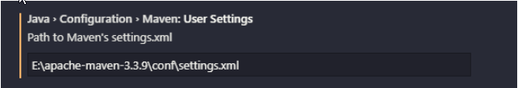

### MAVEN配置HTTP代理
1. 检测本地网络是否不能直接访问Maven的远程中央仓库，
   
    + 命令为ping repo1.maven.org
2. 要检查代理服务器是否畅通
   
    + 运行`telnet  192.168.10.117 3267`来检查该地址的该端口是否畅通
3. 修改~/.m2/settings.xml
    ```xml
    <settings> 
    ...
    <proxies>
        <proxy>
            <id>my-proxy</id>
            <active>true</active>
            <protocol>http</protocol>
            <host>192.168.10.117</host>
            <port>3267</port>
            <username>shihuan</username>
            <password>123456</password>
            <nonProxyHosts>repository.mycom.com|*.google.com</nonProxyHosts>
        </proxy>
        </proxies>
    ...
    </settings>
    ```
    `nonProxyHosts`：指定哪些主机名不需要代理

### maven-compiler-plugin 插件配置

maven的默认编译使用的jdk版本貌似很低，使用maven-compiler-plugin插件可以指定项目源码的jdk版本，编译后的jdk版本，以及编码。

   ```xml
   <plugin>
    <!-- 指定maven编译的jdk版本,如果不指定,maven3默认用jdk 1.5 maven2默认用jdk1.3 -->
    <groupId>org.apache.maven.plugins</groupId>
    <artifactId>maven-compiler-plugin</artifactId>
    <version>3.1</version>
    <configuration>
        <!-- 一般而言，target与source是保持一致的，但是，有时候为了让程序能在其他版本的jdk中运行(对于低版本目标jdk，源代码中不能使用低版本jdk中不支持的语法)，会存在target不同于source的情况 -->
        <target>1.8</target> <!-- 需要生成的目标class文件的编译版本 -->
        <encoding>UTF-8</encoding><!-- 字符集编码 -->
        <skipTests>true</skipTests><!-- 跳过测试 -->
        <verbose>true</verbose>
        <showWarnings>true</showWarnings>
        <fork>true</fork><!-- 要使compilerVersion标签生效，还需要将fork设为true，用于明确表示编译版本配置的可用 -->
        <executable><!-- path-to-javac --></executable><!-- 使用指定的javac命令，例如：<executable>${JAVA_1_4_HOME}/bin/javac</executable> -->           
        <compilerVersion>1.3</compilerVersion><!-- 指定插件将使用的编译器的版本 -->
        <meminitial>128m</meminitial><!-- 编译器使用的初始内存 -->
        <maxmem>512m</maxmem><!-- 编译器使用的最大内存 -->
        <compilerArgument>-verbose -bootclasspath ${java.home}\lib\rt.jar</compilerArgument><!-- 这个选项用来传递编译器自身不包含但是却支持的参数选项 -->
    </configuration>
</plugin>
   ```
配置完成后再执行mvn clean test，就能成功编译了

### maven配置生成可执行的jar:maven-shade-plugin
```xml
    <plugins>
      <plugin>
        <groupId>org.apache.maven.plugins</groupId>
        <artifactId>maven-shade-plugin</artifactId>
        <version>2.0</version>
        <configuration>
      <transformers>
	     <transformer implementation = "org.apache.maven.plugins.shade.resource.MainifestResourceTransformer">
         <!-- 设置入口主类 -->
		 <mainClass>com.xun.pf.sayHello.HelloWorld</mainClass>
	     </transformer>
	  </transformers>
        </configuration>
        <executions>
          <execution>
            <phase>package</phase>
            <goals>
              <goal>shade</goal>
            </goals>
          </execution>
        </executions>
      </plugin>
    </plugins>
```

### VS code 配置maven

修改文件路径：文件>首选项>设置

方式一：搜索:java.configuration.maven，配置setting.xml路径




### cobertura-maven-plugin配置
```xml
			<plugin>
				<groupId>org.codehaus.mojo</groupId>
				<artifactId>cobertura-maven-plugin</artifactId>
				<version>2.6</version>
				<configuration>
					<formats>
						<format>html</format>
						<format>xml</format>
					</formats>
				</configuration>
			</plugin>
```