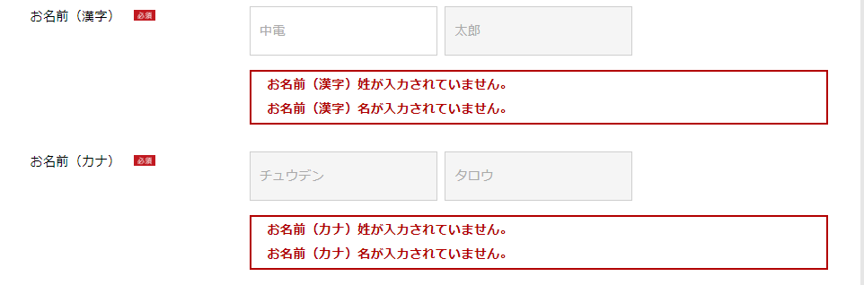

总case个数：53

# 对应QA

46

# bug

SVN\080_テスト管理\20190911フォーム改善２次\05_受入テスト

QA一覧表_フォーム2期Part3_20191204.xlsx

23　　王　謝　符　        対応可    ：ok
41　　符　　　　　　　　　ＱＡ　範囲全機能？ 
46　　王　謝　　　　　　　ＱＡ　画像   待ち ：等待文件
47　　調査　　　　　　　　ＱＡ　パーツリスト　待ち ：ok
48　　王　　　　　　　　　ＱＡ　パーツリスト　待ち
50　　王　　　　　　　　  対応可
53　　王　　　　　　　　　ＱＡ　パーツリスト　待ち
54　　王　　　　　　　　　対応可
55　　王　　　　　　　　　ＱＡ　 画像　待ち
69　　謝　　　　　　　　　対応可 :ok:
70　　謝　　　　　　　　　対応可 :ok:
71    王　謝　　　　　　  対応可  ： 文字中？ 是普通文字吗 ？
74    王　謝　　　　　　  対応可：是在下面加一句话吗？

80    謝　　　　　　　　  対応可

ＮＯ８８　　  王　謝　　　　全部LINK彻查　:ok:

ＮＯ９４－ 4   王　謝      符      ステータスバー　

  

# 参照URL：

  http://localhost:8080/clubkatene/apply/kaishigas/detail/kaishiGasDetailInput.html?nla=true

# 测试URL: 

电气：

 http://localhost:8080/clubkatene/gasswreq4m/gasSwReq4mInput.html?kid=1176745047700&org.apache.struts.taglib.html.TOKEN=cf8458ae190c95278dde8c543e95b023&current.page=L2dhc3JlcWxpc3QvZ2FzUmVxTGlzdFN3Lmh0bWw%3D 

 http://192.168.6.11:8080/clubkatene/gasswreq4cp/gasSwReq4cpInput.do?method=doIndex 

 http://192.168.6.11:8080/clubkatene/gasswreq4m/gasSwReq4mInput.html?kid=1176745047700&org.apache.struts.taglib.html.TOKEN=cf8458ae190c95278dde8c543e95b023&current.page=L2dhc3JlcWxpc3QvZ2FzUmVxTGlzdFN3Lmh0bWw%3D 


# 電気ガス切り替えお手続き

###  上記に同意する 


```
UIKR7E084E,同意事項に同意いただけた場合は、 チェックをつけてください。,-,東邦ガスの申込同意チェック１が未入力チェックでエラー,0
```

## 契約情報の入力

## 現在のご契約内容について

###  東邦ガスのご契約名義 


```
UIKR7E017E,「電気のご契約名義と同じ」「電気のご契約名義とは異なる」のいずれかを選択してください。,-,東邦ガスのご契約名義が未入力チェックでエラー,0
```

###  お名前（漢字）  お名前（カナ） 



```
UIKR7E400E,お名前（漢字）姓が入力されていません。,-,[ご契約名義]お名前（漢字）姓が未入力チェックでエラー,0
UIKR7E401E,お名前（漢字）名が入力されていません。,-,[ご契約名義]お名前（漢字）名が未入力チェックでエラー,0
UIKR7E404E,お名前（カナ）姓が入力されていません。,-,[ご契約名義]お名前（カナ）姓が未入力チェックでエラー,0
UIKR7E405E,お名前（カナ）名が入力されていません。,-,[ご契約名義]お名前（カナ）名が未入力チェックでエラー,0
```


```
UIKR7E402E,お名前（漢字）が32文字を超えています。,-,[ご契約名義]お名前（漢字）が19文字を超えている。,0
UIKR7E406E,お名前（カナ）が19文字を超えています。濁点などは1文字と数えられますのでご注意ください。,-,[ご契約名義]お名前（カナ）が19文字を超えている。濁点などは1文字と数えられますのでご注意ください。,0
```


```
UIKR7E403E,お名前（漢字）に機種依存文字又は、全角文字でない文字が入力されています。,-,[ご契約名義]お名前（漢字）に機種依存文字又は、全角文字でない文字が入力されている。,0
UIKR7E407E,お名前（カナ）に全角カタカナ文字でない文字が入力されています。,-,[ご契約名義]お名前（カナ）に全角カタカナ文字でない文字が入力されている。,0
```

###  東邦ガスのお客さま番号 


```
UIKR7E012E,東邦ガスのお客さま番号を入力してください。,-,東邦ガスのお客さま番号(ガス)が未入力チェックでエラー,0
UIKR7E013E,東邦ガスのお客さま番号は10文字で入力して下さい。,-,東邦ガスのお客さま番号(ガス)が最大桁数チェックでエラー,0
UIKR7E014E,東邦ガスのお客さま番号は半角数字で入力してください。,-,東邦ガスのお客さま番号(ガス)が半角数字チェックでエラー,0
UIKR7E046E,既にガス契約のお申込みが存在します。申込内容の訂正等をご希望の場合はお手数ですが、0120-907-667へお問い合わせください。,-,ガス供給地点特定番号重複エラー,0
```

###  東邦ガスのご契約種別 


```
UIKR7E047E,東邦ガスの契約種別を選択してください。,-,ご契約種別（東邦ガス）が未入力チェックでエラー,0
```

## 検針票の送付先住所

###  住所 


```
UIKR7E408E,都道府県が選択されていません。,-,都道府県が選択されていない。,0
UIKR7E409E,市区町村が選択されていません。,-,市区町村が選択されていない。,0
UIKR7E410E,大字名が選択されていません。,-,大字名が選択されていない。,0
UIKR7E411E,字丁目が選択されていません。,-,字丁目が選択されていない。,0
UIKR7E412E,番地が入力されていません。,-,番地が入力されていない。,0
UIKR7E413E,番地が18文字を超えています。,-,番地が18文字を超えている。,0
UIKR7E414E,番地に機種依存文字又は、全角文字でない文字が入力されています。,-,番地に機種依存文字又は、全角文字でない文字が入力されている。,0
UIKR7E415E,建物名・アパート名が24文字を超えています。,-,建物名・アパート名が24文字を超えている。,0
UIKR7E416E,建物名・アパート名について全角文字で入力してください。,-,建物名・アパート名に機種依存文字又は、全角文字でない文字が入力されている。,0
UIKR7E417E,部屋番号が8文字を超えています。,－,部屋番号が8文字を超えている。,0
UIKR7E418E,部屋番号について全角英数で入力してください。,-,部屋番号に全角英数カタカナ文字でない文字が入力されている。,0
```

## お申込みいただく中部電力のガスのご契約について

###  ご契約名義   ご使用場所  


```
UIKR7E048E,ご契約名義をご確認ください。,-,ご契約名義チェックが未入力チェックでエラー,0
UIKR7E049E,ガスのご使用場所をご確認ください。,-,ご使用場所チェックが未入力チェックでエラー,0
```

###  ガスご契約種別 


###  ガス設備確認事項 


```
UIKR7E041E,「カテエネガスプラン2」は、住宅用の建物に上記ガス設備の設置が適用条件となります。条件に合致しない場合は、他のプランを選択ください。,-,ガス設備確認事項Aが未入力チェックでエラー,0
UIKR7E042E,「カテエネガスプラン3」は、住宅用の建物に上記ガス設備の設置が適用条件となります。条件に合致しない場合は、他のプランを選択ください。,-,ガス設備確認事項Bが未入力チェックでエラー,0
```


## お申し込みいただいた方について

###  ご契約者との関係 


```
UIKR7E060E,「本人」「家族」「その他」のいずれかを選択してください。,-,ご契約者との関係が未入力チェックでエラー,0
```

###  お名前（漢字）   お名前（カナ） 


```
UIKR7E061E,お名前（漢字）姓を入力してください。,-,お申込み者名（姓）が未入力チェックでエラー,0
UIKR7E062E,お名前（漢字）は合わせて31文字以内で入力してください。,-,お申込み者名（姓・名）が最大桁数チェックでエラー,0
UIKR7E063E,お名前（漢字）姓に機種依存文字又は、全角文字でない文字が入力されています。,-,お申込み者名（姓）が全角文字入力チェックでエラー,0
UIKR7E064E,お名前（漢字）名を入力してください。,-,お申込み者名（名）が未入力チェックでエラー,0
UIKR7E066E,お名前（漢字）名に機種依存文字又は、全角文字でない文字が入力されています。,-,お申込み者名（名）が全角文字入力チェックでエラー,0
UIKR7E067E,お名前（カナ）姓を入力してください。,-,お申込み者名（セイ）が未入力チェックでエラー,0
UIKR7E068E,お名前（カナ）は合わせて19文字以内で入力してください。濁点などは1文字と数えられますのでご注意ください。,-,お申込み者名（セイ・メイ）が最大桁数チェックでエラー,0
UIKR7E069E,お名前（カナ）姓は全角カタカナで入力してください。,-,お申込み者名（セイ）が全角カナチェックでエラー,0
UIKR7E070E,お名前（カナ）名を入力してください。,-,お申込み者名（メイ）のが未入力チェックでエラー,0
UIKR7E072E,お名前（カナ）名は全角カタカナで入力してください。,-,お申込み者名（メイ）が全角カナチェックでエラー,0
```

### 契約者の同意 


```
UIKR7E073E,契約者の同意について入力してください。,-,契約者の同意が未入力チェックでエラー,0
```

###  お電話番号 

.


```
UIKR7E419E,お電話番号の種類が選択されていません。,-,[お申し込みいただいた方について]お電話番号の種類が選択されていない。,0
UIKR7E420E,お電話番号が入力されていません。,-,[お申し込みいただいた方について]電話番号が入力されていない。,0
UIKR7E421E,お電話番号が13文字を超えています。,-,[お申し込みいただいた方について]電話番号が13文字を超えている。,0
UIKR7E422E,お電話番号が不正です。,-,[お申し込みいただいた方について]電話番号に不正な文字が入力されている。,0
UIKR7E423E,お電話番号のハイフンの位置をご確認のうえ、再度入力してください。,－,[お申し込みいただいた方について]お電話番号の下４桁が半角数字かつ、下５桁が－（ハイフン）以外の場合,0
```

### 緊急時の電話番号 


````
UIKR7E424E,緊急時のお電話番号の種類が選択されていません。,-,[お申し込みいただいた方について]緊急時のお電話番号の種類が選択されていない。,0
UIKR7E425E,緊急時のお電話番号が入力されていません。,-,[お申し込みいただいた方について]緊急時の電話番号が入力されていない。,0
UIKR7E426E,緊急時のお電話番号が13文字を超えています。,-,[お申し込みいただいた方について]緊急時の電話番号が13文字を超えている。,0
UIKR7E427E,緊急時のお電話番号が不正です。,-,[お申し込みいただいた方について]緊急時の電話番号に不正な文字が入力されている。,0
UIKR7E428E,緊急時のお電話番号のハイフンの位置をご確認のうえ、再度入力してください。,－,[お申し込みいただいた方について]緊急時のお電話番号の下４桁が半角数字かつ、下５桁が－（ハイフン）以外の場合,0
````

